## 前言

身為一位前端工程師，某天在 code review 的時候，發現同事寫了一段讓我很好奇的程式碼

libs/ui/src/file-link/index.stories.tsx

```ts
export const Url: Story = {
  // Note: we use a base64 data URL here to avoid CORS issues in Storybook.
  args: {
    file: {
      name: "example-image.jpg",
      // url: 'https://randomuser.me/api/portraits/men/71.jpg',
      url: "data:image/jpeg;base64,...",
    },
  },
};
```

簡單來說，這個元件會 render 出一個

```html
<a download href="data:image/jpeg;base64,..."></a>
```

而不是

```html
<a download href="https://randomuser.me/api/portraits/men/71.jpg"></a>
```

經過一番查詢，我得知 MDN 在 [`<a download>`](https://developer.mozilla.org/en-US/docs/Web/HTML/Reference/Elements/a#download) 的區塊寫了一段 Note:

```
download only works for same-origin URLs, or the blob: and data: schemes.
```

在前端打滾了 4 ~ 5 年的的我，竟然不知道瀏覽器在 `<a download>` 有這個安全性機制；我第一時間想到的是 [Content-Disposition](./content-type-and-mime-type.md#content-disposition)，但之前並沒有深入研究 `Content-Disposition` 跟 `<a download>` 的交乘情境，所以就趁這個機會來實測看看吧！

## cross-origin + no CD + `<a download>`

這是我同事遇到的情況 => 用 `<a download>` 下載一張 cross-origin 的圖片；圖片本身的 HTTP Response Header 沒有設定 `Content-Disposition`，預設值是 `inline`

寫個 NodeJS http 的 PoC

```ts
import httpServer from "../httpServer";
httpServer.on("request", function requestListener(req, res) {
  if (req.url === "/") {
    res.setHeader("Content-Type", "text/html");
    res.end(
      '<a href="https://randomuser.me/api/portraits/men/71.jpg" download>download</a>',
    );
    return;
  }
});
```

Chrome V142 實測後，確實沒有下載，而是直接原頁導轉
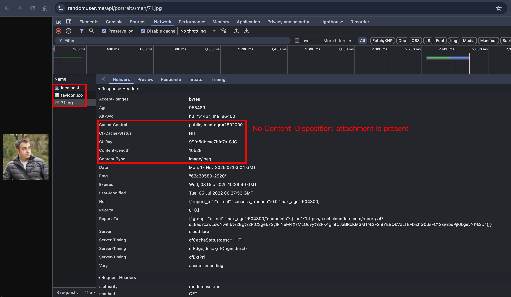

## same-origin + no CD + `<a download>`

若改成 same-origin，就可以下載了嗎？寫個 PoC 實測看看

```ts
import httpServer from "../httpServer";
import { readFileSync } from "fs";
import { join } from "path";

const image = readFileSync(join(__dirname, "image.jpg"));

httpServer.on("request", function requestListener(req, res) {
  if (req.url === "/image") {
    res.setHeader("Content-Type", "image/jpeg");
    res.end(image);
    return;
  }

  if (req.url === "/") {
    res.end('<a href="/image" download>download</a>');
    return;
  }
});
```

成功下載，不過 F12 > Network 並沒有顯示 HTTP Request
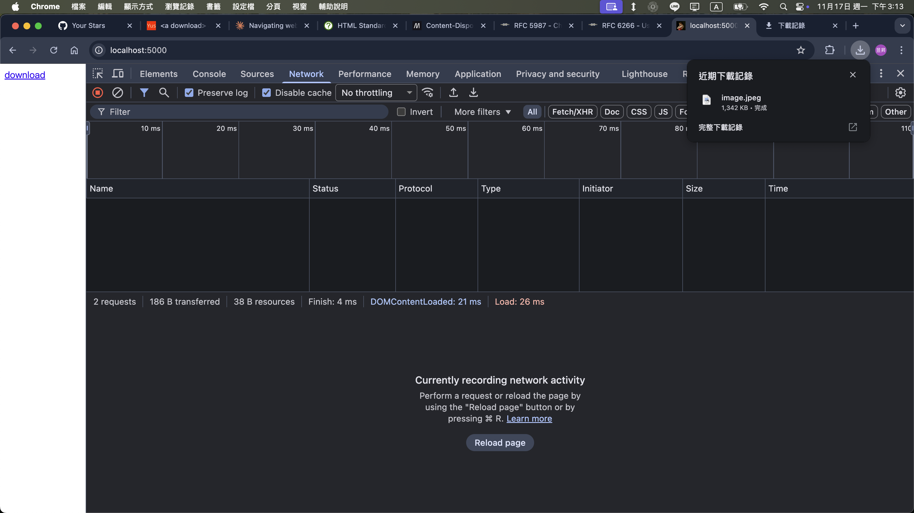

## 矛盾大對決1: same-origin + inline vs `<a download>`

<!-- todo-yus 為何矛盾 -->
<!-- 跨瀏覽器的行為是否不同 (?) -->

PoC

```ts
import httpServer from "../httpServer";
import { readFileSync } from "fs";
import { join } from "path";
import { faviconListener } from "../listeners/faviconListener";

const image = readFileSync(join(__dirname, "image.jpg"));

httpServer.on("request", function requestListener(req, res) {
  if (req.url === "/image") {
    res.setHeader("Content-Type", "image/jpeg");
    res.setHeader("Content-Disposition", "inline");
    res.end(image);
    return;
  }

  if (req.url === "/") {
    res.setHeader("Content-Type", "text/html");
    res.end('<a href="/image" download>download</a>');
    return;
  }
});
```

結果同 [same-origin + no CD + `<a download>`](#same-origin--no-cd--a-download)

## 矛盾大對決2: cross-origin + attachment vs `<a>`

<!-- todo-yus 為何矛盾 -->
<!-- 跨瀏覽器的行為是否不同 (?) -->

我們需要啟動兩個 http server，才能達成 cross-origin

PoC

```ts
import httpServer from "../httpServer";
import { readFileSync } from "fs";
import { join } from "path";
import { createServer } from "http";
import { faviconListener } from "../listeners/faviconListener";

const image = readFileSync(join(__dirname, "image.jpg"));

httpServer.on("request", function requestListener(req, res) {
  if (req.url === "/image") {
    res.setHeader("Content-Type", "image/jpeg");
    res.setHeader("Content-Disposition", "attachment; filename=image.jpg");
    res.end(image);
    return;
  }
});

const http5001Server = createServer().listen(5001);
http5001Server.on("request", (req, res) => {
  res.setHeader("content-type", "text/html");
  res.end('<a href="http://localhost:5000/image" download>download</a>');
  return;
});
```

瀏覽器打開 http://localhost:5001/ ，點選 download 後，成功下載，並且 F12 > Network 有顯示 HTTP Request
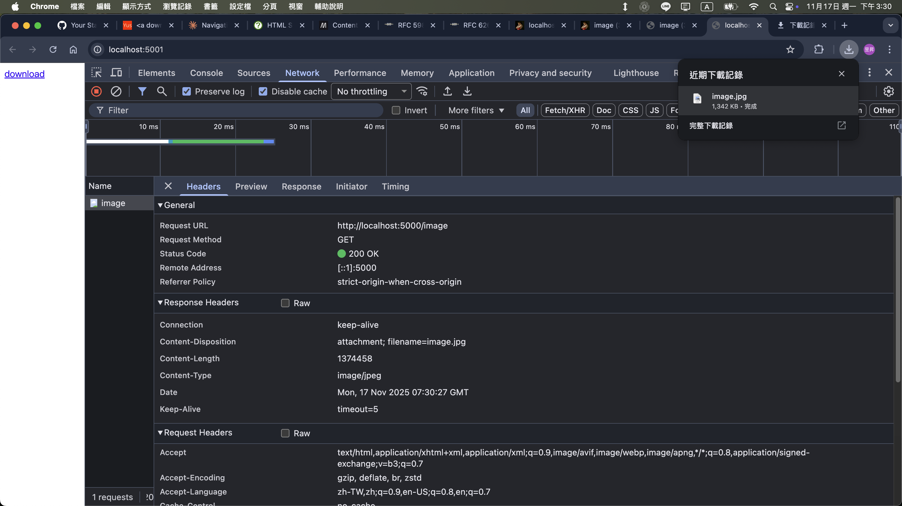

## edge case1: cross-origin + attachment + Larger CL + `<a download>`

<!-- 為何是 edge case，要說明 -->

通常各種 HTTP Agent 都會自動計算 HTTP Request / Response 的 `Content-Length`，如果我們刻意設定一個 Larger CL，瀏覽器會怎麼處理呢？

PoC

```ts
httpServer.on("request", function requestListener(req, res) {
  console.log(req.url);
  if (req.url === "/test") {
    // attachment + Larger CL + `<a download>`
    res.setHeader("Content-Type", "text/html");
    res.setHeader("Content-Disposition", "attachment; filename=test.html");
    res.setHeader("Content-Length", 100);
    res.end("Only11Chars");
    return;
  }

  if (req.url === "/") {
    res.setHeader("Content-Type", "text/html");
    res.end('<a href="/test" download>download</a>');
    return;
  }
});

const http5001Server = createServer().listen(5001);
http5001Server.on("request", (req, res) => {
  res.setHeader("content-type", "text/html");
  res.end('<a href="http://localhost:5000/test" download>download</a>');
});
```

瀏覽器打開 http://localhost:5001/ ，點選 download 後，會顯示 "無法完成下載作業"


並且 Chrome 瀏覽器會自動 retry，看 NodeJS log 的話，會發現總共 retry 5 次

```
/test
/test
/test
/test
/test
/test
/test
```

## edge case2: cross-origin + attachment + Smaller CL + `<a download>`

<!-- 為何是 edge case，要說明 -->

承上述案例，如果設定一個 Smaller CL，那檔案內容會被截斷嗎？

PoC 與上面相同，只有改動這行

```ts
res.setHeader("Content-Length", 10);
```

實測後，確實被截斷了


## edge case3: cross-origin + attachment + 404 + `<a download>`

<!-- 為何是 edge case，要說明 -->

僅列出調整部分

```ts
if (req.url === "/test") {
  res.statusCode = 404;
  res.setHeader("Content-Type", "text/html");
  res.setHeader("Content-Disposition", "attachment; filename=test.html");
  res.end("Only11Chars");
  return;
}
```

實測後，Chrome 直接把 `Content-Length` 跟對應的 Response Body 都拔掉了
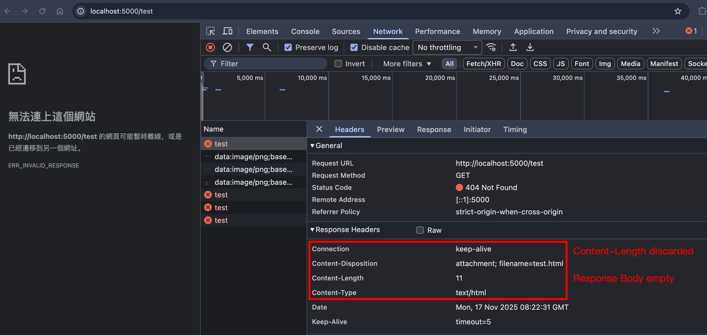

## filename charset

### 範例

```
Content-Disposition: attachment; filename=filename.jpg
Content-Disposition: attachment; filename="file name.jpg"
Content-Disposition: attachment; filename*=UTF-8''file%20name.jpg
```

### 概念

- filename 預設的 charset 是 [ISO-8859-1](https://www.w3schools.com/CHARSETS/ref_html_8859.asp)，也就是 ASCII 定義的 0 ~ 127，再擴展到 128 ~ 255 對應的歐洲字元
- 若 filename 有包含特殊字元，則需要用雙引號包起來 <!-- todo-yus 特殊字元是啥 -->
- 若 filename 有包含 [ISO-8859-1](https://www.w3schools.com/CHARSETS/ref_html_8859.asp) 以外的字元，則可以用 `filename*=UTF-8''URL-Encoded-Value` 的格式

### 實務建議

根據 [RFC6266 section-5](https://datatracker.ietf.org/doc/html/rfc6266#section-5) 的範例，建議 `filename` 跟 `filename*` 兩者同時設定，確保向後兼容性

```
Content-Disposition: attachment; filename="EURO rates"; filename*=utf-8''%e2%82%ac%20rates
```

而根據 [RFC6266](https://datatracker.ietf.org/doc/html/rfc6266#section-4.3) 的原文，當兩者同時設定，會優先選擇 `filename*`

```
when both "filename" and "filename*" are present in a single header field value, recipients SHOULD pick "filename*" and ignore "filename"
```

### 實測環節 - edge case 1: `filename=中文.jpg`

PoC

```ts
res.setHeader("Content-Type", "image/jpeg");
res.setHeader("Content-Disposition", "attachment; filename=中文.jpg");
res.end(image);
return;
```

瀏覽器打開 http://localhost:5001/ ，點選 download 後，會顯示 "ERR_CONNECTION_REFUSED"，查看 NodeJS log

```
TypeError: Invalid character in header content ["Content-Disposition"]
    at ServerResponse.setHeader (node:_http_outgoing:702:3)
    at Server.requestListener (/PATH/TO/YOUR/index.ts:49:9)
    at Server.emit (node:events:518:28)
    at Server.emit (node:domain:489:12)
    at parserOnIncoming (node:_http_server:1153:12)
    at HTTPParser.parserOnHeadersComplete (node:_http_common:117:17) {
  code: 'ERR_INVALID_CHAR'
}
```

看來 NodeJS http 模組有遵守某個 RFC 規範 (?)有時候想要測試 malformed HTTP Request / Response，用各個程式語言封裝好的 http 模組，都會被限制，這時候就得用底層一點的模組來控制；以 NodeJS 為例，可以使用 [net.Socket](https://nodejs.org/api/net.html#class-netsocket) 來控制 raw HTTP Response，如果還不熟悉的夥伴們，可以參考我去年寫過的

- [深入解說 HTTP message](./anatomy-of-an-http-message.md)
- [Transfer-Encoding - 使用 Socket.write 自行處理資料格式](./transfer-encoding.md#使用-socketwrite-自行處理資料格式)

PoC

```ts
res.socket?.write(`HTTP/1.1 200 Ok\r\n`);
res.socket?.write(`Content-Length: ${Buffer.byteLength(image)}\r\n`);
res.socket?.write(`Content-Disposition: attachment; filename=中文.jpg\r\n`);
res.socket?.write(`Content-Type: image/jpeg\r\n\r\n`);
res.socket?.end(image);
```

實測後，檔名在作業系統有正確呈現
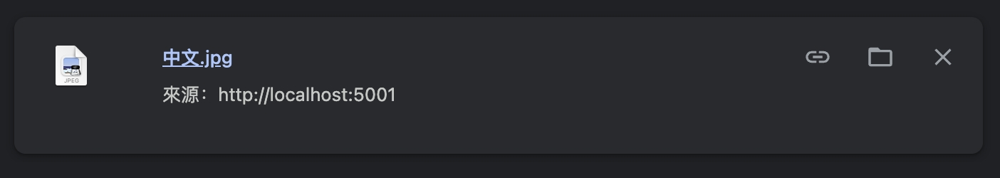

但 F12 > Network 呈現的檔名是錯的(?)
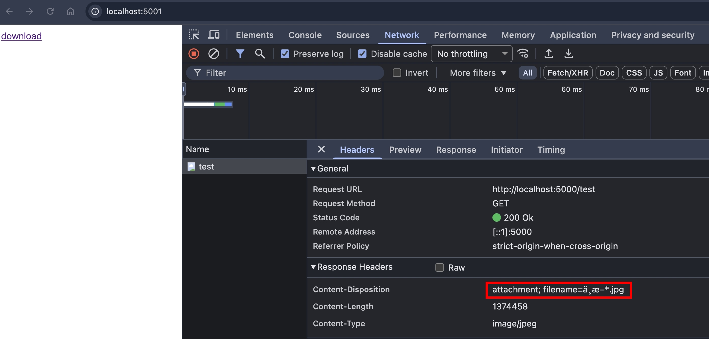

嘗試用 `curl -v "http://localhost:5000/test" --output test.jpg`，確保上面的 PoC 是正確的

```
* Request completely sent off
< HTTP/1.1 200 Ok
< Content-Length: 1374458
< Content-Disposition: attachment; filename=中文.jpg
< Content-Type: image/jpeg
```

`wc -c test.jpg` 確認 Content-Length 符合

```
1374458 test.jpg
```

至於 `中文.jpg` 是什麼呢？這其實是編碼轉換的問題，瀏覽器看到 `filename=`，預設用 ISO-8859-1 的編碼來呈現，轉換過程為：
| UTF-8 | Hex | ISO-8859-1 |
| ----- | --- | ---------- |
| 中文 | e4 b8 ad e6 96 87 | 中文.jpg |

嘗試用最小 PoC 來驗證

```ts
if (req.url === "/ISO-8859-1") {
  const buffer = Buffer.from("中文", "utf8");
  res.setHeader("Content-Type", "text/html; charset=iso-8859-1");
  res.setHeader("Content-Length", buffer.byteLength);
  res.flushHeaders();
  res.socket?.end(buffer);
  return;
}
```

瀏覽器訪問 http://localhost:5000/ISO-8859-1 ，可以正確看到 `中文` 了～
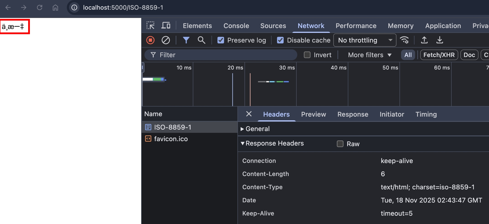

P.S. 現在很多網站,工具預設都用 UTF-8，所以創建一個 `Content-Type: text/html; charset=iso-8859-1` 的網頁來測試，會比較準確

### 實測環節 - edge case 2: `filename=hello world.jpg`

PoC

```ts
res.setHeader("Content-Type", "image/jpeg");
res.setHeader("Content-Disposition", "attachment; filename=hello world.jpg");
res.end(image);
return;
```

實測後，檔名有正確呈現在 F12 > Network 跟作業系統
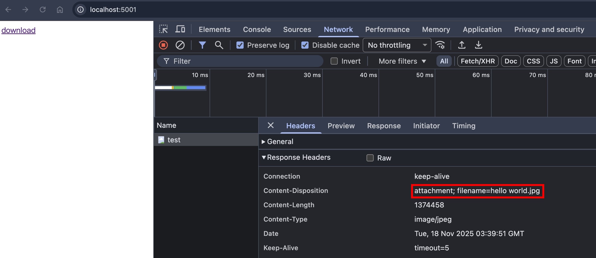
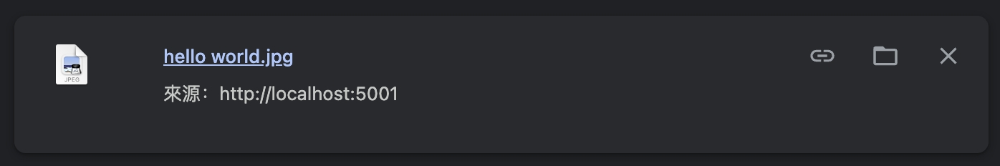

### 實測環節 - edge case 3: `filename=hello%0D%0Aworld.jpg`

P.S. `%0D%0A` 是 CRLF 的 URLEncode 版本

PoC

```ts
res.setHeader("Content-Type", "image/jpeg");
res.setHeader(
  "Content-Disposition",
  "attachment; filename=hello%0D%0Aworld.jpg",
);
res.end(image);
return;
```

實測後，檔名有正確呈現在 F12 > Network，但下載到作業系統後，`%0D%0A` 被轉換成 `__`
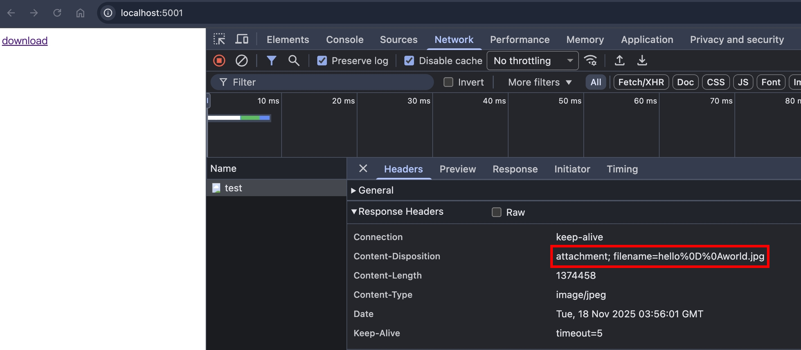
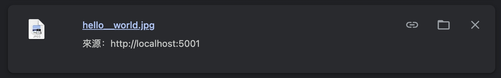

根據 [MDN 文件](https://developer.mozilla.org/en-US/docs/Web/HTTP/Reference/Headers/Content-Disposition#as_a_response_header_for_the_main_body)的描述

```
Browsers may apply transformations to conform to the file system requirements, such as converting path separators (/ and \) to underscores (_).
```

瀏覽器這樣做，除了正規化檔名，讓各個作業系統的 file system 可以正確呈現，還可以避免 [Path Traversal](../port-swigger/path-traversal.md)

## 小結

這個章節，我們學到了

- `<a download>` 跟 `Content-Disposition` 的交互情境
- filename 的 charset
- 如何正確在瀏覽器呈現 ISO-8859-1 的文字

## 參考資料

- https://developer.mozilla.org/en-US/docs/Web/HTML/Reference/Elements/a#download
- https://developer.mozilla.org/en-US/docs/Web/HTTP/Reference/Headers/Content-Disposition
- https://datatracker.ietf.org/doc/html/rfc5987
- https://datatracker.ietf.org/doc/html/rfc6266
