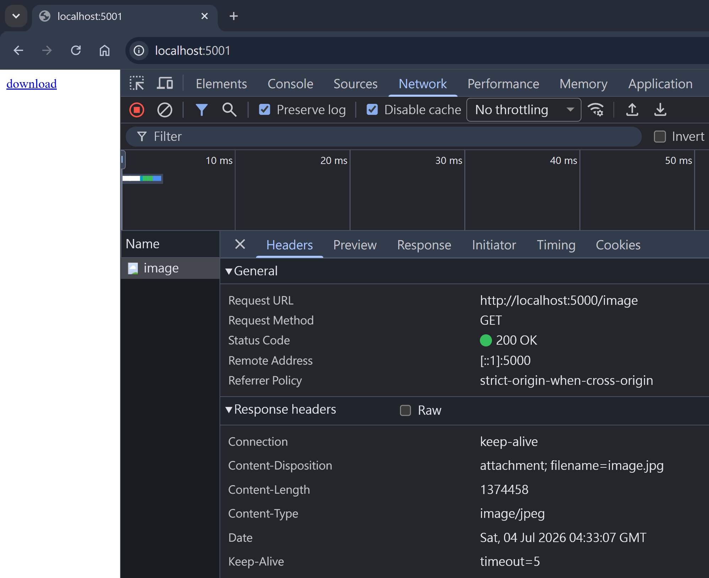

## 前言

身為一位前端工程師，某天在 code review 的時候，發現同事寫了一段讓我很好奇的程式碼

```ts
// libs/ui/src/file-link/index.stories.tsx

export const Url: Story = {
  // Note: we use a base64 data URL here to avoid CORS issues in Storybook.
  args: {
    file: {
      name: "example-image.jpg",
      // url: 'https://randomuser.me/api/portraits/men/71.jpg',
      url: "data:image/jpeg;base64,...",
    },
  },
};
```

簡單來說，這個元件會 render 出一個

```html
<a download href="data:image/jpeg;base64,..."></a>
```

而不是

```html
<a download href="https://randomuser.me/api/portraits/men/71.jpg"></a>
```

經過一番查詢，我得知 MDN 在 [`<a download>`](https://developer.mozilla.org/en-US/docs/Web/HTML/Reference/Elements/a#download) 的區塊寫了一段 Note:

```
download only works for same-origin URLs, or the blob: and data: schemes.
```

在前端打滾了好幾年的的我，竟然不知道瀏覽器在 `<a download>` 有這個安全性機制；我第一時間想到的是 [Content-Disposition](./content-type-and-mime-type.md#content-disposition)，但之前並沒有深入研究 `Content-Disposition` 跟 `<a download>` 的交乘情境，所以就趁這個機會來實測看看吧！

## `<a>` vs `Content-Disposition`

- `<a>` 決定的是「使用者點擊連結時的行為」
- `Content-Disposition` 決定的是「HTTP response 本身該如何被呈現」
- 兩者分屬前端（HTML）與後端（HTTP）不同維度的設定，實際交織起來會產生多種情境
- 下面矩陣只是最單純的示意，並且省略 "same-origin" 跟 "cross-origin" 這個維度：

|                       | download as file                  | display HTTP response in browser |
| --------------------- | --------------------------------- | -------------------------------- |
| `<a>`                 | `<a download href="URL">`         | `<a href="URL">`                 |
| `Content-Disposition` | `Content-Disposition: attachment` | `Content-Disposition: inline`    |

## Case 1: cross-origin + `inline` + `<a download>`

- 用 `<a download>` 下載一張 cross-origin 的圖片
- 圖片本身的 HTTP response header 沒有設定 `Content-Disposition`，故使用預設值 `inline`
- 按照[上面的矩陣](#a-vs-content-disposition)，這是一個互斥的情境

寫個 Node.js `http.Server`

```ts
import http from "http";

const imageURL = "https://randomuser.me/api/portraits/men/71.jpg";
const httpServer = http.createServer((req, res) => {
  if (req.url === "/") {
    res.setHeader("Content-Type", "text/html");
    res.end(`<a href="${imageURL}" download>download</a>`);
    return;
  }
});
httpServer.listen(5000);
```

Chrome V142 實測後，確實沒有下載，而是直接原頁導轉，跟 MDN 的 Note 描述一致

```
download only works for same-origin URLs, or the blob: and data: schemes.
```


## Case 2: same-origin + `inline` + `<a download>`

承上題，若改成 same-origin，就可以下載了嗎？寫個 PoC 實測看看

```ts
import http from "http";
import { readFileSync } from "fs";
import { join } from "path";

const image = readFileSync(join(__dirname, "image.jpg"));

const httpServer = http.createServer((req, res) => {
  if (req.url === "/image") {
    res.setHeader("Content-Type", "image/jpeg");
    res.end(image);
    return;
  }

  if (req.url === "/") {
    res.setHeader("Content-Type", "text/html");
    res.end('<a href="/image" download>download</a>');
    return;
  }
});
httpServer.listen(5000);
```

點擊 "download" 成功下載，跟 MDN 的 Note 描述一致

```
download only works for same-origin URLs
```

## Case 3: cross-origin + `attachment` + `<a>`

- 用 `<a>` 轉導到 cross-origin 的圖片網址
- 圖片本身的 HTTP response header 設定 `Content-Disposition: attachment`
- 按照[上面的矩陣](#a-vs-content-disposition)，這是一個互斥的情境

PoC

```ts
import http from "http";
import { readFileSync } from "fs";
import { join } from "path";

const image = readFileSync(join(__dirname, "image.jpg"));

// serve image
const httpServer5000 = http.createServer((req, res) => {
  if (req.url === "/image") {
    res.setHeader("Content-Type", "image/jpeg");
    res.setHeader("Content-Disposition", "attachment; filename=image.jpg");
    res.end(image);
    return;
  }
});
httpServer5000.listen(5000);

// serve html
const httpServer5001 = http.createServer((req, res) => {
  if (req.url === "/") {
    res.setHeader("Content-Type", "text/html");
    res.end('<a href="http://localhost:5000/image" download>download</a>');
    return;
  }
});
httpServer5001.listen(5001);
```

Chrome 打開 http://localhost:5001/ ，點擊 "download" 成功下載，並且 F12 > Network 有顯示 HTTP request


## Edge Case 1: cross-origin + `attachment` + `<a download>` + Larger CL

- 通常各種 HTTP Agent 都會自動計算 HTTP request / response 的 `Content-Length`
- 如果我們刻意設定一個 Larger CL，瀏覽器會怎麼處理呢？

PoC

```ts
import http from "http";

const httpServer5000 = http.createServer((req, res) => {
  if (req.url === "/test") {
    res.setHeader("Content-Type", "text/html");
    res.setHeader("Content-Disposition", "attachment; filename=test.html");
    // CL: 100, 實際 11 bytes
    res.setHeader("Content-Length", 100);
    res.end("Only11Chars");
    return;
  }

  if (req.url === "/") {
    res.setHeader("Content-Type", "text/html");
    res.end('<a href="/test" download>download</a>');
    return;
  }
});
httpServer5000.listen(5000);

const httpServer5001 = http.createServer().listen(5001);
httpServer5001.on("request", (req, res) => {
  res.setHeader("content-type", "text/html");
  res.end('<a href="http://localhost:5000/test" download>download</a>');
});
```

Chrome 打開 http://localhost:5001/ ，點選 download 後，會 retry 多次，最後顯示 "無法完成下載作業"


## Edge Case 2: cross-origin + `attachment` + `<a download>` + Smaller CL

承上題，如果設定一個 Smaller CL，那檔案內容會被截斷嗎？

PoC 與上面相同，只有改動這行

```ts
res.setHeader("Content-Length", 10);
```

實測後，確實被截斷成 10 bytes


## Edge Case 3: cross-origin + `attachment` + `<a download>` + 404

僅列出調整部分

```ts
if (req.url === "/test") {
  res.statusCode = 404;
  res.setHeader("Content-Type", "text/html");
  res.setHeader("Content-Disposition", "attachment; filename=test.html");
  res.end("Only11Chars");
  return;
}
```

實測後，Chrome 會顯示 "net::ERR_INVALID_RESPONSE"

## 小結

在這篇文章，我們學到了

- `<a download>` 跟 `Content-Disposition` 的交互情境
- "cross-origin" 跟 "same-origin" 如何影響 `<a download>` 的行為
- Chrome 如何處理 `Content-Length` 跟實際 payload length 不匹配的下載情境
- Chrome 如何處理 404 + `Content-Disposition: attachment` 這種 edge case

## 參考資料

- https://developer.mozilla.org/en-US/docs/Web/HTML/Reference/Elements/a#download
- https://developer.mozilla.org/en-US/docs/Web/HTTP/Reference/Headers/Content-Disposition
- https://datatracker.ietf.org/doc/html/rfc6266
