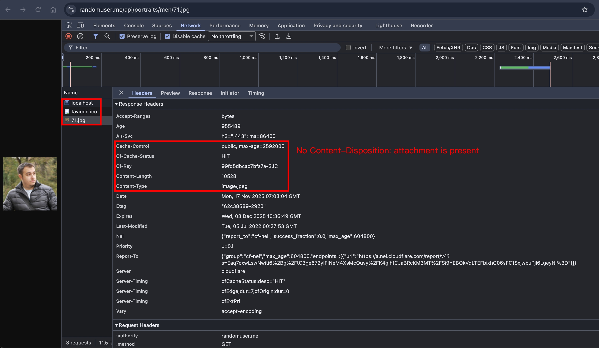
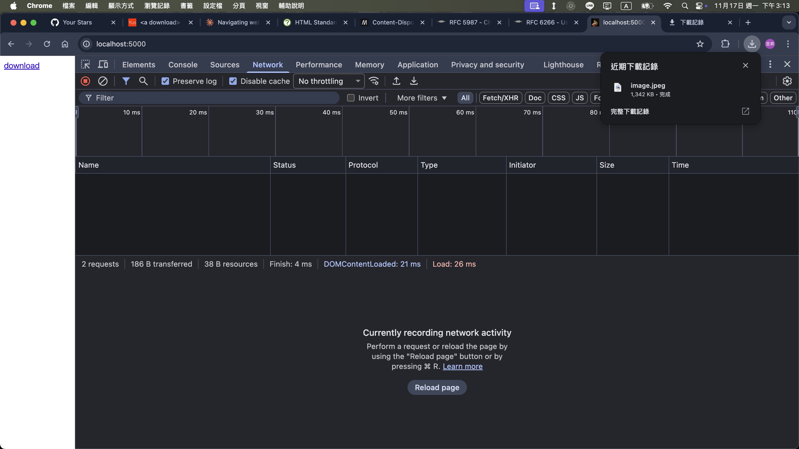
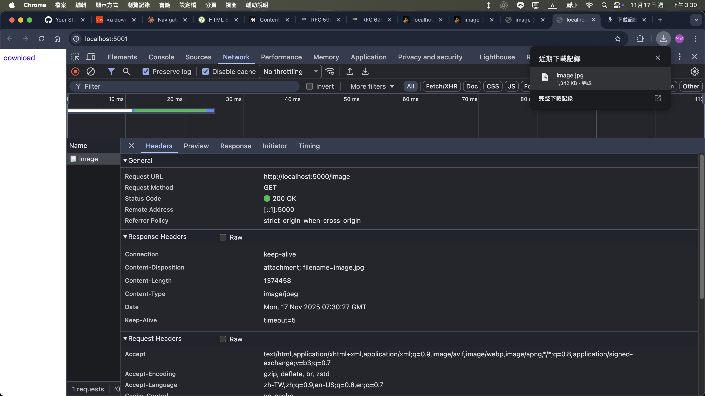
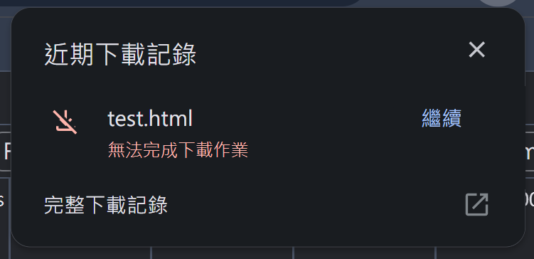
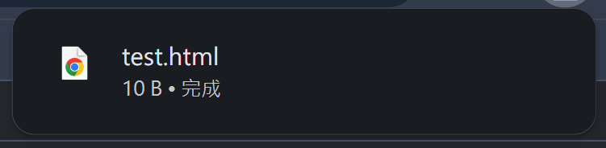
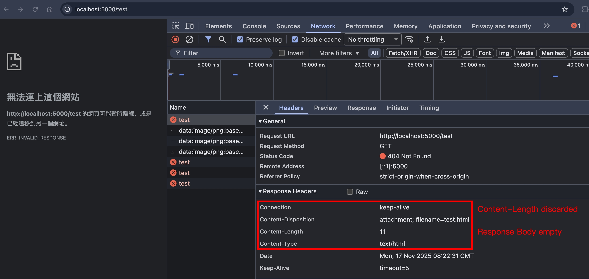

## 前言

身為一位前端工程師，某天在 code review 的時候，發現同事寫了一段讓我很好奇的程式碼

libs/ui/src/file-link/index.stories.tsx

```ts
export const Url: Story = {
  // Note: we use a base64 data URL here to avoid CORS issues in Storybook.
  args: {
    file: {
      name: "example-image.jpg",
      // url: 'https://randomuser.me/api/portraits/men/71.jpg',
      url: "data:image/jpeg;base64,...",
    },
  },
};
```

經過一番詢問 & 考證，得知 MDN 在 [`<a download>`](https://developer.mozilla.org/en-US/docs/Web/HTML/Reference/Elements/a#download) 的區塊寫了一段 Note:

```
download only works for same-origin URLs, or the blob: and data: schemes.
```

在前端打滾了 4 ~ 5 年的的我，竟然不知道瀏覽器在 `<a download>` 有這個安全性機制；我第一時間想到的是 [Content-Disposition](./content-type-and-mime-type.md#content-disposition)，但之前並沒有深入研究 `Content-Disposition` 跟 `<a download>` 的愛恨糾葛，所以就趁這個機會來實測看看吧！

## cross-origin + no CD + `<a download>`

這是我同事遇到的情況 => 用 `<a download>` 下載一張 cross-origin 的圖片

寫個 NodeJS http 的 PoC

```ts
import httpServer from "../httpServer";
httpServer.on("request", function requestListener(req, res) {
  if (req.url === "/") {
    res.setHeader("Content-Type", "text/html");
    res.end(
      '<a href="https://randomuser.me/api/portraits/men/71.jpg" download>download</a>',
    );
    return;
  }
});
```

實測後，確實沒有下載，而是直接原頁導轉


## same-origin + no CD + `<a download>`

若改成 same-origin，就可以下載了嗎？寫個 PoC 實測看看

```ts
import httpServer from "../httpServer";
import { readFileSync } from "fs";
import { join } from "path";

const image = readFileSync(join(__dirname, "image.jpg"));

httpServer.on("request", function requestListener(req, res) {
  if (req.url === "/image") {
    res.setHeader("Content-Type", "image/jpeg");
    res.end(image);
    return;
  }

  if (req.url === "/") {
    res.end('<a href="/image" download>download</a>');
    return;
  }
});
```

成功下載，不過 F12 > Network 並沒有顯示 HTTP Request


## 矛盾大對決1: same-origin + inline vs `<a download>`

PoC

```ts
import httpServer from "../httpServer";
import { readFileSync } from "fs";
import { join } from "path";
import { faviconListener } from "../listeners/faviconListener";

const image = readFileSync(join(__dirname, "image.jpg"));

httpServer.on("request", function requestListener(req, res) {
  if (req.url === "/image") {
    res.setHeader("Content-Type", "image/jpeg");
    res.setHeader("Content-Disposition", "inline");
    res.end(image);
    return;
  }

  if (req.url === "/") {
    res.setHeader("Content-Type", "text/html");
    res.end('<a href="/image" download>download</a>');
    return;
  }
});
```

結果同 [same-origin + no CD + `<a download>`](#same-origin--no-cd--a-download)

## 矛盾大對決2: cross-origin + attachment vs `<a>`

我們需要啟動兩個 http server，才能達成 cross-origin

PoC

```ts
import httpServer from "../httpServer";
import { readFileSync } from "fs";
import { join } from "path";
import { createServer } from "http";
import { faviconListener } from "../listeners/faviconListener";

const image = readFileSync(join(__dirname, "image.jpg"));

httpServer.on("request", function requestListener(req, res) {
  if (req.url === "/image") {
    res.setHeader("Content-Type", "image/jpeg");
    res.setHeader("Content-Disposition", "attachment; filename=image.jpg");
    res.end(image);
    return;
  }
});

const http5001Server = createServer().listen(5001);
http5001Server.on("request", (req, res) => {
  res.setHeader("content-type", "text/html");
  res.end('<a href="http://localhost:5000/image" download>download</a>');
  return;
});
```

瀏覽器打開 http://localhost:5001/ ，點選 download 後，成功下載，並且 F12 > Network 有顯示 HTTP Request


## edge case1: cross-origin + attachment + Larger CL + `<a download>`

通常各種 HTTP Agent 都會自動計算 HTTP Request/Response 的 `Content-Length`，如果我們刻意設定一個 Larger CL，瀏覽器會怎麼處理呢？

PoC

```ts
httpServer.on("request", function requestListener(req, res) {
  console.log(req.url);
  if (req.url === "/test") {
    // attachment + Larger CL + `<a download>`
    res.setHeader("Content-Type", "text/html");
    res.setHeader("Content-Disposition", "attachment; filename=test.html");
    res.setHeader("Content-Length", 100);
    res.end("Only11Chars");
    return;
  }

  if (req.url === "/") {
    res.setHeader("Content-Type", "text/html");
    res.end('<a href="/test" download>download</a>');
    return;
  }
});

const http5001Server = createServer().listen(5001);
http5001Server.on("request", (req, res) => {
  res.setHeader("content-type", "text/html");
  res.end('<a href="http://localhost:5000/test" download>download</a>');
});
```

瀏覽器打開 http://localhost:5001/ ，點選 download 後，會顯示 "無法完成下載作業"


並且 Chrome 瀏覽器會自動 retry，看 NodeJS log 的話，會發現總共 retry 5 次

```
/test
/test
/test
/test
/test
/test
/test
```

## edge case2: cross-origin + attachment + Smaller CL + `<a download>`

承上述案例，如果設定一個 Smaller CL，那檔案內容會被截斷嗎？

PoC 與上面相同，只有改動這行

```ts
res.setHeader("Content-Length", 10);
```

實測後，確實被截斷了


## edge case3: cross-origin + attachment + 404 + `<a download>`

僅列出調整部分

```ts
if (req.url === "/test") {
  res.statusCode = 404;
  res.setHeader("Content-Type", "text/html");
  res.setHeader("Content-Disposition", "attachment; filename=test.html");
  res.end("Only11Chars");
  return;
}
```

實測後，Chrome 直接把 `Content-Length` 跟對應的 Response Body 都拔掉了


##

## filename charset

<!-- todo-yus -->
<!-- https://datatracker.ietf.org/doc/html/rfc5987 -->
<!-- https://datatracker.ietf.org/doc/html/rfc6266 -->

## 參考資料

- https://developer.mozilla.org/en-US/docs/Web/HTML/Reference/Elements/a#download
- https://datatracker.ietf.org/doc/html/rfc5987
- https://datatracker.ietf.org/doc/html/rfc6266
