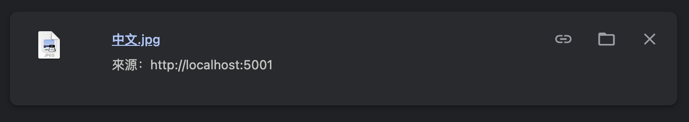
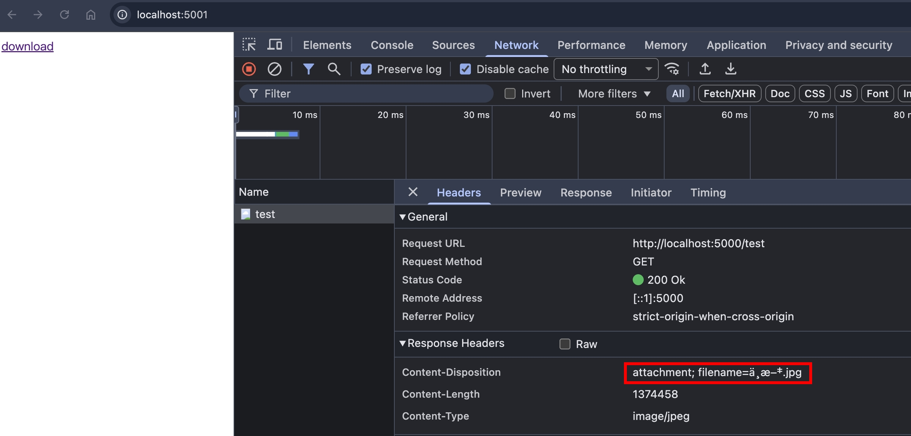
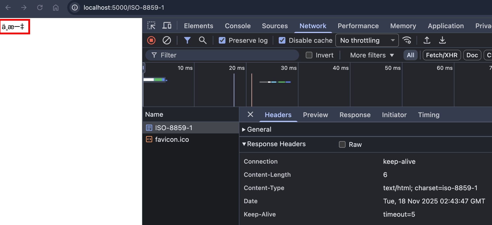
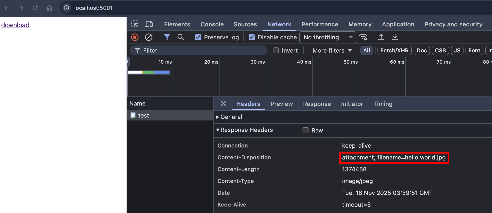
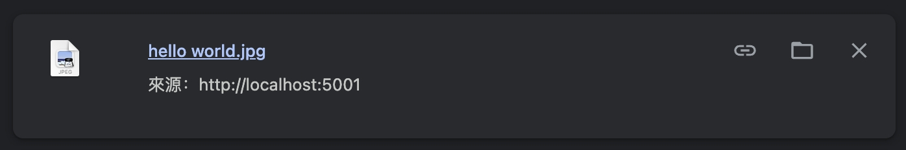
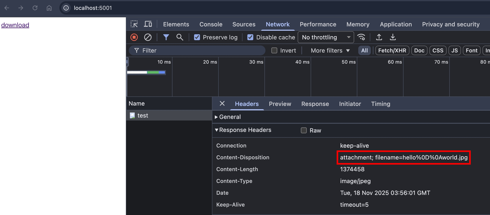
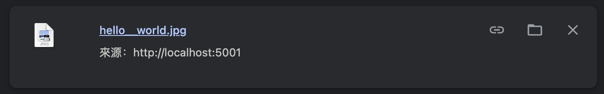

## 前言

承接上一篇，這篇來聊聊 `<a download>` 跟 `Content-Dispositon` 是如何處理下載的檔名

## `<a download>` 範例

```html
<a download="filename.jpg"></a>
```

## Content-Disposition 範例

```
Content-Disposition: attachment; filename=filename.jpg
Content-Disposition: attachment; filename="file name.jpg"
Content-Disposition: attachment; filename*=UTF-8''file%20name.jpg
```

## 兩者一起設定，會以誰為主？

當兩者一起設定時

- `Content-Disposition: attachment; filename=1.txt`
- `<a download="2.txt">`

瀏覽器會優先使用 `Content-Disposition` 的值，參考 [MDN](https://developer.mozilla.org/en-US/docs/Web/HTML/Reference/Elements/a#download) 的描述

```
If the header specifies a filename, it takes priority over a filename specified in the download attribute.
```

寫個 PoC

```ts
import http from "http";

const httpServer5000 = http.createServer((req, res) => {
  if (req.url === "/test") {
    res.setHeader("Content-Type", "text/plain");
    res.setHeader("Content-Disposition", "attachment; filename=1.txt");
    res.end("test");
    return;
  }
});
httpServer5000.listen(5000);

const httpServer5001 = http.createServer((req, res) => {
  res.setHeader("content-type", "text/html");
  res.end('<a href="http://localhost:5000/test" download>download</a>');
  return;
});
httpServer5001.listen(5001);
```

點擊 "download" 後，最終下載的檔名確實會以 `Content-Disposition` 宣告的為主


## 概念

接著，我們會來介紹 `Content-Disposition` filename 的各項參數

- filename 預設的 charset 是 [ISO-8859-1](https://www.w3schools.com/CHARSETS/ref_html_8859.asp)，也就是 ASCII 定義的 0 ~ 127，再擴展到 128 ~ 255 對應的歐洲字元
- 若 filename 有包含特殊字元，則需要用雙引號包起來
- 若 filename 有包含 [ISO-8859-1](https://www.w3schools.com/CHARSETS/ref_html_8859.asp) 以外的字元，則可以用 `filename*=UTF-8''URL-Encoded-Value` 的格式

## 實務建議

根據 [RFC6266 Section 5](https://datatracker.ietf.org/doc/html/rfc6266#section-5) 的範例，建議 `filename` 跟 `filename*` 兩者同時設定，確保向後兼容性

```
Content-Disposition: attachment; filename="EURO rates"; filename*=utf-8''%e2%82%ac%20rates
```

而根據 [RFC6266 Section 4.3](https://datatracker.ietf.org/doc/html/rfc6266#section-4.3) 的原文，當兩者同時設定，會優先選擇 `filename*`

```
when both "filename" and "filename*" are present in a single header field value, recipients SHOULD pick "filename*" and ignore "filename"
```

## Edge Case 1: `filename=中文.jpg`

PoC

```ts
import http from "http";
import { readFileSync } from "fs";
import { join } from "path";

const image = readFileSync(join(import.meta.dirname, "image.jpg"));

const httpServer5000 = http.createServer((req, res) => {
  if (req.url === "/test") {
    const socket = res.socket;
    socket?.write(`HTTP/1.1 200 Ok\r\n`);
    socket?.write(`Content-Length: ${Buffer.byteLength(image)}\r\n`);
    socket?.write(`Content-Disposition: attachment; filename=中文.jpg\r\n`);
    socket?.write(`Content-Type: image/jpeg\r\n\r\n`);
    socket?.write(image);
  }
});
httpServer5000.listen(5000);

const httpServer5001 = http.createServer((req, res) => {
  res.setHeader("content-type", "text/html");
  res.end('<a href="http://localhost:5000/test" download>download</a>');
  return;
});
httpServer5001.listen(5001);
```

點擊 "download" 後，檔名在作業系統有正確呈現



但 F12 > Network 呈現的檔名是錯的



嘗試用 `curl -v "http://localhost:5000/test" --output test.jpg`，確保上面的 PoC 是正確的

```
* Request completely sent off
< HTTP/1.1 200 Ok
< Content-Length: 1374458
< Content-Disposition: attachment; filename=中文.jpg
< Content-Type: image/jpeg
```

`wc -c test.jpg` 確認 Content-Length 跟實際檔案的 bytes 符合

```
1374458 test.jpg
```

至於 `中文.jpg` 是什麼呢？這其實是編碼轉換的問題，瀏覽器看到 `filename=`，預設用 ISO-8859-1 的編碼來呈現，轉換過程為：
| UTF-8 | Hex | ISO-8859-1 |
| ----- | --- | ---------- |
| 中文 | e4 b8 ad e6 96 87 | 中文.jpg |

寫個 PoC 來驗證 `中文`

```ts
import http from "http";

const httpServer5000 = http.createServer((req, res) => {
  if (req.url === "/ISO-8859-1") {
    const buffer = Buffer.from("中文", "utf8");
    res.setHeader("Content-Type", "text/html; charset=iso-8859-1");
    res.end(buffer);
    return;
  }
});
httpServer5000.listen(5000);
```

Chrome 訪問 http://localhost:5000/ISO-8859-1 ，可以正確看到 `中文` 了～



:::info
現在很多網站、工具預設都用 UTF-8，所以使用 `charset=iso-8859-1` 來測試，會比較準確
:::

## Edge Case 2: `filename=hello world.jpg`

PoC

```ts
import http from "http";
import { readFileSync } from "fs";
import { join } from "path";

const image = readFileSync(join(import.meta.dirname, "image.jpg"));

const httpServer5000 = http.createServer((req, res) => {
  if (req.url === "/test") {
    res.setHeader("Content-Type", "image/jpeg");
    res.setHeader(
      "Content-Disposition",
      "attachment; filename=hello world.jpg",
    );
    res.end(image);
    return;
  }
});
httpServer5000.listen(5000);

const httpServer5001 = http.createServer((req, res) => {
  res.setHeader("content-type", "text/html");
  res.end('<a href="http://localhost:5000/test" download>download</a>');
  return;
});
httpServer5001.listen(5001);
```

實測後，檔名的空白，有正確呈現在 F12 > Network 跟作業系統




## Edge Case 3: `filename=hello%0D%0Aworld.jpg`

:::info
`%0D%0A` 是 CRLF 的 URL Encode 版本
:::

PoC

```ts
import http from "http";
import { readFileSync } from "fs";
import { join } from "path";

const image = readFileSync(join(import.meta.dirname, "image.jpg"));

const httpServer5000 = http.createServer((req, res) => {
  if (req.url === "/test") {
    res.setHeader("Content-Type", "image/jpeg");
    res.setHeader(
      "Content-Disposition",
      "attachment; filename=hello%0D%0Aworld.jpg",
    );
    res.end(image);
    return;
  }
});
httpServer5000.listen(5000);

const httpServer5001 = http.createServer((req, res) => {
  res.setHeader("content-type", "text/html");
  res.end('<a href="http://localhost:5000/test" download>download</a>');
  return;
});
httpServer5001.listen(5001);
```

實測後，檔名有正確呈現在 F12 > Network，但下載到作業系統後，`%0D%0A` 被轉換成 `__`



根據 [MDN 文件](https://developer.mozilla.org/en-US/docs/Web/HTTP/Reference/Headers/Content-Disposition#as_a_response_header_for_the_main_body)的描述

```
Browsers may apply transformations to conform to the file system requirements, such as converting path separators (/ and \) to underscores (_).
```

瀏覽器這樣做，除了正規化檔名，讓各個作業系統的 file system 可以正確呈現，還可以避免各種資安隱患，例如 [Path Traversal](../port-swigger/path-traversal.md)

## 小結

在這篇文章，我們學到了

- `<a download>` 跟 `Content-Disposition` 同時設定 filename 時的優先順序
- `Content-Disposition` 的 filename 跟 filename\* 參數的差異
- `Content-Disposition` 的 filename 參數遇到中文會怎麼處理
- `Content-Disposition` 的 filename 參數遇到空白會怎麼處理
- `Content-Disposition` 的 filename 參數遇到特殊字元會怎麼處理

## 參考資料

- https://developer.mozilla.org/en-US/docs/Web/HTML/Reference/Elements/a#download
- https://developer.mozilla.org/en-US/docs/Web/HTTP/Reference/Headers/Content-Disposition
- https://datatracker.ietf.org/doc/html/rfc6266
- https://datatracker.ietf.org/doc/html/rfc8187
