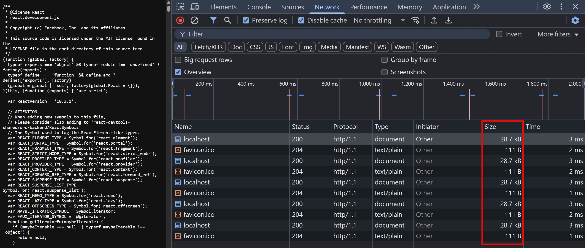
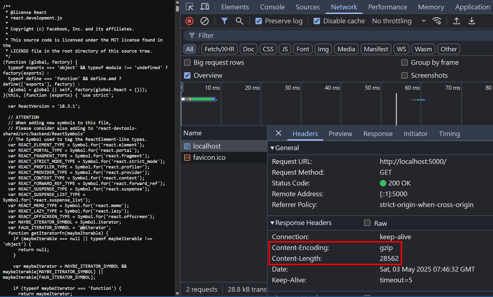
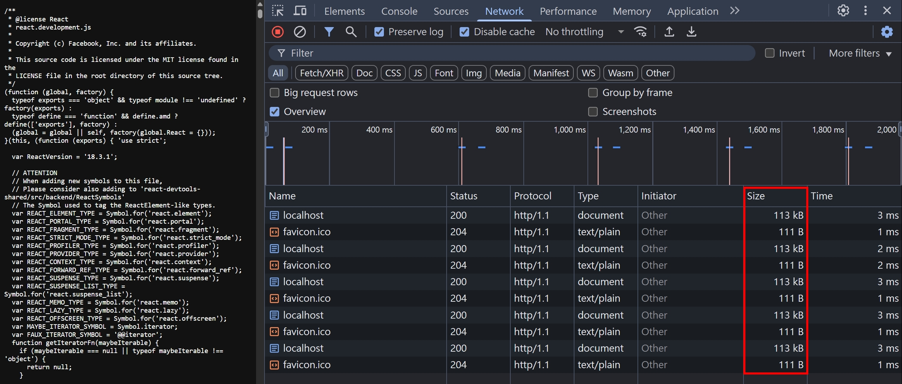
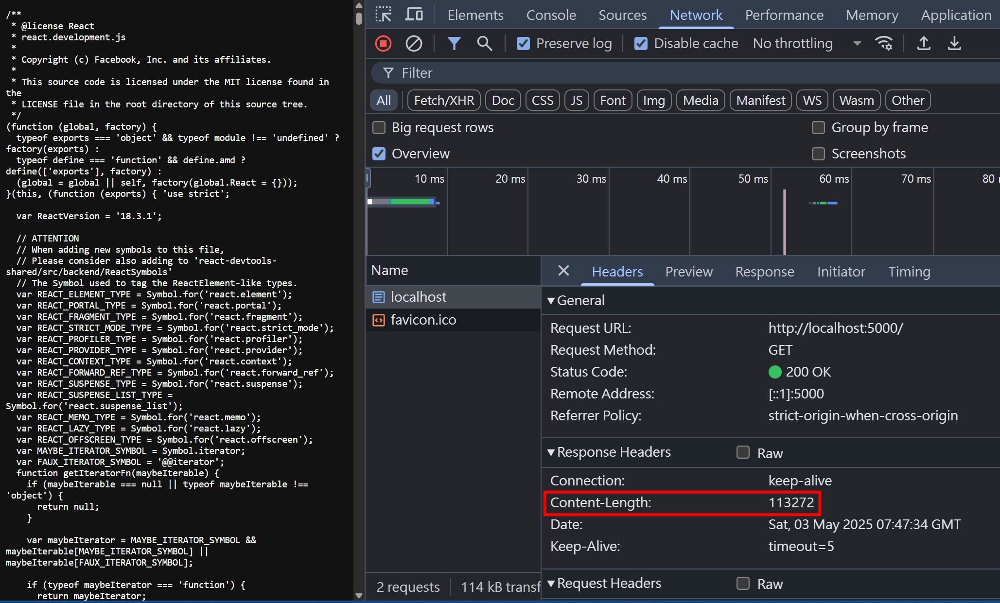
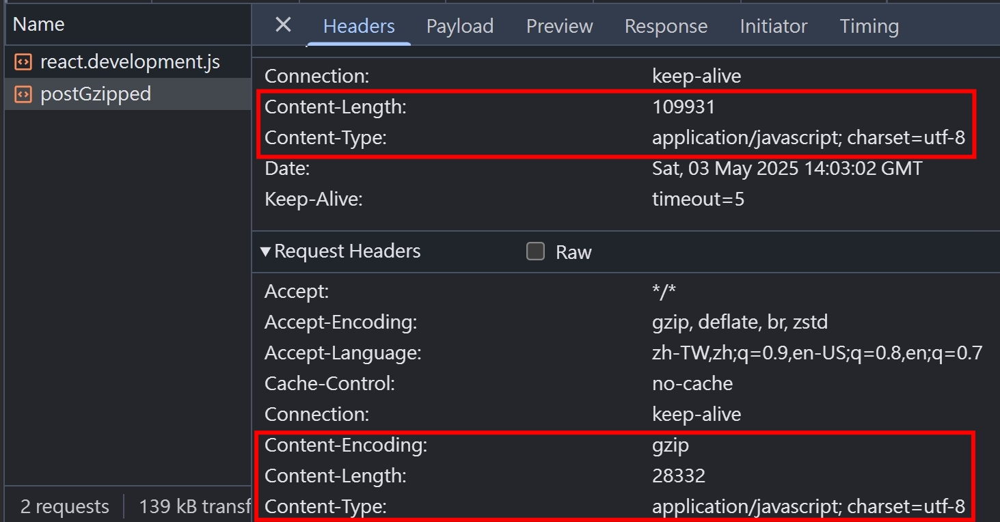
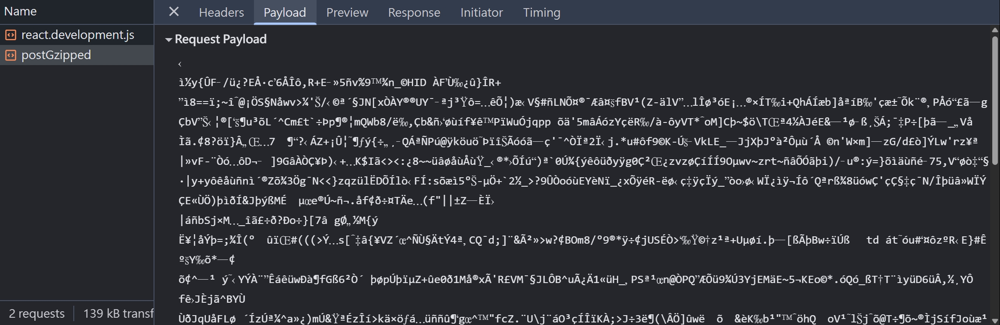
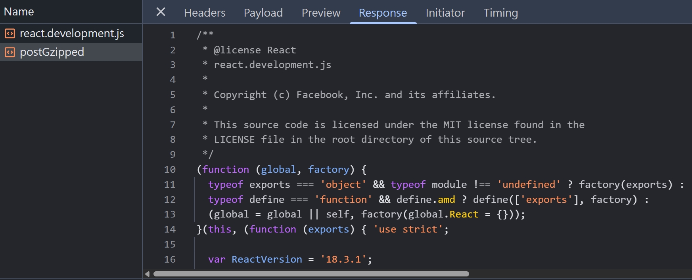
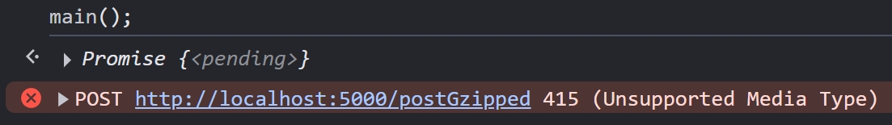
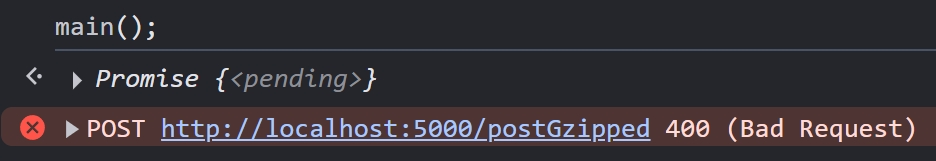

## 透過瀏覽器觀察 Accept-Encoding

當我們使用瀏覽器打開任何一個網頁時，F12 > Network > Doc > Request Headers，應該都可以看到 `Accept-Encoding: gzip, deflate, br, zstd`


這是瀏覽器預設就會發送的 Request Header，代表瀏覽器支援這些資料壓縮的演算法

## Accept-Encoding 深入研究

- `Accept-Encoding` 也可以作為 Response Header，用來告訴 client 端，Server 支援哪些資料壓縮的演算法
- 不一定要有空格，也可以是 `Accept-Encoding: gzip,deflate,br,zstd` 的形式，Server 需要正確的處理這兩種情境
- 加上權重(q)的表達方式， `Accept-Encoding: br;q=1.0, gzip;q=0.8`，其中權重(q)是一個介於 0 ~ 1 的值，通常會使用降冪排序，但這部分似乎沒有硬性規定，所以 Server 也是需要正確處理權重(q)的排序
- `Accept-Encoding: *` => 接受任何的資料壓縮形式
- `Accept-Encoding: identity` => 原始資料直接回傳就好，不要再壓縮了
- `Accept-Encoding: gzip, identity;q=0` => 回傳的資料一定要壓縮，如果 Server 不支援 gzip 壓縮方法，必須回傳 406 Not Acceptable

## HTTP 常見的壓縮演算法

1. [gzip](https://developer.mozilla.org/en-US/docs/Web/HTTP/Reference/Headers/Accept-Encoding#gzip)
2. [deflate](https://developer.mozilla.org/en-US/docs/Web/HTTP/Reference/Headers/Accept-Encoding#deflate)
3. [br](https://github.com/google/brotli)
4. [zstd](https://github.com/facebook/zstd)

## 排序代表的意義

- Server 需要根據這個優先順序 `gzip, deflate, br, zstd` 來決定要使用哪個壓縮演算法
- 根據我查到的資料， `gzip, deflate, br, zstd` 這個順序是根據這些演算法的普及度、效率和兼容性考慮
- 以這些演算法的問世時間從遠到近排序的話，`deflate, gzip, br, zstd`

## 使用 NodeJS zlib + HTTP serve 壓縮後的靜態資源

NodeJS 有原生的模組 `zlib`，專門處理壓縮跟解壓縮的邏輯，常見的 `gzip`, `deflate`, `br` 演算法都有支援，唯獨 `zstd` 是比較新的演算法，在目前 (NodeJS v23.11.0)[https://nodejs.org/api/zlib.html#for-zstd-based-streams] 是還在實驗中的 API，故本篇就不使用。

我們創建一個路由， serve [react 18](https://unpkg.com/react@18.3.1/umd/react.development.js) 的靜態文檔

```ts
import { readFileSync } from "node:fs";
import httpServer from "../httpServer";
import { gzipSync, brotliCompressSync, deflateSync } from "node:zlib";
import { join } from "node:path";

// 使用 react 18.3.1 當作要 serve 的靜態資源，並且預先壓縮
const selfHostReactJs = readFileSync(join(__dirname, "./react.development.js"));
const gzipSelfHostReactJs = gzipSync(selfHostReactJs);
const brotliSelfHostReactJs = brotliCompressSync(selfHostReactJs);
const deflateSelfHostReactJs = deflateSync(selfHostReactJs);
const encodedSelfHostReactJsMap = {
  gzip: gzipSelfHostReactJs,
  deflate: deflateSelfHostReactJs,
  br: brotliSelfHostReactJs,
};
type ServerAcceptedEncoding = keyof typeof encodedSelfHostReactJsMap;
type EncodingPreference = { encoding: string; q: number };

httpServer.on("request", function requestListener(req, res) {
  if (req.url === "/favicon.ico") return faviconListener(req, res);
  const acceptEncoding = req.headers["accept-encoding"];
  const encodingPreferenceList: EncodingPreference[] = String(acceptEncoding)
    .split(",")
    .map((part) => {
      const [encoding, qPart] = part.trim().split(";");
      const q = qPart ? parseFloat(qPart.split("=")[1]) : 1.0;
      return { encoding: encoding.trim(), q };
    })
    // 依照 q-value 排序，從高到低
    .sort((a, b) => b.q - a.q);

  // 暫不處理 identity 或是 * 或是 q=0 這些特殊情境
  for (const { encoding } of encodingPreferenceList) {
    const encodedSelfHostReactJs =
      encodedSelfHostReactJsMap[encoding as ServerAcceptedEncoding];
    if (encodedSelfHostReactJs) {
      res.setHeader("Content-Encoding", encoding);
      res.end(encodedSelfHostReactJs);
      return;
    }
  }
  return res.end(selfHostReactJs);
});
```

使用瀏覽器打開 http://localhost:5000/ ，查看壓縮過後的文件體積




壓縮後的體積是 28.7 KB，我們再來看看不壓縮的情況




沒壓縮的情況，體積是 113 KB，可以感受到這個壓縮比還是非常有感的

## Content-Encoding

上面的程式碼範例，Server 在成功 match 到 client 端的 `Accept-Encoding` 之後，會回傳 `Content-Encoding` 的 HTTP Header。client 端收到以後，就會根據這個值去做對應的解壓縮。

## 錯誤的 Content-Encoding 會發生什麼事情

我們改寫一下 NodeJS 程式碼（只列出異動部分）

```ts
httpServer.on("request", function requestListener(req, res) {
  res.setHeader("Content-Encoding", "br");
  return res.end(selfHostReactJs);
});
```

然後重整瀏覽器，應該會看到白頁，並且顯示 `ERR_CONTENT_DECODING_FAILED`，代表瀏覽器無法正確使用 Server 提供的 `Content-Encoding` 進行解壓縮


## client 傳送壓縮後的資訊給 server

[上面的範例](#使用-nodejs-zlib--http-serve-壓縮後的靜態資源) 是 Server 處理壓縮的邏輯，但 `Content-Encoding` 也可以當作 Request Header。我們使用瀏覽器於 2023-05 新增的 [Compression Streams API](https://developer.mozilla.org/en-US/docs/Web/API/Compression_Streams_API) 來處理 client 端的 gzip 壓縮（這段程式碼稍微複雜，牽涉到很多 js 偏底層的概念，包含 `ArrayBuffer`, `ReadableStream`, `Uint8Array`, `CompressionStream`, `Blob`）

```js
async function fetchAndCompressToGzip() {
  try {
    const response = await fetch(
      "https://unpkg.com/react@18.3.1/umd/react.development.js",
    );
    const originalData = await response.arrayBuffer();
    const readableStream = new ReadableStream({
      start(controller) {
        controller.enqueue(new Uint8Array(originalData));
        controller.close();
      },
    });
    const compressedStream = readableStream.pipeThrough(
      new CompressionStream("gzip"),
    );
    const reader = compressedStream.getReader();
    const chunks = [];
    while (true) {
      const { done, value } = await reader.read();
      if (done) break;
      chunks.push(value);
    }
    const gzippedBlob = new Blob(chunks, {
      type: "application/javascript; charset=utf-8",
    });
    return gzippedBlob;
  } catch (error) {
    console.error("壓縮過程出錯:", error);
    throw error;
  }
}

async function sendGzippedBlobToServer(body) {
  const response = await fetch("http://localhost:5000/postGzipped", {
    method: "post",
    headers: {
      "Content-Encoding": "gzip",
    },
    body,
  }).then((res) => res.text());
}

async function main() {
  const gzippedBlob = await fetchAndCompressToGzip();
  const text = await sendGzippedBlobToServer(gzippedBlob);
  console.log(text);
}

main();
```

稍微調整一下 NodeJS 的程式碼，處理 `/postGzipped` 的路由（僅列出異動部分），把 client 傳送的 gzipped react 原始碼解壓縮，並且回傳。

```ts
if (req.url === "/") {
  // ...無異動
} else if (req.url === "/postGzipped" && req.method?.toLowerCase() === "post") {
  // 檢查 contentEncoding 是否為 Server 可處理的類型
  const contentEncoding = req.headers["content-encoding"];
  if (contentEncoding !== "gzip") {
    res.statusCode = 415;
    res.setHeader("Accept-Encoding", "gzip");
    res.end();
    return;
  }
  // 檢查 contentType 是否有值
  const contentType = req.headers["content-type"];
  if (!contentType) {
    res.statusCode = 400;
    res.setHeader("Content-Type", "text/plain");
    res.end("Invalid Content Type");
    return;
  }

  // 開始讀取 req.body
  const chunks: Buffer[] = [];
  req.on("data", (chunk: Buffer) => {
    chunks.push(chunk);
  });
  req.on("end", () => {
    const decompressedBuffer = gunzipSync(Buffer.concat(chunks));
    const decompressedString = decompressedBuffer.toString("utf-8");
    // 非最佳實踐，需先確認為合法的 contentType
    res.setHeader("Content-Type", contentType);
    res.end(decompressedString);
  });
} else return notFoundListener(req, res);
```

打開瀏覽器 F12 > Console，執行上面的 `main()`，並且切到 Network 觀察

- Request Header 有正確帶上 `Content-Type` 跟 `Content-Encoding`，並且 `Content-Length` 是壓縮過後的體積
- Response Header 有正確帶上 `Content-Type`，並且 `Content-Length` 是解壓縮過後的體積



Request Body 是壓縮後的資料



Response body 是解壓縮後的資料



## Accept-Encoding as Response Header

上面的 `/postGzipped` 路由，其實已經有正確處理 415 Unsupported Media Type 的情況，我們只需要稍微改寫 client 端的程式碼，把 `Content-Encoding` 拔掉

```js
async function sendGzippedBlobToServer(body) {
  const response = await fetch("http://localhost:5000/postGzipped", {
    method: "post",
    headers: {
      // "Content-Encoding": "gzip",
    },
    body,
  }).then((res) => res.text());
}
```

重新執行 `main()`，應該會看到 Server 有正確處理 415 Unsupported Media Type 的情況



## client 端沒有明確指定 Content-Type

這時候 Server 有幾種處理方式：

1. Server 自行處理 [MIME sniffing](./content-type-and-mime-type#mime-sniffing)
2. 回傳 400 Bad Request
3. 其他...

上面的 NodeJS 程式碼範例，我們使用 `2. 回傳 400 Bad Request` 來處理，我們稍微改寫 client 端程式碼，把 `Blob` 的 `Content-Type` 拔掉，測試看看 Server 是否正確回應：

```js
async function fetchAndCompressToGzip() {
  try {
    // 省略
    const gzippedBlob = new Blob(chunks);
    return gzippedBlob;
  } catch (error) {
    // 省略
  }
}
```

重新執行 `main()`，應該會看到 Server 有正確處理 400 Bad Request 的情況



<!-- todo-yusheng 在想這個要不要講 -->
<!-- ## Compression

資料的壓縮通常分為兩種

1. Loss-less compression（無損壓縮）
2. Lossy compression (破壞性資料壓縮) -->

## 插曲

在寫這篇文章的時候，其實我還順便發現了 `node` 跟 `@types/node` 的兩個錯誤，並且順便發 PR 修正了

1. [doc: fix typo of file `zlib.md`](https://github.com/nodejs/node/pull/58093)
2. [doc[node]: add "accept-encoding" to `interface IncomingHttpHeaders`](https://github.com/DefinitelyTyped/DefinitelyTyped/pull/72673)

## 參考資料

- https://developer.mozilla.org/en-US/docs/Web/HTTP/Compression
- https://developer.mozilla.org/en-US/docs/Glossary/Lossless_compression
- https://developer.mozilla.org/en-US/docs/Glossary/Lossy_compression
- https://developer.mozilla.org/en-US/docs/Glossary/Brotli_compression
- https://developer.mozilla.org/en-US/docs/Glossary/gzip_compression
- https://developer.mozilla.org/en-US/docs/Glossary/Zstandard_compression
- https://developer.mozilla.org/en-US/docs/Web/HTTP/Guides/Compression_dictionary_transport
- https://developer.mozilla.org/en-US/docs/Web/HTTP/Headers/Content-Encoding
- https://developer.mozilla.org/en-US/docs/Web/HTTP/Headers/Accept-Encoding
- https://developer.mozilla.org/en-US/docs/Glossary/Quality_values
- https://developer.mozilla.org/en-US/docs/Web/API/Compression_Streams_API
- https://developer.mozilla.org/en-US/docs/Web/API/ReadableStream/ReadableStream
- https://nodejs.org/docs/latest-v22.x/api/zlib.html
