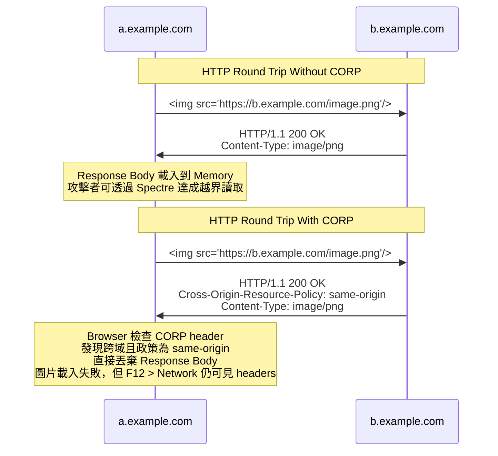
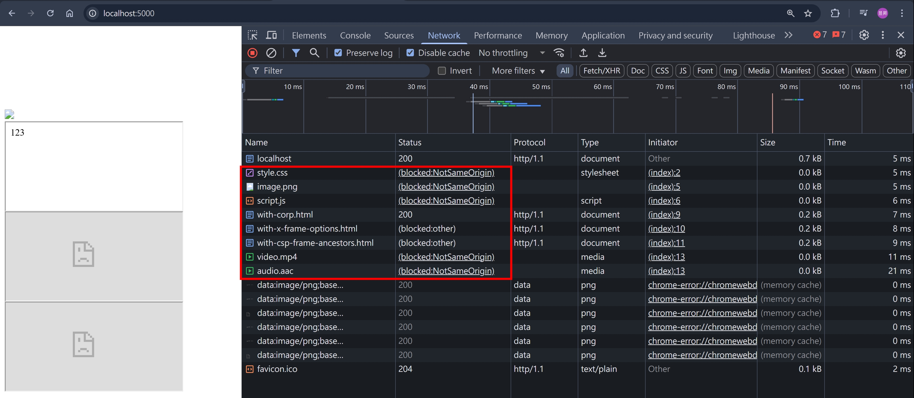
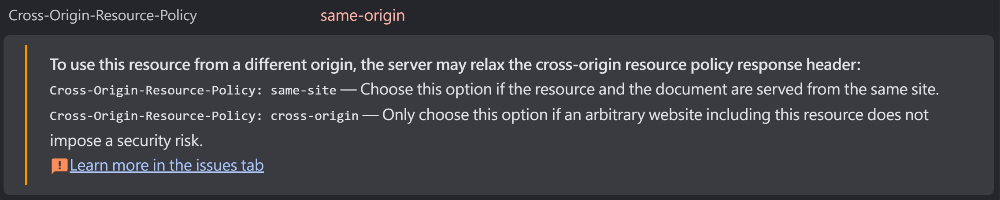
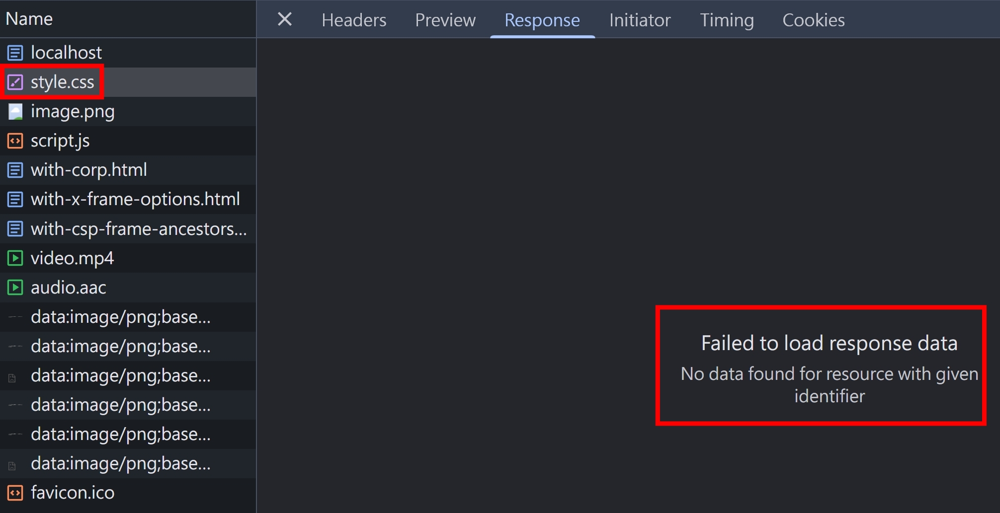
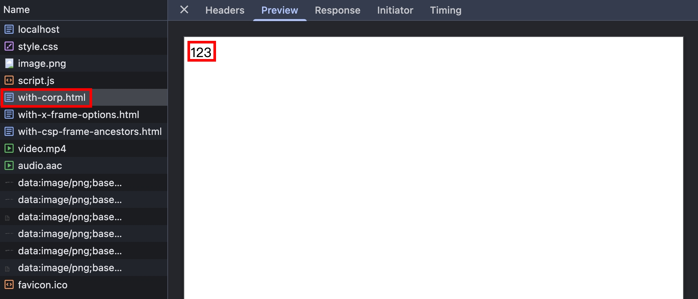
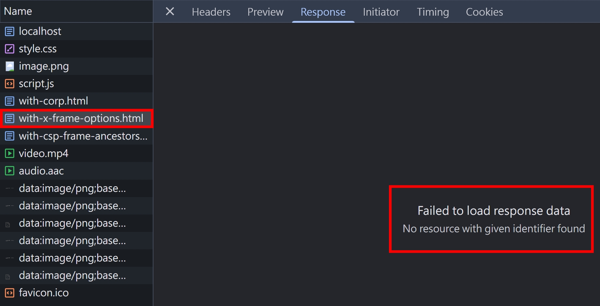
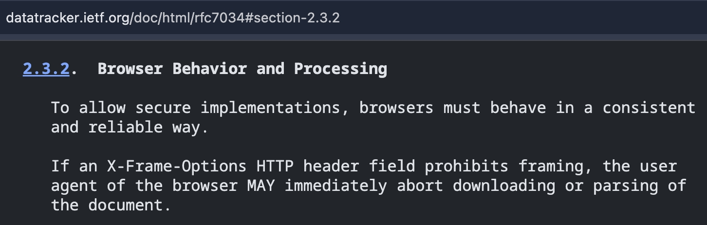
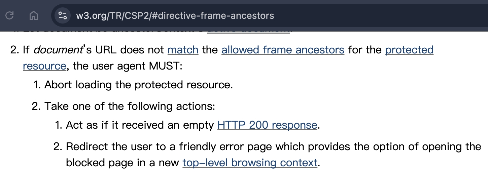
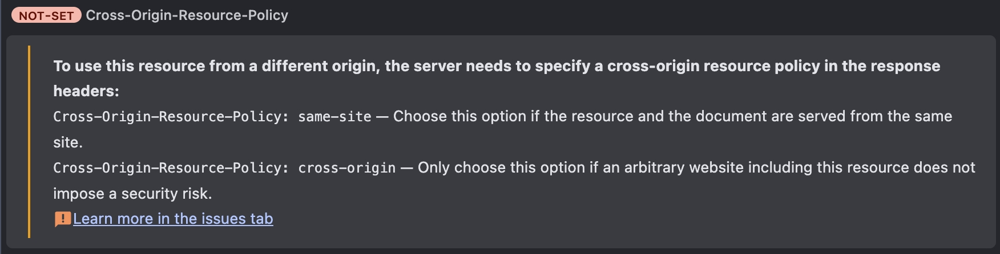

## 行前準備

本篇文章，會大量用到 NodeJS HTTP Server 作為程式碼範例，為了避免重複，所以這邊先把基礎架構設定好

httpServers.ts

```ts
import { createServer } from "http";

export const http5000Server = createServer().listen(5000);
export const http5001Server = createServer().listen(5001);
```

index.ts

```ts
import { faviconListener } from "../listeners/faviconListener";
import { notFoundListener } from "../listeners/notFoundlistener";
import { http5000Server, http5001Server } from "./httpServers";

http5000Server.on("request", function requestListener(req, res) {});

http5001Server.on("request", function requestListener(req, res) {});
```

## 大綱

底下網羅本篇文章會介紹到的 "beyond CORS" Headers，會在接下來的段落陸續介紹到

<table>
  <thead>
    <tr>
      <th>Header Name</th>
      <th>Header Type</th>
    </tr>
  </thead>
  <tbody>
    <tr>
      <td>Cross-Origin-Resource-Policy</td>
      <td>Response</td>
    </tr>
    <tr>
      <td>Cross-Origin-Embedder-Policy</td>
      <td>Response</td>
    </tr>
    <tr>
      <td>Cross-Origin-Opener-Policy</td>
      <td>Response</td>
    </tr>
  </tbody>
</table>

## Cross-Origin-Resource-Policy (CORP)

### 誕生原因

CORP 的誕生，是為了解決 `Meltdown` 跟 `Spectre` 這些資安漏洞，詳細可參考 [Huli 大大的文章](https://aszx87410.github.io/beyond-xss/ch4/cors-attack/)，我沒有深入去瞭解這些資安漏洞的原因跟 PoC，但可以用一個簡單的時序圖，帶大家了解



### 一石二鳥

- CORP 的誕生，也順便解決了另一個問題，就是保護自家網站的資源不被跨域的網站引用
- 這邊的資源，通常是指透過 `` 或是 `<script>` 載入的資源
- 如果是 HTML 類型的資源，不想要被跨域的網站透過 `<iframe>` 載入，則無法透過 CORP 防範，請參考我寫過的 [iframe-security](../http/iframe-security.md)

### CORP 實作環節

http5000Server

```ts
const indexHTML = readFileSync(join(__dirname, "index.html"));

if (req.url === "/") {
  res.setHeader("Content-Type", "text/html");
  res.end(indexHTML);
  return;
}
```

index.html

```html
<html>
  <head>
    <link rel="stylesheet" href="http://localhost:5001/style.css" />
  </head>
  <body>
    
    <script src="http://localhost:5001/script.js"></script>
    <video src="http://localhost:5001/video.mp4"></video>
    <audio src="http://localhost:5001/audio.aac"></audio>
    <iframe src="http://localhost:5001/with-corp.html"></iframe>
    <iframe src="http://localhost:5001/with-x-frame-options.html"></iframe>
    <iframe src="http://localhost:5001/with-csp-frame-ancestors.html"></iframe>
  </body>
</html>
```

http5001Server

```ts
if (req.url === "/style.css") {
  res.setHeader("Cross-Origin-Resource-Policy", "same-origin");
  res.setHeader("Content-Type", "text/css");
  res.end("123");
  return;
}
if (req.url === "/image.png") {
  res.setHeader("Cross-Origin-Resource-Policy", "same-origin");
  res.setHeader("Content-Type", "image/png");
  res.end("123");
  return;
}
if (req.url === "/script.js") {
  res.setHeader("Cross-Origin-Resource-Policy", "same-origin");
  res.setHeader("Content-Type", "text/javascript");
  res.end("123");
  return;
}
if (req.url === "/video.mp4") {
  res.setHeader("Cross-Origin-Resource-Policy", "same-origin");
  res.setHeader("Content-Type", "video/mp4");
  res.end("123");
  return;
}
if (req.url === "/audio.aac") {
  res.setHeader("Cross-Origin-Resource-Policy", "same-origin");
  res.setHeader("Content-Type", "audio/aac");
  res.end("123");
  return;
}
if (req.url === "/with-corp.html") {
  res.setHeader("Cross-Origin-Resource-Policy", "same-origin");
  res.setHeader("Content-Type", "text/html");
  res.end("123");
  return;
}
if (req.url === "/with-x-frame-options.html") {
  res.setHeader("X-Frame-Options", "SAMEORIGIN");
  res.setHeader("Content-Type", "text/html");
  res.end("123");
  return;
}
if (req.url === "/with-csp-frame-ancestors.html") {
  res.setHeader("Content-Security-Policy", "frame-ancestors 'self'");
  res.setHeader("Content-Type", "text/html");
  res.end("123");
  return;
}
```

瀏覽器打開 http://localhost:5000/ ，可看到 F12 > Network 如下


CORP 的 error message


img, link, script, video, audio 的 response body 都無法讀取


即便有設定 CORP，iframe 還是可以正常載入


X-Frame-Options, CSP frame-ancestors 才可以防止 iframe 的 response body 被載入


### iframe vs CORP

<table>
  <thead>
    <tr>
      <th>Response Header</th>
      <th>能否防止 iframe 載入跨域的 response body</th>
      <th>說明</th>
    </tr>
  </thead>
  <tbody>
    <tr>
      <td>Cross-Origin-Resource-Policy</td>
      <th>❌</th>
      <td>iframe 不算是 resource，而是一個 browsing context，所以不受 CORP 影響</td>
    </tr>
    <tr>
      <td>X-Frame-Options</td>
      <th>✅</th>
      <td>
        browser MAY immediately abort downloading or parsing of the document
        
      </td>
    </tr>
    <tr>
      <td>CSP frame-ancestors</td>
      <th>✅</th>
      <td>
        CSP 的規範比較嚴格，是用 MUST 來描述
        
      </td>
    </tr>
  </tbody>
</table>

## Cross-Origin-Embedder-Policy (COEP)

### COEP vs CORP

如果以買水果的概念來比喻的話

- COEP 的概念是 => 我只買沒有農藥的水果
- CORP 的概念是 => 商家的水果決定要賣給誰
- 雙方都要同意才會成交

我把 COEP 跟 CORP 的概念以及交乘情境都列出來，方便大家用圖表的方式去理解

```mermaid
sequenceDiagram
  participant a.example.com
  participant b.example.com

  Note Over a.example.com, b.example.com: Case1: CORP `same-site`

  a.example.com ->> b.example.com: Can I load your image?
  a.example.com ->> b.example.com: <img src="https://b.example.com/image.png"/>

  b.example.com ->> a.example.com: Sure, I allow same-site or cross-origin
  b.example.com ->> a.example.com: HTTP/1.1 200 OK<br/>Cross-Origin-Resource-Policy: same-site | cross-origin<br/>Content-Type: image/png

  Note Over a.example.com, b.example.com: Case2: CORP `same-origin`

  a.example.com ->> b.example.com: Can I load your image?
  a.example.com ->> b.example.com: <img src="https://b.example.com/image.png"/>

  b.example.com ->> a.example.com: Sorry, we are not same-origin
  b.example.com ->> a.example.com: HTTP/1.1 200 OK<br/>Cross-Origin-Resource-Policy: same-origin<br/>Content-Type: image/png

  Note Over a.example.com: Browser ignore the response body because of CORP

  Note Over a.example.com, b.example.com: Case 3-1: COEP `require-corp`

  Note Over a.example.com: COEP: require-corp

  a.example.com ->> b.example.com: I want to load your image only if you say so
  a.example.com ->> b.example.com: <img src="https://b.example.com/image.png"/>

  b.example.com ->> a.example.com: Sure, I allow same-site or cross-origin
  b.example.com ->> a.example.com: HTTP/1.1 200 OK<br/>Cross-Origin-Resource-Policy: same-site | cross-origin<br/>Content-Type: image/png

  Note Over a.example.com, b.example.com: Case 3-2: COEP `require-corp`

  Note Over a.example.com: COEP: require-corp

  a.example.com ->> b.example.com: I want to load your image only if you say so
  a.example.com ->> b.example.com: <img src="https://b.example.com/image.png"/>

  b.example.com ->> a.example.com: Sorry, we are not same-origin
  b.example.com ->> a.example.com: HTTP/1.1 200 OK<br/>Cross-Origin-Resource-Policy: same-origin<br/>Content-Type: image/png

  Note Over a.example.com: Browser ignore the response body because of CORP

  Note Over a.example.com, b.example.com: Case 3-3: COEP `require-corp`

  Note Over a.example.com: COEP: require-corp

  a.example.com ->> b.example.com: I want to load your image only if you say so
  a.example.com ->> b.example.com: <img src="https://b.example.com/image.png"/>

  b.example.com ->> a.example.com: I don't have CORP Header...
  b.example.com ->> a.example.com: HTTP/1.1 200 OK<br/>Content-Type: image/png

  Note Over a.example.com: Browser ignore the response body because of COEP

  Note Over a.example.com, b.example.com: Case 4-1: COEP `credentialless`

  Note Over a.example.com: COEP: credentialless

  a.example.com ->> b.example.com: I want to load your image without sending credentials
  a.example.com ->> b.example.com: <img src="https://b.example.com/image.png" />

  b.example.com ->> a.example.com: Sorry, we are not same-origin
  b.example.com ->> a.example.com: HTTP/1.1 200 OK<br/>Cross-Origin-Resource-Policy: same-origin<br/>Content-Type: image/png

  Note Over a.example.com: Browser ignore the response body because of CORP

  Note Over a.example.com, b.example.com: Case 4-2: COEP `credentialless`

  Note Over a.example.com: COEP: credentialless

  a.example.com ->> b.example.com: I want to load your image without sending credentials
  a.example.com ->> b.example.com: <img src="https://b.example.com/image.png" />

  b.example.com ->> a.example.com: Sure, I allow same-site or cross-origin
  b.example.com ->> a.example.com: HTTP/1.1 200 OK<br/>Cross-Origin-Resource-Policy: same-site | cross-origin<br/>Content-Type: image/png

  Note Over a.example.com, b.example.com: Case 4-3: COEP `credentialless`

  Note Over a.example.com: COEP: credentialless

  a.example.com ->> b.example.com: I want to load your image without sending credentials
  a.example.com ->> b.example.com: <img src="https://b.example.com/image.png" />

  b.example.com ->> a.example.com: I don't have CORP Header...
  b.example.com ->> a.example.com: HTTP/1.1 200 OK<br/>Content-Type: image/png
```



P.S. Case 3-3 Browser ignore the response body because of COEP 的情境，會看到以下錯誤訊息


## 小結

CORP 跟 COEP，實務上我沒看到有網站使用過，但它們也是瀏覽器安全性演進的一環。另外還有 COOP，會在 [未來的章節](../http/beyond-cors-2.md) 跟大家分享～

## 參考資料

- https://developer.mozilla.org/en-US/docs/Web/Security/Practical_implementation_guides/CORP
- https://developer.mozilla.org/en-US/docs/Web/HTTP/Cross-Origin_Resource_Policy
- https://developer.mozilla.org/en-US/docs/Web/HTTP/Reference/Headers/Cross-Origin-Resource-Policy
- https://developer.mozilla.org/en-US/docs/Web/HTTP/Reference/Headers/Cross-Origin-Embedder-Policy
- https://developer.mozilla.org/en-US/docs/Web/HTTP/Reference/Headers/Cross-Origin-Opener-Policy
- https://html.spec.whatwg.org/multipage/browsers.html#cross-origin-opener-policies
- https://datatracker.ietf.org/doc/html/rfc7034#section-2.3.2
- https://www.w3.org/TR/CSP2/#directive-frame-ancestors
- https://aszx87410.github.io/beyond-xss/ch4/cors-attack/
