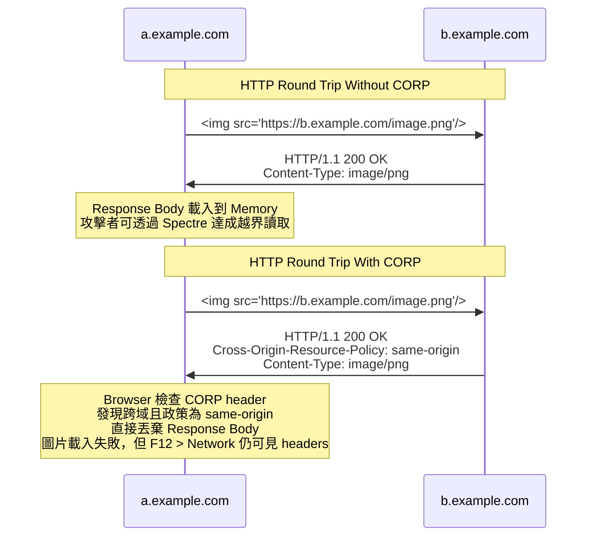

## 大綱

底下網羅本篇文章會介紹到的 "beyond CORS" Headers，會在接下來的段落陸續介紹到

<table>
  <thead>
    <tr>
      <th>Header Name</th>
      <th>Header Type</th>
    </tr>
  </thead>
  <tbody>
    <tr>
      <td>Cross-Origin-Resource-Policy</td>
      <td>Response</td>
    </tr>
    <tr>
      <td>Cross-Origin-Embedder-Policy</td>
      <td>Response</td>
    </tr>
    <tr>
      <td>Cross-Origin-Opener-Policy</td>
      <td>Response</td>
    </tr>
  </tbody>
</table>

## Cross-Origin-Resource-Policy (CORP)

### 誕生原因

CORP 的誕生，是為了解決 `Meltdown` 跟 `Spectre` 這些資安漏洞，詳細可參考 [Huli 大大的文章](https://aszx87410.github.io/beyond-xss/ch4/cors-attack/)，我沒有深入去瞭解這些資安漏洞的原因跟 PoC，但可以用一個簡單的時序圖，帶大家了解

### 一石二鳥

- CORP 的誕生，也順便解決了另一個問題，就是保護自家網站的資源不被跨域的網站引用
- 這邊的資源，通常是指透過 `` 或是 `<script>` 載入的圖片跟 JavaScript
- 如果是 HTML 類型的資源，不想要被跨域的網站透過 `<iframe>` 載入，則無法透過 CORP 防範，請參考我寫過的 [iframe-security](../http/iframe-security.md)

### iframe vs CORP

<!-- todo https://datatracker.ietf.org/doc/html/rfc7034#section-2.3.2 -->
<!-- todo https://www.w3.org/TR/CSP2/#directive-frame-ancestors -->

<table>
  <thead>
    <tr>
      <th>Response Header</th>
      <th>能否防止 iframe 載入跨域的 response body</th>
      <th>說明</th>
    </tr>
  </thead>
  <tbody>
    <tr>
      <td>Cross-Origin-Resource-Policy</td>
      <th>❌</th>
      <td>iframe 不算是 Resource，而是一個 browsing context，所以不受 CORP 影響</td>
    </tr>
    <tr>
      <td>X-Frame-Options</td>
      <th>✅</th>
      <td>
        
browser MAY immediately abort downloading or parsing of the document

        
      </td>
    </tr>
    <tr>
      <td>CSP frame-ancestors</td>
      <th>✅</th>
      <td>
        
CSP 的規範比較嚴格，是用 MUST 來描述

        
      </td>
    </tr>
  </tbody>
</table>

### 實作環節

## Cross-Origin-Embedder-Policy (COEP)

## Cross-Origin-Opener-Policy (COOP)

<!-- ### Cross-Origin Read Blocking（CORB） -->

## 參考資料

<!-- - https://www.chromium.org/Home/chromium-security/corb-for-developers/ -->
<!-- - https://github.com/nodejs/undici/pull/1461/files -->
<!-- - https://github.com/whatwg/fetch/pull/1441 -->
<!-- - https://github.com/mdn/content/pull/40123 -->
<!-- - https://chromium.googlesource.com/chromium/src/+/master/services/network/cross_origin_read_blocking_explainer.md -->

- https://developer.mozilla.org/en-US/docs/Web/Security/Practical_implementation_guides/CORP
- https://developer.mozilla.org/en-US/docs/Web/HTTP/Cross-Origin_Resource_Policy
- https://developer.mozilla.org/en-US/docs/Web/HTTP/Reference/Headers/Cross-Origin-Resource-Policy
- https://developer.mozilla.org/en-US/docs/Web/HTTP/Reference/Headers/Cross-Origin-Embedder-Policy
- https://developer.mozilla.org/en-US/docs/Web/HTTP/Reference/Headers/Cross-Origin-Opener-Policy
- https://datatracker.ietf.org/doc/html/rfc7034#section-2.3.2
- https://www.w3.org/TR/CSP2/#directive-frame-ancestors
- https://aszx87410.github.io/beyond-xss/ch4/cors-attack/
