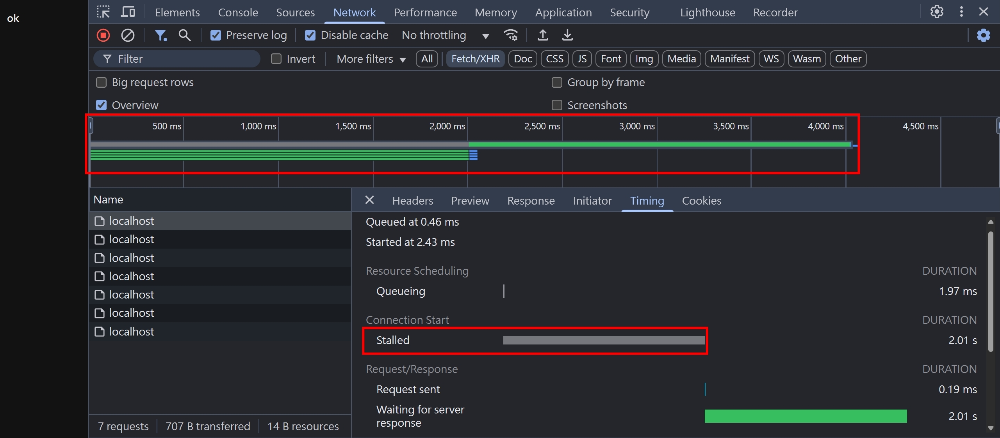
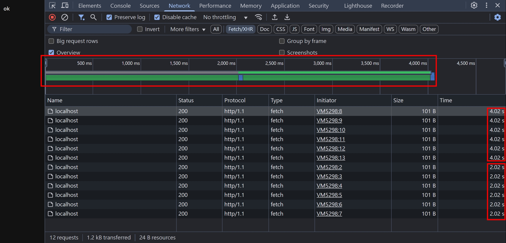
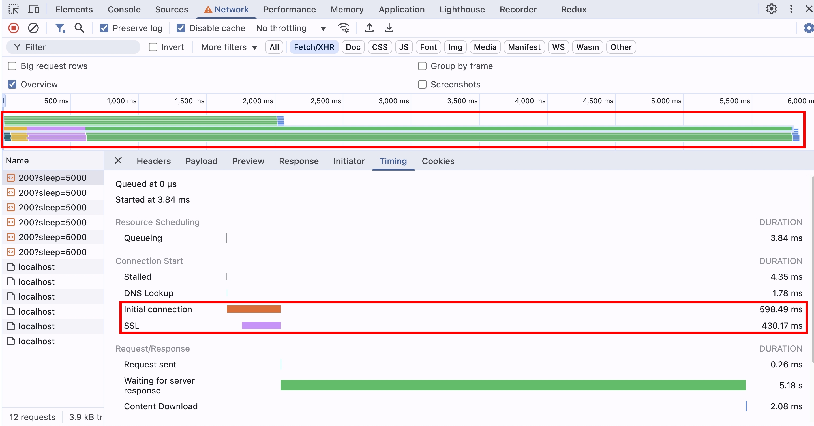
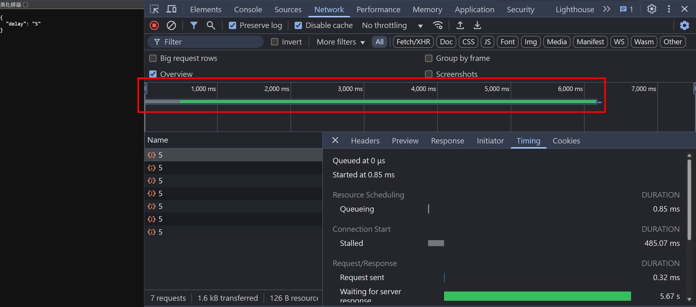

## [更新 2025/11/19]

本文原標題為「HTTP/1.1 HOL blocking」,經重新檢視後發現概念有誤。

## 實測環節

首先，用 NodeJS http module 建立一個簡易的 HTTP/1.1 server，為了方便觀察，我們將 server 設定成 2 秒後才會回覆

```js
import { createServer } from "http";
const httpServer = createServer().listen(5000);
httpServer.on("request", (req, res) => {
  setTimeout(() => {
    res.end("ok");
  }, 2000);
});
httpServer.on("connection", (req, res) => {
  console.log("connection");
});
```

再來用瀏覽器打開 localhost:5000，打開 F12 > Console，輸入以下程式碼

```js
// 總共 7 個
const responses = await Promise.all([
  fetch("http://localhost:5000"),
  fetch("http://localhost:5000"),
  fetch("http://localhost:5000"),
  fetch("http://localhost:5000"),
  fetch("http://localhost:5000"),
  fetch("http://localhost:5000"),
  fetch("http://localhost:5000"),
]);
```

按下 Enter 之前，請各位想想

1. 以下請求會同時發出去嗎?
2. Server Log 總共會看到幾次 `console.log('connection')` 呢?

---

防雷

---

公布答案

1. 不會，第 7 個 request 被停滯（Stalled）了
2. 6 次
   

```
[nodemon] starting `ts-node src/index.ts`
connection
connection
connection
connection
connection
connection
```

為什麼會這樣呢？我們看看 MDN 的解說

https://developer.mozilla.org/en-US/docs/Web/HTTP/Messages#http2_messages

```
This means that browsers are limited in the number of resources that they can download and render at the same time, which has typically been limited to 6 parallel connections.
```

前面 6 個請求會建立 6 個 parallel TCP Connection

第 7 個請求會先停滯（Stalled），等到前面 6 個 TCP Connection 的其中一個變成閒置（Idle），第 7 個請求才會發出去，而因為 HTTP/1.1 預設 Keep-Alive 的機制，所以第 7 個請求可以重複使用前面已經建立的 TCP Connection

那如果我們再進一步嘗試，如果一次發 12 個請求呢？

1. 以下請求會同時發出去嗎？

2. 總共會看到幾次 `console.log('connection')` 呢？

```js
// 總共 12 個
const responses = await Promise.all([
  fetch("http://localhost:5000"),
  fetch("http://localhost:5000"),
  fetch("http://localhost:5000"),
  fetch("http://localhost:5000"),
  fetch("http://localhost:5000"),
  fetch("http://localhost:5000"),
  fetch("http://localhost:5000"),
  fetch("http://localhost:5000"),
  fetch("http://localhost:5000"),
  fetch("http://localhost:5000"),
  fetch("http://localhost:5000"),
  fetch("http://localhost:5000"),
]);
```

聰明的小夥伴們肯定想到答案了

1. 1 ~ 6 會在第一波發出去，7 ~ 12 會在第二波發出去

2. 6 次，因為 7 ~ 12 個請求可以重複使用前面的 TCP Connection
   

```
[nodemon] starting `ts-node src/index.ts`
connection
connection
connection
connection
connection
connection
```

實務上，一個網頁會請求來自四面八方的資源，從第三方 CDN 拿一些 js 跟 css，又載入了一些 google font 之類的...這 6 個平行處理的請求，到底是什麼計算的呢？

答案是 by host，以 chrome 瀏覽器來說，每個 host 最多同時建立 6 個 TCP Connection，這部分可以參考官方文件的描述

https://support.google.com/chrome/a/answer/3339263?hl=en

```
What are the maximum number of HTTP connections I can make with a Chrome device or browser?

Maximum per Host: 6 connections
```

我們試著在 localhost:5000 的 F12 > Console，輸入以下程式碼，請求來自不同 host 的資料，這邊使用的是 httpstat.us 提供的 API，可以模擬 HTTP/1.1 的請求 delay N 毫秒，用來測試非常方便

```js
// 各 6 個請求，總共 12 個
// 為了避免噴 CORS Error，所以跨域請求先使用 { mode: "no-cors" }
// 這只是告訴瀏覽器不要噴錯，但實際上瀏覽器還是會擋住 response 不讓 javascript 存取
const responses = await Promise.all([
  fetch("https://httpstat.us/200?sleep=5000", { mode: "no-cors" }),
  fetch("https://httpstat.us/200?sleep=5000", { mode: "no-cors" }),
  fetch("https://httpstat.us/200?sleep=5000", { mode: "no-cors" }),
  fetch("https://httpstat.us/200?sleep=5000", { mode: "no-cors" }),
  fetch("https://httpstat.us/200?sleep=5000", { mode: "no-cors" }),
  fetch("https://httpstat.us/200?sleep=5000", { mode: "no-cors" }),
  fetch("http://localhost:5000/"),
  fetch("http://localhost:5000/"),
  fetch("http://localhost:5000/"),
  fetch("http://localhost:5000/"),
  fetch("http://localhost:5000/"),
  fetch("http://localhost:5000/"),
]);
```

可以看到每個 host 確實都可以同時建立 6 個請求，至於為何 httpstat.us 為何不是 5 秒整收到 response 呢？原因其實有很多，包含 DNS Lookup, SSL, 網路延遲等等，但細節不在本篇的討論範圍，重點是要讓大家看到，後面 6 個 postman 的請求，不需要等到前面 6 個 localhost:5000 的完成



## HTTP/2 的 multiplexing: 不再受限於 6 個連線

我們來看看 MDN 原文的解說

https://developer.mozilla.org/en-US/docs/Web/HTTP/Messages#http2_messages

```
HTTP/2 allows you to use a single TCP connection for multiple requests and responses at the same time. This is done by wrapping messages into a binary frame and sending the requests and responses in a numbered stream on a connection. Data and header frames are handled separately, which allows headers to be compressed via an algorithm called HPACK. Using the same TCP connection to handle multiple requests at the same time is called multiplexing.
```

HTTP/2 可以使用一個 TCP Connection 來同時傳輸多個請求，細節怎麼實現的，本篇暫時不討論，我們直接來嘗試 HTTP/2 的威力！使用的是 postman 的 HTTP/2 測試 API，一樣可以傳入 delay N 秒，非常方便！

```js
// 總共 7 個
const responses = await Promise.all([
  fetch("https://postman-echo.com/delay/5"),
  fetch("https://postman-echo.com/delay/5"),
  fetch("https://postman-echo.com/delay/5"),
  fetch("https://postman-echo.com/delay/5"),
  fetch("https://postman-echo.com/delay/5"),
  fetch("https://postman-echo.com/delay/5"),
  fetch("https://postman-echo.com/delay/5"),
]);
```

可以看到第 7 個請求就不需要等待第 1 個請求結束才能發，因為這些請求都是共用同一個 TCP Connection



## 小結

今天我們學到了瀏覽器 maxTCPConnectionPerHost = 6，並且也學到了 HTTP/2 的 multiplexing 機制，希望能讓各位夥伴對 HTTP 更熟悉一點

## 參考資料

- https://developer.mozilla.org/en-US/docs/Web/HTTP/Messages#http2_messages
- https://support.google.com/chrome/a/answer/3339263?hl=en
