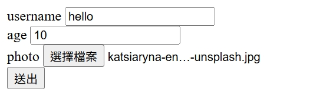
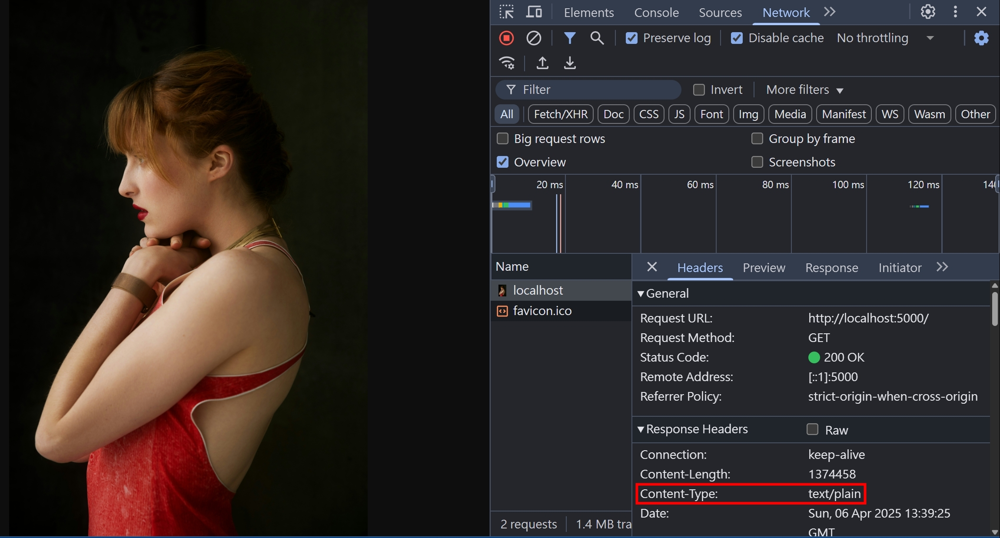
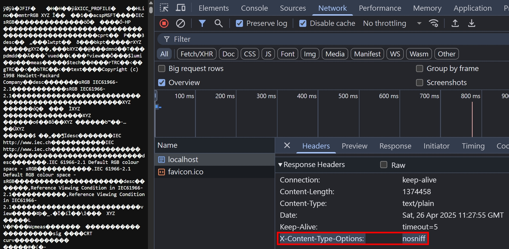
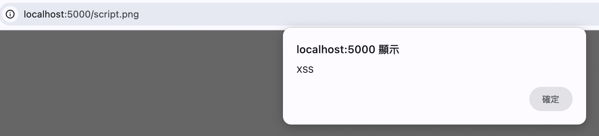

## 名詞解釋

當我們在說 Content-Type 跟 MIME Type 或是 Media Type 的時候，其實通常都是在說同一件事情，差別在於:

1. Content-Type 是一個 HTTP Header，其值就是 MIME Type

2. MIME Type 是比較早期的說法，後改為 Media Type，但兩個其實大家都聽得懂

## Content-Type 的作用

Content-Type 可以做為 HTTP Request Header 跟 HTTP Response Header，其實它指的就是 body 區塊的內容類型

## Web Develop 比較常見的 MIME Type

Web Develop 比較常見的 MIME Type 有以下

- HTML: text/html
- CSS: text/css
- JSON: application/json
- JavaScript: text/javascript
- JPEG: image/jpeg
- SVG: image/svg+xml

要注意，JavaScript 有很多老舊的 MIME Type，詳細可以參考 [MDN官方文件](https://developer.mozilla.org/en-US/docs/Web/HTTP/Guides/MIME_types#applicationjson)

我們接著深入一些比較特殊的 Content-Type

## multipart/formdata

複雜的 HTML FORM 表單，通常會使用這個 Content-Type，我們試著創建一個 `index.html`，裡面包含個人資料填寫的 HTML FORM 表單

```html
<!DOCTYPE html>
<html>
  <head></head>
  <body>
    <main>
      <form
        name="updateUser"
        method="post"
        action="/updateUser"
        enctype="multipart/form-data"
      >
        <div>
          <label for="username">username</label>
          <input id="username" name="username" />
        </div>
        <div>
          <label for="age">age</label>
          <input id="age" name="age" type="number" />
        </div>
        <div>
          <label for="photo">photo</label>
          <input name="photo" type="file" />
        </div>
        <div>
          <input type="submit" value="送出" />
        </div>
      </form>
    </main>
  </body>
</html>
```

接著我們使用 `NodeJS` HTTP 模組來設置一個簡易的 HTTP Server 來處理頁面的渲染跟 API 路由

```ts
import { readFileSync } from "fs";
import { join } from "path";
import httpServer from "../httpServer";
import { faviconListener } from "../listeners/faviconListener";
import { notFoundListener } from "../listeners/notFoundlistener";

const indexHTML = readFileSync(join(__dirname, "index.html"));

httpServer.on("request", function requestListener(req, res) {
  const method = String(req.method).toLowerCase();

  if (req.url === "/") {
    res.setHeader("Content-Type", "text/html; charset=utf-8");
    res.end(indexHTML);
    return;
  }
  if (req.url === "/updateUser" && method === "post") {
    const chunks: Buffer[] = [];
    req.on("data", (chunk) => chunks.push(chunk));
    req.once("end", () => {
      const buffer = Buffer.concat(chunks);
      // binary 圖片轉成 utf8 字串會造成效能低落
      // const utf8String = buffer.toString('utf8');
      console.log(buffer);
      res.setHeader("Content-Type", "application/json");
      res.end(JSON.stringify({ status: "ok" }));
      return;
    });
    return;
  }
  if (req.url === "/favicon.ico") return faviconListener(req, res);
  return notFoundListener(req, res);
});
```

我們在瀏覽器輸入 http://localhost:5000/ ，就可以看到陽春的表單了



我們試著送出表單，並且打開 F12 > Network > Payload > view source，應該會看到這個很長的字串

```
------WebKitFormBoundary1IeWmkPYqF1sNCBz
Content-Disposition: form-data; name="username"

123
------WebKitFormBoundary1IeWmkPYqF1sNCBz
Content-Disposition: form-data; name="age"

123
------WebKitFormBoundary1IeWmkPYqF1sNCBz
Content-Disposition: form-data; name="photo"; filename="image.jpg"
Content-Type: image/jpeg


------WebKitFormBoundary1IeWmkPYqF1sNCBz--
```

這就是 multipart/formdata 的 Request Payload，格式可以分為以下

```
boundary
Content-Disposition: form-data; name="${name}"; filename="${filename}"
Content-Type: 合法的 MIME Type

內容...
```

要注意，`username` 跟 `age` 這兩個欄位，因為是純文本，所以不需要指定 Content-Type，預設就是 `text/plain`

但如果是上傳檔案，即便是 `.txt` 文件，也需要明確指定 `Content-Type: text/plain`，這樣才能讓 Server 端知道要怎麼去解析這個檔案。我們可以試著上傳 `.txt`，Request Payload 應該會變成這樣：

```
------WebKitFormBoundaryC8h6BB9h8kXL7CRQ
Content-Disposition: form-data; name="username"

hello
------WebKitFormBoundaryC8h6BB9h8kXL7CRQ
Content-Disposition: form-data; name="age"

10
------WebKitFormBoundaryC8h6BB9h8kXL7CRQ
Content-Disposition: form-data; name="photo"; filename="questions.txt"
Content-Type: text/plain


------WebKitFormBoundaryC8h6BB9h8kXL7CRQ--
```

關於 boundary 的規則，我們來看看 MDN 文件是怎麼說的

```
For multipart entities, the boundary parameter is required. It is used to demarcate the boundaries of the multiple parts of the message.
```

boundary 其實就是用一個很長的字串來當作分割符號，就像是 CSV 的資料格式，其實就是用 Comma(,) 來分割資料。當使用瀏覽器來傳送 multipart/formdata 的時候，瀏覽器會自動生成一個 `------WebKitFormBoundary${randomString}--` 的字串，不同的瀏覽器可能會有不同的實作方式。那 Server 端要怎麼知道這個分割符號呢？答案就是帶在 Request Header 的 Content-Type

```
Content-Type: multipart/form-data; boundary=----WebKitFormBoundaryC8h6BB9h8kXL7CRQ
```

由於 Header 會先傳送到 Server 端，之後才是 Body，所以 Server 端就可以根據這個 boundary 來處理每個 part 的資料。至於 Server 端具體來說要怎麼實現 multipart 的解析呢？其實這題蠻複雜的，畢竟檔案上傳有很多坑，光是要處理不同的檔案類型...，這部分會建議使用現成的 Solution，可以參考 [busboy](https://www.npmjs.com/package/busboy)，這是一個專門處理 form data 的 NodeJS 模組，有興趣的朋友可以研究看看。

## Content-Disposition

再來我們來看第二個區塊 Content-Disposition，其實這是一個合法的 HTTP Response Header，用來告訴瀏覽器，請求的資源是要呈現在畫面上，還是要當成檔案下載。

另外，Content-Disposition 也可以當作 multipart/form-data body 的 Header，也就是我們上面看到的情況。

我們試試看利用 Content-Disposition 來達成下載檔案的功能，先從最簡單的 `.txt` 檔案下載

```ts
import httpServer from "../httpServer";

httpServer.on("request", function requestListener(req, res) {
  res.setHeader("Content-Disposition", "attachment; filename=hello world.txt");
  res.end("hello world");
});
```

瀏覽器輸入 http://localhost:5000/ ，就可以看到 hello world.txt 成功下載，並且內容是 hello world

接著嘗試看看圖片下載功能：

```ts
import httpServer from "../httpServer";
import { readFileSync } from "fs";
import { join } from "path";
const image = readFileSync(join(__dirname, "image.jpg"));
httpServer.on("request", function requestListener(req, res) {
  res.setHeader("Content-Type", "image/jpeg");
  res.setHeader("Content-Disposition", "attachment; filename=image.jpg");
  res.end(image);
});
```

瀏覽器輸入 http://localhost:5000/ ，就可以成功看到圖片下載囉！

## application/x-www-form-urlencoded

接著我們來實作看看 application/x-www-form-urlencoded，這個感覺在現代前端開發也比較少見了，但可以在一些古老的網站看到這種資料傳送的格式。我們創建一個 HTML FORM

```html
<!DOCTYPE html>
<html>
  <head></head>
  <body>
    <main>
      <form
        name="updateUser"
        method="post"
        action="/updateUser"
        enctype="application/x-www-form-urlencoded"
      >
        <div>
          <label for="username">username</label>
          <input id="username" name="username" />
        </div>
        <div>
          <label for="age">age</label>
          <input id="age" name="age" type="number" />
        </div>
        <div>
          <label for="url">url</label>
          <input id="url" name="url" type="url" />
        </div>
        <div>
          <input type="submit" value="送出" />
        </div>
      </form>
    </main>
  </body>
</html>
```

接著我們使用 `NodeJS` HTTP 模組來設置一個簡易的 HTTP Server 來處理頁面的渲染跟 API 路由

```ts
import { readFileSync } from "fs";
import { join } from "path";
import httpServer from "../httpServer";
import { faviconListener } from "../listeners/faviconListener";
import { notFoundListener } from "../listeners/notFoundlistener";

const indexHTML = readFileSync(join(__dirname, "index.html"));

httpServer.on("request", function requestListener(req, res) {
  const method = String(req.method).toLowerCase();

  if (req.url === "/") {
    res.setHeader("Content-Type", "text/html; charset=utf-8");
    res.end(indexHTML);
    return;
  }
  if (req.url === "/updateUser" && method === "post") {
    const chunks: Buffer[] = [];
    req.on("data", (chunk) => chunks.push(chunk));
    req.once("end", () => {
      const buffer = Buffer.concat(chunks);
      res.setHeader("Content-Type", "text/plain");
      res.end(buffer);
      return;
    });
    return;
  }
  if (req.url === "/favicon.ico") return faviconListener(req, res);
  return notFoundListener(req, res);
});
```

瀏覽器輸入 http://localhost:5000/ ，並且填入對應的資料

```
username: 123
age: 123
url: https://translate.google.com.tw/?hl=zh-TW&sl=auto&tl=zh-TW&op=translate
```

送出以後，就會看到以下的字串

```
username=123&age=123&url=https%3A%2F%2Ftranslate.google.com.tw%2F%3Fhl%3Dzh-TW%26sl%3Dauto%26tl%3Dzh-TW%26op%3Dtranslate
```

url 後面的字串，就是 urlencoded 的結果，我們可以使用以下程式碼驗證

```ts
encodeURIComponent(
  "https://translate.google.com.tw/?hl=zh-TW&sl=auto&tl=zh-TW&op=translate",
) ===
  "https%3A%2F%2Ftranslate.google.com.tw%2F%3Fhl%3Dzh-TW%26sl%3Dauto%26tl%3Dzh-TW%26op%3Dtranslate"; // true
```

要注意 application/x-www-form-urlencoded 是不能用來上傳檔案的，所以通常是用來處理簡單的情境，比如一般的文字表單

## MIME sniffing

在特殊情況下，瀏覽器可能認定 Server 回傳的 Content-Type 是錯誤的，這個時候瀏覽器就會啟動 MIME sniffing 機制，嘗試猜測正確的 Content-Type

我們用 NodeJS 實作以下程式碼

```ts
import httpServer from "../httpServer";
import { faviconListener } from "../listeners/faviconListener";
import { readFileSync } from "fs";
import { join } from "path";

const image = readFileSync(join(__dirname, "image.jpg"));
httpServer.on("request", function requestListener(req, res) {
  if (req.url === "/favicon.ico") return faviconListener(req, res);
  res.setHeader("Content-Type", "text/plain");
  res.end(image);
});
```

當我們用 chrome 瀏覽器打開 http://localhost:5000/ 時，可以看到瀏覽器將其解析成圖片了！



各間瀏覽器實作 MIME sniffing 的方式都不同，可能包含

1. 讀取副檔名
2. Magic numbers

## Magic numbers

部分檔案的開頭前幾個 bits 會揭露其檔案類型，俗稱 Magic numbers；透過這個方式，我們就可以得知檔案的類型。

詳細的 Magic numbers 映射表，可以參考 [Github這篇文章](https://gist.github.com/leommoore/f9e57ba2aa4bf197ebc5)

我們嘗試用 NodeJS 讀取 jpg 檔案，看看 Magic numbers 是否為 ff d8 ff e0

```ts
import { readFileSync } from "fs";
import { join } from "path";

const image = readFileSync(join(__dirname, "image.jpg"));
console.log(image.buffer.slice(0, 4));
```

運行結果為

```ts
ArrayBuffer { [Uint8Contents]: <ff d8 ff e0>, byteLength: 4 }
```

確實符合！這邊稍微複習一下計算機概論

- 1 bit = 計算機最基本的儲存單位 = 0 or 1
- 1 byte = 8 bits = 2 的 8 次方 = 可儲存最多 256 種排列組合
- HEX = 16 進位表達方式
- ff d8 ff e0 都是 1 個 byte 的排列組合，用 16 進位的表達方式

## X-Content-Type-Options

上面有提到瀏覽器的 [MIME sniffing](#mime-sniffing) 機制，但有些情況，我們希望把這個機制禁用，這時候就會需要在 Response Header 設定 `X-Content-Type-Options: nosniff`

我們利用剛才 [MIME sniffing](#mime-sniffing) 的程式碼繼續擴充，針對圖片回傳錯誤的 `Content-Type`，讓瀏覽器的 MIME sniffing 機制啟用，並且再加上 `X-Content-Type-Options: nosniff`

```ts
import httpServer from "../httpServer";
import { faviconListener } from "../listeners/faviconListener";
import { readFileSync } from "fs";
import { join } from "path";

const image = readFileSync(join(__dirname, "image.jpg"));
httpServer.on("request", function requestListener(req, res) {
  if (req.url === "/favicon.ico") return faviconListener(req, res);
  res.setHeader("Content-Type", "text/plain; charset=");
  res.setHeader("X-Content-Type-Options", "nosniff");
  res.end(image);
});
```

這時候用瀏覽器打開 http://localhost:5000/ ，就會看到 MIME sniffing 的機制被禁用，因此產生一堆亂碼了



## 搭配 MIME sniffing 的資安漏洞

先決條件:

- Server 允許使用者上傳文件
- Server 針對上傳文件的驗證不夠嚴謹（例如：只有判斷副檔名跟 Magic Number，或是根本沒驗證）
- Server 沒有把上傳的文件做重新編碼
- Server 沒有設置 `X-Content-Type-Options: nosniff` 的 Response Header
- Server 沒有設置 `Content-Type`，或是 Server 有設置，但瀏覽器 MIME sniffing 的機制蓋過 `Content-Type`
- 上傳的文件可以被其他用戶訪問，且未做額外的安全控制

<b style={{ color: "red" }}>
以下攻擊手法，使用 Chrome v136 瀏覽器，不同瀏覽器會有不同的 MIME sniffing 機制
</b>

### 攻擊手法 1：引誘使用者點開假的圖片連結，實際上暗藏 JavaScript 程式碼

NodeJS HTTP 範例

```ts
import httpServer from "../httpServer";

httpServer.on("request", function requestListener(req, res) {
  // Server 沒有設置 `Content-Type`，瀏覽器的 MIME sniffing 機制認定這是 `text/javascript`
  if (req.url === "/script.png")
    return res.end('<script>alert("XSS")</script>');
});
```

使用瀏覽器打開該頁面，就會執行程式碼


### 攻擊手法 2：繞過 CSP 限制

- 攻擊者已經在某網站找到 XSS 漏洞（假設：可以在聊天室插入 `<script>`）
- 但該網站的 `Content-Security-Policy: script-src: self`
- 攻擊者先上傳一個 html，內容是 `alert("XSS")`
- 範例：https://yusheng.dev/img/mime-sniffing-xss-in-script-src.html
- 這時候就可以在聊天室插入 `<script src="https://yusheng.dev/img/mime-sniffing-xss-in-script-src.html"></script>`
- 其他用戶進入聊天室以後就會執行程式碼
- 透過 `<script>` 引入，雖然 `Content-Type: text/html`，但還是會被瀏覽器 MIME sniffing 成 `text/javascript`

## 亂碼是怎麼產生的

可參考這部影片，講解的非常清楚呦！

https://youtu.be/zSstXi-j7Qc?si=iHu3ebTiF9YtaZmD

## 參考資料

- https://developer.mozilla.org/en-US/docs/Web/HTTP/Headers/Content-Type
- https://developer.mozilla.org/en-US/docs/Web/HTTP/MIME_types
- https://developer.mozilla.org/en-US/docs/Web/HTTP/Guides/MIME_types/Common_types
- https://developer.mozilla.org/en-US/docs/Learn_web_development/Extensions/Server-side/Configuring_server_MIME_types
- https://developer.mozilla.org/en-US/docs/Web/HTTP/Reference/Headers/Content-Disposition
- https://gist.github.com/leommoore/f9e57ba2aa4bf197ebc5
- https://aszx87410.github.io/beyond-xss/ch5/mime-sniffing/
