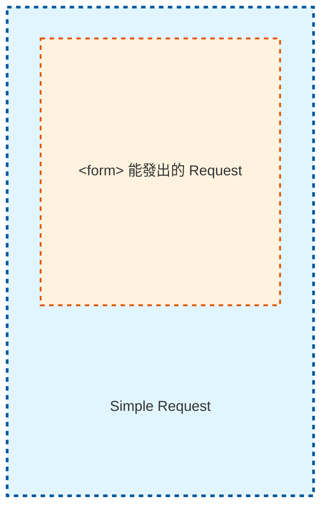
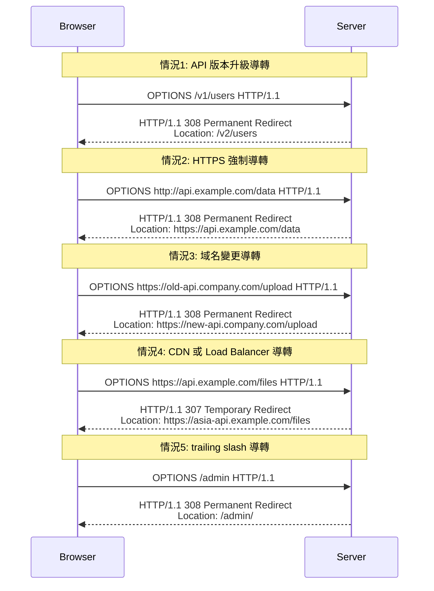
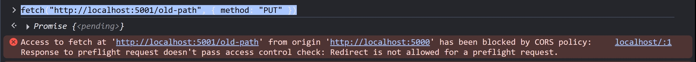
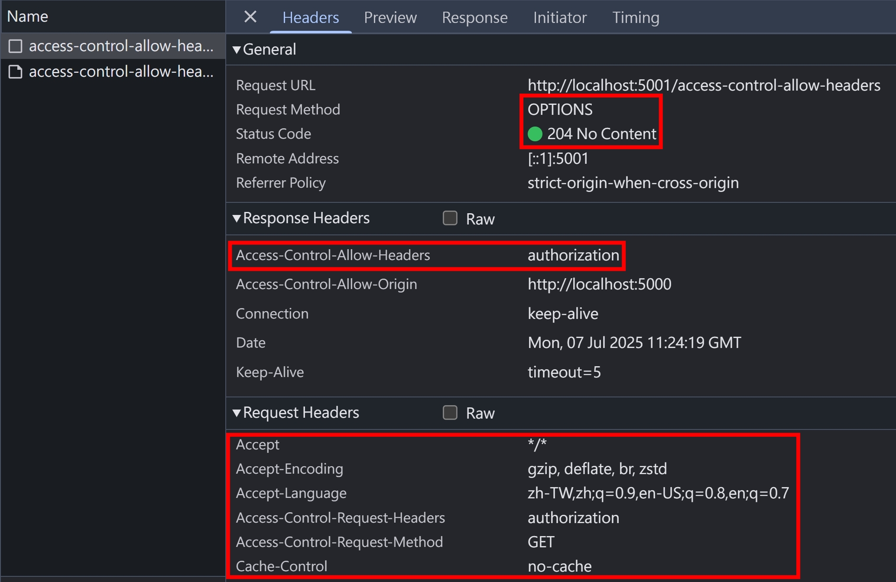
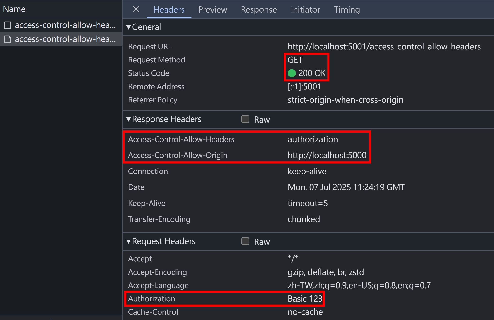
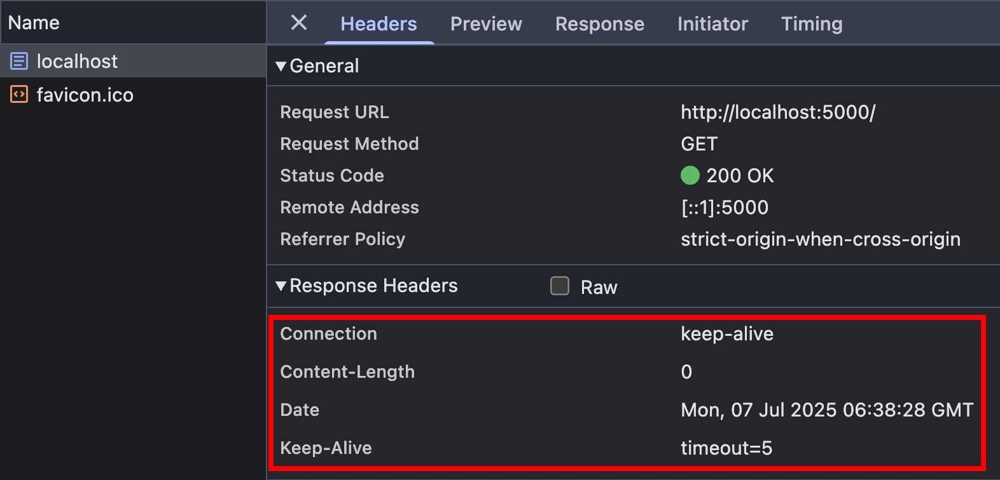

## 行前準備

本篇文章，會大量用到 NodeJS HTTP Server 作為程式碼範例，為了避免重複，所以這邊先把基礎架構設定好

httpServers.ts

```ts
import { createServer } from "http";

export const http5000Server = createServer().listen(5000);
export const http5001Server = createServer().listen(5001);
```

index.ts

```ts
import { faviconListener } from "../listeners/faviconListener";
import { notFoundListener } from "../listeners/notFoundlistener";
import { http5000Server, http5001Server } from "./httpServers";

// 白頁，等等都透過 http://localhost:5000 的 F12 > Console
// 去發起 fetch 請求
http5000Server.on("request", function requestListener(req, res) {
  res.end();
  return;
});

// cross-origin resources
http5001Server.on("request", function requestListener(req, res) {
  if (req.url === "/favicon.ico") return faviconListener(req, res);
  // 等等的範例程式碼會放在這裡...
  return notFoundListener(req, res);
});
```

## CORS Headers 整理

底下網羅 CORS 相關的 Headers，會在接下來的段落陸續介紹到

<table>
  <thead>
    <tr>
      <th>Header Name</th>
      <th>Header Type</th>
      <!-- <th>Explain</th> -->
    </tr>
  </thead>
  <tbody>
    <tr>
      <td>Access-Control-Allow-Origin</td>
      <td>Response</td>
      <!-- <th>-</th> -->
    </tr>
    <tr>
      <td>Access-Control-Allow-Headers</td>
      <td>Response</td>
      <!-- <th>-</th> -->
    </tr>
    <tr>
      <td>Access-Control-Allow-Methods</td>
      <td>Response</td>
      <!-- <th>-</th> -->
    </tr>
    <tr>
      <td>Access-Control-Allow-Credentials</td>
      <td>Response</td>
      <!-- <td>Explain</td> -->
    </tr>
    <tr>
      <td>Access-Control-Max-Age</td>
      <td>Response</td>
      <!-- <td>Explain</td> -->
    </tr>
    <tr>
      <td>Access-Control-Expose-Headers</td>
      <td>Response</td>
      <!-- <td>Explain</td> -->
    </tr>
    <tr>
      <td>Access-Control-Request-Method</td>
      <td>Request</td>
      <!-- <td>Explain</td> -->
    </tr>
    <tr>
      <td>Access-Control-Request-Headers</td>
      <td>Request</td>
      <!-- <td>Explain</td> -->
    </tr>
  </tbody>
</table>

## Simple Request

Simple Request，是指不觸發 Preflight Request 的請求，參考 [MDN Web Docs](https://developer.mozilla.org/en-US/docs/Web/HTTP/Guides/CORS#simple_requests)，須滿足以下條件：

1. [CORS-safelisted method](https://fetch.spec.whatwg.org/#cors-safelisted-method) => `GET`, `HEAD`, or `POST`
2. [CORS-safelisted request-header](https://fetch.spec.whatwg.org/#cors-safelisted-request-header) => 可參考 [CORS-safelisted request header & Access-Control-Allow-Headers](#cors-safelisted-request-header--access-control-allow-headers)
3. `Content-Type` 必須是 [`<form>` 能設定的 enctype](https://developer.mozilla.org/en-US/docs/Web/HTML/Reference/Elements/form#enctype)：`application/x-www-form-urlencoded`, `multipart/form-data` or `text/plain` => 因為 `<form>` 在 CORS 出現前，就能夠發起跨域請求，為了向後兼容性，避免舊網站的後端不支援 Preflight Request 而導致網站壞掉
4. 使用 `XMLHTTPRequest`，且沒有使用 `xhr.upload.addEventListener()`
5. Request 沒有使用 `ReadableStream`

補充 4,5 點（這兩個情境實務上比較少用），原因是 `xhr.upload.addEventListener()` 跟 `ReadableStream` 這兩個情況會讓 Request 本身變得不可控，瀏覽器沒辦法預先知道這個 Request 是否符合 1,2,3 點，所以只好觸發 Preflight Request

Simple Request 與 `<form>` 能發出的 Request 關係如下



## Preflight Request + Redirection

實務上有多種情境會觸發 30x Redirect，例如



這時候 Preflight Request 會跟著導轉嗎？我們寫個測試案例

```ts
// preflight + redirect
if (req.url === "/old-path") {
  res.writeHead(308, { location: "http://localhost:5001/new-path" });
  res.end();
  return;
}
if (req.url === "/new-path") {
  if (req.method === "OPTIONS") {
    res.writeHead(204, {
      "access-control-allow-origin": "http://localhost:5000",
      "access-control-allow-methods": "PUT",
    });
    res.end();
    return;
  }
  res.writeHead(200, {
    "access-control-allow-origin": "http://localhost:5000",
    "access-control-allow-methods": "PUT",
    "content-type": "text/plain",
  });
  res.end();
  return;
}
```

瀏覽器打開 http://localhost:5000/ ，F12 > Console 執行以下程式碼

```js
fetch("http://localhost:5001/old-path", { method: "PUT" });
```

結論是不行～


## CORS-safelisted request header & Access-Control-Allow-Headers

參考 [fetch.spec.whatwg.org](https://fetch.spec.whatwg.org/#cors-safelisted-request-header)，CORS-safelisted request header 如下：

- `Accept`
- `Accept-Language`
- `Content-Language`
- `Content-Type`
- `Range`

P.S. 針對以上 request headers 的 value，還有額外限制，有興趣的[自行參考](https://fetch.spec.whatwg.org/#cors-safelisted-request-header)

### Access-Control-Allow-Headers 實作

我們在 `http5001Server` 新增以下區塊

```ts
if (req.url === "/access-control-allow-headers") {
  if (req.method === "OPTIONS") {
    res.writeHead(204, {
      "access-control-allow-origin": "http://localhost:5000",
      "access-control-allow-headers": "authorization",
    });
    res.end();
    return;
  }
  res.writeHead(200, {
    "access-control-allow-origin": "http://localhost:5000",
    "access-control-allow-headers": "authorization",
  });
  res.end();
  return;
}
```

從 http://localhost:5000/ 的 F12 > Console 戳看看

```js
fetch("http://localhost:5001/access-control-allow-headers", {
  headers: {
    authorization: "Basic 123",
  },
});
```

Preflight Request，這時候還不會帶上 `authorization` Request Header


Actual Request，這時候就會帶上 `authorization` Request Header


## CORS-safelisted response header & Access-Control-Expose-Headers

參考 [fetch.spec.whatwg.org](https://fetch.spec.whatwg.org/#cors-safelisted-response-header-name)，CORS-safelisted response header 代表預設能透過 JavaScript 讀取的 response headers，如下：

- `Cache-Control`
- `Content-Language`
- `Content-Length`
- `Content-Type`
- `Expires`
- `Last-Modified`
- `Pragma`

### JavaScript Can Read All Same-Origin Response Headers

從 http://localhost:5000/ 的 F12 > Console 試試看戳自己，確實可以拿到所有 response headers

```js
fetch("http://localhost:5000/").then(res => console.log(Object.fromEntries(res.headers.entries())))

// result
{
  "connection": "keep-alive",
  "content-length": "0",
  "date": "Mon, 07 Jul 2025 06:38:28 GMT",
  "keep-alive": "timeout=5"
}
```



### CORS-safelisted response header 實測

接著在 `http5001Server` 新增以下區塊

```ts
if (req.url === "/cors-safelisted-response-header") {
  res.writeHead(200, {
    "access-control-allow-origin": "http://localhost:5000",
    "cache-control": "cache-control",
    "content-language": "content-language",
    "content-length": 0,
    "content-type": "text/html",
    expires: "expires",
    "last-modified": "last-modified",
    pragma: "pragma",
    "x-custom-header1": "x-custom-value1",
  });
  res.end();
  return;
}
```

從 http://localhost:5000/ 的 F12 > Console 戳看看，確實如同 spec 的描述，只能透過 JavaScript 讀取這些 Response Headers

```js
fetch("http://localhost:5001/cors-safelisted-response-header").then(res => console.log(Object.fromEntries(res.headers.entries())))

// result
{
  "cache-control": "cache-control",
  "content-language": "content-language",
  "content-length": "0",
  "content-type": "text/html",
  "expires": "expires",
  "last-modified": "last-modified",
  "pragma": "pragma"
}
```

### Access-Control-Expose-Headers 實作

使用 `Access-Control-Expose-Headers`，就可以增加 JavaScript 能讀取的 Response Headers

```ts
if (req.url === "/access-control-expose-headers") {
  res.writeHead(200, {
    "access-control-allow-origin": "http://localhost:5000",
    "cache-control": "cache-control",
    "content-language": "content-language",
    "content-length": 0,
    "content-type": "text/html",
    expires: "expires",
    "last-modified": "last-modified",
    pragma: "pragma",
    "access-control-expose-headers": "connection, date, keep-alive",
  });
  res.end();
  return;
}
```

從 http://localhost:5000/ 的 F12 > Console 戳看看，可以看到 `connection, date, keep-alive` 都可以讀取了～

```js
fetch("http://localhost:5001/access-control-expose-headers").then(res => console.log(Object.fromEntries(res.headers.entries())))

// result
{
  "cache-control": "cache-control",
  "connection": "keep-alive",
  "content-language": "content-language",
  "content-length": "0",
  "content-type": "text/html",
  "date": "Mon, 07 Jul 2025 10:53:13 GMT",
  "expires": "expires",
  "keep-alive": "timeout=5",
  "last-modified": "last-modified",
  "pragma": "pragma"
}
```

## 小結

CORS 的概念很多，跟著我繼續探索下篇的內容吧～

## 參考資料

- https://developer.mozilla.org/en-US/docs/Web/HTTP/CORS
- https://developer.mozilla.org/en-US/docs/Web/HTTP/Guides/CORS/Errors
- https://developer.mozilla.org/en-US/docs/Glossary/CORS
- https://developer.mozilla.org/en-US/docs/Glossary/Preflight_request
- https://developer.mozilla.org/en-US/docs/Glossary/CORS-safelisted_request_header
- https://developer.mozilla.org/en-US/docs/Glossary/CORS-safelisted_response_header
- https://developer.mozilla.org/en-US/docs/Web/Security/Same-origin_policy
- https://developer.mozilla.org/en-US/docs/Web/HTTP/Reference/Headers/Access-Control-Allow-Origin
- https://developer.mozilla.org/en-US/docs/Web/HTTP/Reference/Headers/Access-Control-Allow-Headers
- https://developer.mozilla.org/en-US/docs/Web/HTTP/Reference/Headers/Access-Control-Allow-Methods
- https://developer.mozilla.org/en-US/docs/Web/HTTP/Reference/Headers/Access-Control-Allow-Credentials
- https://developer.mozilla.org/en-US/docs/Web/HTTP/Reference/Headers/Access-Control-Max-Age
- https://developer.mozilla.org/en-US/docs/Web/HTTP/Reference/Headers/Access-Control-Expose-Headers
- https://developer.mozilla.org/en-US/docs/Web/HTTP/Reference/Headers/Access-Control-Request-Method
- https://developer.mozilla.org/en-US/docs/Web/HTTP/Reference/Headers/Access-Control-Request-Headers
