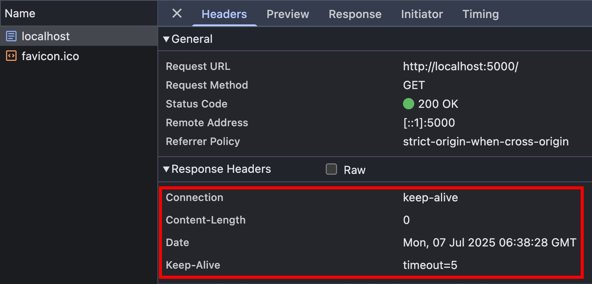

## 行前準備

本篇文章，會大量用到 NodeJS HTTP Server 作為程式碼範例，為了避免重複，所以這邊先把基礎架構設定好

httpServers.ts

```ts
import { createServer } from "http";

export const http5000Server = createServer().listen(5000);
export const http5001Server = createServer().listen(5001);
```

index.ts

```ts
import { faviconListener } from "../listeners/faviconListener";
import { notFoundListener } from "../listeners/notFoundlistener";
import { http5000Server, http5001Server } from "./httpServers";

// 白頁，等等都透過 http://localhost:5000 的 F12 > Console
// 去發起 fetch 請求
http5000Server.on("request", function requestListener(req, res) {
  res.end();
  return;
});

// cross-origin resources
http5001Server.on("request", function requestListener(req, res) {
  if (req.url === "/favicon.ico") return faviconListener(req, res);
  // 等等的範例程式碼會放在這裡...
  return notFoundListener(req, res);
});
```

## CORS Headers 整理

<table>
  <thead>
    <tr>
      <th>Header Name</th>
      <th>Header Type</th>
      <th>Explain</th>
    </tr>
  </thead>
  <tbody>
    <tr>
      <td>Access-Control-Allow-Origin</td>
      <td>Response</td>
      <td>Explain</td>
    </tr>
    <tr>
      <td>Access-Control-Allow-Headers</td>
      <td>Response</td>
      <td>Explain</td>
    </tr>
    <tr>
      <td>Access-Control-Allow-Methods</td>
      <td>Response</td>
      <td>Explain</td>
    </tr>
    <tr>
      <td>Access-Control-Allow-Credentials</td>
      <td>Response</td>
      <td>Explain</td>
    </tr>
    <tr>
      <td>Access-Control-Max-Age</td>
      <td>Response</td>
      <td>Explain</td>
    </tr>
    <tr>
      <td>Access-Control-Expose-Headers</td>
      <td>Response</td>
      <td>Explain</td>
    </tr>
    <tr>
      <td>Access-Control-Request-Method</td>
      <td>Request</td>
      <td>Explain</td>
    </tr>
    <tr>
      <td>Access-Control-Request-Headers</td>
      <td>Request</td>
      <td>Explain</td>
    </tr>
  </tbody>
</table>

## Preflight Request + Redirection

<!-- todo https://claude.ai/chat/97fdfe20-8ec6-45a8-acec-71a86339d2b9 -->

## Access-Control-Max-Age 能 cache 哪些 CORS Headers

<!-- todo 測試 -->
<!-- that is, the information contained in the Access-Control-Allow-Methods and Access-Control-Allow-Headers headers -->

## CORS-safelisted request header & Access-Control-Allow-Headers

## CORS-safelisted response header & Access-Control-Expose-Headers

CORS 請求，參考 [fetch.spec.whatwg.org](https://fetch.spec.whatwg.org/#cors-safelisted-response-header-name)，預設能透過 JavaScript 讀取的 response headers 如下：

- `Cache-Control`
- `Content-Language`
- `Content-Length`
- `Content-Type`
- `Expires`
- `Last-Modified`
- `Pragma`

先從 http://localhost:5000/ 的 F12 > Console 試試看戳自己，確實可以拿到所有 response headers

```js
fetch("http://localhost:5000/").then(res => console.log(Object.fromEntries(res.headers.entries())))

// result
{
  "connection": "keep-alive",
  "content-length": "0",
  "date": "Mon, 07 Jul 2025 06:38:28 GMT",
  "keep-alive": "timeout=5"
}
```



接著在 `http5001Server` 新增以下區塊

```ts
if (req.url === "/cors-safelisted-response-header") {
  res.writeHead(200, {
    "access-control-allow-origin": "http://localhost:5000",
    "cache-control": "cache-control",
    "content-language": "content-language",
    "content-length": 0,
    "content-type": "text/html",
    expires: "expires",
    "last-modified": "last-modified",
    pragma: "pragma",
    "x-custom-header1": "x-custom-value1",
  });
  res.end();
  return;
}
```

再從 http://localhost:5000/ 的 F12 > Console 戳看看，確實如同 spec 的描述，只能透過 JavaScript 讀取這些 Response Headers

```js
fetch("http://localhost:5001/cors-safelisted-response-header").then(res => console.log(Object.fromEntries(res.headers.entries())))

// result
{
  "cache-control": "cache-control",
  "content-language": "content-language",
  "content-length": "0",
  "content-type": "text/html",
  "expires": "expires",
  "last-modified": "last-modified",
  "pragma": "pragma"
}
```

### 參考資料

- https://developer.mozilla.org/en-US/docs/Web/HTTP/CORS
- https://developer.mozilla.org/en-US/docs/Web/HTTP/Guides/CORS/Errors
- https://developer.mozilla.org/en-US/docs/Glossary/CORS
- https://developer.mozilla.org/en-US/docs/Glossary/Preflight_request
- https://developer.mozilla.org/en-US/docs/Glossary/CORS-safelisted_request_header
- https://developer.mozilla.org/en-US/docs/Glossary/CORS-safelisted_response_header
- https://developer.mozilla.org/en-US/docs/Web/Security/Same-origin_policy
- https://developer.mozilla.org/en-US/docs/Web/HTTP/Reference/Headers/Access-Control-Allow-Origin
- https://developer.mozilla.org/en-US/docs/Web/HTTP/Reference/Headers/Access-Control-Allow-Headers
- https://developer.mozilla.org/en-US/docs/Web/HTTP/Reference/Headers/Access-Control-Allow-Methods
- https://developer.mozilla.org/en-US/docs/Web/HTTP/Reference/Headers/Access-Control-Allow-Credentials
- https://developer.mozilla.org/en-US/docs/Web/HTTP/Reference/Headers/Access-Control-Max-Age
- https://developer.mozilla.org/en-US/docs/Web/HTTP/Reference/Headers/Access-Control-Expose-Headers
- https://developer.mozilla.org/en-US/docs/Web/HTTP/Reference/Headers/Access-Control-Request-Method
- https://developer.mozilla.org/en-US/docs/Web/HTTP/Reference/Headers/Access-Control-Request-Headers
