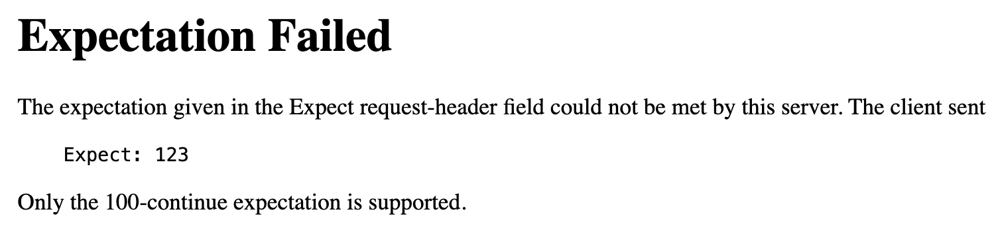
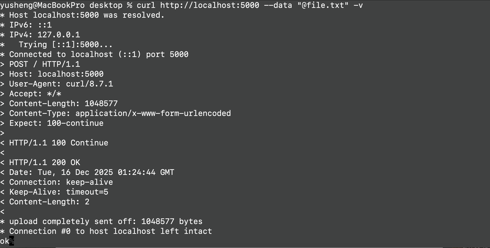

## 前言

2025/11，我在 Linkedin 看到了 [James Kettle 發的這篇文章](https://www.linkedin.com/posts/james-kettle-albinowax_http1mustdie-activity-7387475238516842496-PgY6/)

exploit 細節我也不清楚，但總之是利用 Frontend 跟 Backend 對 `Expect: 100-continue` 解析的不一致，來達成 HTTP Response Queue Poisoning

誠如 James Kettle 在 [HTTP/1.1 Must Die](https://http1mustdie.com/) 所述，會有越來越多不同種類的 HTTP Request Smuggling 被挖掘出來；在我們了解 HTTP Request Smuggling 之前，先來把 HTTP 的基礎打好，就從 `Expect: 100-continue` 這個實務上很少用的 Header 開始研究吧！

## 正常的使用情境

`Expect: 100-continue` 設計的初衷，是用來優化大型檔案的傳輸

假設 Client 想要上傳一個大型圖片，但不確定 Server 會不會拒絕這個 Request，就可以先送 `Expect: 100-continue`

<div className="httpRawRequest">
  <div className="blue">POST /image HTTP/1.1</div>
  <div className="blue">Host: example.com</div>
  <div className="blue">Content-Type: image/jpg</div>
  <div className="blue">Content-Length: 123456789</div>
  <div className="blue">Expect: 100-continue</div>
  <div className="blue"></div>
  <div className="blue"></div>
</div>

Server 收到後，若允許這個 Request，則立即回傳

<div className="httpRawRequest">
  <div className="blue">HTTP/1.1 100 Continue</div>
</div>

Client 就可以開始（在同一個 TCP Connection）傳送 Request Body 了

若 Server 收到後，不允許這個 Request，則可以根據情況回傳

- 401 Unauthorized
- 405 Method Not Allowed
- 413 Content Too Large

或是其他不同的狀態碼

## Edge case 1: `Expect: other than 100-continue`

根據 [RFC 9110 section-10.1.1](https://datatracker.ietf.org/doc/html/rfc9110#section-10.1.1) 的描述

```
A server that receives an Expect field value containing a member other than 100-continue MAY respond with a 417 (Expectation Failed) status code to indicate that the unexpected expectation cannot be met.
```

目前實測下來，有找到 Apache Web Server 會處理這個 Edge case

<div className="httpRawRequest">
  <div className="blue">GET /robots.txt HTTP/1.1</div>
  <div className="blue">Host: example.com</div>
  <div className="blue">Expect: 123</div>
  <div className="blue"></div>
  <div className="blue"></div>
</div>

Response

<div className="httpRawRequest">
  <div className="blue">HTTP/1.1 417 Expectation Failed</div>
  <div className="blue">Server: Apache</div>
  <div className="blue">Content-Length: 355</div>
  <div className="blue">Content-Type: text/html; charset=iso-8859-1</div>
  <div className="blue">Expires: Mon, 15 Dec 2025 07:13:09 GMT</div>
  <div className="blue">Cache-Control: max-age=0, no-cache, no-store</div>
  <div className="blue">Pragma: no-cache</div>
  <div className="blue">Date: Mon, 15 Dec 2025 07:13:09 GMT</div>
  <div className="blue">Connection: keep-alive</div>
  <div className="blue"></div>
  <div className="blue">HTML 省略...</div>
</div>



<!-- ```html
<!DOCTYPE HTML PUBLIC "-//IETF//DTD HTML 2.0//EN">
<html>
    <head>
        <title>417 Expectation Failed</title>
    </head>
    <body>
        <h1>Expectation Failed</h1>
        <p>
            The expectation given in the Expect request-header field could not be met by this server.
            The client sent<pre>Expect: 122</pre>
        </p>
        <p>Only the 100-continue expectation is supported.</p>
    </body>
</html>
```` -->

## Raw HTTP Request / Response

若支援 100-continue 的 Web Server，則會看到以下

Request

<div className="httpRawRequest">
  <div className="blue">GET /robots.txt HTTP/1.1</div>
  <div className="blue">Host: example.com</div>
  <div className="blue">Expect: 100-continue</div>
  <div className="blue">Content-Length: 2</div>
  <div className="blue"></div>
  <div className="blue">12</div>
</div>

Response

<div className="httpRawRequest">
  <div className="blue">HTTP/1.1 100 Continue</div>
  <div className="blue"></div>
  <div className="blue">HTTP/1.1 200 OK</div>
  <div className="blue">Date: Mon, 15 Dec 2025 08:25:13 GMT</div>
  <div className="blue">Content-Type: text/plain</div>
  <div className="blue">Content-Length: 15</div>
  <div className="blue">Connection: keep-alive</div>
  <div className="blue"></div>
  <div className="blue">User-agent: *</div>
  <div className="blue"></div>
</div>

## Node.js http server 預設支援 100 Continue

根據 [Event: 'checkContinue'](https://nodejs.org/api/http.html#event-checkcontinue) 的描述

```
Emitted each time a request with an HTTP Expect: 100-continue is received. If this event is not listened for, the server will automatically respond with a 100 Continue as appropriate.
```

所以在一個最小 PoC 的 http server

```ts
import { createServer } from "http";
createServer()
  .listen(5000)
  .on("request", function requestListener(req, res) {
    return res.end("ok");
  });
```

Client 直接送

<div className="httpRawRequest">
  <div className="blue">GET / HTTP/1.1</div>
  <div className="blue">Host: localhost:5000</div>
  <div className="blue">Expect: 100-continue</div>
  <div className="blue"></div>
  <div className="blue"></div>
</div>

http server 會回傳

<div className="httpRawRequest">
  <div className="blue">HTTP/1.1 100 Continue</div>
  <div className="blue"></div>
  <div className="blue">HTTP/1.1 200 OK</div>
  <div className="blue">Date: Mon, 15 Dec 2025 09:55:35 GMT</div>
  <div className="blue">Connection: keep-alive</div>
  <div className="blue">Keep-Alive: timeout=5</div>
  <div className="blue">Content-Length: 2</div>
  <div className="blue"></div>
  <div className="blue">ok</div>
</div>

:::info
建議使用 Burp Suite Repeater 或是可以完整印出 Raw HTTP Response 的 HTTP Client，才可以觀察到這個結果
:::

## Node.js http server 自行處理 100 Continue

實務上，幾乎不需要在 Application Layer 自行處理 100 Continue，因為很少有 Client 會發這種 Request，但 Node.js http server 還是有提供這個 API 可以用

我們實作 Node.js http server

```ts
import http from "http";

const httpServer = http.createServer();
httpServer.listen(5000);
httpServer.on("checkContinue", function checkContinueListener(req, res) {
  // >= 1MB 就 reject
  if (parseInt(req.headers["content-length"] || "0") >= 1024 * 1024) {
    res.statusCode = 413;
    res.end(http.STATUS_CODES[413]);
    return;
  }
  // < 1MB，讀取 request body，並且原封不動寫入 response body
  res.writeContinue();
  const chunks: Buffer[] = [];
  req.on("data", (chunk) => chunks.push(chunk));
  req.on("end", () => res.end(Buffer.concat(chunks)));
});
```

Client Side 使用 `net.Socket` 手動構造 Raw HTTP Request

```ts
import net from "net";

const rawHTTPRequestWithoutContent = `POST / HTTP/1.1
Host: localhost:5000
Expect: 100-continue
Content-Length: 3

`.replaceAll("\n", "\r\n");

function createSocket(url: URL) {
  return new Promise<net.Socket>((resolve) => {
    const socket = net.connect(parseInt(url.port), url.hostname);
    socket.on("connect", () => resolve(socket));
  });
}

async function main() {
  const url = new URL("http://localhost:5000");
  const socket = await createSocket(url);
  socket.write(rawHTTPRequestWithoutContent);
  socket.setEncoding("utf8");
  socket.on("data", (chunk: string) => {
    console.log(chunk);
    if (chunk === "HTTP/1.1 100 Continue\r\n\r\n") socket.write("123");
  });
}

main();
```

從 Node.js 的 log 可以觀察到，會先印出

<div className="httpRawRequest">
  <div className="blue">HTTP/1.1 100 Continue</div>
  <div className="blue"></div>
  <div className="blue"></div>
</div>

過兩秒後，才會印出

<div className="httpRawRequest">
  <div className="blue">HTTP/1.1 200 OK</div>
  <div className="blue">Date: Mon, 15 Dec 2025 09:55:35 GMT</div>
  <div className="blue">Connection: keep-alive</div>
  <div className="blue">Keep-Alive: timeout=5</div>
  <div className="blue">Content-Length: 3</div>
  <div className="blue"></div>
  <div className="blue">123</div>
</div>

另外，Node.js 的 http client 其實也支援 100 continue

```ts
const clientRequest = http.request({
  host: "localhost",
  port: 5000,
  path: "/",
  method: "POST",
  // ✅ 正常送出 expect: 100-continue 這個 request header
  headers: { expect: "100-continue", "content-length": 3 },
});
// ✅ 等同於幫使用者處理 `if (chunk === "HTTP/1.1 100 Continue\r\n\r\n")`
clientRequest.on("continue", () => clientRequest.end("123"));
clientRequest.on("response", (response) => {
  response.setEncoding("utf8");
  response.on("data", console.log); // 123
});
```

## curl 預設有支援 `Expect: 100-continue`

根據 [everything.curl.dev](https://everything.curl.dev/http/post/expect100.html) 的描述

```
curl sends this Expect: header by default if the POST it does is known or suspected to be larger than one megabyte.
```

實測用 curl 構造一個 1048577 Bytes（1MB + 1Byte）的 POST 請求，確實預設會帶上 `Expect: 100-continue`


同時 curl 也有提到，因為很多 Server 不支援 100 Continue；所以 curl 只會等待 1 秒，即便沒收到 100 Continue，也會繼續傳送 request body

```
Unfortunately, lots of servers in the world do not properly support the Expect: header or do not handle it correctly, so curl only waits 1000 milliseconds for that first response before it continues anyway.
```

我查了 [RFC 9110 section-10.1.1](https://datatracker.ietf.org/doc/html/rfc9110#section-10.1.1)，確定這是符合規範的做法

```
A client that sends a 100-continue expectation is not required to wait for any specific length of time
```

## 小結

這篇文章，帶大家了解 `Expect: 100-continue` 是如何在成熟的 HTTP Client / Server 運作

下一篇文章，會進入 James Kettle 寫的 Paper [HTTP/1.1 must die: the desync endgame](https://portswigger.net/research/http1-must-die#expect-based-desync-attacks)

<!-- todo-yus 還沒深入 -->

## 參考資料

- https://nodejs.org/api/http.html#responsewritecontinue
- https://www.linkedin.com/posts/james-kettle-albinowax_http1mustdie-activity-7387475238516842496-PgY6/
- https://developer.mozilla.org/en-US/docs/Web/HTTP/Reference/Status/100
- https://developer.mozilla.org/en-US/docs/Web/HTTP/Reference/Headers/Expect
- https://datatracker.ietf.org/doc/html/rfc9110#section-10.1.1
