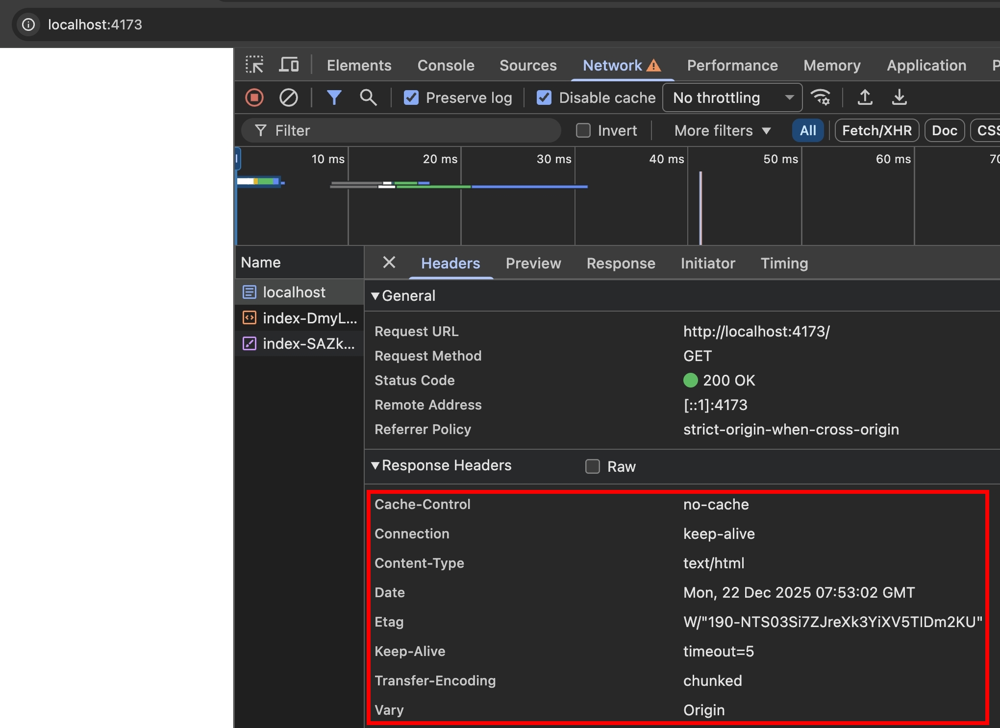
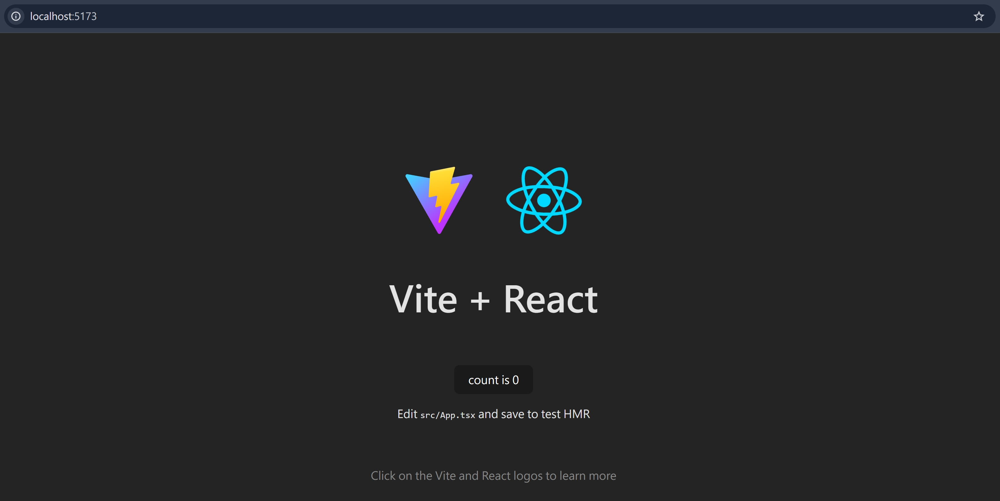
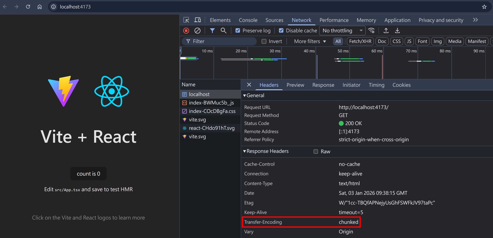

## 前言

相信各位前端工程師多少都有接觸過 [vite](https://vite.dev/)，其中有個指令是 `vite preview`，可以在本機測試 build 出來的靜態 HTML,CSS,JS 是否正常

當我用瀏覽器打開 `vite preview` 的結果時，我嚇到了，這其實是一個算完整的 http server，基本的 Cache Header, gzip 都有用上；且竟然是使用 [`Transfer-Encoding: chunked`](./transfer-encoding.md)


正常來說，serve 靜態檔案，Web Server 是可以預先知道檔案大小的，為何 `vite preview` 會選擇用 `Transfer-Encoding: chunked`，以及這些 Cache Header, gzip 是誰處理的，就讓我們透過這篇文章來深入研究吧！

## 從零開始創建一個 vite 專案

1. 確保本機有安裝 [Node.js](https://nodejs.org/zh-tw/download)
2. 終端機執行 `npm create vite@latest`，這會在當前目錄創建一個最新的 vite 專案

```
npm create vite@latest

> npx
> create-vite

|
o  Project name:
|  http-20260103
|
o  Select a framework:
|  React
|
o  Select a variant:
|  TypeScript + SWC
|
o  Use rolldown-vite (Experimental)?:
|  No
|
o  Install with npm and start now?
|  No
|
o  Scaffolding project in C:\Users\samue\Desktop\daily\my-github\http-20260103...
|
—  Done. Now run:

  cd http-20260103
  npm install
  npm run dev
```

3. 安裝 `package.json` 的套件，我選擇用 [pnpm: Using Corepack](https://pnpm.io/installation#using-corepack)

```
corepack enable pnpm
corepack use pnpm@latest
```

4. 終端機執行

```
pnpm dev
```

就可以在 http://localhost:5173 看到 Vite + React 預設的頁面了


5. 終端機執行

```
pnpm build
pnpm preview
```

就可以在 http://localhost:4173 看到這次要討論的 vite preview 畫面了

:::info
pnpm build => vite build => 把專案打包成 dist 資料夾，裡面包含 html, css, js, assets

pnpm preview => vite preview => 在本機啟動一個 NodeJS http server，serve dist 資料夾的靜態資源
:::

## 閱讀 vite preview 的原始碼

我們一步一步深挖

1. clone repo: `git clone https://github.com/vitejs/vite.git`
2. 在官方的 [README](https://github.com/vitejs/vite?tab=readme-ov-file#packages) 得知這是一個 monorepo
3. 其中，package [vite](https://github.com/vitejs/vite/tree/main/packages/vite) 是在 `/packages/vite`
4. 使用 VSCode 搜尋 "preview" 關鍵字，得知

- 主要的程式碼實現在 `packages/vite/src/node/preview.ts`
- 調用 preview 程式碼的檔案是 `packages/vite/src/node/cli.ts`

 <!-- todo-yus  -->

## 閱讀 vite preview 的官方文件

[cli#vite-preview](https://vite.dev/guide/cli#vite-preview)
[config/preview-options](https://vite.dev/config/preview-options)

## sirv

## @polka/compression

## connect

## host-validation-middleware

<!-- ## http-proxy

- https://github.com/http-party/node-http-proxy/issues/1647
- https://www.npmjs.com/package/http-proxy
- https://www.npmjs.com/package/httpxy
- https://www.npmjs.com/package/http-proxy-3 -->

## 參考資料

- https://vite.dev/guide/cli#vite-preview
- https://vite.dev/config/preview-options
- https://github.com/sapphi-red/host-validation-middleware
- https://github.com/senchalabs/connect
- https://github.com/lukeed/sirv
-
