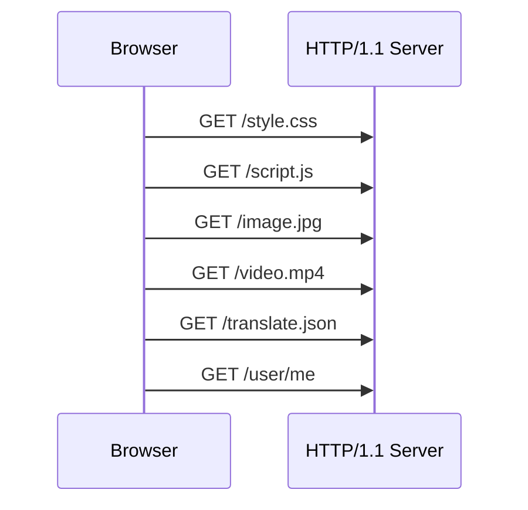

## 前言

打完 [portSwigger 的 HTTP Request Smuggling](https://portswigger.net/web-security/request-smuggling) 之後，我開始在真實世界研究這種技巧，結果卻不小心踩到 HTTP/1.1 pipelining 的坑，想說趁此機會來研究這個機制，於是這篇文章就誕生了

## Why pipelining ?

[去年的文章](./browser-max-tcp-connection-6-per-host.md)有提到，瀏覽器針對每個 Host 有限制 MaxTCPConnection = 6


```mermaid
sequenceDiagram
  participant Browser
  participant HTTP/1.1 Server

  Browser ->> HTTP/1.1 Server: GET /style.css
  Browser ->> HTTP/1.1 Server: GET /script.js
  Browser ->> HTTP/1.1 Server: GET /image.jpg
  Browser ->> HTTP/1.1 Server: GET /video.mp4
  Browser ->> HTTP/1.1 Server: GET /translate.json
  Browser ->> HTTP/1.1 Server: GET /user/me
```

雖然有 [Keep-Alive](./keep-alive-and-connection.md) 的機制可以讓 TCP Connection 複用，但每條 TCP Connection 同時只能發送一個 HTTP Request，現代前端網站架構複雜，框架 bundle 完，動輒十幾個 js, css, img 要載入，從第 7 個 HTTP Request 開始就要等待，導致效能不佳

## pipelining

HTTP/1.1 曾提出了 pipelining 來解決上述問題，根據 [RFC 9112 section-9.3.2](https://datatracker.ietf.org/doc/html/rfc9112#section-9.3.2) 的描述

```
A client that supports persistent connections MAY "pipeline" its requests (i.e., send multiple requests without waiting for each response).
```

簡單來說，就是在一個 TCP Connection 發送

```
GET /style.css HTTP/1.1
Host: localhost

GET /script.js HTTP/1.1
Host: localhost

GET /image.jpg HTTP/1.1
Host: localhost


```

:::info
去年寫的 [深入解說 HTTP message](./anatomy-of-an-http-message.md) 有提到 HTTP/1.1 的傳輸格式
:::

HTTP/1.1 Server 就會依序回傳

```
HTTP/1.1 200 OK
Content-Length: ...
Content-Type: text/css

<style>css here...</style>
```

```
HTTP/1.1 200 OK
Content-Length: ...
Content-Type: text/javascript

console.log('hello world')
```

```
HTTP/1.1 200 OK
Content-Length: ...
Content-Type: image/jpg

jpg here...
```

看起來很美好，但是有一些限制

### pipelining 限制 1: HTTP/1.1 HOL Blocking

根據 [RFC 9112 section-9.3.2](https://datatracker.ietf.org/doc/html/rfc9112#section-9.3.2) 的描述

```
it MUST send the corresponding responses in the same order that the requests were received.
```

假設某個 HTTP Request 花了比較久

<svg width="500" height="150" xmlns="http://www.w3.org/2000/svg">
  <rect x="0" y="10" width="150" height="30" fill="#4CAF50" />
  <text x="10" y="30">Request A: 1.5s</text>
  
  <rect x="0" y="50" width="480" height="30" fill="#2196F3" />
  <text x="10" y="70">Request B: 4.8s</text>
  
  <rect x="0" y="90" width="220" height="30" fill="#FF9800" />
  <text x="10" y="110">Request C: 2.2s</text>
</svg>

最終
<span style={{"color": "#FF9800"}}>Request C</span>
還是得等到
<span style={{"color": "#2196F3"}}>Request B</span>
完成，才能回傳

這個現象，有個專有名詞叫做 Head-of-line blocking (HOL Blocking)，來看看 [MDN 文件](https://developer.mozilla.org/en-US/docs/Glossary/Head_of_line_blocking) 的解說:

```
Unfortunately the design of HTTP/1.1 means that responses must be returned in the same order as the requests were received, so HOL blocking can still occur if a request takes a long time to complete.
```

而 HTTP/2 解決了 HTTP/1.1 的 HOL Blocking，解法也很簡單，就是在每個 Request/Response 都加上流水號 ID，細節我會在未來的 [HTTP/2](./http-2.md) 談到

### pipelining 限制 2: 只能是 Idempotent Methods

## Safe Methods

<!-- https://www.rfc-editor.org/rfc/rfc9110#section-9.2.1 -->

## Idempotent Methods

<!-- https://www.rfc-editor.org/rfc/rfc9110#section-9.2.2 -->

## nc instead of burp suite

<!-- (echo -ne "GET /?sleepMs=0 HTTP/1.1\r\nHost: localhost\r\n\r\nGET /?sleepMs=5000 HTTP/1.1\r\nHost: localhost\r\n\r\nGET /?sleepMs=2000 HTTP/1.1\r\nHost: localhost\r\n\r\n"; sleep 10) | nc localhost 5000 -->

<!-- burp suite not good -->

## 參考資料

- https://www.rfc-editor.org/rfc/rfc9110#section-9.2.1
- https://www.rfc-editor.org/rfc/rfc9110#section-9.2.2
- https://datatracker.ietf.org/doc/html/rfc9112#section-9.3.2
  <!-- - https://tkoce.teaches.cc/training -->
  <!-- - https://www.oce.tku.edu.tw/ -->
- https://developer.mozilla.org/en-US/docs/Web/HTTP/Guides/Connection_management_in_HTTP_1.x
