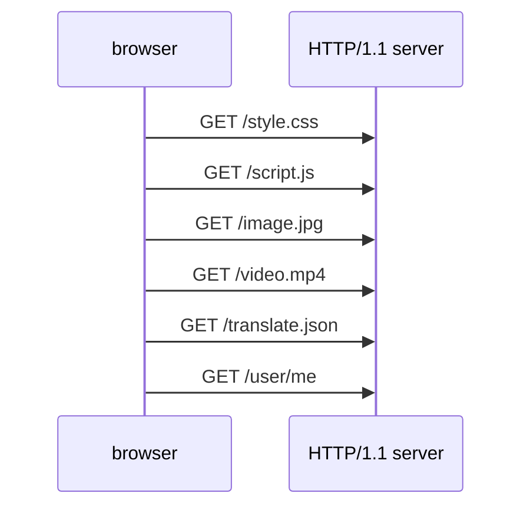

<!-- todo-yus mermaid -->

## 前言

打完 [PortSwigger 的 HTTP Request Smuggling](https://portswigger.net/web-security/request-smuggling) 之後，我開始在真實世界研究這種技巧，結果卻不小心踩到 HTTP/1.1 pipelining 的坑，想說趁此機會來研究這個機制，於是這篇文章就誕生了

## Why pipelining ?

[去年的文章](./browser-max-tcp-connection-6-per-host.md)有提到，瀏覽器針對每個 Host 有限制 MaxTCPConnection = 6



雖然有 [Keep-Alive](./keep-alive-and-connection.md) 的機制可以讓 TCP connection 複用，但每條 TCP connection 同時只能發送一個 HTTP request，現代前端網站架構複雜，框架 bundle 完，動輒十幾個 js, css, img 要載入，從第 7 個 HTTP request 開始就要等待，導致效能不佳

## pipelining

HTTP/1.1 曾提出了 pipelining 來解決上述問題，根據 [RFC 9112 section-9.3.2](https://datatracker.ietf.org/doc/html/rfc9112#section-9.3.2) 的描述

```
A client that supports persistent connections MAY "pipeline" its requests (i.e., send multiple requests without waiting for each response).
```

簡單來說，就是在一個 TCP connection 同時發送多個 HTTP request

<div className="httpRawRequest">
  <div className="blue">GET /style.css HTTP/1.1</div>
  <div className="blue">Host: localhost:5000</div>
  <div className="blue"></div>
  <div className="orange">GET /script.js HTTP/1.1</div>
  <div className="orange">Host: localhost:5000</div>
  <div className="orange"></div>
  <div className="green">GET /image.jpg HTTP/1.1</div>
  <div className="green">Host: localhost:5000</div>
  <div className="green"></div>
  <div className="green"></div>
</div>

:::info
去年寫的 [深入解說 HTTP message](./anatomy-of-an-http-message.md) 有提到 HTTP/1.1 的傳輸格式
:::

HTTP/1.1 server 就會依序回傳

<div className="httpRawRequest">
  <div className="blue">HTTP/1.1 200 OK</div>
  <div className="blue">Content-Length: 100</div>
  <div className="blue">Content-Type: text/css</div>
  <div className="blue"></div>
  <div className="blue">100 bytes of css content...</div>
</div>

<div className="httpRawRequest">
  <div className="orange">HTTP/1.1 200 OK</div>
  <div className="orange">Content-Length: 100</div>
  <div className="orange">Content-Type: text/javascript</div>
  <div className="orange"></div>
  <div className="orange">100 bytes of js content...</div>
</div>

<div className="httpRawRequest">
  <div className="green">HTTP/1.1 200 OK</div>
  <div className="green">Content-Length: 100</div>
  <div className="green">Content-Type: image/jpg</div>
  <div className="green"></div>
  <div className="green">100 bytes of jpg content...</div>
</div>

看起來很美好，但是有一些限制

### pipelining 限制 1: HTTP/1.1 HOL Blocking

根據 [RFC 9112 section-9.3.2](https://datatracker.ietf.org/doc/html/rfc9112#section-9.3.2) 的描述

```
it MUST send the corresponding responses in the same order that the requests were received.
```

假設某個 HTTP request 花了比較久

<svg width="500" height="150" xmlns="http://www.w3.org/2000/svg">
  <rect x="0" y="10" width="150" height="30" fill="#4CAF50" />
  <text x="10" y="30">request A: 1.5s</text>
  
  <rect x="0" y="50" width="480" height="30" fill="#2196F3" />
  <text x="10" y="70">request B: 4.8s</text>
  
  <rect x="0" y="90" width="220" height="30" fill="#FF9800" />
  <text x="10" y="110">request C: 2.2s</text>
</svg>

最終
<span style={{"color": "#FF9800"}}>request C</span>
還是得等到
<span style={{"color": "#2196F3"}}>request B</span>
完成，才能回傳

為什麼呢？因為 response 並沒有標記這是屬於哪個 request，所以回傳的時候一定要按照順序！

這個現象，有個專有名詞叫做 Head-of-line blocking (HOL Blocking)，來看看 [MDN 文件](https://developer.mozilla.org/en-US/docs/Glossary/Head_of_line_blocking) 的解說：

```
Unfortunately the design of HTTP/1.1 means that responses must be returned in the same order as the requests were received, so HOL blocking can still occur if a request takes a long time to complete.
```

而 HTTP/2 解決了 HTTP/1.1 的 HOL Blocking，解法也很簡單，就是在每個 request / response 都加上流水號 ID，細節我會在未來的 [HTTP/2](./http-2.md) 談到

### pipelining 限制 2: Race Condition 跟 Retry 機制複雜

假設 client pipeline 兩個 HTTP request，分別是 "新增使用者" 跟 "取得使用者列表"

<div className="httpRawRequest">
  <div className="blue">POST /users HTTP/1.1</div>
  <div className="blue">Host: localhost:5000</div>
  <div className="blue"></div>
  <div className="orange">GET /users HTTP/1.1</div>
  <div className="orange">Host: localhost:5000</div>
  <div className="orange"></div>
  <div className="orange"></div>
</div>

為了避免 race condition，client 得先 "新增使用者"，等收到 response 之後，才能繼續發送 "取得使用者列表"

參考 [RFC 9112 Section 9.3.2](https://datatracker.ietf.org/doc/html/rfc9112#section-9.3.2) 的描述：

```
A user agent SHOULD NOT pipeline requests after a non-idempotent method, until the final response status code for that method has been received
```

另外，若 "新增使用者" 的時候 TCP 連線中斷，retry 可能造成重複新增使用者，所以 pipeline 的實作上就會變得很複雜

參考 [RFC 9112 Section 9.3.2](https://datatracker.ietf.org/doc/html/rfc9112#section-9.3.2) 的描述：

```
A client that pipelines requests SHOULD retry unanswered requests if the connection closes before it receives all of the corresponding responses.
```

根據上述種種限制，現代瀏覽器基本上都不支援 pipeline

### Safe Methods

直接看 [RFC 9110 section-9.2.1](https://datatracker.ietf.org/doc/html/rfc9110#section-9.2.1) 的描述

- Request methods are considered "safe" if their defined semantics are essentially read-only
- GET, HEAD, OPTIONS, and TRACE methods are defined to be safe.

如果 client 發送的都是 Safe Methods，就可以 pipeline，因為不會互相影響

```
A server MAY process a sequence of pipelined requests in parallel if they all have safe methods
```

### Idempotent Methods

直接看 [RFC 9110 section-9.2.1](https://datatracker.ietf.org/doc/html/rfc9110#section-9.2.1) 的描述

- A request method is considered "idempotent" if the intended effect on the server of multiple identical requests with that method is the same as the effect for a single such request.
- PUT, DELETE, and safe request methods are idempotent.

[pipelining 限制 2: Race Condition 跟 Retry 機制複雜](#pipelining-限制-2-race-condition-跟-retry-機制複雜) 的原因就是 Non-Idempotent Methods

如果 client 發送的都是 Idempotent Methods，就可以安全的 retry

```
Idempotent methods are significant to pipelining because they can be automatically retried after a connection failure.
```

## Node.js `http.Server` 實測 HTTP/1.1 pipeline

Node.js `http.Server` 實作，用 `sleepMs` 來模擬不同資源載入的時間

```ts
import http from "http";

const httpServer = http.createServer(async (req, res) => {
  const url = new URL(req.url || "", "http://localhost:5000");
  const sleepMs = parseInt(url.searchParams.get("sleepMs") || "0");
  await sleep(sleepMs);
  if (!res.writableEnded) res.end(`sleepMs = ${sleepMs}`);
});
httpServer.listen(5000);
```

### Simple Case

構造 raw HTTP request

<div className="httpRawRequest">
  <div className="blue">GET / HTTP/1.1</div>
  <div className="blue">Host: localhost:5000</div>
  <div className="blue"></div>
  <div className="orange">GET / HTTP/1.1</div>
  <div className="orange">Host: localhost:5000</div>
  <div className="orange"></div>
  <div className="green">GET / HTTP/1.1</div>
  <div className="green">Host: localhost:5000</div>
  <div className="green"></div>
  <div className="green"></div>
</div>

response

```
HTTP/1.1 200 OK
Connection: keep-alive
Keep-Alive: timeout=5
Content-Length: 11

sleepMs = 0HTTP/1.1 200 OK
Connection: keep-alive
Keep-Alive: timeout=5
Content-Length: 11

sleepMs = 0HTTP/1.1 200 OK
Connection: keep-alive
Keep-Alive: timeout=5
Content-Length: 11

sleepMs = 0
```

我一開始想說為何 `sleepMs = 0HTTP/1.1 200 OK` 字會黏在一起，但後來想想其實是正常的，因為每一個 response 的結構都是

```
HTTP/1.1 200 OK
Connection: keep-alive
Keep-Alive: timeout=5
Content-Length: 11

sleepMs = 0
```

HTTP Parser 看到 `Content-Length: 11`，就會往後讀取 11 bytes，剛好讀完 `sleepMs = 0`，接著就是下一個 response 的開頭 `HTTP/1.1 200 OK`，中間不會特別再用 `\r\n` 隔開了，所以視覺上看起來就會黏在一起

### Different Process Time

構造 raw HTTP request

<div className="httpRawRequest">
  <div className="blue">GET / HTTP/1.1</div>
  <div className="blue">Host: localhost:5000</div>
  <div className="blue"></div>
  <div className="orange">GET /?sleepMs=1000 HTTP/1.1</div>
  <div className="orange">Host: localhost:5000</div>
  <div className="orange"></div>
  <div className="green">GET /?sleepMs=2000 HTTP/1.1</div>
  <div className="green">Host: localhost:5000</div>
  <div className="green"></div>
  <div className="green"></div>
</div>

PoC

```ts
const rawHttpRequests = `GET / HTTP/1.1
Host: localhost

GET /?sleepMs=1000 HTTP/1.1
Host: localhost

GET /?sleepMs=2000 HTTP/1.1
Host: localhost

`.replaceAll("\n", "\r\n");

const socket = net.connect({ host: "localhost", port: 5000 });
socket.write(rawHttpRequests, () => console.log(performance.now()));
socket.setEncoding("latin1");
socket.on("data", (chunk: string) => {
  console.log(chunk);
  // 印出最後一筆 response 完成的時間
  if (chunk.endsWith("sleepMs = 2000")) console.log(performance.now());
});
```

成功收到 pipeline 的三個 response，總共耗時約 2 秒

```
HTTP/1.1 200 OK
Connection: keep-alive
Keep-Alive: timeout=5
Content-Length: 11

sleepMs = 0HTTP/1.1 200 OK
Connection: keep-alive
Keep-Alive: timeout=5
Content-Length: 14

sleepMs = 1000HTTP/1.1 200 OK
Connection: keep-alive
Keep-Alive: timeout=5
Content-Length: 14

sleepMs = 2000
2098.912125
```

## HTTP Request Smuggling or HTTP/1.1 pipeline ?

有了前面的知識後，假設在同一個 TCP 連線按照順序發送以下 requests，會回傳什麼呢？

request 1

<div className="httpRawRequest">
  <div className="blue">GET / HTTP/1.1</div>
  <div className="blue">Host: localhost:5000</div>
  <div className="blue"></div>
  <div className="orange">GET /?sleepMs=1000 HTTP/1.1</div>
  <div className="orange">Foo: bar</div>
  <div className="orange"></div>
  <div className="orange"></div>
</div>

request 2

<div className="httpRawRequest">
  <div className="green">GET /?sleepMs=2000 HTTP/1.1</div>
  <div className="green">Host: localhost:5000</div>
  <div className="green"></div>
  <div className="green"></div>
</div>

答案是

response 1

<div className="httpRawRequest">
  <div className="blue">HTTP/1.1 200 OK</div>
  <div className="blue">Connection: keep-alive</div>
  <div className="blue">Keep-Alive: timeout=5</div>
  <div className="blue">Content-Length: 11</div>
  <div className="blue"></div>
  <div className="blue">sleepMs = 0</div>
</div>

response 2

<div className="httpRawRequest">
  <div className="orange">HTTP/1.1 200 OK</div>
  <div className="orange">Connection: keep-alive</div>
  <div className="orange">Keep-Alive: timeout=5</div>
  <div className="orange">Content-Length: 14</div>
  <div className="orange"></div>
  <div className="orange">sleepMs = 1000</div>
</div>

為何？因為 HTTP server 收到的 raw bytes 是

<div className="httpRawRequest">
  <div className="blue">GET / HTTP/1.1</div>
  <div className="blue">Host: localhost:5000</div>
  <div className="blue"></div>
  <div className="orange">GET /?sleepMs=1000 HTTP/1.1</div>
  <div className="orange">Foo: bar<span className="green">GET /?sleepMs=2000 HTTP/1.1</span></div>
  <div className="green">Host: localhost:5000</div>
  <div className="green"></div>
  <div className="green"></div>
</div>

從結構上來看，這就是兩個完整的 HTTP request 沒錯，並且

<div className="httpRawRequest">
  <div className="orange">Foo: bar<span className="green">GET /?sleepMs=2000 HTTP/1.1</span></div>
</div>
也是合法的 HTTP header

我曾經以為這就是 [HTTP Request Smuggling](../port-swigger/http-request-smuggling.md)，但深入理解 HTTP/1.1 之後，才發現這是符合規範的正常行為

HTTP server 之所以會在這裡

<div className="httpRawRequest">
  <div className="orange">GET /?sleepMs=1000 HTTP/1.1</div>
  <div className="orange">Foo: bar</div>
</div>

繼續等待更多 headers，是因為無法確保 TCP 在傳輸 raw bytes 的時候，會剛好完整的傳送一個 HTTP request

- 中間可能有網路延遲
- 或是剛好頂到 TCP Maximum Packet Size
- [Nagle’s Algorithm 跟 TCP_NODELAY](../protocols/tcp.md) 的設定影響

所以 HTTP server 通常可以設定 timeout，超過 timeout 沒有收到完整的 HTTP request，就會把 "Incomplete HTTP request" 丟棄

## 小結

這篇文章是在我完成 [Learn HTTP With JS: 2025 iThome 鐵人賽](https://ithelp.ithome.com.tw/users/20155705/ironman/8162) 以及 [PortSwigger HTTP Request Smuggling](../port-swigger/http-request-smuggling.md) 之後寫的，我原本以為我對於 HTTP/1.1 已經算熟悉了，沒想到在真實世界踩坑以後，回來補齊新知識，才意識到 HTTP/1.1 的世界真的是博大精深啊～

HTTP/1.1 pipeline 我認為大部分的前端/後端工程師不會特別接觸到這塊，畢竟在瀏覽器禁用，加上平常用的 HTTP Agent（fetch, axios, XMLHttpRequest...）都是封裝過後的 API，除非是有興趣理解底層原理的人，不然實務上根本不會碰到XD

但我相信，理解 HTTP 的底層原理，雖然對工作不會馬上有幫助，但未來的某一天，也許真的會用上！

## 參考資料

- https://datatracker.ietf.org/doc/html/rfc9110#section-9.2.1
- https://datatracker.ietf.org/doc/html/rfc9110#section-9.2.2
- https://datatracker.ietf.org/doc/html/rfc9112#section-9.3.2
- https://developer.mozilla.org/en-US/docs/Web/HTTP/Guides/Connection_management_in_HTTP_1.x
