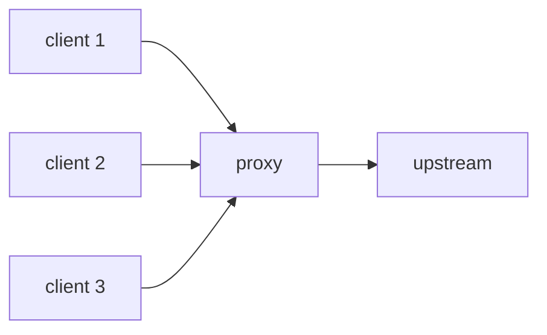

## Node.js 跟 headers 相關的設定

<!-- todo-yus -->

| option                     | description |
| -------------------------- | ----------- |
| maxDeflateDynamicTableSize | -           |
| maxHeaderListPairs         | -           |
| maxSendHeaderBlockLength   | -           |
| settings.headerTableSize   | -           |
| settings.maxHeaderListSize | -           |

## Terminology

| term                              | description                                     |
| --------------------------------- | ----------------------------------------------- |
| [**Static Table**](#static-table) | -                                               |
| **Dynamic Table**                 | -                                               |
| **Header Field**                  | Example：`:authority: localhost:5000`           |
| **Header List**                   | Multiple **"Header Field"**                     |
| **Header Field Representation**   | **"Header Field"** converted to HPACK raw bytes |
| **Header Block**                  | **"Header List"** converted to HPACK raw bytes  |


## Static Table

- https://datatracker.ietf.org/doc/html/rfc7541#appendix-A
- RFC 7541 預先定義好 61 組高頻率使用到的 header name, value

```
+-------+-----------------------------+---------------+
| Index | Header Name                 | Header Value  |
+-------+-----------------------------+---------------+
| 1     | :authority                  |               |
| 2     | :method                     | GET           |
| 3     | :method                     | POST          |
| 4     | :path                       | /             |
| 5     | :path                       | /index.html   |
| 6     | :scheme                     | http          |
| 7     | :scheme                     | https         |
| 8     | :status                     | 200           |
| 9     | :status                     | 204           |
| 10    | :status                     | 206           |
| 11    | :status                     | 304           |
| 12    | :status                     | 400           |
| 13    | :status                     | 404           |
| 14    | :status                     | 500           |
| 15    | accept-charset              |               |
| 16    | accept-encoding             | gzip, deflate |
| 17    | accept-language             |               |
| 18    | accept-ranges               |               |
| 19    | accept                      |               |
| 20    | access-control-allow-origin |               |
| 21    | age                         |               |
| 22    | allow                       |               |
| 23    | authorization               |               |
| 24    | cache-control               |               |
| 25    | content-disposition         |               |
| 26    | content-encoding            |               |
| 27    | content-language            |               |
| 28    | content-length              |               |
| 29    | content-location            |               |
| 30    | content-range               |               |
| 31    | content-type                |               |
| 32    | cookie                      |               |
| 33    | date                        |               |
| 34    | etag                        |               |
| 35    | expect                      |               |
| 36    | expires                     |               |
| 37    | from                        |               |
| 38    | host                        |               |
| 39    | if-match                    |               |
| 40    | if-modified-since           |               |
| 41    | if-none-match               |               |
| 42    | if-range                    |               |
| 43    | if-unmodified-since         |               |
| 44    | last-modified               |               |
| 45    | link                        |               |
| 46    | location                    |               |
| 47    | max-forwards                |               |
| 48    | proxy-authenticate          |               |
| 49    | proxy-authorization         |               |
| 50    | range                       |               |
| 51    | referer                     |               |
| 52    | refresh                     |               |
| 53    | retry-after                 |               |
| 54    | server                      |               |
| 55    | set-cookie                  |               |
| 56    | strict-transport-security   |               |
| 57    | transfer-encoding           |               |
| 58    | user-agent                  |               |
| 59    | vary                        |               |
| 60    | via                         |               |
| 61    | www-authenticate            |               |
+-------+-----------------------------+---------------+
```

## Dynamic Table

- https://datatracker.ietf.org/doc/html/rfc7541#section-2.3.2
- index 從 62 開始
- 跟 [Static Table](#static-table) 一樣是存 header name, value
- first-in, first-out

## Integer Representation

[RFC 7541](https://datatracker.ietf.org/doc/html/rfc7541#section-5.1) 原文

```
Integers are used to represent name indexes, header field indexes, or string lengths
```

### Example 1：prefix "?"，編碼 200

```
  ? 111,1111     0 100,1001
  - --------     - --------
  |      |       |        |
prefix  127    flag = 0   73
             (last octet)
```

`127 + 73 = 200`

### Example 2：prefix "?"，編碼 10000

```
  ? 111,1111     1 001,0001      0 100,1101
  - --------     - --------      - --------
  |      |       |        |      |        |
prefix  127    flag = 1   17   flag = 0   77*2**7
            (continuation)   (last octet)
```

`127 + 17 + 77*2**7 = 10000`

### Example 3：prefix "?"，編碼 16510

```
  ? 111,1111     1 111,1111      0 111,1111
  - --------     - --------      - --------
  |      |       |        |      |        |
prefix  127    flag = 1  127   flag = 0   127*2**7
            (continuation)   (last octet)
```

`127 + 127 + 127*2**7 = 16510`

### Example 4：prefix "?"，編碼 16511

```
  ? 111,1111     1 000,0000       1 000,0000      0 000,0001
  - --------     - --------       - --------      - --------
  |      |       |        |       |        |      |        |
prefix  127    flag = 1   0    flag = 1    0    flag = 0   1*2**14
            (continuation)  (continuation)    (last octet)
```

`127 + 1*2**14 = 16511`

### Example 5：prefix "???"，編碼 4000

```
  ??? 1,1111     1 000,0001       0 001,1111
  --- ------     - --------       - --------
   |    |       |         |       |        |
prefix  31    flag = 1    1    flag = 0    31*2**7
           (continuation)    (last octet)
```

`31 + 1 + 31 * 2**7 = 4000`

### Overlong Encoding

這在 RFC7541 並沒有一個專門的名詞，而是用一段話來描述

```
It
is also possible for an encoder to send a large number of zero
values, which can waste octets and could be used to overflow integer
values.  Integer encodings that exceed implementation limits -- in
value or octet length -- MUST be treated as decoding errors.
```

沿用 [Example 5：prefix "???"，編碼 4000](#example-5prefix-編碼-4000) 的結果

| 1st octet | 2nd octet | 3rd octet |
| --------- | --------- | --------- |
| ???1,1111 | 1000,0001 | 0001,1111 |

我們其實可以把它 encode 成

| 1st octet | 2nd octet | 3rd octet | 4th octet | 5th octet |
| --------- | --------- | --------- | --------- | --------- |
| ???1,1111 | 1000,0001 | 1001,1111 | 1000,0000 | 0000,0000 |

甚至更極端，可以瘋狂塞 1000,0000 這種 "不貢獻任何數字的 continuation byte"

| 1st octet | 2nd octet | 3rd octet | 4th octet | 5th octet | 6th octet |
| --------- | --------- | --------- | --------- | --------- | --------- |
| ???1,1111 | 1000,0001 | 1001,1111 | 1000,0000 | 1000,0000 | 0000,0000 |

為了避免這種問題，實作上通常會限制 continuation byte 的數量

## String Literal Representation

```
  0   1   2   3   4   5   6   7
+---+---+---+---+---+---+---+---+
| H |    String Length (7+)     |
+---+---------------------------+
|  String Data (Length octets)  |
+-------------------------------+
```

- 這邊的 String Length (7+) 就是 [Integer Representation](#integer-representation) 的應用
- H = 0 代表

### Huffman Code

```js
const HUFFMAN_CODE = [
  "1111111111000", // 0
  "11111111111111111011000", // 1
  "1111111111111111111111100010", // 2
  "1111111111111111111111100011", // 3
  "1111111111111111111111100100", // 4
  "1111111111111111111111100101", // 5
  "1111111111111111111111100110", // 6
  "1111111111111111111111100111", // 7
  "1111111111111111111111101000", // 8
  "111111111111111111101010", // 9
  "111111111111111111111111111100", // 10
  "1111111111111111111111101001", // 11
  "1111111111111111111111101010", // 12
  "111111111111111111111111111101", // 13
  "1111111111111111111111101011", // 14
  "1111111111111111111111101100", // 15
  "1111111111111111111111101101", // 16
  "1111111111111111111111101110", // 17
  "1111111111111111111111101111", // 18
  "1111111111111111111111110000", // 19
  "1111111111111111111111110001", // 20
  "1111111111111111111111110010", // 21
  "111111111111111111111111111110", // 22
  "1111111111111111111111110011", // 23
  "1111111111111111111111110100", // 24
  "1111111111111111111111110101", // 25
  "1111111111111111111111110110", // 26
  "1111111111111111111111110111", // 27
  "1111111111111111111111111000", // 28
  "1111111111111111111111111001", // 29
  "1111111111111111111111111010", // 30
  "1111111111111111111111111011", // 31
  "010100", // 32 ' '
  "1111111000", // 33 '!'
  "1111111001", // 34 '"'
  "111111111010", // 35 '#'
  "1111111111001", // 36 '$'
  "010101", // 37 '%'
  "11111000", // 38 '&'
  "11111111010", // 39 '''
  "1111111010", // 40 '('
  "1111111011", // 41 ')'
  "11111001", // 42 '*'
  "11111111011", // 43 '+'
  "11111010", // 44 ','
  "010110", // 45 '-'
  "010111", // 46 '.'
  "011000", // 47 '/'
  "00000", // 48 '0'
  "00001", // 49 '1'
  "00010", // 50 '2'
  "011001", // 51 '3'
  "011010", // 52 '4'
  "011011", // 53 '5'
  "011100", // 54 '6'
  "011101", // 55 '7'
  "011110", // 56 '8'
  "011111", // 57 '9'
  "1011100", // 58 ':'
  "11111011", // 59 ';'
  "111111111111100", // 60 '<'
  "100000", // 61 '='
  "111111111011", // 62 '>'
  "1111111100", // 63 '?'
  "1111111111010", // 64 '@'
  "100001", // 65 'A'
  "1011101", // 66 'B'
  "1011110", // 67 'C'
  "1011111", // 68 'D'
  "1100000", // 69 'E'
  "1100001", // 70 'F'
  "1100010", // 71 'G'
  "1100011", // 72 'H'
  "1100100", // 73 'I'
  "1100101", // 74 'J'
  "1100110", // 75 'K'
  "1100111", // 76 'L'
  "1101000", // 77 'M'
  "1101001", // 78 'N'
  "1101010", // 79 'O'
  "1101011", // 80 'P'
  "1101100", // 81 'Q'
  "1101101", // 82 'R'
  "1101110", // 83 'S'
  "1101111", // 84 'T'
  "1110000", // 85 'U'
  "1110001", // 86 'V'
  "1110010", // 87 'W'
  "11111100", // 88 'X'
  "1110011", // 89 'Y'
  "11111101", // 90 'Z'
  "1111111111011", // 91 '['
  "1111111111111110000", // 92 '\'
  "1111111111100", // 93 ']'
  "11111111111100", // 94 '^'
  "100010", // 95 '_'
  "111111111111101", // 96 '`'
  "00011", // 97 'a'
  "100011", // 98 'b'
  "00100", // 99 'c'
  "100100", // 100 'd'
  "00101", // 101 'e'
  "100101", // 102 'f'
  "100110", // 103 'g'
  "100111", // 104 'h'
  "00110", // 105 'i'
  "1110100", // 106 'j'
  "1110101", // 107 'k'
  "101000", // 108 'l'
  "101001", // 109 'm'
  "101010", // 110 'n'
  "00111", // 111 'o'
  "101011", // 112 'p'
  "1110110", // 113 'q'
  "101100", // 114 'r'
  "01000", // 115 's'
  "01001", // 116 't'
  "101101", // 117 'u'
  "1110111", // 118 'v'
  "1111000", // 119 'w'
  "1111001", // 120 'x'
  "1111010", // 121 'y'
  "1111011", // 122 'z'
  "111111111111110", // 123 '{'
  "11111111100", // 124 '|'
  "11111111111101", // 125 '}'
  "1111111111101", // 126 '~'
  "1111111111111111111111111100", // 127
  "11111111111111100110", // 128
  "1111111111111111010010", // 129
  "11111111111111100111", // 130
  "11111111111111101000", // 131
  "1111111111111111010011", // 132
  "1111111111111111010100", // 133
  "1111111111111111010101", // 134
  "11111111111111111011001", // 135
  "1111111111111111010110", // 136
  "11111111111111111011010", // 137
  "11111111111111111011011", // 138
  "11111111111111111011100", // 139
  "11111111111111111011101", // 140
  "11111111111111111011110", // 141
  "111111111111111111101011", // 142
  "11111111111111111011111", // 143
  "111111111111111111101100", // 144
  "111111111111111111101101", // 145
  "1111111111111111010111", // 146
  "11111111111111111100000", // 147
  "111111111111111111101110", // 148
  "11111111111111111100001", // 149
  "11111111111111111100010", // 150
  "11111111111111111100011", // 151
  "11111111111111111100100", // 152
  "111111111111111011100", // 153
  "1111111111111111011000", // 154
  "11111111111111111100101", // 155
  "1111111111111111011001", // 156
  "11111111111111111100110", // 157
  "11111111111111111100111", // 158
  "111111111111111111101111", // 159
  "1111111111111111011010", // 160
  "111111111111111011101", // 161
  "11111111111111101001", // 162
  "1111111111111111011011", // 163
  "1111111111111111011100", // 164
  "11111111111111111101000", // 165
  "11111111111111111101001", // 166
  "111111111111111011110", // 167
  "11111111111111111101010", // 168
  "1111111111111111011101", // 169
  "1111111111111111011110", // 170
  "111111111111111111110000", // 171
  "111111111111111011111", // 172
  "1111111111111111011111", // 173
  "11111111111111111101011", // 174
  "11111111111111111101100", // 175
  "111111111111111100000", // 176
  "111111111111111100001", // 177
  "1111111111111111100000", // 178
  "111111111111111100010", // 179
  "11111111111111111101101", // 180
  "1111111111111111100001", // 181
  "11111111111111111101110", // 182
  "11111111111111111101111", // 183
  "11111111111111101010", // 184
  "1111111111111111100010", // 185
  "1111111111111111100011", // 186
  "1111111111111111100100", // 187
  "11111111111111111110000", // 188
  "1111111111111111100101", // 189
  "1111111111111111100110", // 190
  "11111111111111111110001", // 191
  "11111111111111111111100000", // 192
  "11111111111111111111100001", // 193
  "11111111111111101011", // 194
  "1111111111111110001", // 195
  "1111111111111111100111", // 196
  "11111111111111111110010", // 197
  "1111111111111111101000", // 198
  "1111111111111111111101100", // 199
  "11111111111111111111100010", // 200
  "11111111111111111111100011", // 201
  "11111111111111111111100100", // 202
  "111111111111111111111011110", // 203
  "111111111111111111111011111", // 204
  "11111111111111111111100101", // 205
  "111111111111111111110001", // 206
  "1111111111111111111101101", // 207
  "1111111111111110010", // 208
  "111111111111111100011", // 209
  "11111111111111111111100110", // 210
  "111111111111111111111100000", // 211
  "111111111111111111111100001", // 212
  "11111111111111111111100111", // 213
  "111111111111111111111100010", // 214
  "111111111111111111110010", // 215
  "111111111111111100100", // 216
  "111111111111111100101", // 217
  "11111111111111111111101000", // 218
  "11111111111111111111101001", // 219
  "1111111111111111111111111101", // 220
  "111111111111111111111100011", // 221
  "111111111111111111111100100", // 222
  "111111111111111111111100101", // 223
  "11111111111111101100", // 224
  "111111111111111111110011", // 225
  "11111111111111101101", // 226
  "111111111111111100110", // 227
  "1111111111111111101001", // 228
  "111111111111111100111", // 229
  "111111111111111101000", // 230
  "11111111111111111110011", // 231
  "1111111111111111101010", // 232
  "1111111111111111101011", // 233
  "1111111111111111111101110", // 234
  "1111111111111111111101111", // 235
  "111111111111111111110100", // 236
  "111111111111111111110101", // 237
  "11111111111111111111101010", // 238
  "11111111111111111110100", // 239
  "11111111111111111111101011", // 240
  "111111111111111111111100110", // 241
  "11111111111111111111101100", // 242
  "11111111111111111111101101", // 243
  "111111111111111111111100111", // 244
  "111111111111111111111101000", // 245
  "111111111111111111111101001", // 246
  "111111111111111111111101010", // 247
  "111111111111111111111101011", // 248
  "1111111111111111111111111110", // 249
  "111111111111111111111101100", // 250
  "111111111111111111111101101", // 251
  "111111111111111111111101110", // 252
  "111111111111111111111101111", // 253
  "111111111111111111111110000", // 254
  "11111111111111111111101110", // 255
  "111111111111111111111111111111", // 256 EOS
];
```

### Example 1：encode "localhost:8080" with Huffman Code

| Char | Huffman Code |
| ---- | ------------ |
| l    | 101000       |
| o    | 00111        |
| c    | 00100        |
| a    | 00011        |
| l    | 101000       |
| h    | 100111       |
| o    | 00111        |
| s    | 01000        |
| t    | 01001        |
| :    | 1011100      |
| 8    | 011110       |
| 0    | 00000        |
| 8    | 011110       |
| 0    | 00000        |

拼接在一起：10100000, 11100100, 00011101, 00010011, 10011101, 00001001, 10111000, 11110000, 00011110, 00000

尾巴補 EOS：10100000, 11100100, 00011101, 00010011, 10011101, 00001001, 10111000, 11110000, 00011110, 00000111

_為何要補 EOS？因為 EOS 全都是 1，不會跟其他 Huffman Code 重複_

```
  0   1   2   3   4   5   6   7
+---+---+---+---+---+---+---+---+
| 1 | 0   0   0   1   0   1   0 |
+---+---------------------------+
| a0 e4 1d 13 9d 09 b8 f0 1e 07 |
+-------------------------------+
```

## Binary Format

### Indexed Header Field Representation

https://datatracker.ietf.org/doc/html/rfc7541#section-6.1

**header field (name + value) 都在 static 或 dynamic table，可直接 index 引用**

```
  0   1   2   3   4   5   6   7
+---+---+---+---+---+---+---+---+
| 1 |        Index (7+)         |
+---+---------------------------+
```

**範例**

`:method: GET`

```
  0   1   2   3   4   5   6   7
+---+---+---+---+---+---+---+---+
| 1 | 0   0   0   0   0   1   0 |
+---+---------------------------+
```

`:path: /`

```
  0   1   2   3   4   5   6   7
+---+---+---+---+---+---+---+---+
| 1 | 0   0   0   0   1   0   0 |
+---+---------------------------+
```

### Literal Header Field Representation with Incremental Indexing

- https://datatracker.ietf.org/doc/html/rfc7541#section-6.2.1
- with Incremental Indexing = 這個 header field 要被存到 dynamic table

**header field name 在 static 或 dynamic table，可直接 index 引用，header field value 用 String Literal Representation 表示**

```
  0   1   2   3   4   5   6   7
+---+---+---+---+---+---+---+---+
| 0 | 1 |      Index (6+)       |
+---+---+-----------------------+
| H |     Value Length (7+)     |
+---+---------------------------+
| Value String (Length octets)  |
+-------------------------------+
```

**範例**

`:method: hello`

```
  0   1   2   3   4   5   6   7
+---+---+---+---+---+---+---+---+
| 0 | 1 | 0   0   0   0   1   0 |
+---+---+-----------------------+
| 0 | 0   0   0   0   1   0   1 |
+---+---------------------------+
|             hello             |
+-------------------------------+
```

`www-authenticate: helloworld`

```
  0   1   2   3   4   5   6   7
+---+---+---+---+---+---+---+---+
| 0 | 1 | 1   1   1   1   0   1 |
+---+---+-----------------------+
| 0 | 0   0   0   1   0   1   0 |
+---+---------------------------+
|          helloworld           |
+-------------------------------+
```

**header field (name + value) 都用 String Literal Representation 表示**

```
  0   1   2   3   4   5   6   7
+---+---+---+---+---+---+---+---+
| 0 | 1 |           0           |
+---+---+-----------------------+
| H |     Name Length (7+)      |
+---+---------------------------+
|  Name String (Length octets)  |
+---+---------------------------+
| H |     Value Length (7+)     |
+---+---------------------------+
| Value String (Length octets)  |
+-------------------------------+
```

**範例**

`hello: world`

```
  0   1   2   3   4   5   6   7
+---+---+---+---+---+---+---+---+
| 0 | 1 | 0   0   0   0   0   0 |
+---+---+-----------------------+
| 0 | 0   0   0   0   1   0   1 |
+---+---------------------------+
|             hello             |
+---+---------------------------+
| 0 | 0   0   0   0   1   0   1 |
+---+---------------------------+
|             world             |
+-------------------------------+
```

### Literal Header Field Representation without Indexing

- https://datatracker.ietf.org/doc/html/rfc7541#section-6.2.2
- without Indexing = 這個 header field 不需要存到 dynamic table
- proxy 可以修改此設定再 forward 給下一個節點

**header field name 在 static 或 dynamic table，可直接 index 引用，header field value 用 String Literal Representation 表示**

```
  0   1   2   3   4   5   6   7
+---+---+---+---+---+---+---+---+
| 0 | 0 | 0 | 0 |  Index (4+)   |
+---+---+-----------------------+
| H |     Value Length (7+)     |
+---+---------------------------+
| Value String (Length octets)  |
+-------------------------------+
```

**範例**

`:method: hello`

```
  0   1   2   3   4   5   6   7
+---+---+---+---+---+---+---+---+
| 0 | 0 | 0 | 0 | 0   0   1   0 |
+---+---+-----------------------+
| 0 | 0   0   0   0   1   0   1 |
+---+---------------------------+
|             hello             |
+-------------------------------+
```

**header field (name + value) 都用 String Literal Representation 表示**

```
  0   1   2   3   4   5   6   7
+---+---+---+---+---+---+---+---+
| 0 | 0 | 0 | 0 |       0       |
+---+---+-----------------------+
| H |     Name Length (7+)      |
+---+---------------------------+
|  Name String (Length octets)  |
+---+---------------------------+
| H |     Value Length (7+)     |
+---+---------------------------+
| Value String (Length octets)  |
+-------------------------------+
```

**範例**

`hello: world`

```
  0   1   2   3   4   5   6   7
+---+---+---+---+---+---+---+---+
| 0 | 0 | 0 | 0 | 0   0   0   0 |
+---+---+-----------------------+
| 0 | 0   0   0   0   1   0   1 |
+---+---------------------------+
|             hello             |
+---+---------------------------+
| 0 | 0   0   0   0   1   0   1 |
+---+---------------------------+
|             world             |
+-------------------------------+
```

### Literal Header Field Never Indexed

- https://datatracker.ietf.org/doc/html/rfc7541#section-6.2.3
- Never Indexed = 這個 header field 不需要存到 dynamic table
- proxy 禁止修改此設定

**header field name 在 static 或 dynamic table，可直接 index 引用，header field value 用 String Literal Representation 表示**

```
  0   1   2   3   4   5   6   7
+---+---+---+---+---+---+---+---+
| 0 | 0 | 0 | 1 |  Index (4+)   |
+---+---+-----------------------+
| H |     Value Length (7+)     |
+---+---------------------------+
| Value String (Length octets)  |
+-------------------------------+
```

**範例**

`:method: hello`

```
  0   1   2   3   4   5   6   7
+---+---+---+---+---+---+---+---+
| 0 | 0 | 0 | 1 | 0   0   1   0 |
+---+---+-----------------------+
| 0 | 0   0   0   0   1   0   1 |
+---+---------------------------+
|             hello             |
+-------------------------------+
```

**header field (name + value) 都用 String Literal Representation 表示**

```
  0   1   2   3   4   5   6   7
+---+---+---+---+---+---+---+---+
| 0 | 0 | 0 | 1 |       0       |
+---+---+-----------------------+
| H |     Name Length (7+)      |
+---+---------------------------+
|  Name String (Length octets)  |
+---+---------------------------+
| H |     Value Length (7+)     |
+---+---------------------------+
| Value String (Length octets)  |
+-------------------------------+
```

**範例**

`hello: world`

```
  0   1   2   3   4   5   6   7
+---+---+---+---+---+---+---+---+
| 0 | 0 | 0 | 1 | 0   0   0   0 |
+---+---+-----------------------+
| 0 | 0   0   0   0   1   0   1 |
+---+---------------------------+
|             hello             |
+---+---------------------------+
| 0 | 0   0   0   0   1   0   1 |
+---+---------------------------+
|             world             |
+-------------------------------+
```

### Dynamic Table Size Update

- https://datatracker.ietf.org/doc/html/rfc7541#section-6.3
- 新的 Max size 必須 `<=` [SETTINGS_HEADER_TABLE_SIZE](./http-2-raw-bytes.md#section-652-defined-settings)
- 必須出現在 [Header Block](#terminology) 的最前面

```
  0   1   2   3   4   5   6   7
+---+---+---+---+---+---+---+---+
| 0 | 0 | 1 |   Max size (5+)   |
+---+---------------------------+
```

**範例 1：Max size = 10**

```
  0   1   2   3   4   5   6   7
+---+---+---+---+---+---+---+---+
| 0 | 0 | 1 | 0   1   0   1   0 |
+---+---------------------------+
```

## Cross-Client HPACK State Leakage via Shared Dynamic Table

假設有以下架構



假設 proxy 到 upstream 這邊是共用一條 HTTP/2 connection，就會造成 Dynamic Table 的互相汙染。解法也很簡單，針對跨租戶的情境，應該要把 HTTP/2 connection 隔開，而不是共用一條

## 參考資料

- https://datatracker.ietf.org/doc/html/rfc7541
- https://nodejs.org/docs/latest-v24.x/api/http2.html#http2sensitiveheaders
- maxDeflateDynamicTableSize
- maxSendHeaderBlockLength
- sensitiveHeaders
