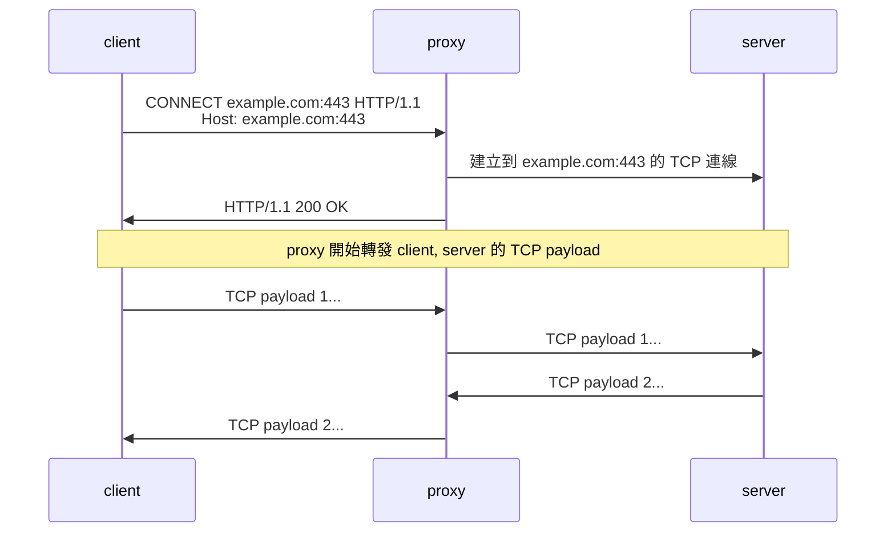
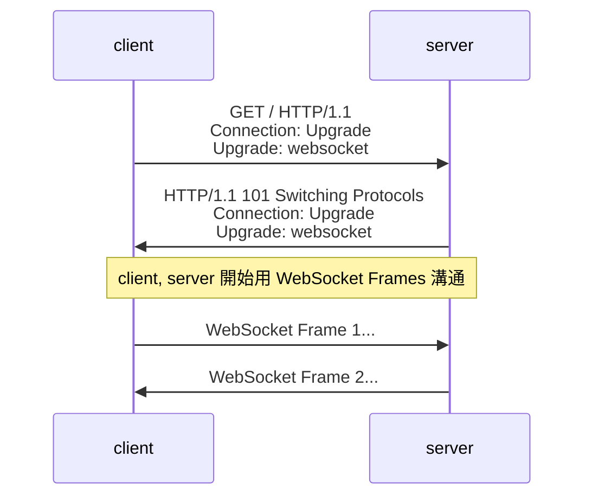
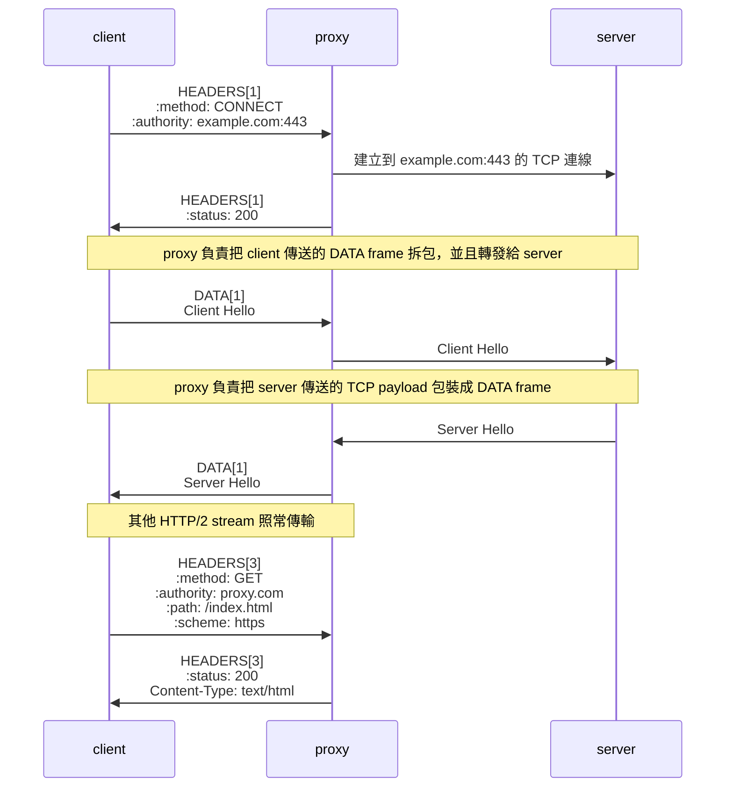
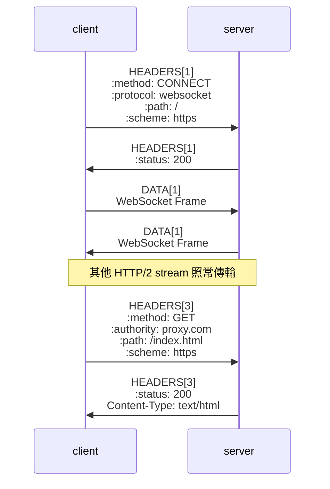
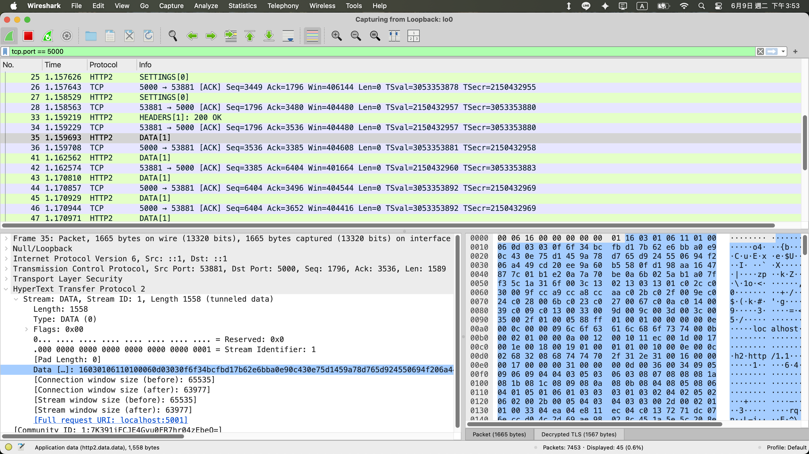
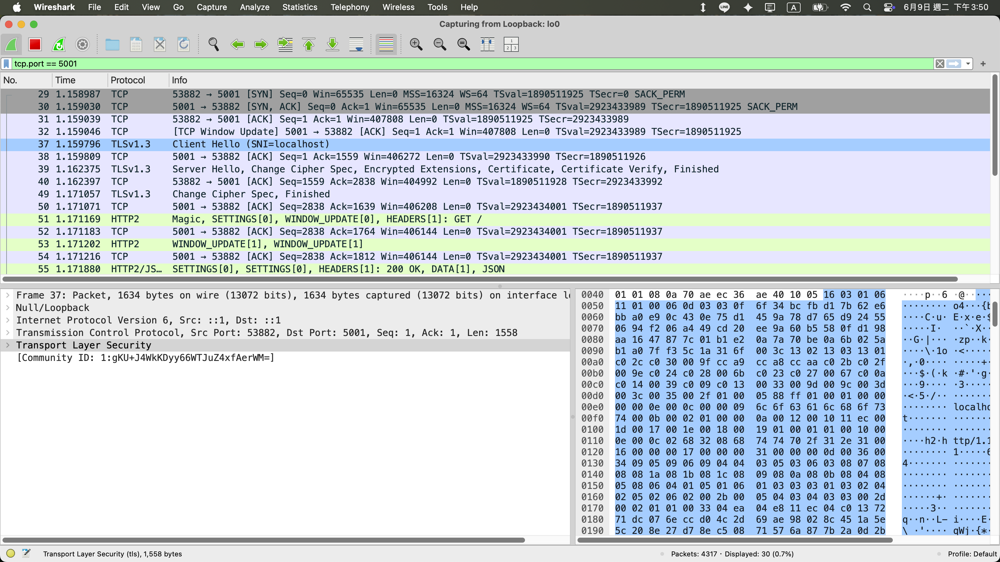
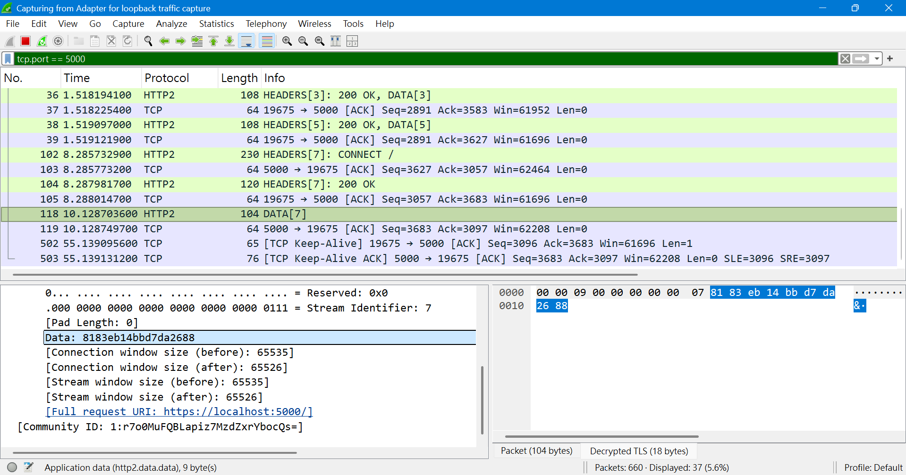

## HTTP/2 跟 HTTP/1.1 處理 CONNECT 的差異

|                          | HTTP/1.1<br/>CONNECT                                       | HTTP/1.1<br/>WebSocket                                        | HTTP/2<br/>CONNECT                               | HTTP/2<br/>WebSocket                                                      |
| ------------------------ | ---------------------------------------------------------- | ------------------------------------------------------------- | ------------------------------------------------ | ------------------------------------------------------------------------- |
| Underlying<br/>Carrier   | Single TCP socket                                          | Single TCP socket                                             | Single HTTP/2 stream                             | Single HTTP/2 stream                                                      |
| Connection<br/>Hijacking | ✅                                                         | ✅                                                            | ❌                                               | ❌                                                                        |
| Multiplexing             | ❌                                                         | ❌                                                            | ✅                                               | ✅                                                                        |
| Request<br/>Headers      | CONNECT example.com:443 HTTP/1.1<br/>Host: example.com:443 | GET / HTTP/1.1<br/>Connection: Upgrade<br/>Upgrade: websocket | :method: CONNECT<br/>:authority: example.com:443 | :method: CONNECT<br/>:protocol: websocket<br/>:path: /<br/>:scheme: https |
| Data<br/>Framing         | raw bytes                                                  | WebSocket<br/>Frames                                          | HTTP/2<br/>DATA Frames                           | HTTP/2<br/>DATA Frames                                                    |

## HTTP/1.1 CONNECT 時序圖



## HTTP/1.1 WebSocket 時序圖



## HTTP/2 CONNECT 時序圖



## HTTP/2 WebSocket 時序圖



## HTTP/2 CONNECT 程式範例

- proxy server
  ```js
  const proxyServer = http2.createSecureServer({
    settings: { enableConnectProtocol: true },
    key: readFileSync(join(import.meta.dirname, "private-key.pem")),
    cert: readFileSync(join(import.meta.dirname, "cert.pem")),
  });
  proxyServer.listen(5000);
  proxyServer.on("stream", (stream, headers) => {
    const method = headers[":method"];
    const protocol = headers[":protocol"];
    if (method === "CONNECT" && protocol === undefined) {
      // 為了簡化程式碼，固定連線到 localhost:5001
      assert(headers[":authority"] === "localhost:5001");
      const socket = net.connect({ host: "localhost", port: 5001 });
      socket.on("connect", () => stream.respond({ ":status": 200 }));
      // handle close
      socket.on("close", () => stream.destroy());
      socket.on("error", (err) => stream.destroy(err));
      stream.on("close", () => socket.destroy());
      stream.on("error", (err) => socket.destroy(err));
      // 轉發 TCP payload，不進行任何修改
      stream.pipe(socket);
      socket.pipe(stream);
      return;
    }
  });
  ```
- target server
  ```js
  const targetServer = http2.createSecureServer({
    key: readFileSync(join(import.meta.dirname, "private-key.pem")),
    cert: readFileSync(join(import.meta.dirname, "cert.pem")),
  });
  targetServer.on("stream", (stream, headers) => {
    stream.end(JSON.stringify(headers));
  });
  targetServer.listen(5001);
  ```
- client (curl)
  ```
  curl --proxy-http2 --proxy https://localhost:5000 https://localhost:5001
  ```
- wireshark 抓 client => proxy 的第一包 DATA frame

  

- wireshark 抓 proxy => server 的 Client Hello

  

比對 raw bytes 皆為 16 03 01 06 ......，可以得到以下結論

- client 會把所有 TCP payload 包裝成 HTTP/2 DATA frame 傳輸，包含 TLS handshake 的 Client Hello
- proxy 會把 client 傳來的 HTTP/2 DATA frame 拆包，再轉發給 server，透過 `stream.pipe(socket)`

## HTTP/2 WebSocket 程式範例

- server
  ```js
  const server = http2.createSecureServer({
    settings: { enableConnectProtocol: true },
    key: readFileSync(join(import.meta.dirname, "private-key.pem")),
    cert: readFileSync(join(import.meta.dirname, "cert.pem")),
  });
  server.listen(5000);
  server.on("stream", (stream, headers) => {
    const method = headers[":method"];
    const protocol = headers[":protocol"];
    if (method === "CONNECT" && protocol === "websocket") {
      stream.respond({ ":status": 200 });
      stream.on("data", console.log);
      return;
      // todo: connect to websocket server
    }
    stream.end("ok");
  });
  ```
- client（瀏覽器打開 https://localhost:5000 ，F12 > Console 輸入）
  ```js
  const ws = new WebSocket("wss://localhost:5000");
  ws.send("123");
  ```
- server output
  ```js
  <Buffer 81 83 eb 14 bb d7 da 26 88>
  ```
- wireshark 抓 `ws.send("123")` 對應的 DATA frame，發現其 payload 與 server output 一樣

  

## 小結

回顧 HTTP/1.1 的時代，不論是 CONNECT 還是 WebSocket，它們在接通後的本質都是一種「流氓行為」——直接強行綁架（Hijack）整條 TCP 連線，導致常規的 HTTP Parser 必須當場下班，且整條連線無法再做其他網頁請求。

而到了 HTTP/2，規格制定者展現了極致的抽象思維。他們引入了 Framing Layer（分幀層），把原本會綁架連線的盲轉隧道和 WebSocket，溫柔地「關進了 Stream 的籠子裡」。

透過本篇 Wireshark 的二進位比對可以發現，不管是 TLS Client Hello 還是 WebSocket Frame，在外層 H2 眼中通通都只是 DATA frame 的 payload。這種設計既維護了單一 TCP 連線上的多路復用（Multiplexing），又讓 L4 盲轉與 L7 長連線隧道能以逸待勞地跑在同一條公路上。

## 參考資料

- https://datatracker.ietf.org/doc/html/rfc8441
- https://datatracker.ietf.org/doc/html/rfc9113
- https://nodejs.org/docs/latest-v24.x/api/http2.html#the-extended-connect-protocol
