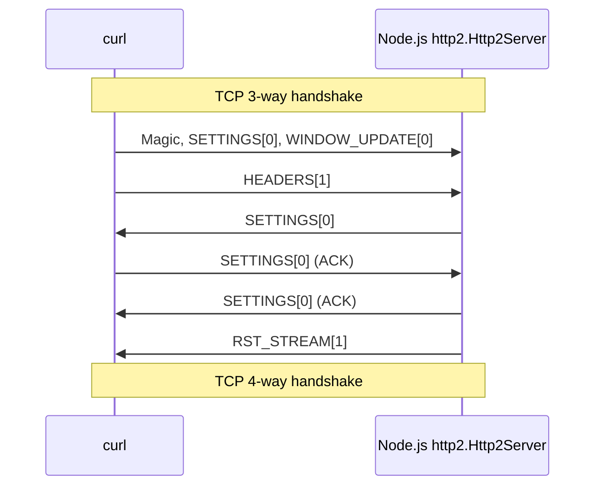
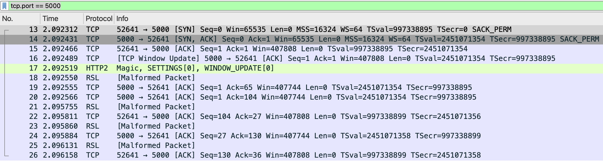
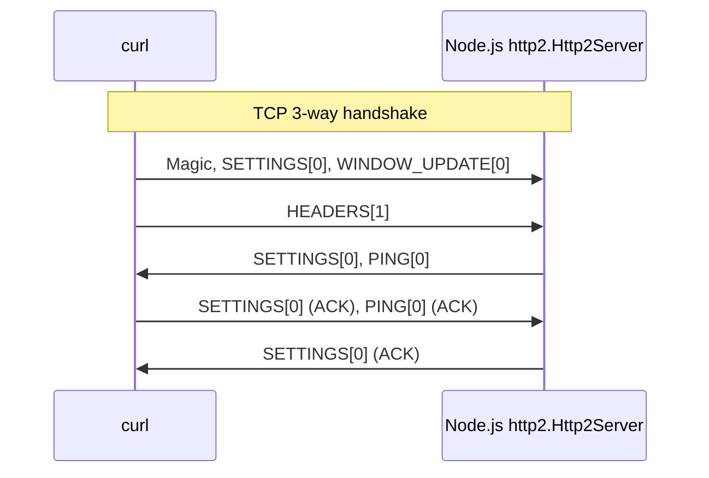
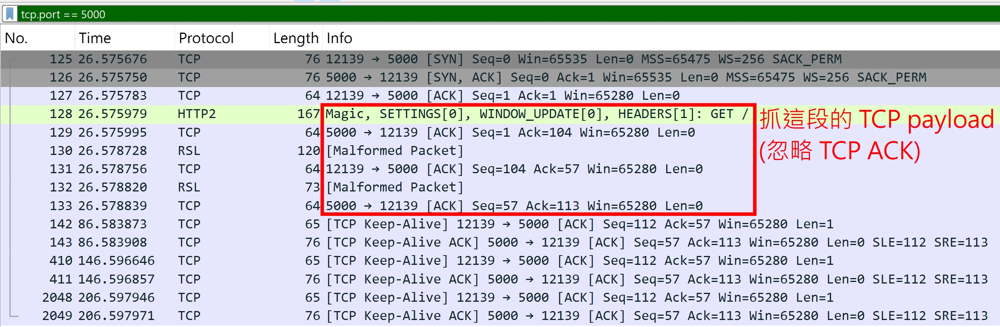
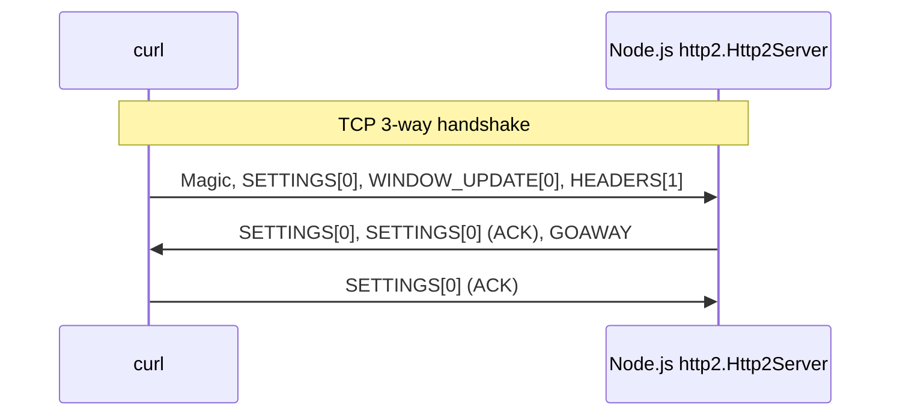

## RST_STREAM frame

[Section 6.4. RST_STREAM](https://datatracker.ietf.org/doc/html/rfc9113#section-6.4)

### 測試方法

- client (curl)

  ```
  curl --http2-prior-knowledge http://localhost:5000
  ```

- server (Node.js http2)

  ```js
  const http2Server = http2.createServer().listen(5000);
  http2Server.on("stream", (stream) => stream.close());
  ```

- curl output

  ```
  curl: (92) HTTP/2 stream 1 was closed cleanly, but before getting  all response header fields, treated as error
  ```

### Wireshark 抓包

:::info
P.S. 不確定為何這些 HTTP/2 封包會被 Wireshark 解析成 RSL Malformed Packet，但總之抓 TCP payload 就對了
:::


### 時序圖



:::info
這邊的 TCP 4-way handshake 是因為 command line 的 curl 會在結束後關閉 TCP 連線，並非由 "RST_STREAM" 造成的
:::

### 解析 RST_STREAM raw bytes

server 會送以下 bytes (hex)

```
00 00 04 03 00 00 00 00 01 // frame header
00 00 00 00                // frame payload
```

- frame header

  | field                        | hex         | description                                           |
  | ---------------------------- | ----------- | ----------------------------------------------------- |
  | Length                       | 00 00 04    | frame payload has 4 bytes                             |
  | Type                         | 03          | RST_STREAM frame (type=0x03)                          |
  | Flags                        | 00          | unset (0x00)                                          |
  | Reserved + Stream Identifier | 00 00 00 01 | Reserved: 1-bit (0)<br/>Stream Identifier: 31-bit (1) |

- frame payload

  | field                                          | hex         | description     |
  | ---------------------------------------------- | ----------- | --------------- |
  | [Error Code](./http-2-errors.md#7-error-codes) | 00 00 00 00 | NO_ERROR (0x00) |

## PUSH_PROMISE frame

## PING frame

### 測試方法

- client (curl)

  ```
  curl --http2-prior-knowledge http://localhost:5000
  ```

- server (Node.js http2)

  ```js
  const http2Server = http2.createServer();
  http2Server.on("session", (session) => {
    const payload = Buffer.alloc(8);
    session.ping(payload, (err, duration, payload) =>
      console.log({ err, duration, payload }),
    );
  });
  http2Server.listen(5000);
  ```

- server output

  ```js
  {
    err: null,
    duration: 0.600375,
    payload: <Buffer 00 00 00 00 00 00 00 00>
  }
  ```

### Wireshark 抓包

:::info
P.S. 不確定為何這些 HTTP/2 封包會被 Wireshark 解析成 RSL Malformed Packet，但總之抓 TCP payload 就對了
:::



### 時序圖



### 解析 PING raw bytes

server 會送以下 bytes (hex)

## GOAWAY frame

[Section 6.8. GOAWAY](https://datatracker.ietf.org/doc/html/rfc9113#section-6.8)

### 測試方法

- client (curl)

  ```
  curl --http2-prior-knowledge http://localhost:5000
  ```

- server (Node.js http2)

  ```js
  const http2Server = http2.createServer().listen(5000);
  http2Server.on("session", (session) => {
    const code = http2.constants.NGHTTP2_NO_ERROR;
    const lastStreamID = 1;
    const opaqueData = Buffer.from("Additional Debug Data", "utf8");
    session.goaway(code, lastStreamID, opaqueData);
  });
  ```

### Wireshark 抓包

:::info
P.S. 不確定為何這些 HTTP/2 封包會被 Wireshark 解析成 RSL Malformed Packet，但總之抓 TCP payload 就對了
:::



### 時序圖



### 解析 RST_STREAM raw bytes

server 會送以下 bytes (hex)

```
00 00 1d 07 00 00 00 00 00                                                             // frame header
00 00 00 01 00 00 00 00 41 64 64 69 74 69 6f 6e 61 6c 20 44 65 62 75 67 20 44 61 74 61 // frame payload
```

- frame header

  | field                        | hex         | description                                           |
  | ---------------------------- | ----------- | ----------------------------------------------------- |
  | Length                       | 00 00 1d    | frame payload has 29 bytes                            |
  | Type                         | 07          | GOAWAY frame (type=0x07)                              |
  | Flags                        | 00          | unset (0x00)                                          |
  | Reserved + Stream Identifier | 00 00 00 01 | Reserved: 1-bit (0)<br/>Stream Identifier: 31-bit (0) |

- frame payload

  | field                                          | hex                                                            | description                                        |
  | ---------------------------------------------- | -------------------------------------------------------------- | -------------------------------------------------- |
  | Reserved + Last-Stream-ID                      | 00 00 00 01                                                    | Reserved: 1-bit (0)<br/>Last-Stream-ID: 31-bit (1) |
  | [Error Code](./http-2-errors.md#7-error-codes) | 00 00 00 00                                                    | NO_ERROR (0x00)                                    |
  | Additional Debug Data                          | 41 64 64 69 74 69 6f 6e 61 6c 20 44 65 62 75 67 20 44 61 74 61 | `Buffer.from("Additional Debug Data", "utf8")`     |

## CONTINUATION frame

[Section 6.10. CONTINUATION](https://datatracker.ietf.org/doc/html/rfc9113#section-6.10)

**正常使用情境：headers 太長，無法在一個 HEADERS frame 送出，就會用 CONTINUATION frame 來送**

### 測試方法

- 參考 [Node.js + CLI 串接 `deflatehd`](./http-2-raw-bytes.md#nodejs--cli-串接-deflatehd)，產 HPACK raw bytes

  ```js
  const pathToDeflatehd = "/path-to-your/nghttp2-1.69.0/src/deflatehd";
  const spawnSyncReturns = spawnSync(pathToDeflatehd, ["-t"], {
    input: [
      ":method: GET",
      ":scheme: http",
      ":path: /",
      ":authority: localhost:5000",
      "",
      "",
    ].join("\n"),
    encoding: "utf8",
  });
  const result = JSON.parse(spawnSyncReturns.stdout);
  const { wire } = result.cases[0]; // 828684418aa0e41d139d09b8d8000f
  ```

- 組 HTTP/2 raw bytes

  ```js
  const magicFrame = Buffer.from("PRI * HTTP/2.0\r\n\r\nSM\r\n\r\n", "latin1");
  const emptySettingsFrame = Buffer.from([
    0x00,
    0x00,
    0x00, // Length
    0x04, // Type
    0x00, // Flags
    0x00,
    0x00,
    0x00,
    0x00, // Reserved + Stream Identifier
  ]);
  // 刻意設定 empty headers
  const emptyHeadersFrame = Buffer.from([
    0x00,
    0x00,
    0x00, // Length
    0x01, // Type
    0x01, // Flags (END_STREAM)
    0x00,
    0x00,
    0x00,
    0x01, // Reserved + Stream Identifier
  ]);
  // 刻意把 828684418aa0e41d139d09b8d8000f 拆成兩組 CONTINUATION frame
  const continuationFrame1 = Buffer.from([
    0x00,
    0x00,
    0x08, // Length
    0x09, // Type
    0x00, // Flags
    0x00,
    0x00,
    0x00,
    0x01, // Reserved + Stream Identifier

    // Field Block Fragment
    0x82,
    0x86,
    0x84,
    0x41,
    0x8a,
    0xa0,
    0xe4,
    0x1d,
  ]);
  const continuationFrame2 = Buffer.from([
    0x00,
    0x00,
    0x07, // Length
    0x09, // Type
    0x04, // Flags (END_HEADERS)
    0x00,
    0x00,
    0x00,
    0x01, // Reserved + Stream Identifier

    // Field Block Fragment
    0x13,
    0x9d,
    0x09,
    0xb8,
    0xd8,
    0x00,
    0x0f,
  ]);
  const frames = Buffer.concat([
    magicFrame,
    emptySettingsFrame,
    emptyHeadersFrame,
    continuationFrame1,
    continuationFrame2,
  ]);
  const socket = connect({ host: "localhost", port: 5000 });
  socket.write(frames);
  ```

- server (Node.js http2)

  ```js
  const http2Server = http2.createServer();
  http2Server.on("request", (req, res) => {
    console.log({ headers: req.headers, rawHeaders: req.rawHeaders });
    res.end("ok");
  });
  ```

- server output

  ```js
  {
    headers: [Object: null prototype] {
      ':method': 'GET',
      ':scheme': 'http',
      ':path': '/',
      ':authority': 'localhost:5000',
      Symbol(sensitiveHeaders): []
    },
    rawHeaders: [
      ':method',
      'GET',
      ':scheme',
      'http',
      ':path',
      '/',
      ':authority',
      'localhost:5000'
    ]
  }
  ```

## PRIORITY frame
