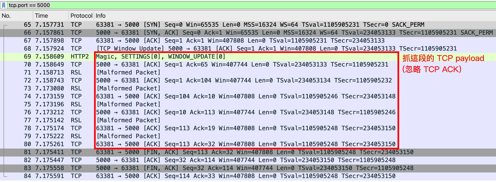
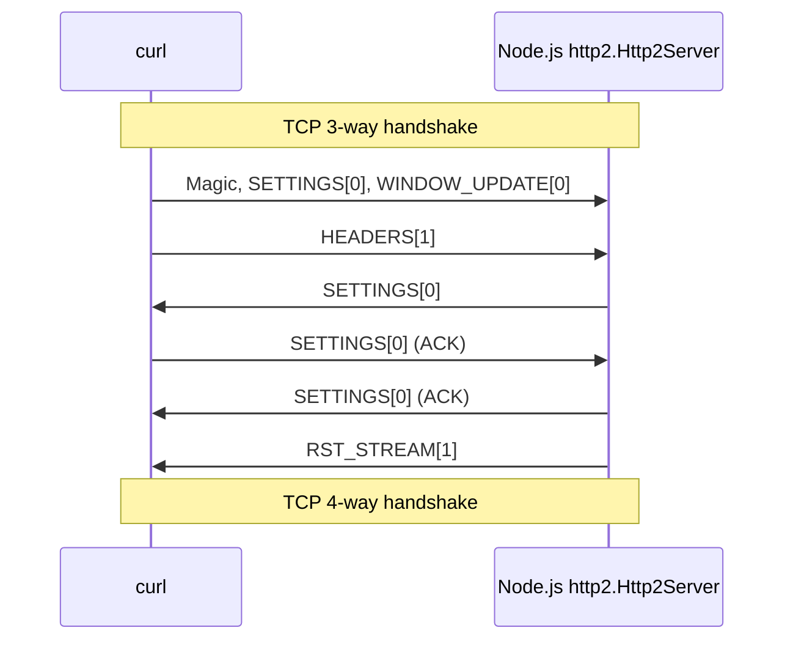

## RST_STREAM frame

[Section 6.4. RST_STREAM](https://datatracker.ietf.org/doc/html/rfc9113#section-6.4)

### 測試方法

- client (curl)

  ```
  curl --http2-prior-knowledge http://localhost:5000
  ```

- server (Node.js http2)

  ```js
  const http2Server = http2.createServer().listen(5000);
  http2Server.on("stream", (stream) => stream.close());
  ```

- curl output

  ```
  curl: (92) HTTP/2 stream 1 was closed cleanly, but before getting  all response header fields, treated as error
  ```

### Wireshark 抓包

:::info
P.S. 不確定為何這些 HTTP/2 封包會被 Wireshark 解析成 RSL Malformed Packet，但總之抓 TCP payload 就對了
:::



### 時序圖



:::info
這邊的 TCP 4-way handshake 是因為 command line 的 curl 會在結束後關閉 TCP 連線，並非由 "RST_STREAM" 造成的
:::

### 解析 RST_STREAM raw bytes

server 會送以下 bytes (hex)

```
00 00 04 03 00 00 00 00 01 // frame header
00 00 00 00                // frame payload
```

- frame header

  | field                        | hex         | description                                           |
  | ---------------------------- | ----------- | ----------------------------------------------------- |
  | Length                       | 00 00 04    | frame payload has 4 bytes                             |
  | Type                         | 03          | RST_STREAM frame (type=0x03)                          |
  | Flags                        | 00          | unset (0x00)                                          |
  | Reserved + Stream Identifier | 00 00 00 01 | Reserved: 1-bit (0)<br/>Stream Identifier: 31-bit (1) |

- frame payload

  | field                                          | hex         | description     |
  | ---------------------------------------------- | ----------- | --------------- |
  | [Error Code](./http-2-errors.md#7-error-codes) | 00 00 00 00 | NO_ERROR (0x00) |

## PUSH_PROMISE frame

## PING frame

## GOAWAY frame

### 測試方法

- client (curl)

  ```
  curl --http2-prior-knowledge http://localhost:5000
  ```

- server (Node.js http2)

  ```js
  const http2Server = http2.createServer().listen(5000);
  http2Server.on("stream", (stream) => stream.close());
  ```

- curl output

  ```
  curl: (92) HTTP/2 stream 1 was closed cleanly, but before getting  all response header fields, treated as error
  ```

### Wireshark 抓包

### 時序圖

### 解析 RST_STREAM raw bytes

## CONTINUATION frame

## PRIORITY frame
