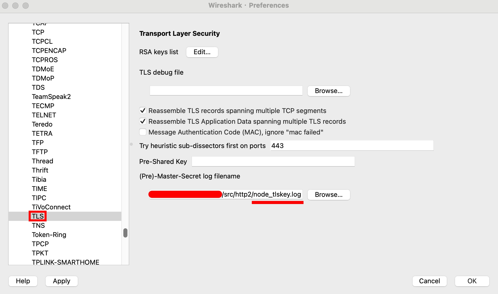
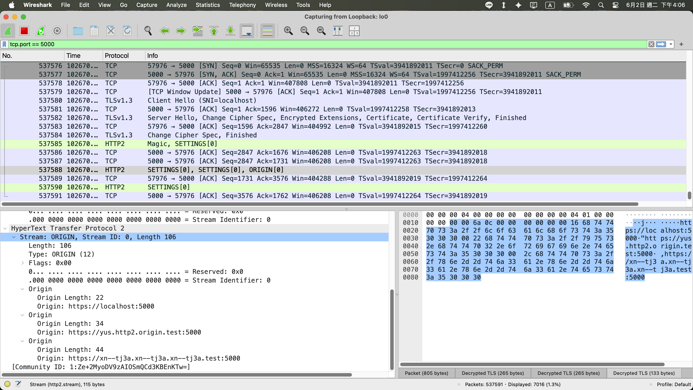

## ORIGIN frame

**測試步驟**

- etc/hosts
  ```
  # http2 ORIGIN frame & TLS SAN test
  127.0.0.1	yus.http2.origin.test
  127.0.0.1	xn--tj3a.xn--tj3a.xn--tj3a.test
  ```
- mkcert
  ```
  mkcert -key-file private-key.pem -cert-file cert.pem localhost yus.http2.origin.test xn--tj3a.xn--tj3a.xn--tj3a.test
  ```
- server
  ```js
  const http2SecureServer = http2.createSecureServer({
    origins: [
      "https://localhost:5000",
      "https://yus.http2.origin.test:5000",
      "https://xn--tj3a.xn--tj3a.xn--tj3a.test:5000", // https://貓.貓.貓.test:5000
    ],
    key: readFileSync(join(import.meta.dirname, "private-key.pem")),
    cert: readFileSync(join(import.meta.dirname, "cert.pem")),
  });
  http2SecureServer.listen(5000);
  ```
- client
  ```js
  const rootCA = readFileSync("/path-to-your/mkcert/rootCA.pem");
  const clientHttp2Session = http2.connect("https://localhost:5000", {
    ca: rootCA,
    keepAlive: false,
  });
  clientHttp2Session.on("origin", (origins) => {
    console.log({ originSet: clientHttp2Session.originSet, origins });
    assert(
      JSON.stringify(clientHttp2Session.originSet) === JSON.stringify(origins),
    );
  });
  ```
- client output
  ```js
  {
    originSet: [
      'https://localhost:5000',
      'https://yus.http2.origin.test:5000',
      'https://xn--tj3a.xn--tj3a.xn--tj3a.test:5000'
    ],
    origins: [
      'https://localhost:5000',
      'https://yus.http2.origin.test:5000',
      'https://xn--tj3a.xn--tj3a.xn--tj3a.test:5000'
    ]
  }
  ```
- Node.js 生成 tls keylog
  ```
  node --tls-keylog="./src/http2/node_tlskey.log" src/http2/index.ts
  ```
- wireshark 匯入 tls keylog（解密 TLS，才可以看到 HTTP/2 的 raw bytes）
  
- wireshark 抓包
  

<!-- - https://nodejs.org/docs/latest-v24.x/api/http2.html#serverhttp2sessionoriginorigins -->

<!-- ### ALTSVC

- https://nodejs.org/docs/latest-v24.x/api/http2.html#serverhttp2sessionaltsvcalt-originorstream
- https://nodejs.org/docs/latest-v24.x/api/http2.html#event-altsvc -->

<!-- ## CONNECT

- https://datatracker.ietf.org/doc/html/rfc8441
- https://nodejs.org/docs/latest-v24.x/api/http2.html#the-extended-connect-protocol -->

<!-- paddingStrategy -->

## 參考資料

- https://nodejs.org/docs/latest-v24.x/api/http2.html
- https://datatracker.ietf.org/doc/html/rfc8336
