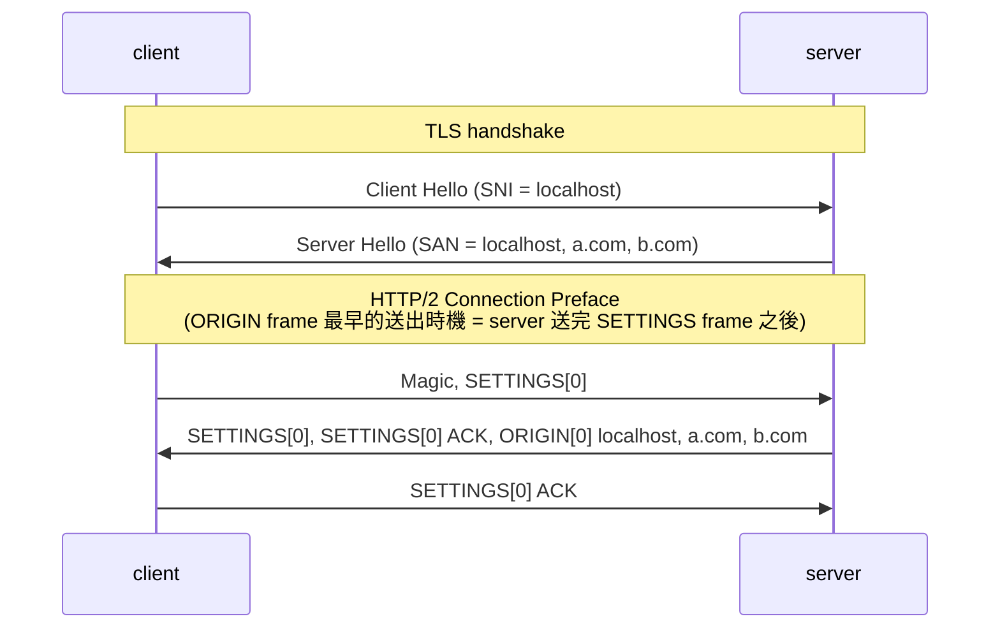

## ORIGIN frame

**概念**

- Subject Alternative Name (SAN) is an extension in digital TLS/SSL certificates that allows multiple hostnames, domain names, or IP addresses to be protected by a single certificate
- 搭配 HTTP/2 multiplexing 的機制，假設 a.com 跟 b.com 共用一個 certificate，只需要開一個 TCP/TLS 連線，就可以在多個 stream 分別請求 a.com 跟 b.com 的資源
- ORIGIN frame 扮演的角色是，讓 server 主動告知 client "我對哪些 origin 是權威性的，你可以在 request headers 帶上不同 `:authority` 來存取不同 origin 的資源"

**時序圖**



**測試步驟**

- etc/hosts
  ```
  # http2 ORIGIN frame & TLS SAN test
  127.0.0.1	yus.http2.origin.test
  127.0.0.1	xn--tj3a.xn--tj3a.xn--tj3a.test
  ```
- [mkcert](../http/strict-transport-security.md#mkcert-建立本機-ca)
  ```
  mkcert -key-file private-key.pem -cert-file cert.pem localhost yus.http2.origin.test xn--tj3a.xn--tj3a.xn--tj3a.test
  ```
- server

  ```js
  const http2SecureServer = http2.createSecureServer({
    origins: [
      "https://localhost:5000",
      "https://yus.http2.origin.test:5000",
      "https://xn--tj3a.xn--tj3a.xn--tj3a.test:5000", // https://貓.貓.貓.test:5000
    ],
    key: readFileSync(join(import.meta.dirname, "private-key.pem")),
    cert: readFileSync(join(import.meta.dirname, "cert.pem")),
  });
  http2SecureServer.on("stream", (stream, headers) => {
    console.log(headers[":authority"]);
    stream.end("ok");
  });
  http2SecureServer.listen(5000);
  ```

- client

  ```js
  const rootCA = readFileSync("/path-to-your/mkcert/rootCA.pem");

  const clientHttp2Session = http2.connect("https://localhost:5000", {
    ca: rootCA,
    keepAlive: false,
  });
  // 一個 TCP 連線（HTTP/2 長連線），可以透過不同 :authority 請求不同 domain 的資源
  clientHttp2Session.request({ ":authority": "localhost:5000" });
  clientHttp2Session.request({ ":authority": "yus.http2.origin.test:5000" });
  clientHttp2Session.request({
    ":authority": "xn--tj3a.xn--tj3a.xn--tj3a.test:5000",
  });
  clientHttp2Session.on("origin", (origins) => {
    console.log({ originSet: clientHttp2Session.originSet, origins });
  });
  ```

- output

  ```js
  localhost:5000
  yus.http2.origin.test:5000
  xn--tj3a.xn--tj3a.xn--tj3a.test:5000
  {
    originSet: [
      'https://localhost:5000',
      'https://yus.http2.origin.test:5000',
      'https://xn--tj3a.xn--tj3a.xn--tj3a.test:5000'
    ],
    origins: [
      'https://localhost:5000',
      'https://yus.http2.origin.test:5000',
      'https://xn--tj3a.xn--tj3a.xn--tj3a.test:5000'
    ]
  }
  ```

- Node.js 生成 tls keylog
  ```
  node --tls-keylog="./src/http2/node_tlskey.log" src/http2/index.ts
  ```
- wireshark 匯入 tls keylog（解密 TLS，才可以看到 HTTP/2 的 raw bytes）
  
- wireshark 抓 ORIGIN frame 封包
  
- wireshark 抓 Subject Alternative Name (SAN)
  

**拆解 ORIGIN frame**

server 會送以下 bytes (hex)

```
00 00 6a 0c 00 00 00 00 00 // frame header

00 16 // Origin-Len
https://localhost:5000

00 22 // Origin-Len
https://yus.http2.origin.test:5000

00 2c // Origin-Len
https://xn--tj3a.xn--tj3a.xn--tj3a.test:5000
```

- frame header

  | field                        | hex         | description                                           |
  | ---------------------------- | ----------- | ----------------------------------------------------- |
  | Length                       | 00 00 6a    | frame payload has 106 bytes                           |
  | Type                         | 0c          | ORIGIN frame (type=0x0c)                              |
  | Flags                        | 00          | unset (0x00)                                          |
  | Reserved + Stream Identifier | 00 00 00 00 | Reserved: 1-bit (0)<br/>Stream Identifier: 31-bit (0) |

- frame payload
  - 00 16 https://localhost:5000
  - 00 22 https://yus.http2.origin.test:5000
  - 00 2c https://xn--tj3a.xn--tj3a.xn--tj3a.test:5000

**Subject Alternative Name (SAN) 都已經宣告過「這張憑證合法涵蓋哪些網域」，為何還需要 ORIGIN frame？**

現代網站大量使用 Cloudflare、Akamai 等 CDN 服務。為了省資源或方便管理，CDN 常常會發放一張萬用字元憑證（Wildcard Certificate），或者在一張憑證的 SAN 裡面塞入幾十個、甚至上百個完全不同客戶的網域。

- 情境：假設 customer-A.com 和 customer-B.com 剛好被 CDN 分配到了同一張大雜燴憑證。這兩家公司在現實中毫無關係，但因為背後都是同一個 CDN 服務商，所以牠們的 DNS 都指向同一個 CDN 的 IP。
- 如果只看 SAN：當瀏覽器連到 customer-A.com 時，翻開 SAN 發現裡面也有 customer-B.com，IP 檢查也一樣。如果瀏覽器自作聰明直接把 customer-B.com 的私密請求（例如帶有 Cookie 的登入請求）透過同一條連線發過去，這會直接引發嚴重的安全性與隔離風險。
- ORIGIN frame 的解法：在連線建立時發送 ORIGIN frame，明確告訴瀏覽器：「雖然我這張憑證很大張，但這條連線此時此刻只幫 customer-A.com 服務。」直接在 L7 把這個合法的潛在風險給阻斷。

**ORIGIN frame 發送時機**

- 最佳時機：connection preface 階段，server 在 SETTINGS frame 之後接著發送
  ```js
  const http2SecureServer = http2.createSecureServer({
    origins: [
      "https://localhost:5000",
      "https://yus.http2.origin.test:5000",
      "https://xn--tj3a.xn--tj3a.xn--tj3a.test:5000", // https://貓.貓.貓.test:5000
    ],
    // ...other options
  });
  ```
- 規範上並沒有限制 ORIGIN frame 的發送時機，故 Node.js 有提供對應的 method 控制發送
  ```js
  http2SecureServer.on("session", (session) => {
    session.origin(
      "https://localhost:5000",
      "https://yus.http2.origin.test:5000",
      "https://xn--tj3a.xn--tj3a.xn--tj3a.test:5000", // https://貓.貓.貓.test:5000
    );
  });
  ```

<!-- ### ALTSVC

- https://nodejs.org/docs/latest-v24.x/api/http2.html#serverhttp2sessionaltsvcalt-originorstream
- https://nodejs.org/docs/latest-v24.x/api/http2.html#event-altsvc -->

<!-- ## CONNECT

- https://datatracker.ietf.org/doc/html/rfc8441
- https://nodejs.org/docs/latest-v24.x/api/http2.html#the-extended-connect-protocol -->

<!-- paddingStrategy -->

## 參考資料

- https://nodejs.org/docs/latest-v24.x/api/http2.html
- https://datatracker.ietf.org/doc/html/rfc8336
