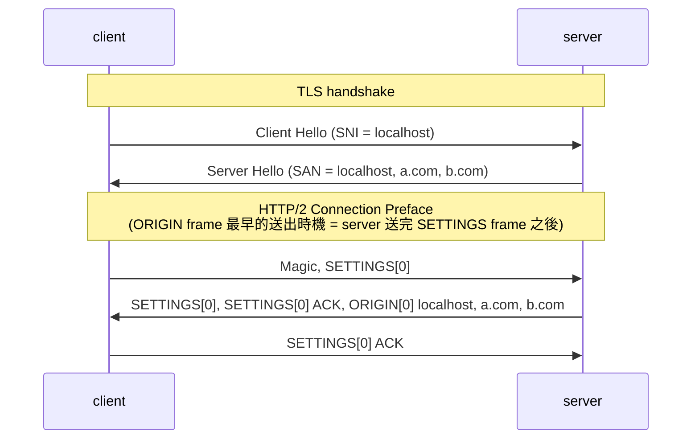
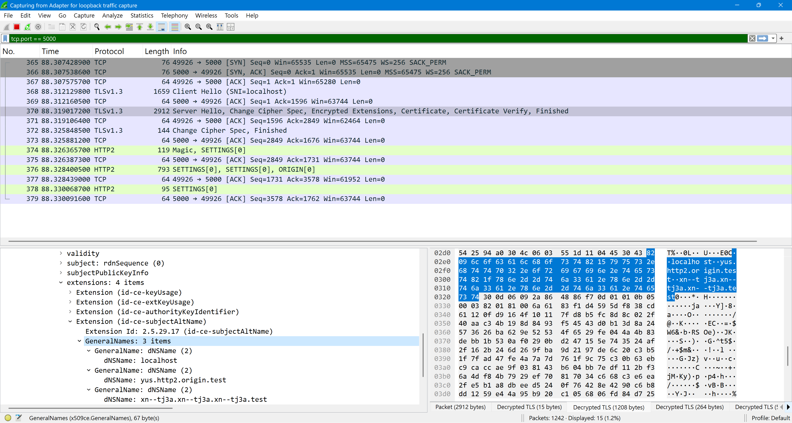
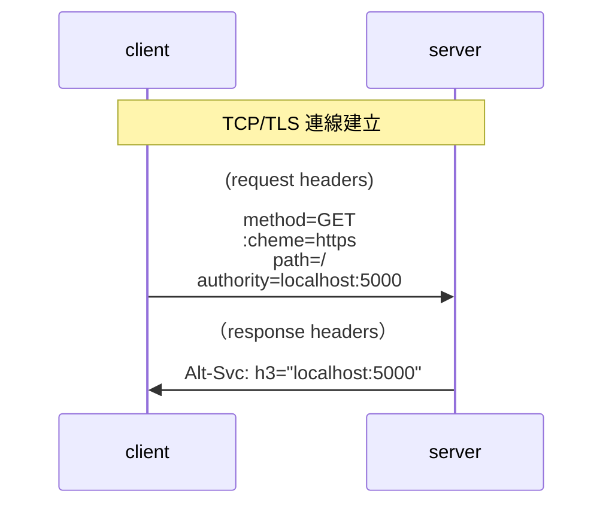
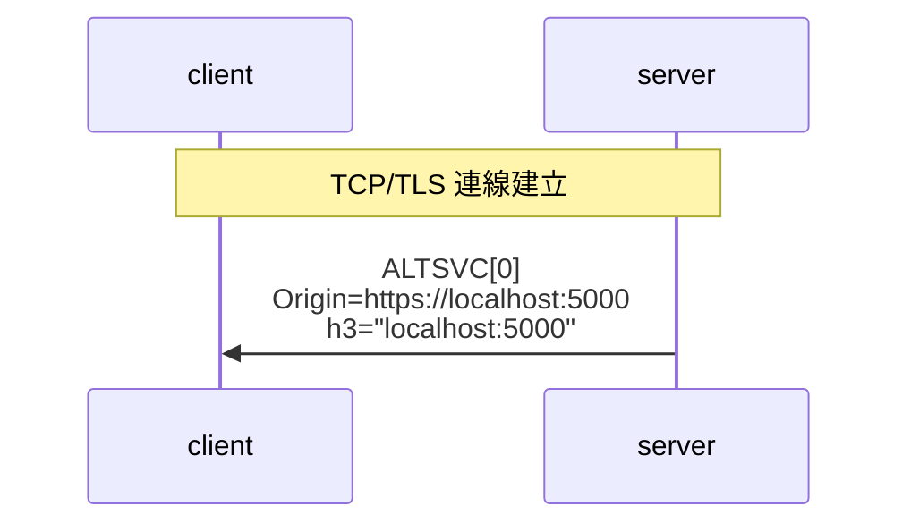
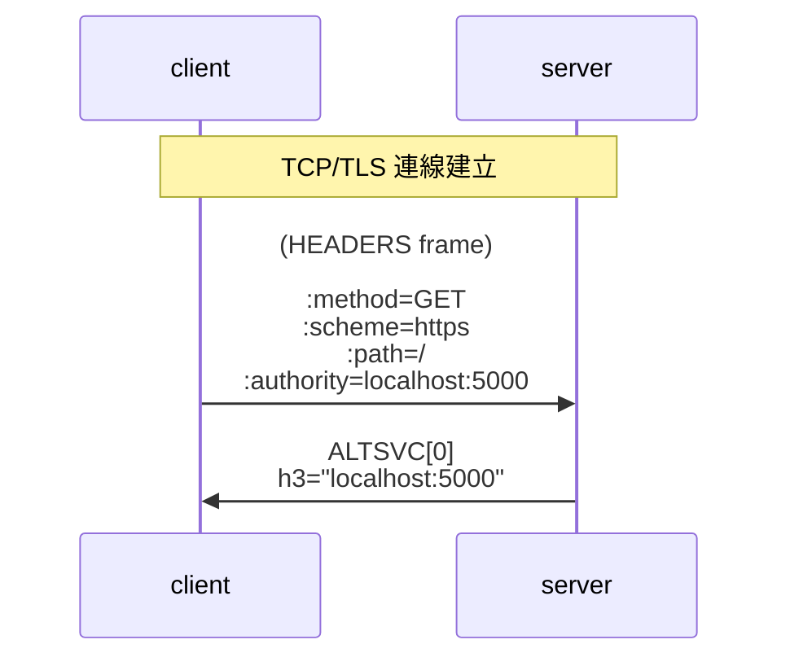

## HTTP/2 frame types overview

| Frame Type           | Description                                                          |
| -------------------- | -------------------------------------------------------------------- |
| DATA (0x00)          | carry request / response body                                        |
| HEADERS (0x01)       | carry request headers, request / response trailers                   |
| PRIORITY (0x02)      | deprecated                                                           |
| RST_STREAM (0x03)    | immediate termination of a stream                                    |
| SETTINGS (0x04)      | conveys configuration parameters                                     |
| PUSH_PROMISE (0x05)  | carry request headers that the server predicts the client might need |
| PING (0x06)          | measuring a minimal round-trip time from the sender                  |
| GOAWAY(0x07)         | initiate shutdown of a connection                                    |
| WINDOW_UPDATE (0x08) | flow control                                                         |
| CONTINUATION (0x09)  | continuation of HEADERS or PUSH_PROMISE                              |
| ALTSVC (0x0a)        | Alternative Services                                                 |
| ORIGIN (0x0b)        | indicate what origins are available on a given connection            |

## ORIGIN frame

**概念**

- Subject Alternative Name (SAN) is an extension in digital TLS/SSL certificates that allows multiple hostnames, domain names, or IP addresses to be protected by a single certificate
- 搭配 HTTP/2 multiplexing 的機制，假設 a.com 跟 b.com 共用一個 certificate，只需要開一個 TCP/TLS 連線，就可以在多個 stream 分別請求 a.com 跟 b.com 的資源
- ORIGIN frame 扮演的角色是，讓 server 主動告知 client "我對哪些 origin 是權威性的，你可以在 request headers 帶上不同 `:authority` 來存取不同 origin 的資源"

**時序圖**



**測試步驟**

- etc/hosts
  ```
  # http2 ORIGIN frame & TLS SAN test
  127.0.0.1	yus.http2.origin.test
  127.0.0.1	xn--tj3a.xn--tj3a.xn--tj3a.test
  ```
- [mkcert](../http/strict-transport-security.md#mkcert-建立本機-ca)
  ```
  mkcert -key-file private-key.pem -cert-file cert.pem localhost yus.http2.origin.test xn--tj3a.xn--tj3a.xn--tj3a.test
  ```
- server

  ```js
  const http2SecureServer = http2.createSecureServer({
    origins: [
      "https://localhost:5000",
      "https://yus.http2.origin.test:5000",
      "https://xn--tj3a.xn--tj3a.xn--tj3a.test:5000", // https://貓.貓.貓.test:5000
    ],
    key: readFileSync(join(import.meta.dirname, "private-key.pem")),
    cert: readFileSync(join(import.meta.dirname, "cert.pem")),
  });
  http2SecureServer.on("stream", (stream, headers) => {
    console.log(headers[":authority"]);
    stream.end("ok");
  });
  http2SecureServer.listen(5000);
  ```

- client

  ```js
  const rootCA = readFileSync("/path-to-your/mkcert/rootCA.pem");

  const clientHttp2Session = http2.connect("https://localhost:5000", {
    ca: rootCA,
    keepAlive: false,
  });
  // 一個 TCP 連線（HTTP/2 長連線），可以透過不同 :authority 請求不同 domain 的資源
  clientHttp2Session.request({ ":authority": "localhost:5000" });
  clientHttp2Session.request({ ":authority": "yus.http2.origin.test:5000" });
  clientHttp2Session.request({
    ":authority": "xn--tj3a.xn--tj3a.xn--tj3a.test:5000",
  });
  clientHttp2Session.on("origin", (origins) => {
    console.log({ originSet: clientHttp2Session.originSet, origins });
  });
  ```

- output

  ```js
  localhost:5000
  yus.http2.origin.test:5000
  xn--tj3a.xn--tj3a.xn--tj3a.test:5000
  {
    originSet: [
      'https://localhost:5000',
      'https://yus.http2.origin.test:5000',
      'https://xn--tj3a.xn--tj3a.xn--tj3a.test:5000'
    ],
    origins: [
      'https://localhost:5000',
      'https://yus.http2.origin.test:5000',
      'https://xn--tj3a.xn--tj3a.xn--tj3a.test:5000'
    ]
  }
  ```

- Node.js 生成 tls keylog
  ```
  node --tls-keylog="./src/http2/node_tlskey.log" src/http2/index.ts
  ```
- wireshark 匯入 tls keylog（解密 TLS，才可以看到 HTTP/2 的 raw bytes）
  
- wireshark 抓 ORIGIN frame 封包
  
- wireshark 抓 Subject Alternative Name (SAN)
  

**拆解 ORIGIN frame**

server 會送以下 bytes (hex)

```
00 00 6a 0c 00 00 00 00 00 // frame header

00 16 // Origin-Len
https://localhost:5000

00 22 // Origin-Len
https://yus.http2.origin.test:5000

00 2c // Origin-Len
https://xn--tj3a.xn--tj3a.xn--tj3a.test:5000
```

- frame header

  | field                        | hex         | description                                           |
  | ---------------------------- | ----------- | ----------------------------------------------------- |
  | Length                       | 00 00 6a    | frame payload has 106 bytes                           |
  | Type                         | 0c          | ORIGIN frame (type=0x0c)                              |
  | Flags                        | 00          | unset (0x00)                                          |
  | Reserved + Stream Identifier | 00 00 00 00 | Reserved: 1-bit (0)<br/>Stream Identifier: 31-bit (0) |

- frame payload
  - 00 16 https://localhost:5000
  - 00 22 https://yus.http2.origin.test:5000
  - 00 2c https://xn--tj3a.xn--tj3a.xn--tj3a.test:5000

**Subject Alternative Name (SAN) 都已經宣告過「這張憑證合法涵蓋哪些網域」，為何還需要 ORIGIN frame？**

現代網站大量使用 Cloudflare、Akamai 等 CDN 服務。為了省資源或方便管理，CDN 常常會發放一張萬用字元憑證（Wildcard Certificate），或者在一張憑證的 SAN 裡面塞入幾十個、甚至上百個完全不同客戶的網域。

- 情境：假設 customer-A.com 和 customer-B.com 剛好被 CDN 分配到了同一張大雜燴憑證。這兩家公司在現實中毫無關係，但因為背後都是同一個 CDN 服務商，所以牠們的 DNS 都指向同一個 CDN 的 IP。
- 如果只看 SAN：當瀏覽器連到 customer-A.com 時，翻開 SAN 發現裡面也有 customer-B.com，IP 檢查也一樣。如果瀏覽器自作聰明直接把 customer-B.com 的私密請求（例如帶有 Cookie 的登入請求）透過同一條連線發過去，這會直接引發嚴重的安全性與隔離風險。
- ORIGIN frame 的解法：在連線建立時發送 ORIGIN frame，明確告訴瀏覽器：「雖然我這張憑證很大張，但這條連線此時此刻只幫 customer-A.com 服務。」直接在 L7 把這個合法的潛在風險給阻斷。

**ORIGIN frame 發送時機**

- 最佳時機：connection preface 階段，server 在 SETTINGS frame 之後接著發送
  ```js
  const http2SecureServer = http2.createSecureServer({
    origins: [
      "https://localhost:5000",
      "https://yus.http2.origin.test:5000",
      "https://xn--tj3a.xn--tj3a.xn--tj3a.test:5000", // https://貓.貓.貓.test:5000
    ],
    // ...other options
  });
  ```
- 規範上並沒有限制 ORIGIN frame 的發送時機，故 Node.js 有提供對應的 method 控制發送
  ```js
  http2SecureServer.on("session", (session) => {
    session.origin(
      "https://localhost:5000",
      "https://yus.http2.origin.test:5000",
      "https://xn--tj3a.xn--tj3a.xn--tj3a.test:5000", // https://貓.貓.貓.test:5000
    );
  });
  ```

## ALTSVC

**概念：大部分的情境是 HTTP/2 連線要升級到 HTTP/3，server 會告知 client 其 "Alternative Services"**

**傳輸方式：可以透過 HTTP/2 ALTSVC frame 傳輸，也可以透過 "Alt-Svc" response header 傳輸**

| 傳輸方式         | streamID 狀態   | 發送時間點限制               | 核心優勢與設計目的                                |
| ---------------- | --------------- | ---------------------------- | ------------------------------------------------- |
| "Alt-Svc" header | -               | 跟著 response header 一起    | 簡單直覺，相容 HTTP/1.1                           |
| ALTSVC frame     | `streamID != 0` | 該 stream 關閉前的任何時間點 | proxy 可在中途自由插播，不影響業務邏輯            |
| ALTSVC frame     | `streamID = 0`  | 隨時                         | 連線建立後，server 不需等待任何請求，即可主動推播 |

**透過 "Alt-Svc" header 傳輸**



**透過 ALTSVC frame (streamID = 0) 傳輸**



:::info
streamID = 0 的情境，需要在 ALTSVC frame 宣告 Origin，原因如同我們在 [ORIGIN frame](#origin-frame) 提到的

customer-A.com 跟 customer-B.com 若使用同一個 CDN 服務商（共用一個 certificate）則需要宣告兩個 ALTSVC frame

1. ALTSVC[0] Origin=https://customer-A.com h3="customer-A.com:443"
2. ALTSVC[0] Origin=https://customer-B.com h3="customer-A.com:443"

避免使用者訪問 customer-A.com 的時候，卻連線到 customer-B.com，反之亦然
:::

**透過 ALTSVC frame (streamID != 0) 傳輸**



:::info
比起透過 "Alt-Svc" header 傳輸，透過 ALTSVC frame 傳輸的好處是：

**可以由中間層（CDN, proxy）先回，不需要等待 Origin Server 的 HEADERS frame**
:::

**程式範例（Node.js 語法展示 + 解析 raw bytes）**

- server
  ```js
  const http2Server = http2.createServer();
  http2Server.on("session", (session) => {
    // 如果 client 連到的是 http://localhost:5000 的話
    // server 有 h3="localhost:5000" 可以連！
    session.altsvc('h3="localhost:5000"', "http://localhost:5000");
  });
  http2Server.on("stream", (stream, headers) => {
    assert(stream.session);
    // 如果 client 連到的是 http://yus.http2.origin.test:5000 的話
    // server 有 h3="yus.http2.origin.test:5000" 可以連！
    stream.session.altsvc(`h3="${headers[":authority"]}"`, stream.id);
  });
  http2Server.listen(5000);
  ```
- client
  ```js
  const clientHttp2Session = http2.connect("http://localhost:5000");
  const clientHttp2Stream = clientHttp2Session.request({
    ":authority": "yus.http2.origin.test:5000",
  });
  clientHttp2Session.on("altsvc", (alt, origin, stream) =>
    console.log({ alt, origin, stream }),
  );
  ```
- client output
  ```js
  {
    alt: 'h3="localhost:5000"',
    origin: 'http://localhost:5000',
    stream: 0
  }
  { alt: 'h3="yus.http2.origin.test:5000"', origin: '', stream: 1 }
  ```

**wireshark 抓 ALTSVC[0] frame**

```
00 00 2a 0a 00 00 00 00 00                                     // frame header

// frame payload
00 15                                                          // Origin-Len
68 74 74 70 3a 2f 2f 6c 6f 63 61 6c 68 6f 73 74 3a 35 30 30 30 // Origin
68 33 3d 22 6c 6f 63 61 6c 68 6f 73 74 3a 35 30 30 30 22       // Alt-Svc-Field-Value
```

- frame header

  | field                        | hex         | description                                           |
  | ---------------------------- | ----------- | ----------------------------------------------------- |
  | Length                       | 00 00 2a    | frame payload has 42 bytes                            |
  | Type                         | 0a          | ALTSVC frame (type=0x0a)                              |
  | Flags                        | 00          | unset (0x00)                                          |
  | Reserved + Stream Identifier | 00 00 00 00 | Reserved: 1-bit (0)<br/>Stream Identifier: 31-bit (0) |

- frame payload

  | field               | hex             | Description           |
  | ------------------- | --------------- | --------------------- |
  | Origin-Len          | 00 15           | Origin has 21 bytes   |
  | Origin              | 68 74 ... 30 30 | http://localhost:5000 |
  | Alt-Svc-Field-Value | 68 33 ... 30 22 | h3="localhost:5000"   |

**wireshark 抓 ALTSVC[1] frame**

```
00 00 21 0a 00 00 00 00 01 // frame header

// frame payload
00 00                                                                                        // Origin-Len
68 33 3d 22 79 75 73 2e 68 74 74 70 32 2e 6f 72 69 67 69 6e 2e 74 65 73 74 3a 35 30 30 30 22 // Alt-Svc-Field-Value
```

- frame header

  | field                        | hex         | description                                           |
  | ---------------------------- | ----------- | ----------------------------------------------------- |
  | Length                       | 00 00 21    | frame payload has 33 bytes                            |
  | Type                         | 0a          | ALTSVC frame (type=0x0a)                              |
  | Flags                        | 00          | unset (0x00)                                          |
  | Reserved + Stream Identifier | 00 00 00 01 | Reserved: 1-bit (0)<br/>Stream Identifier: 31-bit (1) |

- frame payload

  | field               | hex             | Description                     |
  | ------------------- | --------------- | ------------------------------- |
  | Origin-Len          | 00 00           | Origin has 0 byte               |
  | Origin              | -               | -                               |
  | Alt-Svc-Field-Value | 68 33 ... 30 22 | h3="yus.http2.origin.test:5000" |

**程式範例（實測 firefox 真的會用 UDP 開啟 h3 連線）**

- https server
  ```js
  const http2Server = http2.createSecureServer({
    // 沿用在 ORIGIN frame 那邊建立好的憑證
    key: readFileSync(join(import.meta.dirname, "private-key.pem")),
    cert: readFileSync(join(import.meta.dirname, "cert.pem")),
  });
  http2Server.on("session", (session) => {
    // 如果 client 連到的是 https://localhost:5000 的話
    // server 有 h3="localhost:5000" 可以連！
    session.altsvc('h3="localhost:5000"; ma=1', "https://localhost:5000");
  });
  http2Server.on("stream", (stream, headers) => {
    stream.end(headers[":authority"]);
  });
  ```
- udp dummy server
  ```js
  const udpServer = dgram.createSocket("udp4");
  udpServer.on("message", (msg, rinfo) => console.log({ msg, rinfo }));
  udpServer.bind(5000);
  ```
- firefox 瀏覽器訪問 https://localhost:5000
- udp dummy server output
  ```js
  {
    msg: <Buffer c8 00 00 ...>,
    rinfo: { address: '127.0.0.1', family: 'IPv4', port: 53698, size: 1252 }
  }
  ```

:::info
Chrome 在本機 rootCA 的限制比較嚴格，不一定會真的去連 h3="localhost:5000"

實測 Firefox 151.0.3 沒有這麼嚴格的限制，可以真的去連 h3="localhost:5000"
:::

## 參考資料

- https://nodejs.org/docs/latest-v24.x/api/http2.html
- https://datatracker.ietf.org/doc/html/rfc7838
- https://datatracker.ietf.org/doc/html/rfc8336
- https://datatracker.ietf.org/doc/html/rfc9113
