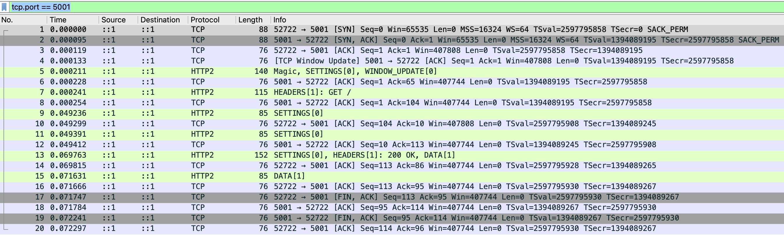
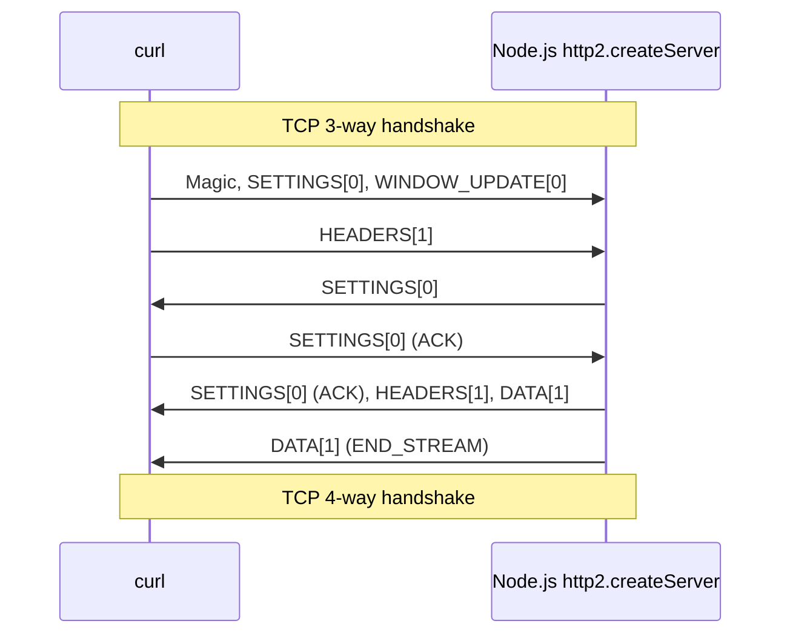
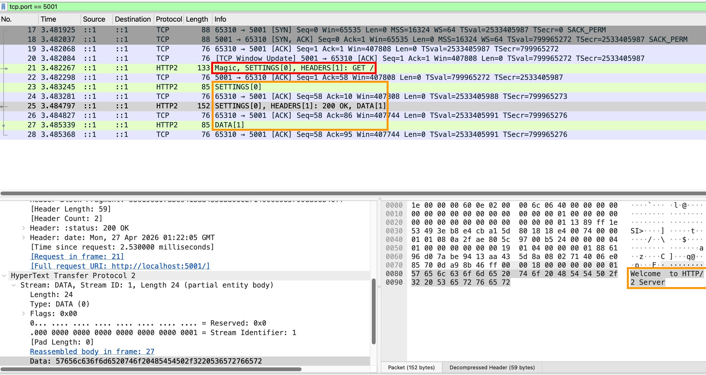

## 目標

1. 參考 [RFC 9113](https://datatracker.ietf.org/doc/html/rfc9113)，拆解 HTTP/2 raw bytes
2. 用 Node.js `net.Socket` 手搓 HTTP/2 raw bytes (client side)

## 環境架設

- 用 Node.js 架一個 `http2.Http2Server`

  ```js
  const http2Server = http2.createServer((req, res) => {
    res.end("Welcome to HTTP/2 Server"),
  });
  http2Server.listen(5001);
  ```

- `curl --http2-prior-knowledge http://localhost:5001`

## wireshark 抓包



## 循序圖



## Step 1: Magic (Connection Preface)

[Section 3.4. HTTP/2 Connection Preface](https://datatracker.ietf.org/doc/html/rfc9113#section-3.4)

- client 會送 `PRI * HTTP/2.0\r\n\r\nSM\r\n\r\n`
- 原因：確保 HTTP/1.x server 將其視為 invalid request，進一步關閉連線

## Step 2: SETTINGS frame (Connection Preface)

- [Section 3.4. HTTP/2 Connection Preface](https://datatracker.ietf.org/doc/html/rfc9113#section-3.4)
- [Section 4.1. Frame Format](https://datatracker.ietf.org/doc/html/rfc9113#section-4.1)
- [Section 5.1.1. Stream Identifiers](https://datatracker.ietf.org/doc/html/rfc9113#section-5.1.1)
- [Section 6.5. SETTINGS](https://datatracker.ietf.org/doc/html/rfc9113#section-6.5)
- [Section 6.5.1. SETTINGS Format](https://datatracker.ietf.org/doc/html/rfc9113#section-6.5.1)
- [Section 6.5.2. Defined Settings](https://datatracker.ietf.org/doc/html/rfc9113#section-6.5.2)

client 會送以下 bytes (hex)

```
00 00 12 04 00 00 00 00 00 // frame header
00 03 00 00 00 64          // frame payload
00 04 00 a0 00 00          // frame payload
00 02 00 00 00 00          // frame payload
```

- frame header

  | field                        | hex         | description                                           |
  | ---------------------------- | ----------- | ----------------------------------------------------- |
  | Length                       | 00 00 12    | frame payload has 18 bytes                            |
  | Type                         | 04          | SETTINGS frame (type=0x04)                            |
  | Flags                        | 00          | unset (0x00)                                          |
  | Reserved + Stream Identifier | 00 00 00 00 | Reserved: 1-bit (0)<br/>Stream Identifier: 31-bit (0) |

- frame payload（參考 [Defined Settings](#section-652-defined-settings)）

  | hex               | Description                           |
  | ----------------- | ------------------------------------- |
  | 00 03 00 00 00 64 | SETTINGS_MAX_CONCURRENT_STREAMS = 100 |
  | 00 04 00 a0 00 00 | SETTINGS_INITIAL_WINDOW_SIZE = 10 MiB |
  | 00 02 00 00 00 00 | SETTINGS_ENABLE_PUSH = false          |

## Step 3: WINDOW_UPDATE frame

[Section 6.9. WINDOW_UPDATE](https://datatracker.ietf.org/doc/html/rfc9113#section-6.9)

client 會送以下 bytes (hex)

```
00 00 04 08 00 00 00 00 00 // frame header
3e 7f 00 01                // frame payload
```

- frame header

  | field                        | hex         | description                                           |
  | ---------------------------- | ----------- | ----------------------------------------------------- |
  | Length                       | 00 00 04    | frame payload has 4 bytes                             |
  | Type                         | 08          | WINDOW_UPDATE frame (type=0x08)                       |
  | Flags                        | 00          | unset (0x00)                                          |
  | Reserved + Stream Identifier | 00 00 00 00 | Reserved: 1-bit (0)<br/>Stream Identifier: 31-bit (0) |

- frame payload

  | field                            | hex         | description                                                           |
  | -------------------------------- | ----------- | --------------------------------------------------------------------- |
  | Reserved + Window Size Increment | 3e 7f 00 01 | Reserved: 1-bit (0)<br/>Window Size Increment: 31-bit (1,048,510,465) |

  :::info
  1,048,510,465 + connection flow-control window (default 65,535) = 1000 MiB
  :::

## Step 4: HEADERS frame

client 會送以下 bytes (hex)

```
00 00 1e 01 05 00 00 00 01                                                                // frame header
82 86 41 8a a0 e4 1d 13 9d 09 b8 d8 00 1f 84 7a 88 25 b6 50 c3 cb ba b8 7f 53 03 2a 2f 2a // frame payload
```

- frame header

  | field                        | hex         | description                                           |
  | ---------------------------- | ----------- | ----------------------------------------------------- |
  | Length                       | 00 00 1e    | frame payload has 30 bytes                            |
  | Type                         | 01          | HEADERS frame (type=0x01)                             |
  | Flags                        | 05          | END_STREAM + END_HEADERS                              |
  | Reserved + Stream Identifier | 00 00 00 01 | Reserved: 1-bit (0)<br/>Stream Identifier: 31-bit (1) |

- frame payload

  `82 86 41 8a a0 e4 1d 13 9d 09 b8 d8 00 1f 84 7a 88 25 b6 50 c3 cb ba b8 7f 53 03 2a 2f 2a` (HPACK)

## Step 5: SETTINGS frame (Connection Preface)

[Section 3.4. HTTP/2 Connection Preface](https://datatracker.ietf.org/doc/html/rfc9113#section-3.4)

server 會送以下 bytes (hex)

```
00 00 00 04 00 00 00 00 00 // frame header
```

| field                        | hex         | description                                           |
| ---------------------------- | ----------- | ----------------------------------------------------- |
| Length                       | 00 00 00    | frame payload has 0 bytes                             |
| Type                         | 04          | SETTINGS frame (type=0x04)                            |
| Flags                        | 00          | unset (0x00)                                          |
| Reserved + Stream Identifier | 00 00 00 00 | Reserved: 1-bit (0)<br/>Stream Identifier: 31-bit (0) |

代表 server 沒有要修改任何設定

## Step 6: SETTINGS frame (client ACK)

[Section 6.5. SETTINGS](https://datatracker.ietf.org/doc/html/rfc9113#section-6.5)

client 會送以下 bytes (hex)

```
00 00 00 04 01 00 00 00 00
```

| field                        | hex         | description                                           |
| ---------------------------- | ----------- | ----------------------------------------------------- |
| Length                       | 00 00 00    | frame payload has 0 bytes                             |
| Type                         | 04          | SETTINGS frame (type=0x04)                            |
| Flags                        | 01          | ACK flag                                              |
| Reserved + Stream Identifier | 00 00 00 00 | Reserved: 1-bit (0)<br/>Stream Identifier: 31-bit (0) |

代表 client 收到 [Step 5: server 的 SETTINGS frame](#step-5-settings-frame-connection-preface) 了

## Step 6: SETTINGS frame (server ACK)

server 會送以下 bytes (hex)

```
00 00 00 04 01 00 00 00 00
```

| field                        | hex         | description                                           |
| ---------------------------- | ----------- | ----------------------------------------------------- |
| Length                       | 00 00 00    | frame payload has 0 bytes                             |
| Type                         | 04          | SETTINGS frame (type=0x04)                            |
| Flags                        | 01          | ACK flag                                              |
| Reserved + Stream Identifier | 00 00 00 00 | Reserved: 1-bit (0)<br/>Stream Identifier: 31-bit (0) |

代表 server 收到 [Step 2: client 的 SETTINGS frame](#step-2-settings-frame-connection-preface) 了

## Step 7: HEADERS frame

server 會送以下 bytes (hex)

```
00 00 19 01 04 00 00 00 01                                                 // frame header
88 61 96 d0 7a be 94 10 14 86 bb 14 10 04 e2 80 7a e0 1f b8 db 4a 62 d1 bf // frame payload
```

- frame header

  | field                        | hex         | description                                           |
  | ---------------------------- | ----------- | ----------------------------------------------------- |
  | Length                       | 00 00 19    | frame payload has 25 bytes                            |
  | Type                         | 01          | HEADERS frame (type=0x01)                             |
  | Flags                        | 04          | END_HEADERS                                           |
  | Reserved + Stream Identifier | 00 00 00 01 | Reserved: 1-bit (0)<br/>Stream Identifier: 31-bit (1) |

- frame payload

  `88 61 96 d0 7a be 94 10 14 86 bb 14 10 04 e2 80 15 c6 83 70 0e 29 8b 46 ff` (HPACK)

## Step 8: server send DATA frame

server 會送以下 bytes (hex)

```
00 00 18 00 00 00 00 00 01                                               // frame header
57 65 6c 63 6f 6d 65 20 74 6f 20 48 54 54 50 2f 32 20 53 65 72 76 65 72  // frame payload
```

- frame header

  | field                        | hex         | description                                                         |
  | ---------------------------- | ----------- | ------------------------------------------------------------------- |
  | Length                       | 00 00 18    | frame payload has 24 bytes                                          |
  | Type                         | 00          | DATA frame (type=0x00)                                              |
  | Flags                        | 00          | unset (0x00)                                                        |
  | Reserved + Stream Identifier | 00 00 00 01 | Reserved: 1-bit field (0)<br/>Stream Identifier: 31-bit integer (1) |

- frame payload

  `57 65 6c 63 6f 6d 65 20 74 6f 20 48 54 54 50 2f 32 20 53 65 72 76 65 72` = Welcome to HTTP/2 Server

## Step 9: server send DATA frame (END_STREAM)

server 會送以下 bytes (hex)

```
00 00 00 00 01 00 00 00 01 // frame header
```

| field                        | hex         | description                                                         |
| ---------------------------- | ----------- | ------------------------------------------------------------------- |
| Length                       | 00 00 00    | frame payload has 0 bytes                                           |
| Type                         | 00          | DATA frame (type=0x00)                                              |
| Flags                        | 01          | END_STREAM                                                          |
| Reserved + Stream Identifier | 00 00 00 01 | Reserved: 1-bit field (0)<br/>Stream Identifier: 31-bit integer (1) |

代表 stream ID = 1 的 request / response 已經傳輸完成，進入 [half-closed 或 closed state](https://datatracker.ietf.org/doc/html/rfc9113#section-5.1)

## Section 6.5.2 Defined Settings

https://datatracker.ietf.org/doc/html/rfc9113#section-6.5.2

| Defined Settings                | hex   | Description                               |
| ------------------------------- | ----- | ----------------------------------------- |
| SETTINGS_HEADER_TABLE_SIZE      | 00 01 | -                                         |
| SETTINGS_ENABLE_PUSH            | 00 02 | server push                               |
| SETTINGS_MAX_CONCURRENT_STREAMS | 00 03 | -                                         |
| SETTINGS_INITIAL_WINDOW_SIZE    | 00 04 | stream-level flow control, max = 2^31 - 1 |
| SETTINGS_MAX_FRAME_SIZE         | 00 05 | frame payload, max = 2^24 - 1             |
| SETTINGS_MAX_HEADER_LIST_SIZE   | 00 06 | -                                         |

## Node.js `net.Socket` 手搓 HTTP/2 raw bytes

**Why？**

- 要測試 HTTP/2 的 RFC 跟實作差異，就必須學習手搓 HTTP/2 raw bytes
- 使用封裝好的 HTTP/2 的 client, server 套件、模組，無法精準控制送出的 raw bytes
  :::info
  套件送出的 HTTP/2 frame 基本上都會盡可能符合 RFC，無法測試 edge case

  例如要測試 `Transfer-Encoding` + `Content-Length` 的組合，套件可能會把 TE 移除，並且把 CL 改成正確的值
  :::

### 安裝 nghttp2 HPACK tools

**為何要安裝 [nghttp2](https://github.com/nghttp2/nghttp2)？**

1. Node.js http2 模組底層使用 [nghttp2](https://github.com/nghttp2/nghttp2)
2. 將 [HPACK](https://datatracker.ietf.org/doc/html/rfc7541) 外包給 [nghttp2](https://github.com/nghttp2/nghttp2)，其餘 frame types 自己組

**Mac 安裝 nghttp2 HPACK tools 步驟：**

1. 到 [releases](https://github.com/nghttp2/nghttp2/releases) 頁面下載 package，我個人是選擇 `nghttp2-1.69.0.tar.gz`
2. `gunzip nghttp2-1.69.0.tar.gz`
3. `cd nghttp2-1.69.0`
4. `brew install jansson`（[README](https://github.com/nghttp2/nghttp2) 說 HPACK tools 需要裝這個）
5. `make -j8`（j = job）

**Windows 安裝 nghttp2 HPACK tools 步驟：**

<!-- todo-yus -->

### CLI 測試 `deflatehd`

**終端機輸入**

```
./src/deflatehd -t <<'EOF'
:method: GET
:scheme: https
:path: /
:authority: example.com

EOF
```

- [deflatehd](https://github.com/nghttp2/nghttp2#deflatehd---header-compressor) = deflate header
- `-t` 參數，讓我們可以用類似 HTTP/1.1 的格式宣告 HTTP/2 headers
- `<<'EOF'`：接下來的多行文字，原樣當 stdin 餵給它
- `EOF`：結尾

**預期輸出**

```
{
  "cases":
  [
{
  "seq": 0,
  "input_length": 49,
  "output_length": 13,
  "percentage_of_original_size": 26.53061224489796,
  "wire": "82878441882f91d35d055c87a7",
  "headers": [
    {
      ":method": "GET"
    },
    {
      ":scheme": "https"
    },
    {
      ":path": "/"
    },
    {
      ":authority": "example.com"
    }
  ],
  "header_table_size": 4096
}
  ]
}
Overall: input=49 output=13 ratio=0.27
```

### Node.js + CLI 串接 `deflatehd`

**使用 `spawnSync` 開啟一個同步的 child process 來執行 `deflatehd`**

```js
import { spawnSync } from "child_process";

const pathToDeflatehd = "/path-to-your/nghttp2-1.69.0/src/deflatehd";
const spawnSyncReturns = spawnSync(pathToDeflatehd, ["-t"], {
  input: [
    ":method: GET",
    ":scheme: http",
    ":path: /",
    ":authority: localhost:5001",
    "",
    "",
  ].join("\n"),
  encoding: "utf8",
});
const result = JSON.parse(spawnSyncReturns.stdout);
// {
//   cases: [
//     {
//       seq: 0,
//       input_length: 51,
//       output_length: 15,
//       percentage_of_original_size: 29.411764705882355,
//       wire: '828684418aa0e41d139d09b8d8001f',
//       headers: [
//         { ':method': 'GET' },
//         { ':scheme': 'http' },
//         { ':path': '/' },
//         { ':authority': 'localhost:5001' }
//       ],
//       header_table_size: 4096
//     }
//   ]
// }
```

**其中 `result.cases[0].wire` 就是我們要的 HPACKED raw bytes (HEADERS frame payload)**

### 最終程式碼

**接續上面的 `result`，接著開始組其他 HTTP/2 frames**

```js
const bufferMagic = Buffer.from("PRI * HTTP/2.0\r\n\r\nSM\r\n\r\n", "latin1");
const bufferEmptySettingsFrame = Buffer.from(
  "00 00 00 04 00 00 00 00 00".replaceAll(" ", ""),
  "hex",
);
// 計算 HEADERS frame payload length，轉成 3 bytes 的 HEX 格式
const bufferHeadersFramePayloadLength3Bytes = Buffer.alloc(3);
bufferHeadersFramePayloadLength3Bytes.writeUintBE(
  Buffer.from(result.cases[0].wire, "hex").byteLength,
  0,
  3,
);
const bufferHeadersFrame = Buffer.concat([
  bufferHeadersFramePayloadLength3Bytes,
  Buffer.from(
    `01 05 00 00 00 01 ${result.cases[0].wire}`.replaceAll(" ", ""),
    "hex",
  ),
]);

const frames = Buffer.concat([
  bufferMagic,
  bufferEmptySettingsFrame,
  bufferHeadersFrame,
]);
const socket = connect({ host: "localhost", port: 5001 });
socket.write(frames);
```

**使用 Wireshark 抓 HTTP server 回應的 response（有正確回應）**



## 小結

這篇文章涵蓋的是基本情境（一個 HTTP/2 round trip）。實際上 HTTP/2 還有其他 frame types，會在下一篇文章介紹到
