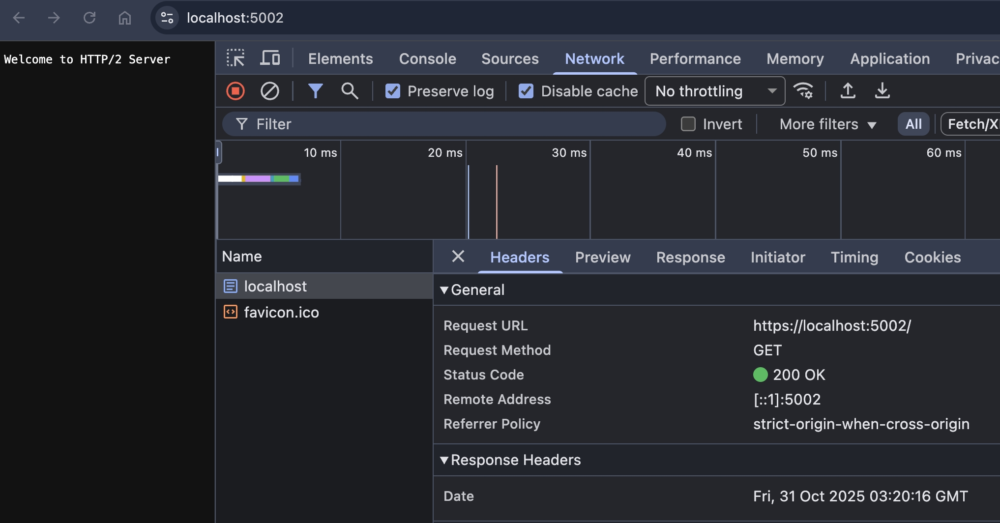
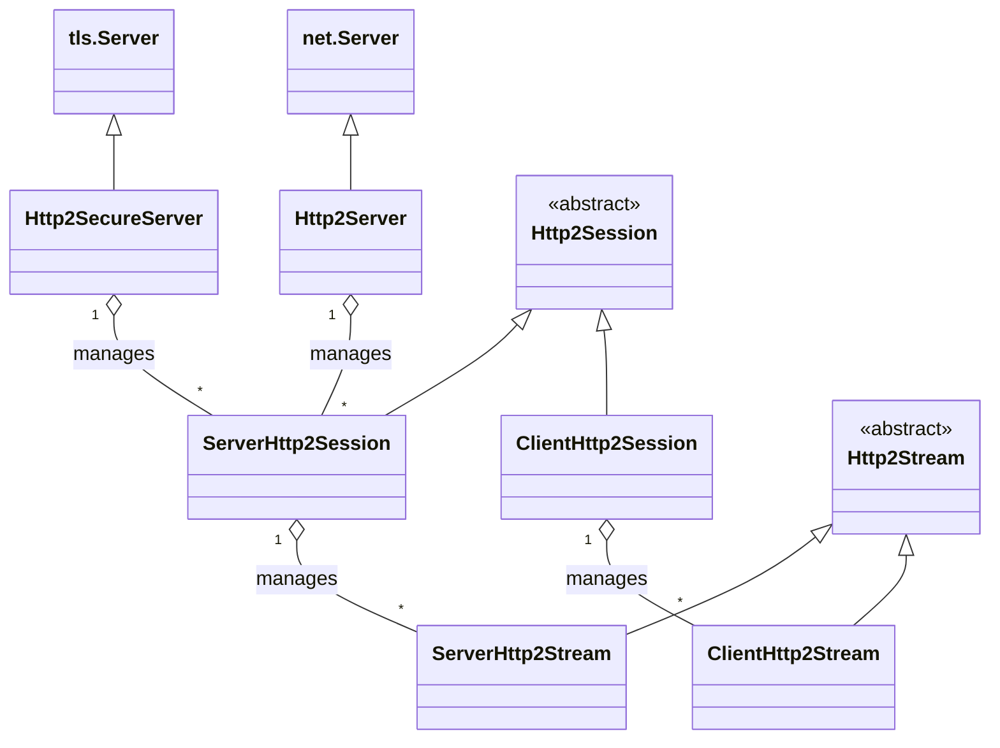
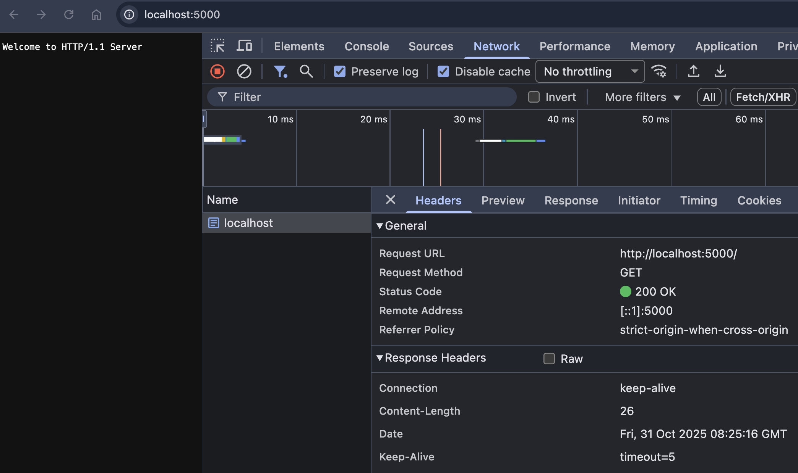
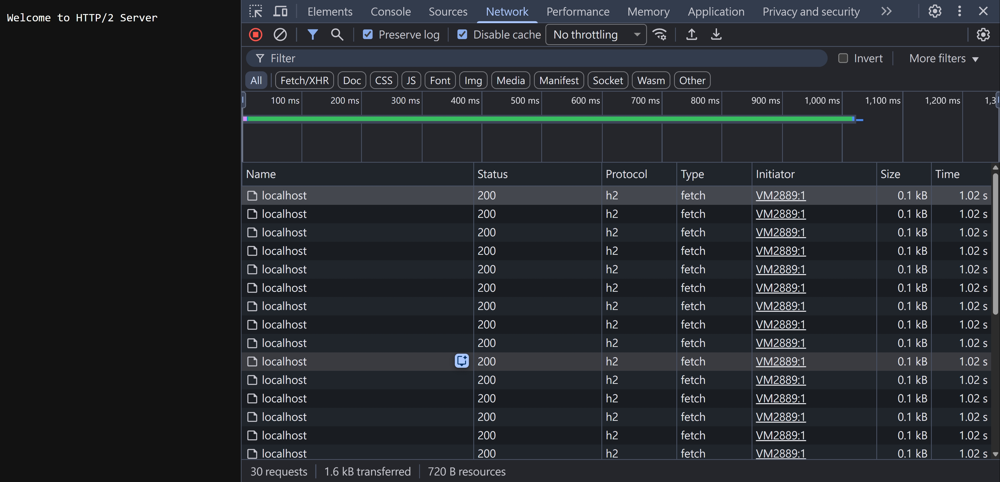

## 前言

2025 iThome 鐵人賽，我發表了 30 篇 [Learn HTTP With JS](https://ithelp.ithome.com.tw/users/20155705/ironman/8162) 系列文。時隔兩個月，為了打 portSwigger [Race conditions](https://portswigger.net/web-security/all-labs#race-conditions) 跟 [HTTP request smuggling](https://portswigger.net/web-security/all-labs#http-request-smuggling) 的 Labs，我打算先把 HTTP2 的基本知識補齊，所以又開始寫 HTTP 系列文啦～

## HTTP2 Over HTTPS

### NodeJS http2.createServer

在開始寫這篇文章前，我就有依稀記得 HTTP2 不支援 Over HTTP，如果細看 NodeJS HTTP2 Module 的話，可以看到主流瀏覽器都不支援 HTTP2 Over HTTP

```js
/**
 * Returns a `net.Server` instance that creates and manages `Http2Session` instances.
 *
 * Since there are no browsers known that support [unencrypted HTTP/2](https://http2.github.io/faq/#does-http2-require-encryption), the use of {@link createSecureServer} is necessary when
 * communicating
 * with browser clients.
 */
export function createServer(
    onRequestHandler?: (request: Http2ServerRequest, response: Http2ServerResponse) => void,
): Http2Server;
```

### Starting HTTP/2 for "http" URIs

回到 2015 年的 [RFC7540 #section-3.2](https://datatracker.ietf.org/doc/html/rfc7540#section-3.2)，有說到 HTTP2 Over HTTP 的協商機制

```
A client that makes a request for an "http" URI without prior knowledge about support for HTTP/2 on the next hop uses the HTTP Upgrade mechanism.
```

具體來說，client 會構造

```
GET / HTTP/1.1
Host: server.example.com
Connection: Upgrade, HTTP2-Settings
Upgrade: h2c
HTTP2-Settings: <base64url encoding of HTTP/2 SETTINGS payload>
```

其中 h2c 代表 HTTP/2 over cleartext TCP

Server 若不支援，則回傳

```
HTTP/1.1 200 OK
```

Server 若支援，則回傳

```
HTTP/1.1 101 Switching Protocols
Connection: Upgrade
Upgrade: h2c
```

### HTTP/2 for "http" URIs has been deprecated

看起來很美好，但實務上支援的 Server 並不多，畢竟各大瀏覽器廠商都說只支援 HTTP2 Over HTTPS，那這樣的場景自然就不需要實作。並且在 HTTP2 最新的 [RFC 9113 #section-3.1](https://datatracker.ietf.org/doc/html/rfc9113#section-3.1) 有提到這個機制已被棄用

```
The "h2c" string was previously used as a token for use in the HTTP Upgrade mechanism's Upgrade header field (Section 7.8 of [HTTP]). This usage was never widely deployed and is deprecated by this document. The same applies to the HTTP2-Settings header field, which was used with the upgrade to "h2c".
```

### firefox does not implement h2c

根據 [bugzilla](https://bugzilla.mozilla.org/show_bug.cgi?id=1418832) 在 2017 年的某則討論，裡面就有明確說到不實作 h2c 的原因，參考 [comment 7](https://bugzilla.mozilla.org/show_bug.cgi?id=1418832#c7)

在 client 跟 HTTP/2 Server 中間可能會有很多 transparent proxies 只支援 HTTP/1.0, HTTP/1.1，並且會攔截/修改 HTTP 流量。這些 transparent proxies 遇到 HTTPS 就會直接轉發，遇到 h2c 可能會導致解析失敗，所以讓 HTTP/2 for "https" 算是一種向後兼容的作法

### curl as h2c client

雖說支援 h2c 的 Server 並不多，但還是可以玩看看 h2c client 是怎麼發送 HTTP Request 的

架一個簡單的 NodeJS HTTP/1.1 Server

```ts
import { createServer } from "http";
const httpServer = createServer().listen(5000);

httpServer.on("request", (req, res) => {
  console.log(req.headers);
  res.end("Welcome to HTTP/1.1 Server");
});
```

終端機輸入

```
curl --http2 http://localhost:5000
```

Server 會看到

```js
{
  host: 'localhost:5000',
  'user-agent': 'curl/8.7.1',
  accept: '*/*',
  connection: 'Upgrade, HTTP2-Settings',
  upgrade: 'h2c',
  'http2-settings': 'AAMAAABkAAQAoAAAAAIAAAAA'
}
```

接下來就是要做協議的轉換，不過我暫時找不到有實作 HTTP/1.1 => HTTP/2 的 npm library

## NodeJS HTTP2 Server

### HTTP2 Over HTTP

最小 PoC

```ts
import http2 from "http2";

const http2Server = http2.createServer();
http2Server.on("request", (req, res) => {
  console.log(req.headers);
  res.end("Welcome to HTTP/2 Server");
});
```

一樣用 curl，有支援 HTTP2 Over HTTP 的 Client

```
curl --http2-prior-knowledge http://localhost:5001
```

Server 會看到

```js
[Object: null prototype] {
  ':method': 'GET',
  ':scheme': 'http',
  ':authority': 'localhost:5001',
  ':path': '/',
  'user-agent': 'curl/8.7.1',
  accept: '*/*',
  [Symbol(sensitiveHeaders)]: []
}
```

所謂的 `--http2-prior-knowledge`，就是直接跳過協商步驟，Client 假定 Server 有支援 HTTP2，直接發送 HTTP2 的請求

```
curl --help all

--http2-prior-knowledge         Use HTTP 2 without HTTP/1.1 Upgrade
```

### HTTP2 Over HTTPS

根據之前寫的文章 [Strict-Transport-Security # mkcert 建立本機 CA](./strict-transport-security.md#mkcert-建立本機-ca)，建立好憑證

最小 PoC

```ts
import { readFileSync } from "fs";
import http2 from "http2";
import { join } from "path";

const https2Server = http2.createSecureServer({
  key: readFileSync(join(__dirname, "private-key.pem")),
  cert: readFileSync(join(__dirname, "cert.pem")),
});
https2Server.on("request", (req, res) => {
  console.log(req.headers);
  res.end("Welcome to HTTP/2 Server");
});
https2Server.listen(5002);
```

瀏覽器訪問 https://localhost:5002/


## Request Pseudo-header

在 [RFC 9113 #section-8.3](https://datatracker.ietf.org/doc/html/rfc9113#section-8.3) 有提到 Pseudo-header，也就是我們上面看到的

```js
{
  ':method': 'GET',
  ':scheme': 'http',
  ':authority': 'localhost:5001',
  ':path': '/',
}
```

這四個 Request Pseudo Headers，剛好可以構成完整的 URI

## Response Pseudo-header

根據 [RFC 9113 #section-8.3.2](https://datatracker.ietf.org/doc/html/rfc9113#section-8.3.2) 的定義，目前 Response Pseudo-header 只有 `:status`

curl 讀出來的 Response Headers 感覺有經過整理，符合我們平常愛看的 HTTP/1.1 格式

```
curl --http2-prior-knowledge -i "http://localhost:5001/hello/world?test=123"
HTTP/2 200
date: Fri, 31 Oct 2025 02:26:02 GMT

Welcome to HTTP/2 Server
```

改用 NodeJS HTTP2

```ts
const clientHttp2Server = http2.connect("http://localhost:5001");
clientHttp2Server
  .request({
    [http2.constants.HTTP2_HEADER_PATH]: "/hello/world?test=123",
    [http2.constants.HTTP2_HEADER_METHOD]: "POST",
  })
  .end()
  .on("response", console.log)
  .on("error", console.log);
```

Server 會看到

```js
[Object: null prototype] {
  ':status': 200,
  date: 'Fri, 31 Oct 2025 02:24:00 GMT',
  [Symbol(sensitiveHeaders)]: []
}
```

## `:authority` vs `host`

HTTP/1.1，完整的 URI 其實被分散在 startline 跟 headers

```
GET /hello/world?test=123
Host: example.com
```

HTTP/2 重新設計了這個架構，變成 [Request Pseudo-header](#request-pseudo-header)

並且在 [RFC 9113 #section-8.3.1](https://datatracker.ietf.org/doc/html/rfc9113#section-8.3.1) 也有幾句關鍵字提到，請使用 `:authority` 而不是 `host`，原文如下

```
The recipient of an HTTP/2 request MUST NOT use the Host header field to determine the target URI if ":authority" is present.

A server SHOULD treat a request as malformed if it contains a Host header field that identifies an entity that differs from the entity in the ":authority" pseudo-header field.
```

另外有一段蠻吸引我的眼球

```
An intermediary that needs to generate a Host header field (which might be necessary to construct an HTTP/1.1 request) MUST use the value from the ":authority" pseudo-header field as the value of the Host field, unless the intermediary also changes the request target. This replaces any existing Host field to avoid potential vulnerabilities in HTTP routing.
```

假設有 Client => HTTP/2 Server => HTTP/1.1 Internal API 的架構，Client 可以構造以下 Request Headers

```js
{
  ':authority': 'localhost:5001',
  host: 'malicious.host'
}
```

PoC

```ts
const clientHttp2Server = http2.connect("http://localhost:5001");
clientHttp2Server
  .request({
    [http2.constants.HTTP2_HEADER_PATH]: "/hello/world?test=123",
    [http2.constants.HTTP2_HEADER_METHOD]: "POST",
    [http2.constants.HTTP2_HEADER_AUTHORITY]: "localhost:5001",
    [http2.constants.HTTP2_HEADER_HOST]: "malicious.host",
  })
  .end()
  .on("error", console.log);
```

假設

1. HTTP/2 Server 的實作，沒有拒絕這種請求（RFC 9113 並沒有強制規定 Server 必須要拒絕）
2. HTTP/2 Server => HTTP/1.1 Internal API 這段 downgrade 的過程沒有遵守 RFC 9113 的規定，意外的將 `host: 'malicious.host'` 傳遞下去

就有機會達成 [HTTP Request Smuggling](../port-swigger/http-request-smuggling.md) 或是 [HTTP Host Header Attacks](../port-swigger/http-host-header-attacks.md)

## Compatibility API

在使用 NodeJS http2 模組實作時，我發現其 API 跟 http 模組（也就是 HTTP/1.1）幾乎相同，開發起來完全沒有難度(?)後來翻了官方文件，才發現原來這是開發團隊很暖心的設計

[Event: `'request'`](https://nodejs.org/api/http2.html#event-request)

```
Emitted each time there is a request. There may be multiple requests per session.
```

[Compatibility API](https://nodejs.org/api/http2.html#compatibility-api)

```
The Compatibility API has the goal of providing a similar developer experience of HTTP/1 when using HTTP/2, making it possible to develop applications that support both HTTP/1 and HTTP/2.
```

## NodeJS http2 classDiagram

根據 [NodeJS http2 官方文件](https://nodejs.org/api/http2.html)，畫出以下 classDiagram



懶人包

- 1 個 Http2Server 管理 n 個 Http2Session
- 1 個 Http2Session 管理 n 個 Http2Stream
- 要創建 Http2Server => 請使用

```ts
http2.createServer;
http2.createSecureServer;
```

- 要發送 Http2Client => 請使用

```ts
http2.connect;
```

## Keep-Alive

### HTTP/2 discard connection-specific header fields

如果仔細觀察 [Response Pseudo-header](#response-pseudo-header) 的話，會覺得很空虛

架一個最小 HTTP/1.1 Server PoC 來比較

```ts
const httpServer = createServer().listen(5000);
httpServer.on("request", (req, res) => {
  console.log(req.headers);
  res.end("Welcome to HTTP/1.1 Server");
});
```

瀏覽器訪問 http://localhost:5000/


```
HTTP/1.1 200 OK
Date: Fri, 31 Oct 2025 08:25:16 GMT
Connection: keep-alive
Keep-Alive: timeout=5
Content-Length: 26
```

會發現 Connection 跟 Keep-Alive 都消失了！這是 HTTP/2 設計上的改進，根據 [RFC 9113 #section-8.2.2](https://datatracker.ietf.org/doc/html/rfc9113#section-8.2.2) 的描述

```
An endpoint MUST NOT generate an HTTP/2 message containing connection-specific header fields. This includes the Connection header field and those listed as having connection-specific semantics in Section 7.6.1 of [HTTP] (that is, Proxy-Connection, Keep-Alive, Transfer-Encoding, and Upgrade). Any message containing connection-specific header fields MUST be treated as malformed.
```

若 http/2 server 允許 Transfer-Encoding，則可能會有 [H2.TE vulnerabilities](../port-swigger/http-request-smuggling.md#h2te-vulnerabilities)

### Malformed HTTP/2 Response With Connection Header

我猜測瀏覽器應該會嚴格遵守這個規範，所以我們來構造一個 malformed HTTP/2 Response

```ts
// server
https2Server.on("request", (req, res) => {
  console.log(req.headers);
  res.writeHead(200, { connection: "keep-alive" });
  res.end("Welcome to HTTP/2 Server");
});

// client
const rootCA = readFileSync("mkcert -CAROOT");
const clientHttp2Session1 = http2.connect("https://localhost:5002", {
  ca: rootCA,
});
clientHttp2Session1.request().on("response", console.log).end();
```

瀏覽器跟 NodeJS HTTP/2 Client 的行為都一致 => 把 Connection Header 移除

```
(node:6224) UnsupportedWarning: The provided connection header is not valid, the value will be dropped from the header and will never be in use.
```

回到剛才 HTTP/2 把 connection-specific header fields 移除的原因，參考 [RFC 9113 #section-9.1](https://datatracker.ietf.org/doc/html/rfc9113#section-9.1) 的描述

```
HTTP/2 connections are persistent. For best performance, it is expected that clients will not close connections until it is determined that no further communication with a server is necessary (for example, when a user navigates away from a particular web page) or until the server closes the connection.
```

### NodeJS HTTP/1.1 vs HTTP/2 Client API

從 NodeJS http, http2 的 Client API，也可以明顯感覺到差異

HTTP/1.1

```ts
import http from "http";
http.request("URL");
```

HTTP/2

```ts
import http2 from "http2";
const clientHttp2Session = http2.connect("Origin");
clientHttp2Session.request({ ":path": "/path/to/resource" });
```

<!-- todo-yus -->

### HTTP/2 solves HTTP/1.1 HOL Blocking

所謂的 `http2.connect('Origin')`，其實就是建立一個 TCP Connection，並且在 Application Layer 建立一個 HTTP/2 的 Persistent Connection，後續所有 HTTP Request, Response 都在這個 TCP Connection 傳輸。

[RFC 9113 #section-9.1](https://datatracker.ietf.org/doc/html/rfc9113#section-9.1) 也有提到

```
Clients SHOULD NOT open more than one HTTP/2 connection to a given host and port pair
```

如果理解 [BrowserMaxTCPConnectionPerHost = 6](./browser-max-tcp-connection-6-per-host.md) 的話，可能就會想問，只建議開一個連線，那還不如用 HTTP/1.1 開六條 TCP Connection，速度肯定更快！

我們實測看看，先在 Server 加上

```ts
https2Server.on("request", (req, res) => {
  setTimeout(() => res.end("Welcome to HTTP/2 Server"), 1000);
});
https2Server.on("connection", (socket) => {
  console.log("socket created");
});
https2Server.on("session", (session) => {
  console.log("session created");
});
```

瀏覽器打開 https://localhost:5002/，F12 > Console 輸入

```ts
Array(30)
  .fill(0)
  .forEach(() => fetch(location.origin));
```

如果按照 HTTP/1.1 的概念

- 第 1 ~ 6 個請求會在第 1 秒之後完成
- 第 7 ~ 12 個請求會 Stalled 1 秒，因為要等待前面 6 個 請求完成，才能複用 TCP Connection，並且會在第 2 秒之後完成
- 依此類推，總共需要 5 秒才能完成

但是 HTTP/2 解決了這個問題，這 30 個請求幾乎都是同時回傳，並且 Server 也只有建立一個 TCP Connection


並且 Server 也只有建立一個 TCP Connection，以及一個 HTTP/2 的 Persistent Connection

```
socket created
session created
```

## Http2Session

NodeJS 的 [Http2Session](https://nodejs.org/api/http2.html#class-http2session)，就是代表 HTTP/2 的 Persistent Connection，官方描述如下

```
Instances of the http2.Http2Session class represent an active communications session between an HTTP/2 client and server.
```

### Restrict maxHttp2Sessions for Http2Server

當我們使用 `http2.connect()` 的時候，就會建立一個 `Http2Session`

我在官方文件找不到 `Http2Server.maxSessions` 的設定，但由於前面有講到，其實 `Http2Session` 跟 TCP Connection 是 1:1 的關係，所以我們可以在 TCP 層設定

```ts
https2Server.maxConnections = 1;
```

然後嘗試建立兩個連線

```ts
const rootCA = readFileSync("mkcert -CAROOT");
const clientHttp2Session1 = http2.connect("https://localhost:5002", {
  ca: rootCA,
});
const clientHttp2Session2 = http2.connect("https://localhost:5002", {
  ca: rootCA,
});
```

就會噴以下錯誤訊息

```ts
Error: read ECONNRESET
    at TLSWrap.onStreamRead (node:internal/stream_base_commons:216:20) {
  errno: -4077,
  code: 'ECONNRESET',
  syscall: 'read'
}
```

P.S. 這個錯誤是會直接讓 NodeJS Server 掛掉的，所以記得在 `ClientHttp2Session` 加上錯誤捕捉

```ts
clientHttp2Session2.on("error", console.log);
```

### @types/node not perfect

P.S. [@types/node](https://www.npmjs.com/package/@types/node) 雖然有在 `Http2Session` 定義

```ts
export interface Http2Session extends EventEmitter {
  on(event: "error", listener: (err: Error) => void): this;
}
```

但是在 `ClientHttp2Session` 這層就沒有定義 onError

```ts
export interface ClientHttp2Session extends Http2Session {
  on(
    event: "altsvc",
    listener: (alt: string, origin: string, stream: number) => void,
  ): this;
  on(event: "origin", listener: (origins: string[]) => void): this;
  on(
    event: "connect",
    listener: (
      session: ClientHttp2Session,
      socket: net.Socket | tls.TLSSocket,
    ) => void,
  ): this;
  on(
    event: "stream",
    listener: (
      stream: ClientHttp2Stream,
      headers: IncomingHttpHeaders & IncomingHttpStatusHeader,
      flags: number,
      rawHeaders: string[],
    ) => void,
  ): this;
}
```

導致型別推導不完全，這問題其實我每次在寫 NodeJS 的時候都覺得很不方便，但畢竟 [@types/node](https://www.npmjs.com/package/@types/node) 跟 NodeJS 本身是分開維護的，建議還是看 [NodeJS 官方文件](https://nodejs.org/docs/latest/api/)，查詢對應 NodeJS Major Version 會比較準確

## Http2Stream

了解 [Http2Session](#http2session) 的概念之後，接下來要來談 [Http2Stream](https://nodejs.org/docs/latest-v24.x/api/http2.html#class-http2stream)，對應到 [RFC 9113 #section-5](https://datatracker.ietf.org/doc/html/rfc9113#section-5)

NodeJS 官方文件介紹

```
Each instance of the Http2Stream class represents a bidirectional HTTP/2 communications stream over an Http2Session instance.
```

RFC 9113

```
A "stream" is an independent, bidirectional sequence of frames exchanged between the client and server within an HTTP/2 connection.
```

## NodeJS maxConcurrentStreams

<!-- todo-yus -->

承接 [HTTP/2 solves HTTP/1.1 HOL Blocking](#http2-solves-http11-hol-blocking)，我很好奇，一個 HTTP/2 的連線，到底可以同時發多少請求？

先看看 [NodeJS 官方文件](https://nodejs.org/docs/latest-v24.x/api/http2.html#settings-object)

- `maxConcurrentStreams`: Specifies the maximum number of concurrent streams permitted on an `Http2Session`. There is no default value which implies, at least theoretically, 232-1 streams may be open concurrently at any given time in an `Http2Session`. The minimum value is 0. The maximum allowed value is 232-1. Default: `4294967295`.

再來看看 [RFC 9113 #section-6.5.2-2.6.1](https://datatracker.ietf.org/doc/html/rfc9113#section-6.5.2-2.6.1)

```
SETTINGS_MAX_CONCURRENT_STREAMS (0x03):
This setting indicates the maximum number of concurrent streams that the sender will allow. This limit is directional: it applies to the number of streams that the sender permits the receiver to create.
```

## SETTINGS

根據 [RFC 9113 #section-6.5.2](https://datatracker.ietf.org/doc/html/rfc9113#section-6.5.2)，HTTP/2 的每個連線都可以設定以下

- SETTINGS_HEADER_TABLE_SIZE
- SETTINGS_ENABLE_PUSH
- SETTINGS_MAX_CONCURRENT_STREAMS
- SETTINGS_INITIAL_WINDOW_SIZE
- SETTINGS_MAX_FRAME_SIZE
- SETTINGS_MAX_HEADER_LIST_SIZE

重點！

1. 每個連線都可以設定，相當於 NodeJS 的 `Http2Session`

```
A SETTINGS frame MUST be sent by both endpoints at the start of a connection

SETTINGS frames always apply to a connection, never a single stream.
```

2. Client, Server 可以各自設定彼此的 SETTINGS 給對方遵守

```
Settings are not negotiated; they describe characteristics of the sending peer, which are used by the receiving peer.
```

<!-- https://datatracker.ietf.org/doc/html/rfc9113#section-6.5 -->

<!-- ## frameError

https://nodejs.org/docs/latest-v24.x/api/http2.html#event-frameerror -->

<!-- ## goaway

https://nodejs.org/docs/latest-v24.x/api/http2.html#event-goaway
https://nodejs.org/docs/latest-v24.x/api/http2.html#http2sessiongoawaycode-laststreamid-opaquedata -->

<!-- ## localSettings

https://nodejs.org/docs/latest-v24.x/api/http2.html#event-localsettings
https://nodejs.org/docs/latest-v24.x/api/http2.html#http2sessionlocalsettings
https://nodejs.org/docs/latest-v24.x/api/http2.html#http2sessionsettingssettings-callback -->

<!-- ## remoteSettings

https://nodejs.org/docs/latest-v24.x/api/http2.html#event-remotesettings
https://nodejs.org/docs/latest-v24.x/api/http2.html#http2sessionremotesettings -->

<!-- ## ping

https://nodejs.org/docs/latest-v24.x/api/http2.html#event-ping
https://nodejs.org/docs/latest-v24.x/api/http2.html#http2sessionpingpayload-callback -->

<!-- ## originSet

https://nodejs.org/docs/latest-v24.x/api/http2.html#serverhttp2sessionoriginorigins
https://nodejs.org/docs/latest-v24.x/api/http2.html#http2sessionoriginset
https://nodejs.org/docs/latest-v24.x/api/http2.html#event-origin -->

<!-- ## trailers

https://nodejs.org/docs/latest-v24.x/api/http2.html#event-trailers -->

## frame

## Header Compression

## Content-Length

根據 [RFC 9113 #section-8.1.1](https://datatracker.ietf.org/doc/html/rfc9113#section-8.1.1) 的描述

```
A request or response that includes message content can include a content-length header field. A request or response is also malformed if the value of a content-length header field does not equal the sum of the DATA frame payload lengths that form the content, unless the message is defined as having no content.
```

然而有些 HTTP/2 的實作沒有遵守 RFC 的 "MUST" 規範，導致了 [H2.CL request smuggling](../port-swigger/http-request-smuggling.md#lab-h2cl-request-smuggling)

## StreamID

<!-- https://datatracker.ietf.org/doc/html/rfc9113#section-5.1.1 -->

## 參考資料

- https://nodejs.org/api/http2.html
- https://developer.mozilla.org/en-US/docs/Glossary/HTTP_2
- https://developer.mozilla.org/en-US/docs/Web/HTTP/Reference/Status/103
- https://datatracker.ietf.org/doc/html/rfc7540
- https://datatracker.ietf.org/doc/html/rfc7541
- https://datatracker.ietf.org/doc/html/rfc9113
