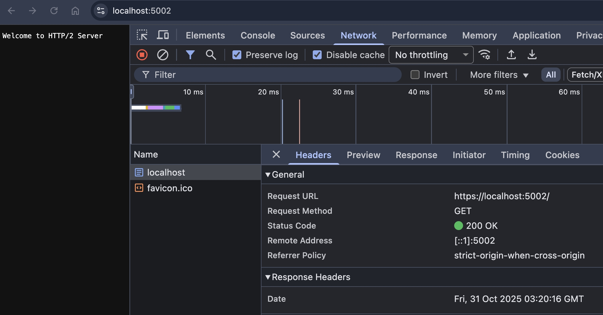
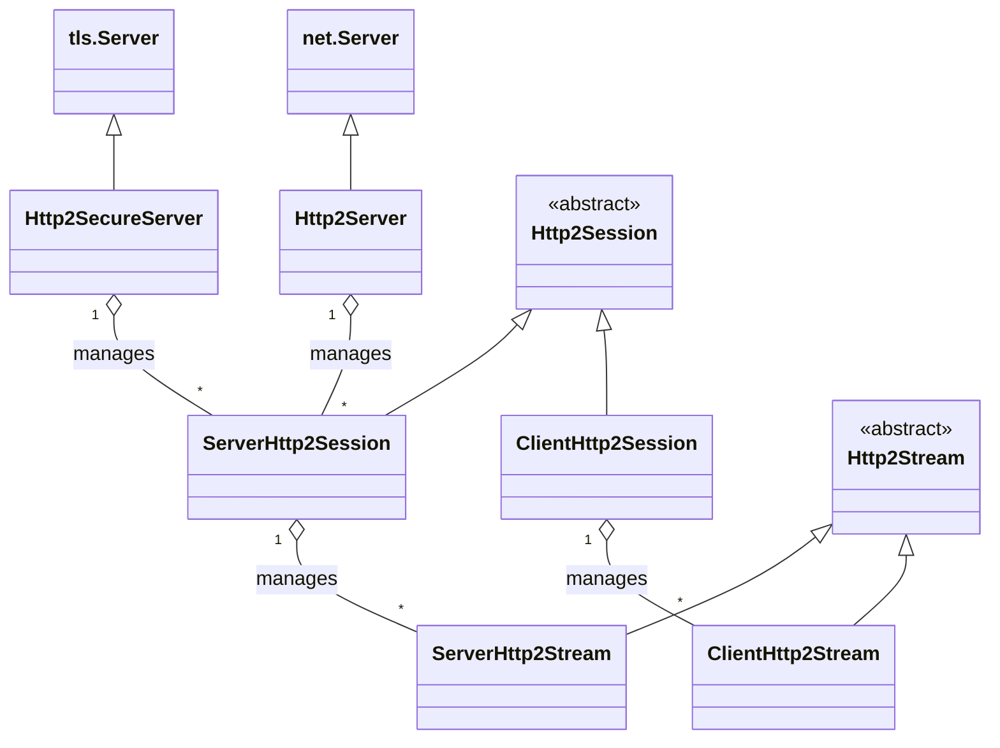
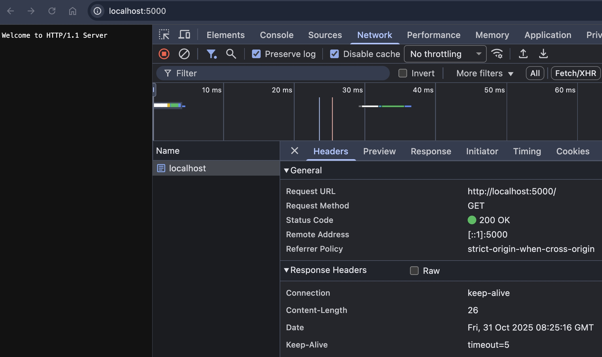

## 前言

2025 iThome 鐵人賽，我發表了 30 篇 [Learn HTTP With JS](https://ithelp.ithome.com.tw/users/20155705/ironman/8162) 系列文。時隔兩個月，為了打 portSwigger [Race conditions](https://portswigger.net/web-security/all-labs#race-conditions) 跟 [HTTP request smuggling](https://portswigger.net/web-security/all-labs#http-request-smuggling) 的 Labs，我打算先把 HTTP2 的基本知識補齊，所以又開始寫 HTTP 系列文啦～

## HTTP2 Over HTTPS

### NodeJS http2.createServer

在開始寫這篇文章前，我就有依稀記得 HTTP2 不支援 Over HTTP，如果細看 NodeJS HTTP2 Module 的話，可以看到主流瀏覽器都不支援 HTTP2 Over HTTP

```js
/**
 * Returns a `net.Server` instance that creates and manages `Http2Session` instances.
 *
 * Since there are no browsers known that support [unencrypted HTTP/2](https://http2.github.io/faq/#does-http2-require-encryption), the use of {@link createSecureServer} is necessary when
 * communicating
 * with browser clients.
 */
export function createServer(
    onRequestHandler?: (request: Http2ServerRequest, response: Http2ServerResponse) => void,
): Http2Server;
```

### Starting HTTP/2 for "http" URIs

回到 2015 年的 [RFC7540 #section-3.2](https://datatracker.ietf.org/doc/html/rfc7540#section-3.2)，有說到 HTTP2 Over HTTP 的協商機制

```
A client that makes a request for an "http" URI without prior knowledge about support for HTTP/2 on the next hop uses the HTTP Upgrade mechanism.
```

具體來說，client 會構造

```
GET / HTTP/1.1
Host: server.example.com
Connection: Upgrade, HTTP2-Settings
Upgrade: h2c
HTTP2-Settings: <base64url encoding of HTTP/2 SETTINGS payload>
```

其中 h2c 代表 HTTP/2 over cleartext TCP

Server 若不支援，則回傳

```
HTTP/1.1 200 OK
```

Server 若支援，則回傳

```
HTTP/1.1 101 Switching Protocols
Connection: Upgrade
Upgrade: h2c
```

### HTTP/2 for "http" URIs has been deprecated

看起來很美好，但實務上支援的 Server 並不多，畢竟各大瀏覽器廠商都說只支援 HTTP2 Over HTTPS，那這樣的場景自然就不需要實作。並且在 HTTP2 最新的 [RFC 9113 #section-3.1](https://datatracker.ietf.org/doc/html/rfc9113#section-3.1) 有提到這個機制已被棄用

```
The "h2c" string was previously used as a token for use in the HTTP Upgrade mechanism's Upgrade header field (Section 7.8 of [HTTP]). This usage was never widely deployed and is deprecated by this document. The same applies to the HTTP2-Settings header field, which was used with the upgrade to "h2c".
```

### firefox does not implement h2c

根據 [bugzilla](https://bugzilla.mozilla.org/show_bug.cgi?id=1418832) 在 2017 年的某則討論，裡面就有明確說到不實作 h2c 的原因，參考 [comment 7](https://bugzilla.mozilla.org/show_bug.cgi?id=1418832#c7)

在 client 跟 HTTP/2 Server 中間可能會有很多 transparent proxies 只支援 HTTP/1.0, HTTP/1.1，並且會攔截/修改 HTTP 流量。這些 transparent proxies 遇到 HTTPS 就會直接轉發，遇到 h2c 可能會導致解析失敗，所以讓 HTTP/2 for "https" 算是一種向後兼容的作法

### curl as h2c client

雖說支援 h2c 的 Server 並不多，但還是可以玩看看 h2c client 是怎麼發送 HTTP Request 的

架一個簡單的 NodeJS HTTP/1.1 Server

```ts
import { createServer } from "http";
const httpServer = createServer().listen(5000);

httpServer.on("request", (req, res) => {
  console.log(req.headers);
  res.end("Welcome to HTTP/1.1 Server");
});
```

終端機輸入

```
curl --http2 http://localhost:5000
```

Server 會看到

```js
{
  host: 'localhost:5000',
  'user-agent': 'curl/8.7.1',
  accept: '*/*',
  connection: 'Upgrade, HTTP2-Settings',
  upgrade: 'h2c',
  'http2-settings': 'AAMAAABkAAQAoAAAAAIAAAAA'
}
```

接下來就是要做協議的轉換，不過我暫時找不到有實作 HTTP/1.1 => HTTP/2 的 npm library

## NodeJS HTTP2 Server

### HTTP2 Over HTTP

最小 PoC

```ts
import http2 from "http2";

const http2Server = http2.createServer();
http2Server.on("request", (req, res) => {
  console.log(req.headers);
  res.end("Welcome to HTTP/2 Server");
});
```

一樣用 curl，有支援 HTTP2 Over HTTP 的 Client

```
curl --http2-prior-knowledge http://localhost:5001
```

Server 會看到

```js
[Object: null prototype] {
  ':method': 'GET',
  ':scheme': 'http',
  ':authority': 'localhost:5001',
  ':path': '/',
  'user-agent': 'curl/8.7.1',
  accept: '*/*',
  [Symbol(sensitiveHeaders)]: []
}
```

所謂的 `--http2-prior-knowledge`，就是直接跳過協商步驟，Client 假定 Server 有支援 HTTP2，直接發送 HTTP2 的請求

```
curl --help all

--http2-prior-knowledge         Use HTTP 2 without HTTP/1.1 Upgrade
```

### HTTP2 Over HTTPS

根據之前寫的文章 [Strict-Transport-Security # mkcert 建立本機 CA](./strict-transport-security.md#mkcert-建立本機-ca)，建立好憑證

最小 PoC

```ts
import { readFileSync } from "fs";
import http2 from "http2";
import { join } from "path";

const https2Server = http2.createSecureServer({
  key: readFileSync(join(__dirname, "private-key.pem")),
  cert: readFileSync(join(__dirname, "cert.pem")),
});
https2Server.on("request", (req, res) => {
  console.log(req.headers);
  res.end("Welcome to HTTP/2 Server");
});
https2Server.listen(5002);
```

瀏覽器訪問 https://localhost:5002/


## Request Pseudo-header

在 [RFC 9113 #section-8.3](https://datatracker.ietf.org/doc/html/rfc9113#section-8.3) 有提到 Pseudo-header，也就是我們上面看到的

```js
{
  ':method': 'GET',
  ':scheme': 'http',
  ':authority': 'localhost:5001',
  ':path': '/',
}
```

這四個 Request Pseudo Headers，剛好可以構成完整的 URI

## Response Pseudo-header

根據 [RFC 9113 #section-8.3.2](https://datatracker.ietf.org/doc/html/rfc9113#section-8.3.2) 的定義，目前 Response Pseudo-header 只有 `:status`

curl 讀出來的 Response Headers 感覺有經過整理，符合我們平常愛看的 HTTP/1.1 格式

```
curl --http2-prior-knowledge -i "http://localhost:5001/hello/world?test=123"
HTTP/2 200
date: Fri, 31 Oct 2025 02:26:02 GMT

Welcome to HTTP/2 Server
```

改用 NodeJS HTTP2

```ts
const clientHttp2Server = http2.connect("http://localhost:5001");
clientHttp2Server
  .request({
    [http2.constants.HTTP2_HEADER_PATH]: "/hello/world?test=123",
    [http2.constants.HTTP2_HEADER_METHOD]: "POST",
  })
  .end()
  .on("response", console.log)
  .on("error", console.log);
```

Server 會看到

```js
[Object: null prototype] {
  ':status': 200,
  date: 'Fri, 31 Oct 2025 02:24:00 GMT',
  [Symbol(sensitiveHeaders)]: []
}
```

## `:authority` vs `host`

HTTP/1.1，完整的 URI 其實被分散在 startline 跟 headers

```
GET /hello/world?test=123
Host: example.com
```

HTTP/2 重新設計了這個架構，變成 [Request Pseudo-header](#request-pseudo-header)

並且在 [RFC 9113 #section-8.3.1](https://datatracker.ietf.org/doc/html/rfc9113#section-8.3.1) 也有幾句關鍵字提到，請使用 `:authority` 而不是 `host`，原文如下

```
The recipient of an HTTP/2 request MUST NOT use the Host header field to determine the target URI if ":authority" is present.

A server SHOULD treat a request as malformed if it contains a Host header field that identifies an entity that differs from the entity in the ":authority" pseudo-header field.
```

另外有一段蠻吸引我的眼球

```
An intermediary that needs to generate a Host header field (which might be necessary to construct an HTTP/1.1 request) MUST use the value from the ":authority" pseudo-header field as the value of the Host field, unless the intermediary also changes the request target. This replaces any existing Host field to avoid potential vulnerabilities in HTTP routing.
```

假設有 Client => HTTP/2 Server => HTTP/1.1 Internal API 的架構，Client 可以構造以下 Request Headers

```js
{
  ':authority': 'localhost:5001',
  host: 'malicious.host'
}
```

PoC

```ts
const clientHttp2Server = http2.connect("http://localhost:5001");
clientHttp2Server
  .request({
    [http2.constants.HTTP2_HEADER_PATH]: "/hello/world?test=123",
    [http2.constants.HTTP2_HEADER_METHOD]: "POST",
    [http2.constants.HTTP2_HEADER_AUTHORITY]: "localhost:5001",
    [http2.constants.HTTP2_HEADER_HOST]: "malicious.host",
  })
  .end()
  .on("error", console.log);
```

假設

1. HTTP/2 Server 的實作，沒有拒絕這種請求（RFC 9113 並沒有強制規定 Server 必須要拒絕）
2. HTTP/2 Server => HTTP/1.1 Internal API 這段 downgrade 的過程沒有遵守 RFC 9113 的規定，意外的將 `host: 'malicious.host'` 傳遞下去

就有機會達成 [HTTP Request Smuggling](../port-swigger/http-request-smuggling.md) 或是 [HTTP Host Header Attacks](../port-swigger/http-host-header-attacks.md)

## Compatibility API

在使用 NodeJS http2 模組實作時，我發現其 API 跟 http 模組（也就是 HTTP/1.1）幾乎相同，開發起來完全沒有難度(?)後來翻了官方文件，才發現原來這是開發團隊很暖心的設計

[Event: `'request'`](https://nodejs.org/api/http2.html#event-request)

```
Emitted each time there is a request. There may be multiple requests per session.
```

[Compatibility API](https://nodejs.org/api/http2.html#compatibility-api)

```
The Compatibility API has the goal of providing a similar developer experience of HTTP/1 when using HTTP/2, making it possible to develop applications that support both HTTP/1 and HTTP/2.
```

## NodeJS http2 classDiagram

根據 [NodeJS http2 官方文件](https://nodejs.org/api/http2.html)，畫出以下 classDiagram


```mermaid
classDiagram
    net.Server <|-- Http2Server
    tls.Server <|-- Http2SecureServer

    Http2Session <|-- ServerHttp2Session
    Http2Session <|-- ClientHttp2Session

    Http2Stream <|-- ServerHttp2Stream
    Http2Stream <|-- ClientHttp2Stream

    Http2SecureServer "1" o-- "*" ServerHttp2Session : manages
    Http2Server "1" o-- "*" ServerHttp2Session : manages

    ServerHttp2Session "1" o-- "*" ServerHttp2Stream : manages
    ClientHttp2Session "1" o-- "*" ClientHttp2Stream : manages

    class Http2Session {
        <<abstract>>
    }
    class Http2Stream {
        <<abstract>>
    }
```

懶人包

- 1 個 Http2Server 管理 n 個 Http2Session
- 1 個 Http2Session 管理 n 個 Http2Stream
- 要創建 Http2Server => 請使用

```ts
http2.createServer;
http2.createSecureServer;
```

- 要發送 Http2Client => 請使用

```ts
http2.connect;
```

## Keep-Alive

如果仔細觀察 [Response Pseudo-header](#response-pseudo-header) 的話，會覺得很空虛

架一個最小 HTTP/1.1 Server PoC 來比較

```ts
const httpServer = createServer().listen(5000);
httpServer.on("request", (req, res) => {
  console.log(req.headers);
  res.end("Welcome to HTTP/1.1 Server");
});
```

瀏覽器訪問 http://localhost:5000/


```
HTTP/1.1 200 OK
Date: Fri, 31 Oct 2025 08:25:16 GMT
Connection: keep-alive
Keep-Alive: timeout=5
Content-Length: 26
```

會發現 Connection 跟 Keep-Alive 都消失了！這是 HTTP/2 設計上的改進，根據 []

## frame

## session

## stream

## Header Compression

## 參考資料

- https://nodejs.org/api/http2.html
- https://developer.mozilla.org/en-US/docs/Glossary/HTTP_2
- https://developer.mozilla.org/en-US/docs/Web/HTTP/Reference/Status/103
- https://datatracker.ietf.org/doc/html/rfc7540
- https://datatracker.ietf.org/doc/html/rfc7541
- https://datatracker.ietf.org/doc/html/rfc9113
