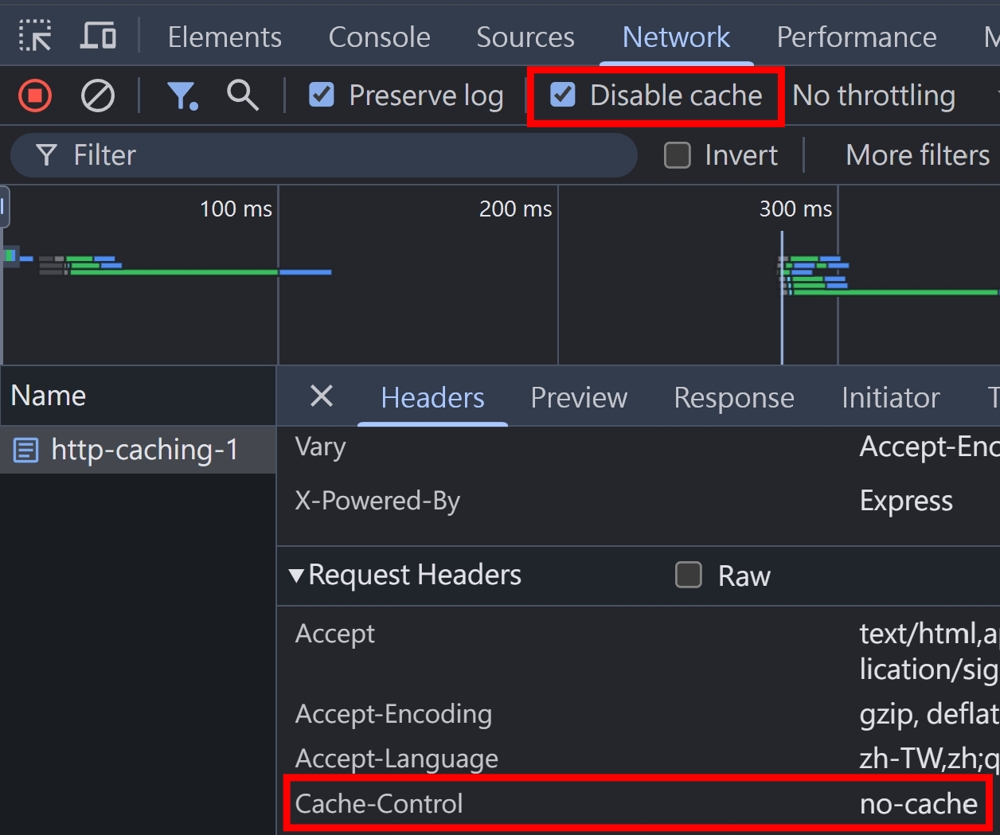
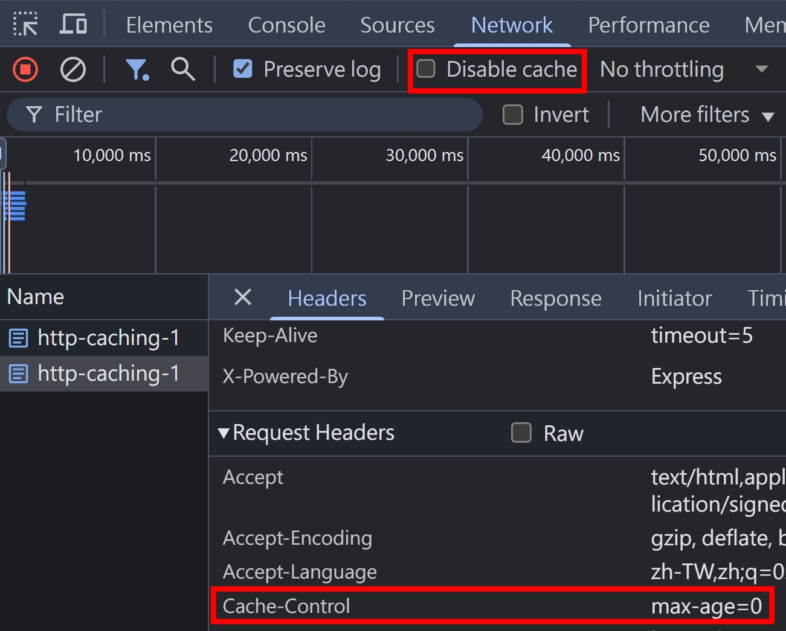

## 大綱

底下網羅關於 HTTP Caching, HTTP Conditional Request 的 Headers，會在接下來的段落陸續介紹到

<table>
  <thead>
    <tr>
      <th>Header Name</th>
      <th>Header Type</th>
      <th>Explain</th>
    </tr>
  </thead>
  <tbody>
    <tr>
      <td>Cache-Control</td>
      <td>Request/Response</td>
      <td>[Cache-Control](#cache-control)</td>
    </tr>
    <tr>
      <td>Expires</td>
      <td>Response</td>
      <td>❌ HTTP/1.0 就有的，逐漸被 Cache-Control 取代</td>
    </tr>
    <tr>
      <td>Last-Modified</td>
      <td>Response</td>
      <td>📗 Last-Modified: Sat, 12 Jul 2025 07:20:17 GMT</td>
    </tr>
    <tr>
      <td>ETag</td>
      <td>Response</td>
      <td>[ETag](#etag)</td>
    </tr>
    <tr>
      <td>Vary</td>
      <td>Response</td>
      <td>
        <div>📗 Vary: Accept-Encoding, Origin</div>
        <div>[Vary](../http/http-caching-3.md#vary)</div>
      </td>
    </tr>
    <tr>
      <td>Pragma</td>
      <td>Request/Response</td>
      <td>❌ Deprecated</td>
    </tr>
    <tr>
      <td>Age</td>
      <td>Response</td>
      <td>📗 Age: 24</td>
    </tr>
    <tr>
      <td>If-Range</td>
      <td>Request</td>
      <td>
        <div>📗 If-Range: Strong ETag</div>
        <div>📗 If-Range: Last-Modified</div>
        <div>✅ Must be use with [Range](../http/http-range-requests.md) Request Header</div>
      </td>
    </tr>
    <tr>
      <td>If-Modified-Since</td>
      <td>Request</td>
      <td>
        <div>📗 If-Modified-Since: Last-Modified</div>
        <div>✅ Conditional Request，主要用來更新快取</div>
      </td>
    </tr>
    <tr>
      <td>If-None-Match</td>
      <td>Request</td>
      <td>
        <div>📗 If-None-Match: Strong ETag | Weak ETag</div>
        <div>👶 Weak Comparison</div>
        <div>✅ Conditional Request，主要用來更新快取</div>
        <div>✅ If-None-Match 的優先度 > If-Modified-Since</div>
      </td>
    </tr>
    <tr>
      <td>If-Unmodified-Since</td>
      <td>Request</td>
      <td>
        <div>📗 If-Modified-Since: Last-Modified</div>
        <div>✅ Conditional Request，主要用來更新資源</div>
      </td>
    </tr>
    <tr>
      <td>If-Match</td>
      <td>Request</td>
      <td>
        <div>📗 If-Match: Strong ETag</div>
        <div>💪 Strong Comparison</div>
        <div>✅ Conditional Request，主要用來更新資源</div>
        <div>✅ If-Match 的優先度 > If-Unmodified-Since</div>
      </td>
    </tr>
  </tbody>
</table>

## ETag

- 全名是 Entity Tag
- 語法

```
ETag: W/"0-2jmj7l5rSw0yVb/vlWAYkK/YBwk" # Weak
ETag: "0-2jmj7l5rSw0yVb/vlWAYkK/YBwk" # Strong
```

## Weak ETag

- 通常是把 file metadata 拿去 hash，方法沒有規定
- 同樣的 Weak ETag，不能確保 file content 完全一致
- 但用在 cache 優化很有效

看看 [NodeJS etag](https://github.com/jshttp/etag/blob/master/index.js) 的實作，就是拿 [lastModified](https://nodejs.org/api/fs.html#statsmtime) 跟 [檔案大小](https://nodejs.org/api/fs.html#statssize) 去做 hash

```js
function stattag(stat) {
  var mtime = stat.mtime.getTime().toString(16);
  var size = stat.size.toString(16);

  return '"' + size + "-" + mtime + '"';
}
```

## Strong ETag

- 通常是把 file content 拿去 hash，方法沒有規定
- 同樣的 Strong ETag，可以確保 file content 完全一致
- Strong ETag 的生成，效能比 Weak ETag 更差

看看 [NodeJS etag](https://github.com/jshttp/etag/blob/master/index.js) 的實作，實作上也是非常樸實無華

```js
function entitytag(entity) {
  if (entity.length === 0) {
    // fast-path empty
    return '"0-2jmj7l5rSw0yVb/vlWAYkK/YBwk"';
  }

  // compute hash of entity
  var hash = crypto
    .createHash("sha1")
    .update(entity, "utf8")
    .digest("base64")
    .substring(0, 27);

  // compute length of entity
  var len =
    typeof entity === "string"
      ? Buffer.byteLength(entity, "utf8")
      : entity.length;

  return '"' + len.toString(16) + "-" + hash + '"';
}
```

## Cache-Control

- 用來控制 cache 的各種行為
- cache 存放位置（public, private）
- 是否允許 cache（no-cache, no-store）
- cache 有效期控制（max-age, s-maxage）
- cache 過期後的行為 （must-revalidate, proxy-revalidate, stale-while-revalidate）
- cache 可否被轉換（no-transform）
- cache 優化策略（only-if-cached, immutable）
- 其他很少用到的（must-understand）

### Directives

<table>
  <thead>
    <tr>
      <th>Directive</th>
      <th>Request</th>
      <th>Response</th>
    </tr>
  </thead>
  <tbody>
    <tr>
      <td>max-age</td>
      <td></td>
      <td>
        <div>📗 Cache-Control: max-age=600</div>
        <div>代表 Response 在生成後的 600 秒內都算 fresh</div>
      </td>
    </tr>
    <tr>
      <td>s-maxage (shared-maxage)</td>
      <td>-</td>
      <td>
        <div>📗 Cache-Control: s-maxage=600</div>
        <div>同 max-age</div>
        <div>優先度 > max-age</div>
      </td>
    </tr>
    <tr>
      <td>no-cache</td>
      <td>同 ➡️</td>
      <td>可被 cache，但是每次都需跟 origin server 驗證</td>
    </tr>
    <tr>
      <td>no-store</td>
      <td>同 ➡️</td>
      <td>禁止任何形式的 cache</td>
    </tr>
    <tr>
      <td>must-revalidate</td>
      <td>-</td>
      <td>
        <div>Cache-Control: max-age=600, must-revalidate</div>
        <div>600 秒內可以使用 cache，超過的話就必須重新驗證</div>
      </td>
    </tr>
    <tr>
      <td>proxy-revalidate</td>
      <td>-</td>
      <td>同 must-revalidate，for shared caches only</td>
    </tr>
    <tr>
      <td>private</td>
      <td>-</td>
      <td>Response 只能被存在 private cache</td>
    </tr>
    <tr>
      <td>public</td>
      <td>-</td>
      <td>Response 可被存在 shared cache</td>
    </tr>
    <tr>
      <td>no-transform</td>
      <td>同 ➡️</td>
      <td>禁止中間層把 response body 做轉換</td>
    </tr>
    <tr>
      <td>immutable</td>
      <td>-</td>
      <td>response 在 fresh 期間不會異動</td>
    </tr>
    <tr>
      <td>stale-while-revalidate</td>
      <td>-</td>
      <td>
        <div>Cache-Control: max-age=600, stale-while-revalidate=300</div>
        <div>[swr](https://www.npmjs.com/package/swr) 套件的命名來源</div>
        <div></div>
      </td>
    </tr>
    <tr>
      <td>must-understand</td>
      <td>-</td>
      <td>
        <div>Cache-Control: must-understand, no-store</div>
        <div>必須了解 status code 的涵義，才可以 cache</div>
      </td>
    </tr>
    <tr>
      <td>only-if-cached</td>
      <td>client 只想拿 cache 的資料</td>
      <td>-</td>
    </tr>
    <tr>
      <td>stale-if-error</td>
      <td>主流瀏覽器不支援</td>
      <td>-</td>
    </tr>
    <tr>
      <td>max-stale</td>
      <td>主流瀏覽器不支援</td>
      <td>-</td>
    </tr>
    <tr>
      <td>min-fresh</td>
      <td>主流瀏覽器不支援</td>
      <td>-</td>
    </tr>
  </tbody>
</table>

## 小插曲，觀察 Chrome Disable Cache 的行為

隨便打開一個網頁，F12 > Network > Disable Cache 打勾，實際發送的是 `Cache-Control: no-cache`



取消勾選，再重整網頁，實際發送的是 `Cache-Control: max-age=0`



## Conditional Requests

- `If-*` 開頭的 Request Headers
- `If-*` 條件為 `true`，則執行對應的 HTTP Method 操作
- `If-Range` + `Range` 用來發起 Conditional Range Request，`true` 回傳對應的 Range，`false` 回傳整個 resource
- `If-None-Match` + `If-Modified-Since` 通常會一起使用，用來更新快取
- `If-Match` + `If-Unmodified-Since` 通常會一起使用，用來更新資源，若 `If-*` 條件為 `false`，則回傳 412 Precondition Failed

## 小結

HTTP Caching 跟 HTTP Conditional Requests 是兩個密不可分的概念。在第一個篇章，我們先有一個概觀，把這個主題會用到的 Headers 都介紹過一輪，接下來我們就會進到實作的環節～

## 參考資料

- https://developer.mozilla.org/en-US/docs/Web/HTTP/Guides/Conditional_requests
- https://developer.mozilla.org/en-US/docs/Web/HTTP/Guides/Caching
- https://developer.mozilla.org/en-US/docs/Web/HTTP/Reference/Headers/Cache-Control
- https://developer.mozilla.org/en-US/docs/Web/HTTP/Reference/Headers/Expires
- https://developer.mozilla.org/en-US/docs/Web/HTTP/Reference/Headers/Last-Modified
- https://developer.mozilla.org/en-US/docs/Web/HTTP/Reference/Headers/ETag
- https://developer.mozilla.org/en-US/docs/Web/HTTP/Reference/Headers/Vary
- https://developer.mozilla.org/en-US/docs/Web/HTTP/Reference/Headers/Pragma
- https://developer.mozilla.org/en-US/docs/Web/HTTP/Reference/Headers/Age
- https://developer.mozilla.org/en-US/docs/Web/HTTP/Reference/Headers/If-Range
- https://developer.mozilla.org/en-US/docs/Web/HTTP/Reference/Headers/If-Match
- https://developer.mozilla.org/en-US/docs/Web/HTTP/Reference/Headers/If-Modified-Since
- https://developer.mozilla.org/en-US/docs/Web/HTTP/Reference/Headers/If-None-Match
- https://developer.mozilla.org/en-US/docs/Web/HTTP/Reference/Headers/If-Unmodified-Since
- https://developer.mozilla.org/en-US/docs/Web/HTTP/Reference/Status/304
- https://developer.mozilla.org/en-US/docs/Web/HTTP/Reference/Status/412
- https://developer.mozilla.org/en-US/docs/Web/HTTP/Reference/Status/428
- https://datatracker.ietf.org/doc/html/rfc9111
- https://nginx.org/en/docs/http/ngx_http_proxy_module.html#proxy_cache_key
- https://nginx.org/en/docs/http/ngx_http_proxy_module.html#proxy_cache_path
- https://nginx.org/en/docs/http/ngx_http_proxy_module.html#proxy_cache
