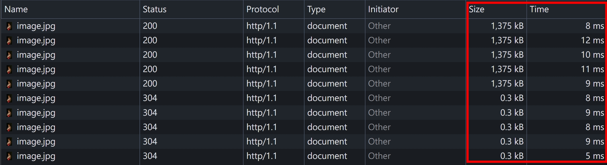
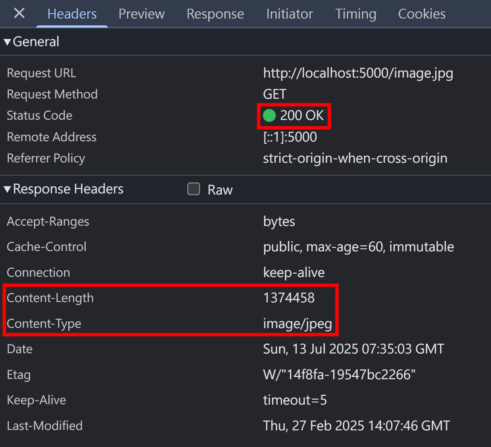
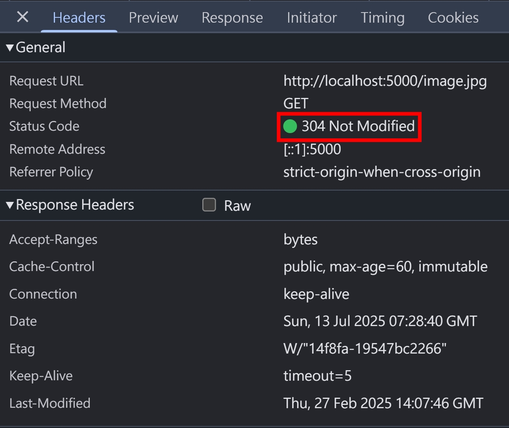
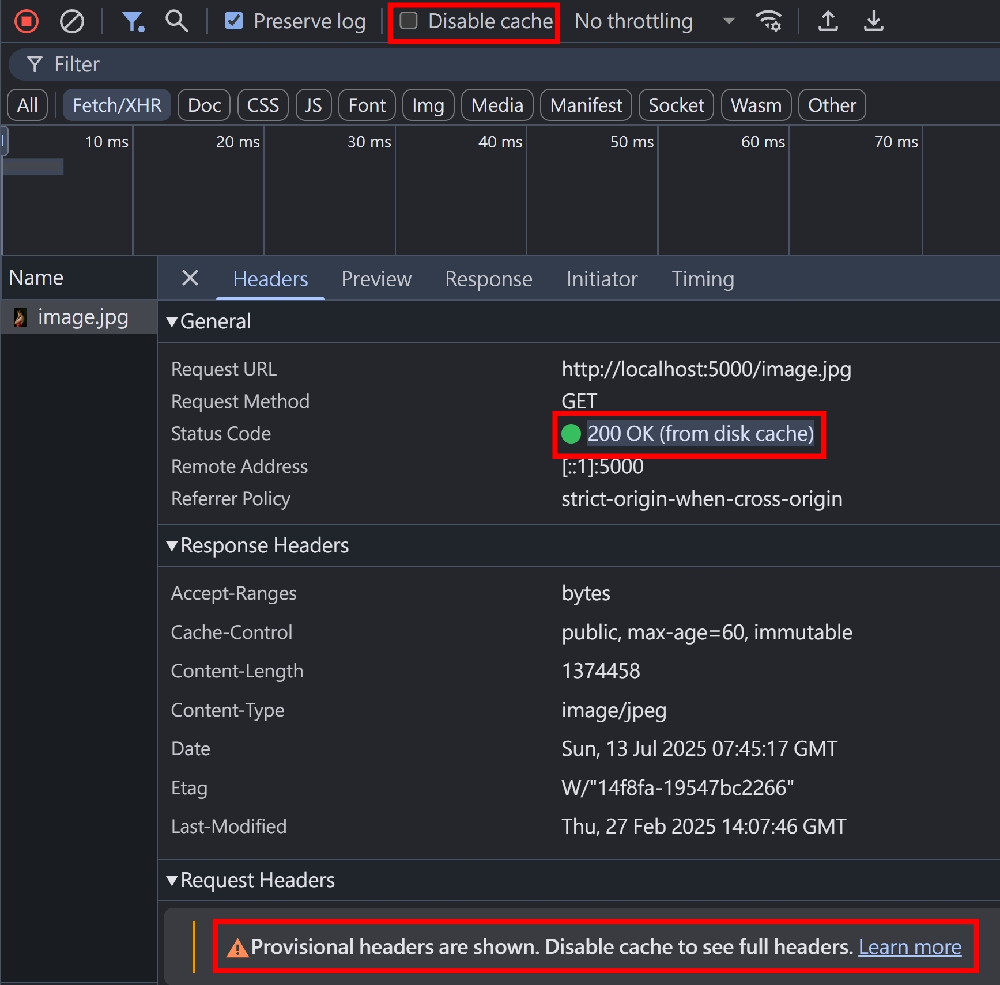
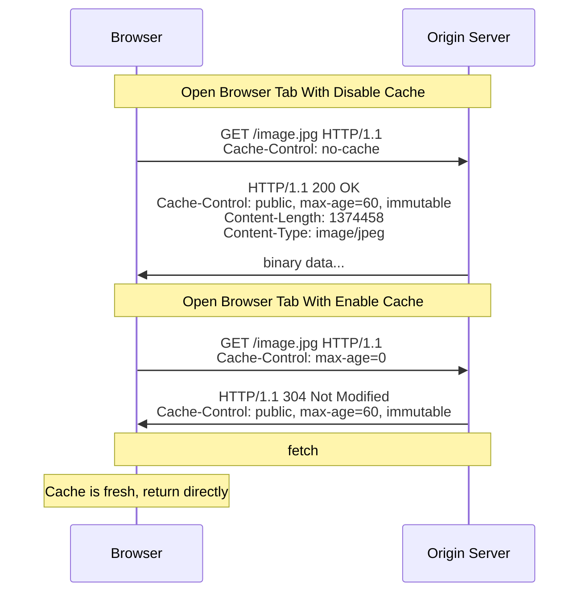

## 大綱

底下網羅關於 HTTP Caching 的 Headers，會在接下來的段落陸續介紹到

<table>
  <thead>
    <tr>
      <th>Header Name</th>
      <th>Header Type</th>
      <th>Explain</th>
    </tr>
  </thead>
  <tbody>
    <tr>
      <td>Cache-Control</td>
      <td>Request/Response</td>
      <td>[Cache-Control](#cache-control)</td>
    </tr>
    <tr>
      <td>Expires</td>
      <td>Response</td>
      <td>❌HTTP/1.0 就有的，逐漸被 Cache-Control 取代</td>
    </tr>
    <tr>
      <td>Last-Modified</td>
      <td>Response</td>
      <td>Last-Modified: Sat, 12 Jul 2025 07:20:17 GMT</td>
    </tr>
    <tr>
      <td>ETag</td>
      <td>Response</td>
      <td>[ETag](#etag)</td>
    </tr>
    <tr>
      <td>Vary</td>
      <td>Response</td>
      <td>
        <div>哪些 Request Header 會影響到 Response Body 的生成</div>
        <div>Vary: Accept-Encoding, Origin</div>
      </td>
    </tr>
    <tr>
      <td>Pragma</td>
      <td>Request/Response</td>
      <td>❌Deprecated</td>
    </tr>
    <tr>
      <td>Age</td>
      <td>Response</td>
      <td>Age: 24</td>
    </tr>
  </tbody>
</table>

## ETag

- 全名是 Entity Tag
- 語法

```
ETag: W/"0-2jmj7l5rSw0yVb/vlWAYkK/YBwk" # Weak
ETag: "0-2jmj7l5rSw0yVb/vlWAYkK/YBwk" # Strong
```

## Weak ETag

- 通常是把 file metadata 拿去 hash，方法沒有規定
- 同樣的 Weak ETag，不能確保 file content 完全一致
- 但用在 cache 優化很有效

看看 [NodeJS etag](https://github.com/jshttp/etag/blob/master/index.js) 的實作，就是拿 [lastModified](https://nodejs.org/api/fs.html#statsmtime) 跟 [檔案大小](https://nodejs.org/api/fs.html#statssize) 去做 hash

```js
function stattag(stat) {
  var mtime = stat.mtime.getTime().toString(16);
  var size = stat.size.toString(16);

  return '"' + size + "-" + mtime + '"';
}
```

## Strong ETag

- 通常是把 file content 拿去 hash，方法沒有規定
- 同樣的 Strong ETag，可以確保 file content 完全一致
- Strong ETag 的生成，效能較 Weak ETag 較差

看看 [NodeJS etag](https://github.com/jshttp/etag/blob/master/index.js) 的實作，實作上也是非常樸實無華

```js
function entitytag(entity) {
  if (entity.length === 0) {
    // fast-path empty
    return '"0-2jmj7l5rSw0yVb/vlWAYkK/YBwk"';
  }

  // compute hash of entity
  var hash = crypto
    .createHash("sha1")
    .update(entity, "utf8")
    .digest("base64")
    .substring(0, 27);

  // compute length of entity
  var len =
    typeof entity === "string"
      ? Buffer.byteLength(entity, "utf8")
      : entity.length;

  return '"' + len.toString(16) + "-" + hash + '"';
}
```

## Cache-Control

### Directives

<table>
  <thead>
    <tr>
      <th>Directive</th>
      <th>Request</th>
      <th>Response</th>
    </tr>
  </thead>
  <tbody>
    <tr>
      <td>max-age</td>
      <td></td>
      <td>
        <div>📗 Cache-Control: max-age=600</div>
        <div>代表 Response 在生成後的 600 秒內都算 fresh</div>
      </td>
    </tr>
    <tr>
      <td>s-maxage (shared-maxage)</td>
      <td>-</td>
      <td>
        <div>📗 Cache-Control: s-maxage=600</div>
        <div>同 max-age</div>
        <div>優先度 > max-age</div>
      </td>
    </tr>
    <tr>
      <td>no-cache</td>
      <td>同➡️</td>
      <td>可被 cache，但是每次都需跟 origin server 驗證</td>
    </tr>
    <tr>
      <td>no-store</td>
      <td>同➡️</td>
      <td>禁止任何形式的 cache</td>
    </tr>
    <tr>
      <td>must-revalidate</td>
      <td>-</td>
      <td>
        <div>Cache-Control: max-age=600, must-revalidate</div>
        <div>600 秒內可以使用 cache，超過的話就必須重新驗證</div>
      </td>
    </tr>
    <tr>
      <td>proxy-revalidate</td>
      <td>-</td>
      <td>同 must-revalidate，for shared caches only</td>
    </tr>
    <tr>
      <td>private</td>
      <td>-</td>
      <td>Response 只能被存在 private cache</td>
    </tr>
    <tr>
      <td>public</td>
      <td>-</td>
      <td>Response 可被存在 shared cache</td>
    </tr>
    <tr>
      <td>no-transform</td>
      <td>同➡️</td>
      <td>禁止中間層把 response body 做轉換</td>
    </tr>
    <tr>
      <td>immutable</td>
      <td>-</td>
      <td>response 在 fresh 期間不會異動</td>
    </tr>
    <tr>
      <td>stale-while-revalidate</td>
      <td>-</td>
      <td>
        <div>Cache-Control: max-age=600, stale-while-revalidate=300</div>
        <div>[swr](https://www.npmjs.com/package/swr) 套件的命名來源</div>
        <div></div>
      </td>
    </tr>
    <tr>
      <td>must-understand</td>
      <td>-</td>
      <td>
        <div>Cache-Control: must-understand, no-store</div>
        <div>必須了解 status code 的涵義，才可以 cache</div>
      </td>
    </tr>
    <tr>
      <td>only-if-cached</td>
      <td>client 只想拿 cache 的資料</td>
      <td>-</td>
    </tr>
    <tr>
      <td>stale-if-error</td>
      <td>主流瀏覽器不支援</td>
      <td>-</td>
    </tr>
    <tr>
      <td>max-stale</td>
      <td>主流瀏覽器不支援</td>
      <td>-</td>
    </tr>
    <tr>
      <td>min-fresh</td>
      <td>主流瀏覽器不支援</td>
      <td>-</td>
    </tr>
  </tbody>
</table>

### 觀察 Chrome 的行為

隨便打開一個網頁，F12 > Network > Disable Cache 打勾，實際發送的是 `Cache-Control: no-cache`


取消勾選，再重整網頁，實際發送的是 `Cache-Control: max-age=0`


## Browser => Origin Server 實作環節

先測試一個 Browser => Origin Server 的情境，使用 NodeJS HTTP Server + [send](https://www.npmjs.com/package/send) 套件實作

1. index.ts

```ts
import send from "send";
import httpServer from "../httpServer";

httpServer.on("request", function requestListener(req, res) {
  if (req.url === "/image.jpg") {
    console.log(req.url);
    return send(req, String(req.url), {
      root: __dirname,
      cacheControl: true,
      etag: true,
      immutable: true,
      lastModified: true,
      maxAge: 60000,
    }).pipe(res);
  }
});
```

2. 在 index.ts 同一層，準備一個 image.jpg 檔案

瀏覽器打開 http://localhost:5000/image.jpg ，在 Disable Cache 勾選/不勾選的情況，各重整五次

可以看到 304 Not Modified 的平均響應毫秒比較快，且資料傳輸量小很多，因為不需要傳送 response body


再來比較 200 跟 304 的 response headers，304 由於沒有 response body，所以也就沒有 `Content-*` 的 response headers



要注意！實際上 HTTP Request 都有到達 Origin Server，這個 304 是 Origin Server 回傳的。如果要避免 HTTP Request，直接使用 Browser Cache 的話，可以把 Disable Cache 不勾選，並且在 F12 > Console 輸入

```js
fetch("http://localhost:5000/image.jpg");
```

就會看到 200 OK (from disk cache)，原因是 [fetch 預設的 cache 模式](https://developer.mozilla.org/en-US/docs/Web/API/RequestInit#default)


### Browser => Origin Server 小結

分別把上面三種請求模式，整理成時序圖


```mermaid
sequenceDiagram
  participant Browser
  participant Origin Server

  Note Over Browser, Origin Server: Open Browser Tab With Disable Cache

  Browser ->> Origin Server: GET /image.jpg HTTP/1.1<br/>Cache-Control: no-cache
  Origin Server ->> Browser: HTTP/1.1 200 OK<br/>Cache-Control: public, max-age=60, immutable<br/>Content-Length: 1374458<br/>Content-Type: image/jpeg<br/><br/>binary data...

  Note Over Browser, Origin Server: Open Browser Tab With Enable Cache

  Browser ->> Origin Server: GET /image.jpg HTTP/1.1<br/>Cache-Control: max-age=0
  Origin Server ->> Browser: HTTP/1.1 304 Not Modified<br/>Cache-Control: public, max-age=60, immutable

  Note Over Browser, Origin Server: fetch

  Note Over Browser: Cache is fresh, return directly
```

<!-- todo 時序圖 -->

## 參考資料

- https://developer.mozilla.org/en-US/docs/Web/HTTP/Guides/Caching
- https://developer.mozilla.org/en-US/docs/Web/HTTP/Reference/Headers/Cache-Control
- https://developer.mozilla.org/en-US/docs/Web/HTTP/Reference/Headers/Expires
- https://developer.mozilla.org/en-US/docs/Web/HTTP/Reference/Headers/Last-Modified
- https://developer.mozilla.org/en-US/docs/Web/HTTP/Reference/Headers/ETag
- https://developer.mozilla.org/en-US/docs/Web/HTTP/Reference/Headers/Vary
- https://developer.mozilla.org/en-US/docs/Web/HTTP/Reference/Headers/Pragma
- https://developer.mozilla.org/en-US/docs/Web/HTTP/Reference/Headers/Age
- https://developer.mozilla.org/en-US/docs/Web/HTTP/Reference/Status/304
- https://www.rfc-editor.org/rfc/rfc9111.html
- https://nginx.org/en/docs/http/ngx_http_proxy_module.html#proxy_cache_key
- https://nginx.org/en/docs/http/ngx_http_proxy_module.html#proxy_cache_path
- https://nginx.org/en/docs/http/ngx_http_proxy_module.html#proxy_cache
