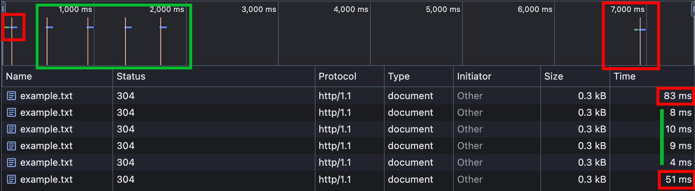
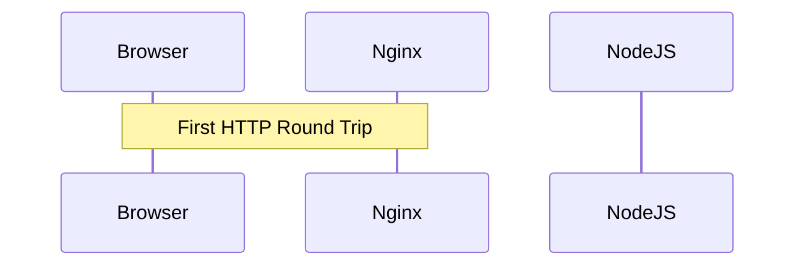

## Nginx Proxy Cache 設定

在 nginx.conf 新增以下設定（以 Mac M系列晶片 + homebrew 為例）

```conf
http {
    ...
    # proxy_cache_path path keys_zone=name:size;
    # 在 /opt/homebrew/etc/nginx 底下建一個資料夾 /my_5000_cache;
    # 1m = One megabyte zone can store about 8 thousand keys.
    proxy_cache_path /opt/homebrew/etc/nginx/my_5000_cache keys_zone=my_5000_cache:1m;

    server {
        ...
        location / {
            # proxy_cache zone
            # 這邊的 my_5000_cache 就是在 proxy_cache_path 定義的 keys_zone
            proxy_cache my_5000_cache;
            proxy_pass http://localhost:5000;
        }
    }
}
```

## must-revalidate 實測

由於 [send](https://www.npmjs.com/package/send) 沒有支援很精細的 [Cache-Control directives](../http/http-caching-1.md#directives)，所以我們自行設定

```ts
if (req.url === "/image.jpg" || req.url === "/example.txt") {
  console.log(req.url);
  const sendStream = send(req, String(req.url), {
    root: __dirname,
    // cacheControl: true,
    // immutable: true,
    // maxAge: 1000,
    etag: true,
    lastModified: true,
    cacheControl: false,
  });
  res.setHeader("Cache-Control", "public, max-age=5, must-revalidate");
  sendStream.pipe(res);
  return;
}
```

記得在跟 `image.jpg` 同一層新增 `example.txt`，接著重啟 nginx

```
nginx -s reload # Windows
brew services restart nginx # Mac
```

瀏覽器打開 http://localhost:8080/example.txt ，由於我們設定 `Cache-Control: public, max-age=5, must-revalidate`，代表 cache 只要存在 nginx 超過 5 秒，再次請求就會打到 Origin Server，我們可以控制重整頁面的秒數來觀察

- 第 1 個請求會打到 Origin Server，因為 nginx 一開始還沒有 cache
- 後面第 2 ~ 5 個請求直接在 nginx 這層就回傳 304，因為都在 5 秒內
- 第 6 個請求會打到 Origin Server，因為 cache 已經存在超過 5 秒



### must-revalidate 小結


```mermaid
sequenceDiagram
  participant Browser
  participant Nginx
  participant NodeJS

  Note over Browser, Nginx: First HTTP Round Trip
```

<!-- todo-yus -->

### 研究 Nginx Proxy Cache 存了什麼資料

## 參考資料

- https://developer.mozilla.org/en-US/docs/Web/HTTP/Guides/Caching
- https://developer.mozilla.org/en-US/docs/Web/HTTP/Reference/Headers/Cache-Control
- https://developer.mozilla.org/en-US/docs/Web/HTTP/Reference/Headers/Expires
- https://developer.mozilla.org/en-US/docs/Web/HTTP/Reference/Headers/Last-Modified
- https://developer.mozilla.org/en-US/docs/Web/HTTP/Reference/Headers/ETag
- https://developer.mozilla.org/en-US/docs/Web/HTTP/Reference/Headers/Vary
- https://developer.mozilla.org/en-US/docs/Web/HTTP/Reference/Headers/Pragma
- https://developer.mozilla.org/en-US/docs/Web/HTTP/Reference/Headers/Age
- https://developer.mozilla.org/en-US/docs/Web/HTTP/Reference/Status/304
- https://www.rfc-editor.org/rfc/rfc9111.html
- https://nginx.org/en/docs/http/ngx_http_proxy_module.html#proxy_cache_key
- https://nginx.org/en/docs/http/ngx_http_proxy_module.html#proxy_cache_path
- https://nginx.org/en/docs/http/ngx_http_proxy_module.html#proxy_cache
