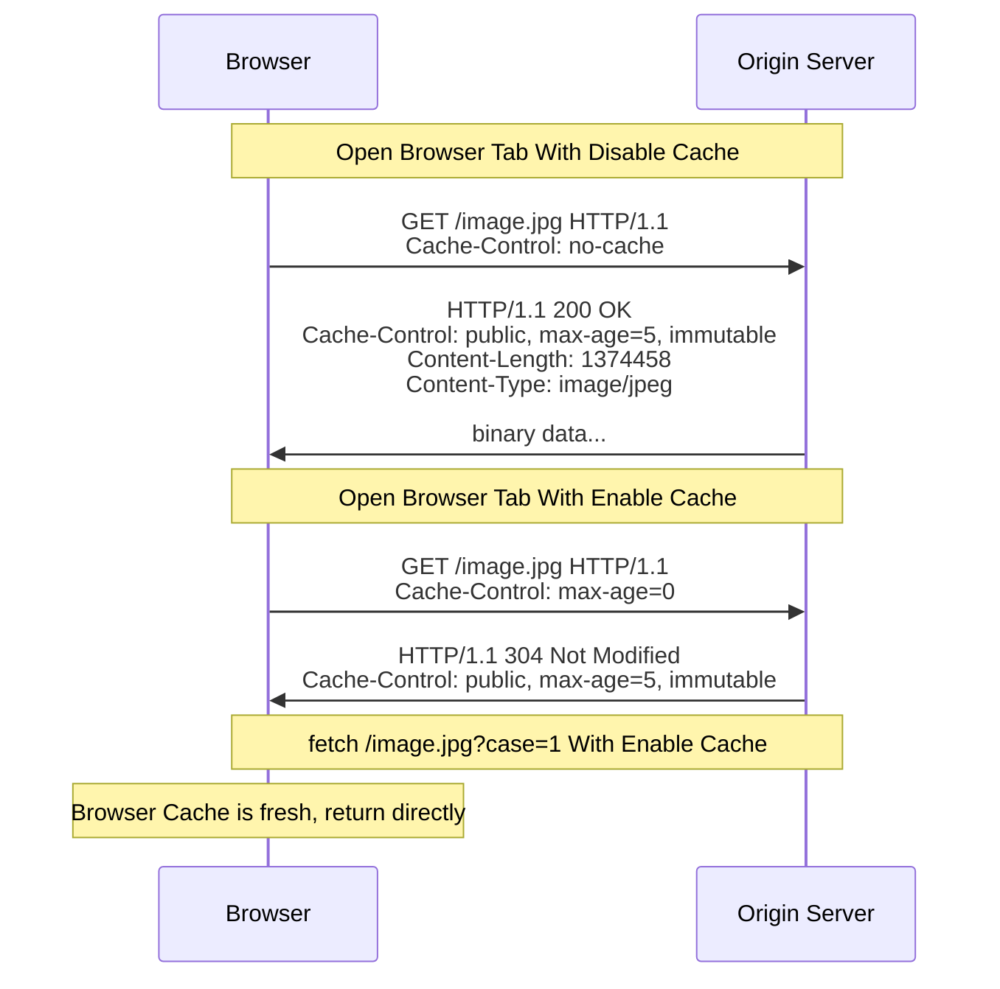
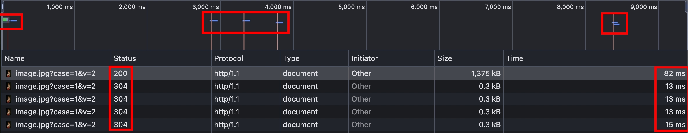
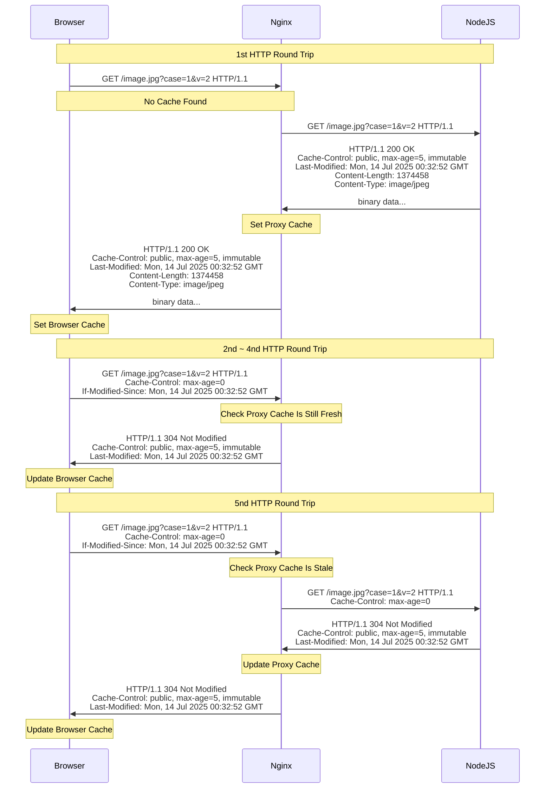

## Browser => Origin Server 實作環節

我們使用 NodeJS HTTP Server 來實作

### Browser "Disable cache" 測試

1. index.ts

```ts
import send from "send";
import httpServer from "../httpServer";

httpServer.on("request", function requestListener(req, res) {
  const url = new URL(`http://localhost:5000${req.url}`);
  const qsCase = url.searchParams.get("case") || "1";
  if (url.pathname === "/favicon.ico") return faviconListener(req, res);
  if (url.pathname === "/image.jpg" || url.pathname === "/example.txt") {
    // 確保請求有抵達 Origin Server
    res.setHeader("Is-Origin-Server", "true");
    // 印出訊息
    console.log(req.url, req.headers);

    // Last-Modified + If-Modified-Since
    if (qsCase === "1") {
      const sendStream = send(req, url.pathname, {
        root: __dirname,
        etag: false,
        lastModified: true,
        cacheControl: true,
        maxAge: 5000,
        immutable: true,
      });
      sendStream.pipe(res);
      return;
    }
  }
  return notFoundListener(req, res);
});
```

2. 在 index.ts 同一層，準備一個 image.jpg 檔案

瀏覽器打開 http://localhost:5000/image.jpg?case=1 ，在 Disable Cache 勾選/不勾選的情況，各重整五次

可以看到 304 Not Modified 的平均響應毫秒比較快，且資料傳輸量小很多，因為不需要傳送 response body


再來比較 200 跟 304 的 response headers，304 由於沒有 response body，所以也就沒有 `Content-*` 的 response headers


要注意！實際上這 10 個 HTTP Request 都有到達 Origin Server，因為我們現在還沒有中間層。如果要避免 HTTP Request 送到 Origin Server，直接使用 Browser Cache 的話，可以把 Disable Cache 不勾選，並且在 cache 還是 fresh 的期間（5 秒內），F12 > Console 輸入

```js
fetch("http://localhost:5000/image.jpg?case=1");
```

就會看到 200 OK (from disk cache)，原因是 [fetch 預設的 cache 模式](https://developer.mozilla.org/en-US/docs/Web/API/RequestInit#default) 會先從 Browser Cache 拿資料


### Browser "Disable cache" 測試 - 小結

分別把上面三種請求模式，整理成時序圖


```mermaid
sequenceDiagram
  participant Browser
  participant Origin Server

  Note Over Browser, Origin Server: Open Browser Tab With Disable Cache

  Browser ->> Origin Server: GET /image.jpg HTTP/1.1<br/>Cache-Control: no-cache
  Origin Server ->> Browser: HTTP/1.1 200 OK<br/>Cache-Control: public, max-age=5, immutable<br/>Content-Length: 1374458<br/>Content-Type: image/jpeg<br/><br/>binary data...

  Note Over Browser, Origin Server: Open Browser Tab With Enable Cache

  Browser ->> Origin Server: GET /image.jpg HTTP/1.1<br/>Cache-Control: max-age=0
  Origin Server ->> Browser: HTTP/1.1 304 Not Modified<br/>Cache-Control: public, max-age=5, immutable

  Note Over Browser, Origin Server: fetch /image.jpg?case=1 With Enable Cache

  Note Over Browser: Browser Cache is fresh, return directly
```

## Nginx Proxy Cache 設定

實務上，通常會有很多中間層，例如 Web Server, CDN 等等，這些中間層都扮演著重要的 Cache 角色，分擔 Origin Server 的流量，讓 HTTP Reqeust 在中間層就處理掉，所以我們接下來要把架構升級成 Browser => Nginx => Origin Server

在 nginx.conf 新增以下設定（以 Mac M系列晶片 + homebrew 為例）

```conf
http {
    ...
    # proxy_cache_path path keys_zone=name:size;
    # 在 /opt/homebrew/etc/nginx/ 底下建一個資料夾 my_5000_cache;
    # 1m = One megabyte zone can store about 8 thousand keys.
    proxy_cache_path /opt/homebrew/etc/nginx/my_5000_cache keys_zone=my_5000_cache:1m;

    server {
        ...
        location / {
            # proxy_cache zone
            # 這邊的 my_5000_cache 就是在 proxy_cache_path 定義的 keys_zone
            proxy_cache my_5000_cache;
            proxy_pass http://localhost:5000;
        }
    }
}
```

接下來的測試，一律都在 "Disable cache" 不勾選的情況下測試～

## Last-Modified + If-Modified-Since

沿用 [Browser "Disable cache" 測試](#browser-disable-cache-測試) 的 NodeJS HTTP Server，由於我們設定 `max-age: 5`，所以我們就來觀察 cache 超過 5 秒的情況，Browser 會不會發送 Conditional Request

瀏覽器打開 http://localhost:8080/image.jpg?case=1&v=2 ，並且重整 4 次，總共是 5 個請求


- 第 1 個請求，由於 Browser Cache 跟 Nginx Cache 都尚未建立，所以請求會到 Origin Server
- 第 2 ~ 4 個請求，Browser 會發送 `If-Modified-Since` Request Header，由於 cache 還是 fresh，Nginx 這層就會處理掉，所以請求不會到 Origin Server
- 第 5 個請求，Browser 會發送 `If-Modified-Since` Request Header，由於 cache 變成 stale，所以 Nginx 會跟 Origin Server 更新快取

### Last-Modified + If-Modified-Since 小結

我們將上面的 5 個請求畫成時序圖


```mermaid
sequenceDiagram
  participant Browser
  participant Nginx
  participant NodeJS

  Note over Browser, NodeJS: 1st HTTP Round Trip

  Browser ->> Nginx: GET /image.jpg?case=1&v=2 HTTP/1.1
  Note over Browser, Nginx: No Cache Found
  Nginx ->> NodeJS: GET /image.jpg?case=1&v=2 HTTP/1.1
  NodeJS ->> Nginx: HTTP/1.1 200 OK<br/>Cache-Control: public, max-age=5, immutable<br/>Last-Modified: Mon, 14 Jul 2025 00:32:52 GMT<br/>Content-Length: 1374458<br/>Content-Type: image/jpeg<br/><br/>binary data...
  Note over  Nginx: Set Proxy Cache
  Nginx ->> Browser: HTTP/1.1 200 OK<br/>Cache-Control: public, max-age=5, immutable<br/>Last-Modified: Mon, 14 Jul 2025 00:32:52 GMT<br/>Content-Length: 1374458<br/>Content-Type: image/jpeg<br/><br/>binary data...
  Note over Browser: Set Browser Cache

  Note over Browser, NodeJS: 2nd ~ 4nd HTTP Round Trip

  Browser ->> Nginx: GET /image.jpg?case=1&v=2 HTTP/1.1<br/>Cache-Control: max-age=0<br/>If-Modified-Since: Mon, 14 Jul 2025 00:32:52 GMT
  Note over  Nginx: Check Proxy Cache Is Still Fresh
  Nginx ->> Browser: HTTP/1.1 304 Not Modified<br/>Cache-Control: public, max-age=5, immutable<br/>Last-Modified: Mon, 14 Jul 2025 00:32:52 GMT
  Note over Browser: Update Browser Cache

  Note over Browser, NodeJS: 5nd HTTP Round Trip

  Browser ->> Nginx: GET /image.jpg?case=1&v=2 HTTP/1.1<br/>Cache-Control: max-age=0<br/>If-Modified-Since: Mon, 14 Jul 2025 00:32:52 GMT
  Note over  Nginx: Check Proxy Cache Is Stale
  Nginx ->> NodeJS: GET /image.jpg?case=1&v=2 HTTP/1.1<br/>Cache-Control: max-age=0
  NodeJS ->> Nginx: HTTP/1.1 304 Not Modified<br/>Cache-Control: public, max-age=5, immutable<br/>Last-Modified: Mon, 14 Jul 2025 00:32:52 GMT
  Note over  Nginx: Update Proxy Cache
  Nginx ->> Browser: HTTP/1.1 304 Not Modified<br/>Cache-Control: public, max-age=5, immutable<br/>Last-Modified: Mon, 14 Jul 2025 00:32:52 GMT
  Note over Browser: Update Browser Cache
```

### ETag + If-None-Match

<!-- todo 加上 conditional request -->
<!-- todo https://developer.mozilla.org/en-US/docs/Web/HTTP/Guides/Caching#etagif-none-match -->

<!-- todo -->
<!-- 研究為何 -->
<!-- https://claude.ai/chat/3fd15153-6006-4b2a-82c5-2d0776b2bc35 -->
<!-- ```
If caching is enabled, the header fields “If-Modified-Since”, “If-Unmodified-Since”, “If-None-Match”, “If-Match”, “Range”, and “If-Range” from the original request are not passed to the proxied server.
``` -->

### 研究 Nginx Proxy Cache 存了什麼資料

<!-- todo-yus -->

## If-Match

<!-- todo-yus 研究有誰支援 -->

## If-Unmodified-Since

<!-- todo-yus 研究有誰支援 -->

## 參考資料

- https://developer.mozilla.org/en-US/docs/Web/HTTP/Guides/Caching
- https://developer.mozilla.org/en-US/docs/Web/HTTP/Reference/Headers/Cache-Control
- https://developer.mozilla.org/en-US/docs/Web/HTTP/Reference/Headers/Expires
- https://developer.mozilla.org/en-US/docs/Web/HTTP/Reference/Headers/Last-Modified
- https://developer.mozilla.org/en-US/docs/Web/HTTP/Reference/Headers/ETag
- https://developer.mozilla.org/en-US/docs/Web/HTTP/Reference/Headers/Vary
- https://developer.mozilla.org/en-US/docs/Web/HTTP/Reference/Headers/Pragma
- https://developer.mozilla.org/en-US/docs/Web/HTTP/Reference/Headers/Age
- https://developer.mozilla.org/en-US/docs/Web/HTTP/Reference/Status/304
- https://www.rfc-editor.org/rfc/rfc9111.html
- https://nginx.org/en/docs/http/ngx_http_proxy_module.html#proxy_cache_key
- https://nginx.org/en/docs/http/ngx_http_proxy_module.html#proxy_cache_path
- https://nginx.org/en/docs/http/ngx_http_proxy_module.html#proxy_cache
- https://nginx.org/en/docs/http/ngx_http_proxy_module.html#proxy_set_header
