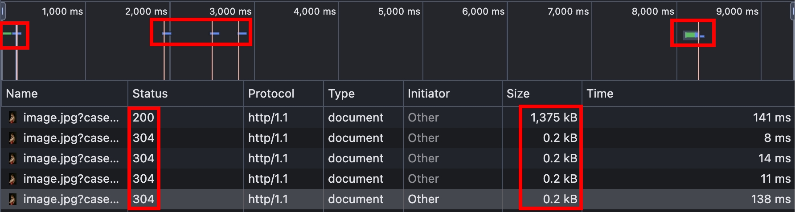
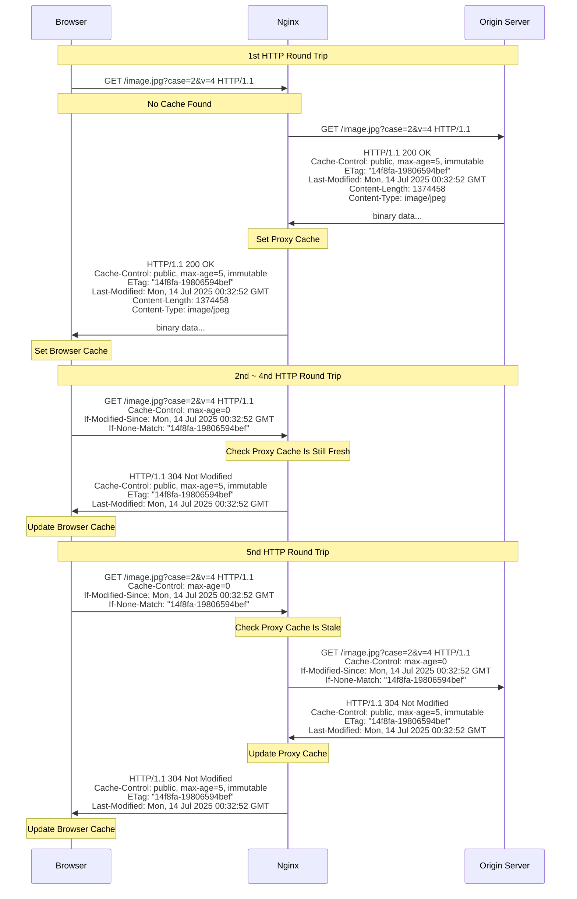
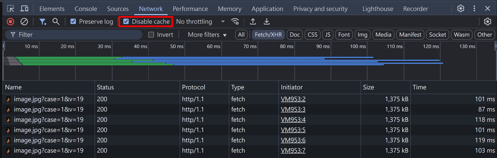

## send 套件的限制

[send](https://www.npmjs.com/package/send) 套件，依照目前最新版本 v1.2.0，只能生成 [Weak ETag](../http/http-caching-1.md#weak-etag)，這部分似乎沒有在官方文件明講。於是我翻了 send 跟 [etag](https://github.com/jshttp/etag) 的實作，得出以下結論

- etag 套件有支援 [Strong ETag](../http/http-caching-1.md#strong-etag) 的生成
- etag 套件，若傳入的 entity 是 [fs.Stats](https://nodejs.org/api/fs.html#class-fsstats) 物件，則預設就是 Weak ETag
- send 套件是使用 fs.Stats 來生成 ETag，且目前不支援 `{ weak: false }` 的參數

send/index.js

```js
if (this._etag && !res.getHeader("ETag")) {
  var val = etag(stat);
  debug("etag %s", val);
  res.setHeader("ETag", val);
}
```

etag/index.js

```js
// support fs.Stats object
var isStats = isstats(entity)
var weak = options && typeof options.weak === 'boolean'
  ? options.weak
  : isStats

...

// generate entity tag
var tag = isStats
  ? stattag(entity)
  : entitytag(entity)

return weak
  ? 'W/' + tag
  : tag

/**
 * Generate a tag for a stat.
 *
 * @param {object} stat
 * @return {string}
 * @private
 */

function stattag (stat) {
  var mtime = stat.mtime.getTime().toString(16)
  var size = stat.size.toString(16)

  return '"' + size + '-' + mtime + '"'
}
```

## ETag + If-None-Match

承接上一篇文章，我們新增以下 NodeJS 程式碼，並且使用 etag 套件來生成 Strong ETag

```ts
import { statSync } from "fs";
import { join } from "path";
import etag from "etag";

...

// ETag + If-None-Match
if (qsCase === "2") {
  const sendStream = send(req, url.pathname, {
    root: __dirname,
    etag: false,
    lastModified: true,
    cacheControl: true,
    maxAge: 5000,
    immutable: true,
  });
  res.setHeader("ETag", etag(statSync(join(__dirname, url.pathname)), { weak: false }))
  res.once("finish", () => {
    console.log("Response headers:", res.getHeaders());
    console.log("Status code:", res.statusCode);
  });
  sendStream.pipe(res);
  return;
}
```

瀏覽器輸入 http://localhost:8080/image.jpg?case=2&v=4 ，並且重整 4 次


我們將上面的 5 個請求畫成時序圖



基本上跟 [HTTP caching (第二篇) proxy_cache_revalidate 設定](../http/http-caching-2.md#proxy_cache_revalidate-設定) 的結果是差不多的，只差在

- Request 的 `If-None-Match` 跟 `If-Modified-Since` 會一起出現
- Response 的 `ETag` 跟 `Last-Modified` 會一起出現

如果一起出現的話，會優先使用 `If-None-Match` 跟 `ETag` 來進行比較，這部分可以看看 [RFC 9110](https://www.rfc-editor.org/rfc/rfc9110.html#name-if-modified-since) 的原文

```
A recipient MUST ignore If-Modified-Since if the request contains an If-None-Match header field; the condition in If-None-Match is considered to be a more accurate replacement for the condition in If-Modified-Since, and the two are only combined for the sake of interoperating with older intermediaries that might not implement If-None-Match.
```

## Cache Busting

承接 Nginx 關於 proxy_cache_key 的預設值，是使用 `$scheme$proxy_host$request_uri` 的格式。換句話說，只要 `$scheme$proxy_host$request_uri` 改變了，就會新增一個 cache。利用這個概念延伸出來的概念，就叫做 Cache Busting。其實在前端開發的世界，這個概念已經不稀奇了，你我平常應該都會看到：

```
# timestamp
script.js?v=1752655998535

# file name hash
script-randomHash.js

# version in path
/react-dom@16/umd/react-dom.production.min.js
```

概念基本上就是 timestamp, hash, version，看要放在 path, query 還是 file name。這樣的做法，就可以確保若要更新前端使用到的資源（js, css, images...），不會被快取咬住，而是會去請求最新的資源。

## proxy_cache 管理學問

Nginx 有一套機制管理、優化 proxy_cache，這邊大致列舉幾個：

- `proxy_cache_min_uses: 2;` => 兩個同樣的 request 才會把它加到 cache，確保這個資源是高頻訪問
- `proxy_cache_valid 200 302 10m;` => 200 跟 302 status code 會被 cache 10 分鐘
- `proxy_cache_path: ... inactive=60s` => cache 如果 60 秒都沒有被訪問，就會被刪除

當初在使用 Nginx proxy_cache 時沒有想太多，只是單純想測試。但沒想到要實作一個 proxy_cache 也是大有學問，不僅僅是要了解 HTTP Caching 跟 HTTP Conditional Requests 相關的 Headers，還要考量實務層面。學習 Nginx 關於 proxy_cache 相關的模組時，其實也會順便了解實務的應用場景，以及會遇到的問題。

## proxy_cache_lock

在研究 Nginx proxy_cache 相關模組時，看到一個蠻感興趣的，官方文件的介紹如下：

```
To minimize the number of accesses to proxied servers when populating a new cache element, the proxy_cache_lock directive can be used.
```

想像一個搶購演唱會門票的網站，開放搶票的瞬間，會有大量的流量湧入，這些初始流量都吃不到 cache，就很有可能直接把 Origin Server 打爆。解決這個問題的辦法也很簡單，就是讓第一個請求先到 Origin Server，等到回來 Nginx 這邊設好 cache 以後，後面的請求就可以全部回傳 304，這樣 Origin Server 就只會收到一個請求

我們實測看看，在 nginx.conf 新增以下設定，並且重啟

```conf
location / {
    proxy_cache_lock on;
    ...
}
```

瀏覽器打開 http://localhost ，Disable Cache 勾選，並且在 F12 > Network 輸入

```js
const url = "http://localhost/image.jpg?case=1&v=19";
fetch(url);
fetch(url);
fetch(url);
fetch(url);
fetch(url);
fetch(url);
```



觀察 NodeJS 的 log，確實只有一個請求，Nginx 幫 Origin Server 擋掉了超多請求的！

```
Request url: /image.jpg?case=1&v=19
Request headers: {
  'cache-control': 'no-cache',
  ...
}
Response headers: [Object: null prototype] {
  'cache-control': 'public, max-age=5, immutable',
  'last-modified': 'Thu, 27 Feb 2025 14:07:46 GMT',
  'content-type': 'image/jpeg',
  'content-length': 1374458
}
Status code: 200
```

## Vary

微尷尬的一個 Response Header，雖然立意良善，但是實務上的使用情境不多～這本來應該是要在 [HTTP content negotiation](../http/http-content-negotiation.md) 的篇章講到，但實際上又會牽扯到 cache，所以就統一在這邊帶過

以 [HTTP content negotiation - NodeJS HTTP Server + negotiator 實作](../http/http-content-negotiation.md#nodejs-http-server--negotiator-實作) 為例，Server 會根據不同的 `Accept` 以及 `Accept-Language` 回傳不同的資源，在這個情況，其實應該加上

```ts
res.setHeader("Vary", "Accept, Accept-Language");
```

但是，就像我們在 [Cache Busting](#cache-busting) 提到的，Nginx 預設的 cache key 是 `$scheme$proxy_host$request_uri`，如果用這個 cache key 的話，就會導致不同語系跟不同 Content-Type 的資源都被寫入同一個 cache，除非要把 Vary 也加入 cache key 的格式，但就要再額外設定。實務上，通常會直接用 URL 切開，可參考 [HTTP content negotiation - Accept-Language & Content-Language 實務](../http/http-content-negotiation.md#accept-language--content-language-實務) 的範例

## X-Cache-Status

實務上，為了監控 cache 狀態，常常會在 response header 加上 `X-Cache-Status`，在 Cloudflare 的架構下叫做 `CF-Cache-Status`，但基本上就同樣概念。Nginx 也有支援，設定如下：

```conf
location / {
    ...
    add_header X-Cache-Status $upstream_cache_status;
}
```

支援以下七種值

- MISS => 第一次請求，Nginx 還沒有 cache
- BYPASS => 須設定 [proxy_cache_bypass](https://nginx.org/en/docs/http/ngx_http_proxy_module.html#proxy_cache_bypass) 才會看到
- EXPIRED => 快取過期，直接跟 Origin Server 請求新的資源
- STALE => 須設定 [proxy_cache_use_stale](https://nginx.org/en/docs/http/ngx_http_proxy_module.html#proxy_cache_use_stale) 才會看到
- UPDATING => 須設定 `proxy_cache_use_stale updating;` 才會看到，概念跟 [Cache-Control: stale-while-revalidate](https://developer.mozilla.org/en-US/docs/Web/HTTP/Reference/Headers/Cache-Control#stale-while-revalidate) 類似，cache 過期後，先回傳 stale resource，然後再跟 Origin Server 重新驗證
- REVALIDATED => Conditional Request 成功
- HIT => 命中 cache

## 小結

Cache 是一個很大的主題，分了三篇才講完，實際上還有很多內容可以深入研究跟測試，不過我想，這三篇文章已經涵蓋了大部分的使用情境了～

## 參考資料

- https://developer.mozilla.org/en-US/docs/Web/HTTP/Guides/Caching
- https://developer.mozilla.org/en-US/docs/Web/HTTP/Reference/Headers/Cache-Control
- https://developer.mozilla.org/en-US/docs/Web/HTTP/Reference/Headers/Expires
- https://developer.mozilla.org/en-US/docs/Web/HTTP/Reference/Headers/Last-Modified
- https://developer.mozilla.org/en-US/docs/Web/HTTP/Reference/Headers/ETag
- https://developer.mozilla.org/en-US/docs/Web/HTTP/Reference/Headers/Vary
- https://developer.mozilla.org/en-US/docs/Web/HTTP/Reference/Headers/Pragma
- https://developer.mozilla.org/en-US/docs/Web/HTTP/Reference/Headers/Age
- https://developer.mozilla.org/en-US/docs/Web/HTTP/Reference/Status/304
- https://datatracker.ietf.org/doc/html/rfc9111
- https://nginx.org/en/docs/http/ngx_http_proxy_module.html#proxy_cache_key
- https://nginx.org/en/docs/http/ngx_http_proxy_module.html#proxy_cache_path
- https://nginx.org/en/docs/http/ngx_http_proxy_module.html#proxy_cache
- https://nginx.org/en/docs/http/ngx_http_proxy_module.html#proxy_set_header
