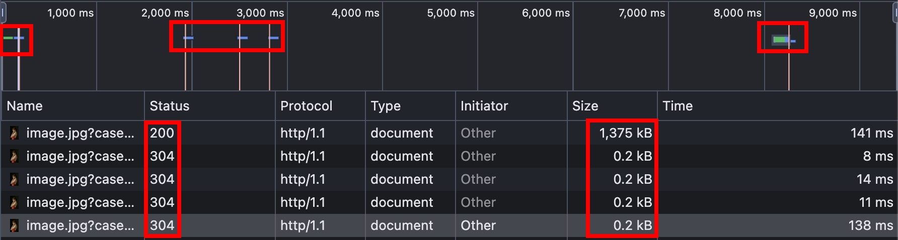
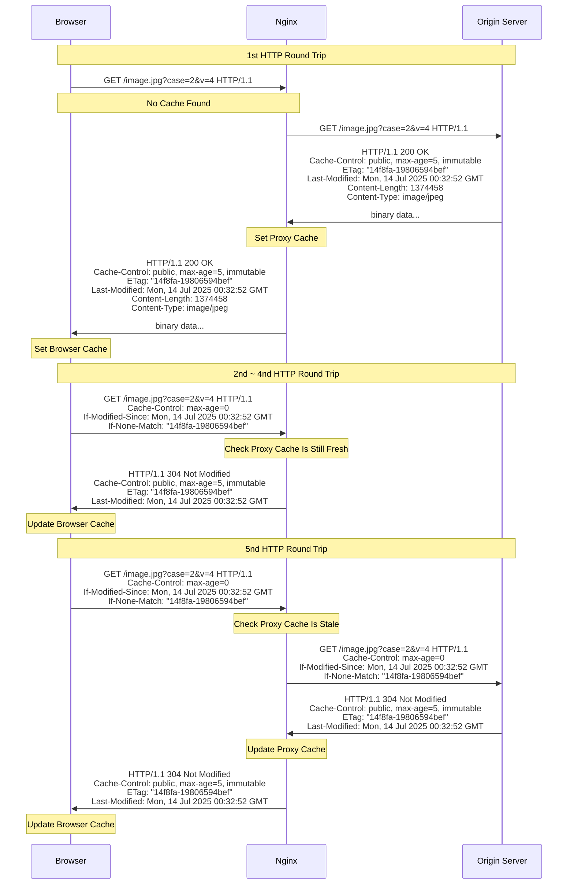

## send 套件的限制

[send](https://www.npmjs.com/package/send) 套件，依照目前最新版本 v1.2.0，只能生成 [Weak ETag](../http/http-caching-1.md#weak-etag)，這部分似乎沒有在官方文件明講．於是我翻了 send 跟 [etag](https://github.com/jshttp/etag) 的實作，得出以下結論

- etag 套件有支援 [Strong ETag](../http/http-caching-1.md#strong-etag) 的生成
- etag 套件，若傳入的 entity 是 [fs.Stats](https://nodejs.org/api/fs.html#class-fsstats) 物件，則預設就是 Weak ETag
- send 套件是使用 fs.Stats 來生成 ETag，且目前不支援 `{ weak: false }` 的參數

send/index.js

```js
if (this._etag && !res.getHeader("ETag")) {
  var val = etag(stat);
  debug("etag %s", val);
  res.setHeader("ETag", val);
}
```

etag/index.js

```js
// support fs.Stats object
var isStats = isstats(entity)
var weak = options && typeof options.weak === 'boolean'
  ? options.weak
  : isStats

...

// generate entity tag
var tag = isStats
  ? stattag(entity)
  : entitytag(entity)

return weak
  ? 'W/' + tag
  : tag

/**
 * Generate a tag for a stat.
 *
 * @param {object} stat
 * @return {string}
 * @private
 */

function stattag (stat) {
  var mtime = stat.mtime.getTime().toString(16)
  var size = stat.size.toString(16)

  return '"' + size + '-' + mtime + '"'
}
```

## ETag + If-None-Match

承接上一篇文章，我們新增以下 NodeJS 程式碼，並且使用 etag 套件來生成 Strong ETag

```ts
import { statSync } from "fs";
import { join } from "path";
import etag from "etag";

...

// ETag + If-None-Match
if (qsCase === "2") {
  const sendStream = send(req, url.pathname, {
    root: __dirname,
    etag: false,
    lastModified: true,
    cacheControl: true,
    maxAge: 5000,
    immutable: true,
  });
  res.setHeader("ETag", etag(statSync(join(__dirname, url.pathname)), { weak: false }))
  res.once("finish", () => {
    console.log("Response headers:", res.getHeaders());
    console.log("Status code:", res.statusCode);
  });
  sendStream.pipe(res);
  return;
}
```

瀏覽器輸入 http://localhost:8080/image.jpg?case=2&v=4 ，並且重整 4 次


我們將上面的 5 個請求畫成時序圖


```mermaid
sequenceDiagram
  participant Browser
  participant Nginx
  participant Origin Server

  Note over Browser, Origin Server: 1st HTTP Round Trip

  Browser ->> Nginx: GET /image.jpg?case=2&v=4 HTTP/1.1
  Note over Browser, Nginx: No Cache Found
  Nginx ->> Origin Server: GET /image.jpg?case=2&v=4 HTTP/1.1
  Origin Server ->> Nginx: HTTP/1.1 200 OK<br/>Cache-Control: public, max-age=5, immutable<br/>ETag: "14f8fa-19806594bef"<br/>Last-Modified: Mon, 14 Jul 2025 00:32:52 GMT<br/>Content-Length: 1374458<br/>Content-Type: image/jpeg<br/><br/>binary data...
  Note over  Nginx: Set Proxy Cache
  Nginx ->> Browser: HTTP/1.1 200 OK<br/>Cache-Control: public, max-age=5, immutable<br/>ETag: "14f8fa-19806594bef"<br/>Last-Modified: Mon, 14 Jul 2025 00:32:52 GMT<br/>Content-Length: 1374458<br/>Content-Type: image/jpeg<br/><br/>binary data...
  Note over Browser: Set Browser Cache

  Note over Browser, Origin Server: 2nd ~ 4nd HTTP Round Trip

  Browser ->> Nginx: GET /image.jpg?case=2&v=4 HTTP/1.1<br/>Cache-Control: max-age=0<br/>If-Modified-Since: Mon, 14 Jul 2025 00:32:52 GMT<br/>If-None-Match: "14f8fa-19806594bef"
  Note over  Nginx: Check Proxy Cache Is Still Fresh
  Nginx ->> Browser: HTTP/1.1 304 Not Modified<br/>Cache-Control: public, max-age=5, immutable<br/>ETag: "14f8fa-19806594bef"<br/>Last-Modified: Mon, 14 Jul 2025 00:32:52 GMT
  Note over Browser: Update Browser Cache

  Note over Browser, Origin Server: 5nd HTTP Round Trip

  Browser ->> Nginx: GET /image.jpg?case=2&v=4 HTTP/1.1<br/>Cache-Control: max-age=0<br/>If-Modified-Since: Mon, 14 Jul 2025 00:32:52 GMT<br/>If-None-Match: "14f8fa-19806594bef"
  Note over  Nginx: Check Proxy Cache Is Stale
  Nginx ->> Origin Server: GET /image.jpg?case=2&v=4 HTTP/1.1<br/>Cache-Control: max-age=0<br/>If-Modified-Since: Mon, 14 Jul 2025 00:32:52 GMT<br/>If-None-Match: "14f8fa-19806594bef"
  Origin Server ->> Nginx: HTTP/1.1 304 Not Modified<br/>Cache-Control: public, max-age=5, immutable<br/>ETag: "14f8fa-19806594bef"<br/>Last-Modified: Mon, 14 Jul 2025 00:32:52 GMT
  Note over  Nginx: Update Proxy Cache
  Nginx ->> Browser: HTTP/1.1 304 Not Modified<br/>Cache-Control: public, max-age=5, immutable<br/>ETag: "14f8fa-19806594bef"<br/>Last-Modified: Mon, 14 Jul 2025 00:32:52 GMT
  Note over Browser: Update Browser Cache
```

基本上跟 [HTTP caching (第二篇) proxy_cache_revalidate 設定](../http/http-caching-2.md#proxy_cache_revalidate-設定) 的結果是差不多的，只差在

- Request 的 `If-None-Match` 跟 `If-Modified-Since` 會一起出現
- Response 的 `ETag` 跟 `Last-Modified` 會一起出現

如果一起出現的話，會優先使用 `If-None-Match` 跟 `ETag` 來進行比較，這部分可以看看 [RFC 9110](https://www.rfc-editor.org/rfc/rfc9110.html#name-if-modified-since) 的原文

```
A recipient MUST ignore If-Modified-Since if the request contains an If-None-Match header field; the condition in If-None-Match is considered to be a more accurate replacement for the condition in If-Modified-Since, and the two are only combined for the sake of interoperating with older intermediaries that might not implement If-None-Match.
```

## Cache Busting

承接 Nginx 設定 proxy_cache_key 的方式，是使用 `$scheme$proxy_host$request_uri` 的格式．換句話說，只要 `$scheme$proxy_host$request_uri` 改變了，就會新增一個 cache．利用這個概念延伸出來的概念，就叫做 Cache Busting．其實在前端開發的世界，這個概念已經不稀奇了，你我平常應該都會看到：

```
# timestamp
script.js?v=1752655998535

# file name hash
script-randomHash.js

# version in path
/react-dom@16/umd/react-dom.production.min.js
```

概念基本上就是 timestamp, hash, version，看要放在 path, query 還是 file name．這樣的做法，就可以確保若要更新前端使用到的資源（js, css, images...），不會被快取咬住，而是會去請求最新的資源．

## If-Match

<!-- todo-yus 研究有誰支援 -->

## If-Unmodified-Since

<!-- todo-yus 研究有誰支援 -->

## 參考資料

- https://developer.mozilla.org/en-US/docs/Web/HTTP/Guides/Caching
- https://developer.mozilla.org/en-US/docs/Web/HTTP/Reference/Headers/Cache-Control
- https://developer.mozilla.org/en-US/docs/Web/HTTP/Reference/Headers/Expires
- https://developer.mozilla.org/en-US/docs/Web/HTTP/Reference/Headers/Last-Modified
- https://developer.mozilla.org/en-US/docs/Web/HTTP/Reference/Headers/ETag
- https://developer.mozilla.org/en-US/docs/Web/HTTP/Reference/Headers/Vary
- https://developer.mozilla.org/en-US/docs/Web/HTTP/Reference/Headers/Pragma
- https://developer.mozilla.org/en-US/docs/Web/HTTP/Reference/Headers/Age
- https://developer.mozilla.org/en-US/docs/Web/HTTP/Reference/Status/304
- https://www.rfc-editor.org/rfc/rfc9111.html
- https://nginx.org/en/docs/http/ngx_http_proxy_module.html#proxy_cache_key
- https://nginx.org/en/docs/http/ngx_http_proxy_module.html#proxy_cache_path
- https://nginx.org/en/docs/http/ngx_http_proxy_module.html#proxy_cache
- https://nginx.org/en/docs/http/ngx_http_proxy_module.html#proxy_set_header
