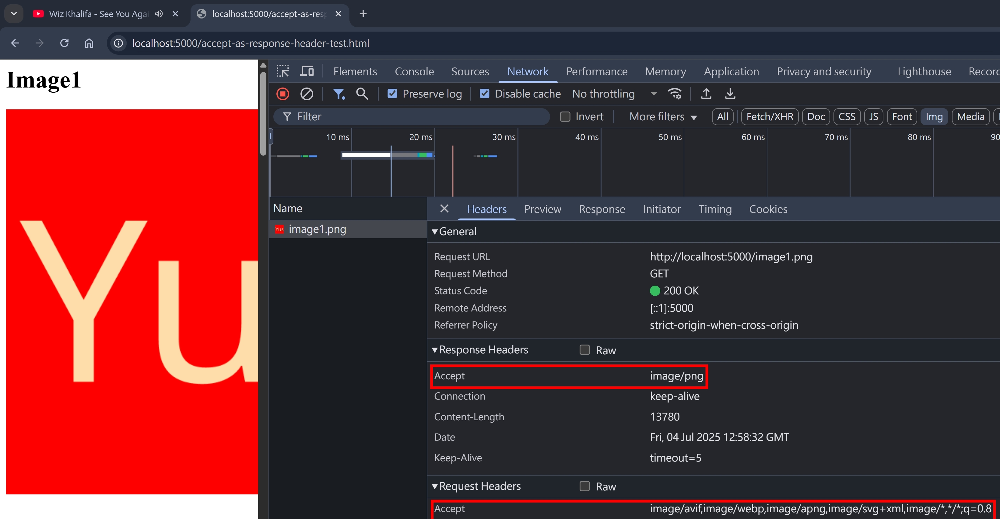

## Content Negotiation

### Server-driven Content Negotiation

概念不難，就是一個 HTTP Round Trip，Client 使用 `Accept` 開頭的 Header 跟 Server 說我想要什麼類型的資源，Server 把最適合的資源回傳，並使用 `Content` 開頭的 Header 告訴 Client 這個資源的 metadata


### Agent-driven Content Negotiation

別被 Agent 這個名詞嚇到，這裡的 Agent 指的是 HTTP Agent，也就是幫你發 HTTP Request 的 "代理人"。例如：瀏覽器、curl、Postman，總的來說就是 Client

概念也不難，就是兩個 HTTP Round Trip

- 第一個 Round Trip，Server 會把它支援的 alternative resource 都回傳（300 Multiple Choices）
- 第一個 Round Trip，Client 請求它想要的 resource，Server 回傳


### Server-driven vs Agent-driven

Agent-driven 的設計，是為了解決 Server-driven 需要在每次 HTTP Request 都帶上一堆 `Accept` 開頭的 Headers，且可以讓 Client 自行選擇要哪個 resouce

設計上很美好，可惜 Agent-driven 卻需要兩個 HTTP Round Trip，加上 [RFC 9110](https://www.rfc-editor.org/rfc/rfc9110.html#name-300-multiple-choices) 並沒有規範 300 Multiple Choices 的 Response Body 格式，導致實作上都是 By Case，支援度自然就會很低

以下節錄 [RFC 9110 #300 Multiple Choices](https://www.rfc-editor.org/rfc/rfc9110.html#name-300-multiple-choices) 的原文：

```
A specific format for automatic selection is not defined by this specification because HTTP tries to remain orthogonal to the definition of its content.
```

結論是，實務上還是以 Server-driven 為主流～

## Accept & Content-Type

這兩個可以算是一對的 Headers，其中 `Content-Type` 可參考我之前寫的 [content-type-and-mime-type](../http/content-type-and-mime-type.md)，這個章節只介紹 `Accept`

### 語法

```
Accept: text/html
Accept: text/*
Accept: */*
Accept: text/html, application/xml;q=0.9, image/webp, */*;q=0.8
```

### 簡介

- Request & Response Header
- 作為 Request Header 的情境，Client 會把其支援的 `Content-Type` 都列出來，讓 Server 選擇最適合的
- 承上，瀏覽器針對不同類型的 resource，例如 ``, `<script>`，會有不同的預設值
- 承上，各家瀏覽器的預設值可能不一樣
- 承上，以 Chrome V138 為例

```
CSS => Accept: text/css,*/*;q=0.1
JS => Accept: */*
Img => Accept: image/avif,image/webp,image/apng,image/svg+xml,image/*,*/*;q=0.8
```

- 作為 Response Header 的情境，Server 會把其支援的 `Content-Type` 都列出來，讓 Client 在之後的請求可以調整 `Accept` Request Header

### 作為 Response Header 的情境

為了測試瀏覽器有沒有 "在之後的請求調整 `Accept` Request Header"，我們寫個簡單的情境測試

index.ts

```ts
const acceptAsResponseHeaderTestHTML = readFileSync(
  join(__dirname, "accept-as-response-header-test.html"),
);

// Accept as Response Header Test
if (req.url === "/accept-as-response-header-test.html") {
  res.setHeader("Content-Type", "text/html");
  res.end(acceptAsResponseHeaderTestHTML);
  return;
}
if (req.url === "/image1.png") {
  console.log("image1.png", req.headers.accept);
  res.setHeader("Accept", "image/png");
  res.end(png);
  return;
}
if (req.url === "/image2.png") {
  console.log("image2.png", req.headers.accept);
  res.setHeader("Accept", "image/png");
  res.end(png);
  return;
}
```

accept-as-response-header-test.html

```html
<html>
  <head></head>
  <body>
    <h1>Image1</h1>
    <div style="height: 300vh;">
      
    </div>
    <!-- 第二張圖片要往下滾才會觸發 HTTP Request -->
    <h1>Image2</h1>
    <div style="height: 300vh;">
      
    </div>
  </body>
</html>
```

瀏覽器打開 http://localhost:5000/accept-as-response-header-test.html，並且慢慢往下滾。結論是第二個 Request 的 `Accept`，並沒有依照第一個 Response 回傳的 `Accept` 去調整



根據 [RFC 9110](https://www.rfc-editor.org/rfc/rfc9110.html#name-accept) 的描述：

```
When sent by a server in a response, Accept provides information about which content types are preferred in the content of a subsequent request to the same resource.
```

也並沒有說到 Client `SHOULD` 或是 `MAY` 在接下來的 HTTP Request 使用 Server 回傳的 `Accept`，代表這個是非強制性的。我在實務上的使用情境，也很少看到 Server 會回傳 `Accept`。在 `Server-Driven Content Negotiation` 的情境，Client 提供它支援的 `Accept`，Server 根據自己的能力回傳最適合的 `Content-Type`，然後就結束了XD

## Accept-Encoding & Content-Encoding

可參考先前寫過的 [accept-encoding-and-content-encoding](../http/accept-encoding-and-content-encoding.md)，這也是 Content-Negotiation 的一環，不過本篇文章不會提到

## Accept-Language & Content-Language

- `Accept-Language` 是 Request Header，瀏覽器也會自動帶上。以 Chrome V138 為例：

```
Accept-Language: zh-TW,zh;q=0.9,en-US;q=0.8,en;q=0.7
```

## Accept-Language & Content-Language 實務

- 實務上，若有支援多語系的網站，會提供切換語系的功能，`Accept-Language` 則是作為預設的語系
- 承上，以 [console.cloud.google.com](https://console.cloud.google.com/) 為例，有提供切換語系的功能
  
- `Content-Language` 跟 `Content-Type` 都是 `representation header`，簡單講就是描述 HTTP Body 區塊的 metadata
- `Content-Language` 可當作 Request & Response Header，但實務上我沒看過
- 實務上，因為快取的實作、網站流量分析、Debug 的方便性等等，通常會直接把不同的語系，用不同的 URL 切開，例如

```
# query string
https://example.com/
https:/example.com/?lang=en-US
# path
https://example.com/
https://example.com/en/
# sub domain
https://example.com/
https://cn.example.com/
```

## Content-Location

- 也是 `Content-*` 家族的 `representation header`
- 我在實務上沒看過這個 Header 的使用情境，這個 Header 跟 [Content-Language](#accept-language--content-language) 差不多是同樣的情況，[RFC 9110](https://www.rfc-editor.org/rfc/rfc9110.html) 規範有定義，但實務上沒什麼使用情境
- 語法：

```
Content-Location: /path/to/resource
Content-Location: https://example.com/path/to/resource
```

## 406 Not Acceptable

在 [Content Negotiation](#content-negotiation) 的過程，Server 如果不支援 Client 想要的 resource 類型，其實可以回傳 406 Not Acceptable。

但實務上，會建議 Server 回傳預設的 resource，讓使用者體驗更好，所以這個 status code 也是屬於 "規範有，但實務上沒什麼人實作" 的類型

## NodeJS HTTP Server + negotiator 實作

[negotiator](https://www.npmjs.com/package/negotiator) 是一個 NodeJS 老牌的，用來解析 `Accept` 開頭 Header 的套件，我們用它來實作一個簡易的 Content-Negotiation

```ts
import Negotiator from "negotiator";
import httpServer from "../httpServer";
import { readFileSync } from "fs";
import { join } from "path";

const availableMediaTypes = ["application/json", "text/html"];
const availableLanguages = ["zh-TW", "en-US"];
const messages: { [key: string]: { [key: string]: string | NonSharedBuffer } } =
  {
    "zh-TW": {
      "application/json": JSON.stringify({ message: "您好世界" }),
      "text/html": readFileSync(join(__dirname, "zh-TW.html")),
    },
    "en-US": {
      "application/json": JSON.stringify({ message: "hello world" }),
      "text/html": readFileSync(join(__dirname, "en-US.html")),
    },
  };

httpServer.on("request", function requestListener(req, res) {
  // content-negotiation
  if (req.url === "/") {
    const negotiator = new Negotiator({ headers: req.headers });

    const language = String(negotiator.language(availableLanguages));
    const mediaType = String(negotiator.mediaType(availableMediaTypes));
    const message = messages[language]?.[mediaType];
    if (message) {
      res.setHeader("Content-Language", language);
      res.setHeader("Content-Type", mediaType);
      res.end(message);
      return;
    }
    // fallback case
    // we could return 406, but return 200 with default resource would be preferable
    res.setHeader("Content-Language", availableLanguages[0]);
    res.setHeader("Content-Type", availableMediaTypes[0]);
    res.end(messages[availableLanguages[0]][availableMediaTypes[0]]);
    return;
  }
});
```

測試看看 `curl -H "Accept: text/html" -H "Accept-Language: zh-TW" http://localhost:5000/`

```html
<html lang="zh-TW">
  <head>
    <meta charset="utf-8" />
  </head>
  <body>
    <h1>您好世界</h1>
  </body>
</html>
```

測試看看 `curl -H "Accept: application/json" -H "Accept-Language: en-US" http://localhost:5000/`

```json
{ "message": "hello world" }
```

測試看看 `curl -H "Accept: text/html, application/json" -H "Accept-Language: en-US, zh-TW" http://localhost:5000/`

```html
<html lang="en-US">
  <head>
    <meta charset="utf-8" />
  </head>
  <body>
    <h1>hello world</h1>
  </body>
</html>
```

測試看看 `curl -H "Accept: */*" -H "Accept-Language: */*" http://localhost:5000/`

```json
{ "message": "您好世界" }
```

以上測試都符合預期～

## 小結

`Content-Negotiation`，我放到很後面才講，當初看標題以為是一個很難的主題，結果實際閱讀完，才發現其實概念也不難。過程中也看到很多歷史的演進，像是 `Accept-Charset`，現在基本上都是 `UTF-8` 的年代，所以這個 Header 基本上也沒在使用了。另外還有 300 Multiple Choices 的概念，讓我理解到規範跟實作的差距。希望看完本篇文章的你，也有所收穫呦～

## 參考資料

- https://developer.mozilla.org/en-US/docs/Web/HTTP/Content_negotiation
- https://developer.mozilla.org/en-US/docs/Web/HTTP/Reference/Headers/Accept
- https://developer.mozilla.org/en-US/docs/Web/HTTP/Reference/Headers/Accept-Encoding
- https://developer.mozilla.org/en-US/docs/Web/HTTP/Reference/Headers/Accept-Language
- https://developer.mozilla.org/en-US/docs/Web/HTTP/Reference/Headers/Content-Language
- https://developer.mozilla.org/en-US/docs/Web/HTTP/Reference/Headers/Content-Location
- https://developer.mozilla.org/en-US/docs/Web/HTTP/Reference/Headers/Vary
- https://developer.mozilla.org/en-US/docs/Web/HTTP/Reference/Status/300
- https://www.rfc-editor.org/rfc/rfc9110.html
- https://developer.mozilla.org/en-US/docs/Web/HTTP/Reference/Status/406
- https://www.npmjs.com/package/negotiator
<!-- todo 不一定要讀 -->
- https://httpd.apache.org/docs/current/en/content-negotiation.html#algorithm
