## 使用時機

Range Requests，通常用在影片播放，當我們使用 `<video>` 載入影片時：

- 若 Server 支援 Range，就可以實現跳轉功能
- 若 Server 不支援 Range，則無法跳轉

以 [Google 提供的 Public Test MP4](http://commondatastorage.googleapis.com/gtv-videos-bucket/sample/ElephantsDream.mp4) 為例，當我們每次跳轉的時候，都會發起一個 Range Request，取得當前進度的影片內容
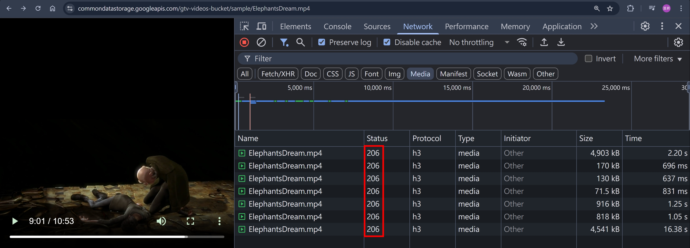

## Range 相關的 Headers

同樣以 [Google 提供的 Public Test MP4](http://commondatastorage.googleapis.com/gtv-videos-bucket/sample/ElephantsDream.mp4) 為例：

1. Client 會發送

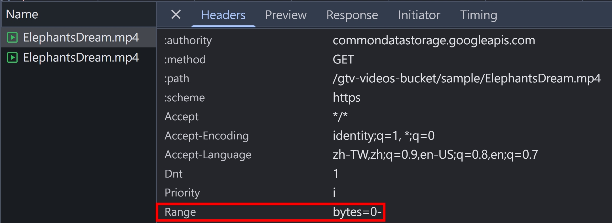 2. Server 若支援 Range，則會回傳 206 Partial Content

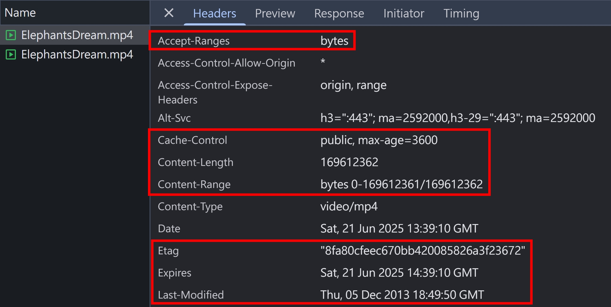 3. 切換影片進度時，Client 會多發送一個 `If-Range` 的 Header

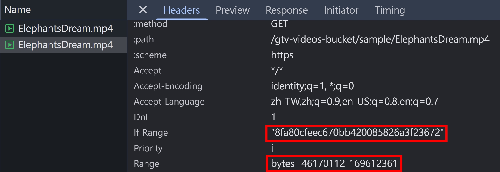 4. Server 會比對 `If-Range` 跟 `etag` 或是 `last-modified` 是否一樣

若一樣，則回傳 206 Partial Content
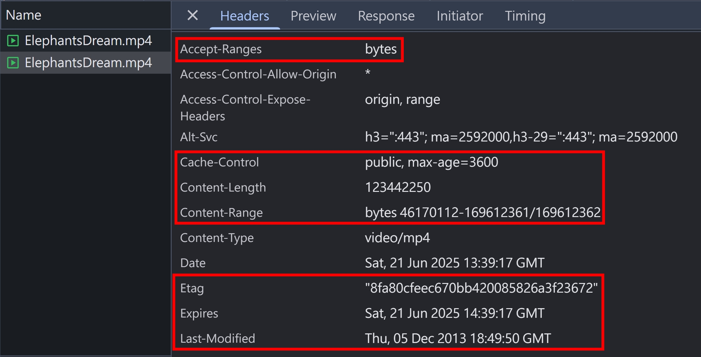
若不一樣，則回傳 200 + 整個文檔

```
HTTP/1.1 200
Accept-Ranges: bytes
Content-Length: 169612362
```

## send 套件的實作

`express.static` 的底層是使用 [serve-static](https://www.npmjs.com/package/serve-static) 這個套件，而 [serve-static](https://www.npmjs.com/package/serve-static) 的底層則是用 [send](https://www.npmjs.com/package/send)。

[send](https://www.npmjs.com/package/send) 這個套件處理了 range 以及 cache 相關的邏輯，我們來看看 `If-Range` 的實作，跟規範定義的一樣，`If-Range` 可以是 `ETag` 或是 `Last-Modified`

```js
/**
 * Check if the range is fresh.
 *
 * @return {Boolean}
 * @api private
 */

SendStream.prototype.isRangeFresh = function isRangeFresh() {
  var ifRange = this.req.headers["if-range"];

  if (!ifRange) {
    return true;
  }

  // if-range as etag
  if (ifRange.indexOf('"') !== -1) {
    var etag = this.res.getHeader("ETag");
    return Boolean(etag && ifRange.indexOf(etag) !== -1);
  }

  // if-range as modified date
  var lastModified = this.res.getHeader("Last-Modified");
  return parseHttpDate(lastModified) <= parseHttpDate(ifRange);
};
```

再來看看怎麼達成資料切片的

```js
SendStream.prototype.stream = function stream(path, options) {
  var self = this;
  var res = this.res;

  // pipe
  var stream = fs.createReadStream(path, options);
  this.emit("stream", stream);
  stream.pipe(res);

  // other code ...
};
```

其實 NodeJS 原生的 `createReadStream` 就可以指定 `opions = { start: 0, end: 1023 }`，讀取指定 range 的 bytes

## NodeJS HTTP 模組 + send

我們創建一個 NodeJS HTTP Server，針對 `/article.txt` 這個路由使用 `send` 套件，其中 `/article.txt` 是一篇 AI 隨機生成的 1000 字文章

```ts
import httpServer from "../httpServer";
import send from "send";
import { notFoundListener } from "../listeners/notFoundlistener";
import { faviconListener } from "../listeners/faviconListener";

httpServer.on("request", function requestListener(req, res) {
  if (req.url === "/favicon.ico") return faviconListener(req, res);
  if (req.url === "/article.txt") {
    res.setHeader("Content-Type", "text/plain;charset=utf-8");
    return send(req, String(req.url), { root: __dirname }).pipe(res);
  }
  return notFoundListener(req, res);
});
```

使用 Postman 發起一個 Range Request，可以看到確實有回傳對應的 Range
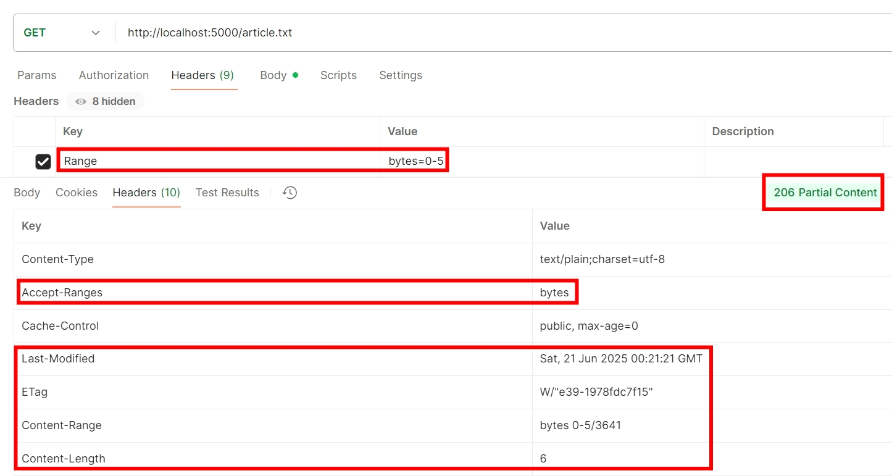
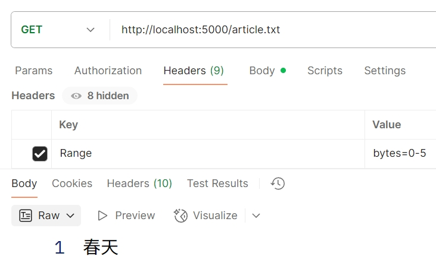

使用 Postman 發起 `If-Range` 的請求，發送正確的 ETag，Server 比對後，回傳對應的 Range
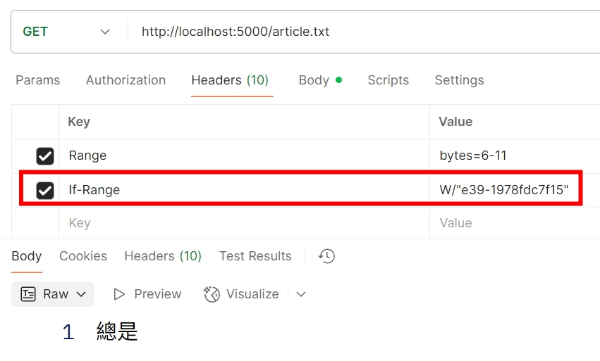
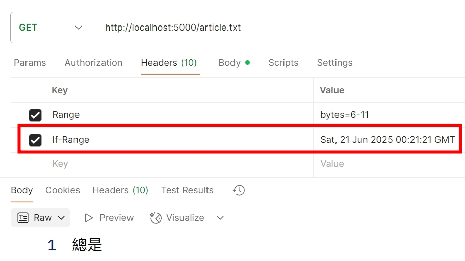

使用 Postman 發起 `If-Range` 的請求，發送錯誤的 ETag，Server 比對後，回傳 200 + 整個檔案
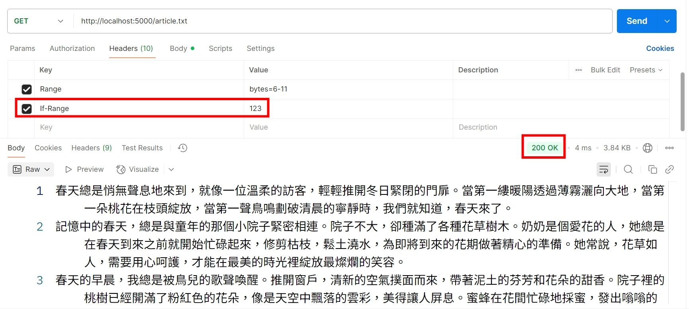

## Range 的不同形式

- 不指定尾巴，代表取到最後一個 byte　`Range: bytes=6-`
  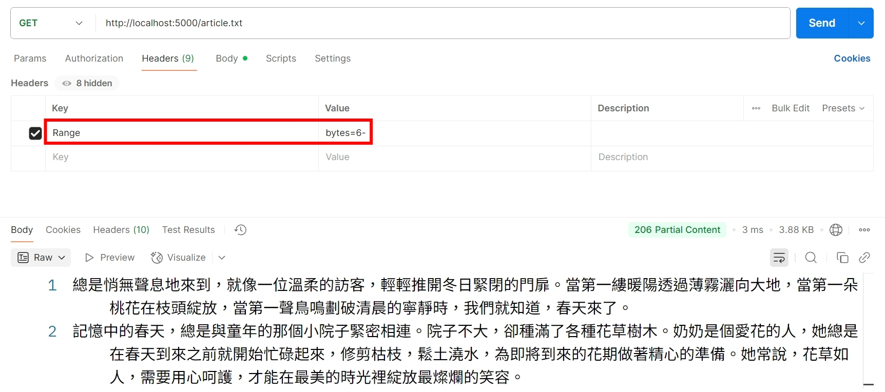

- 使用負數，代表從後面數過來 99 個 bytes `Range: bytes=-99`
  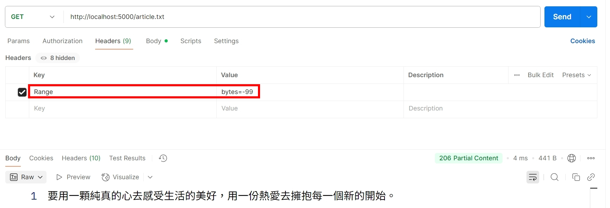

- 多個區間（但 send 套件不支援，會直接回傳整個檔案），`Range: bytes=0-5,9-14`
  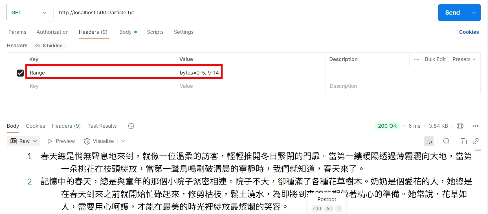

## multipart/byteranges

並不是所有 Application Server 或是 Web Server 都支援多個 Range 區間，但 Apache 有支援，所以我們來嘗試看看！

1. 下載最新的 [XAMPP](https://www.apachefriends.org/zh_tw/download.html)
2. 啟動 Apache Web Server 後，預設會在 `C:\xampp\htdocs` 有很多檔案，隨便挑一個 HTML 檔案
3. 使用 Postman 發送 multi-range 請求
   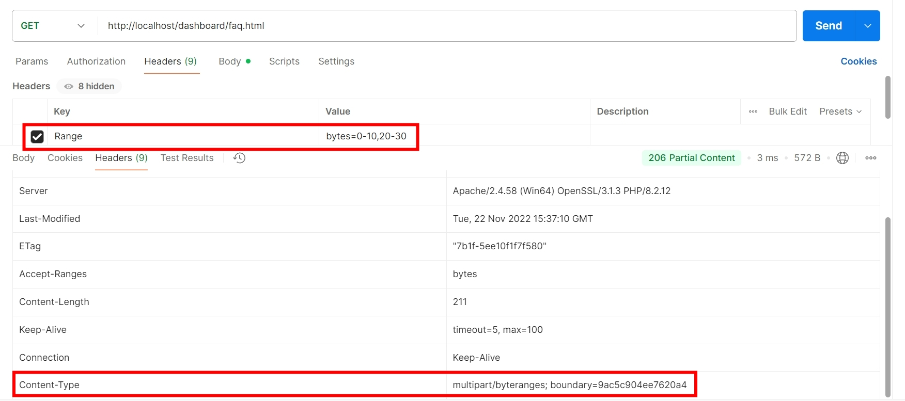
   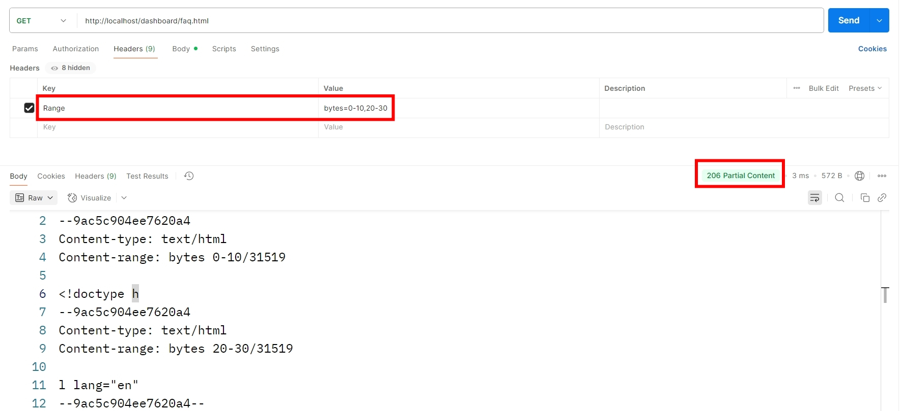
   💡要注意，這邊的 `Range: bytes=0-5,9-14` 不可寫成 `Range: bytes=0-5, 9-14`，Apache 會解析失敗💡

## 416 Range Not Satisfiable

當 client 端送了超出範圍的 range，Server 就會回傳 416，並且回傳 `Content-Range: bytes */3641`，告訴 client 這個檔案只有 3641 bytes。
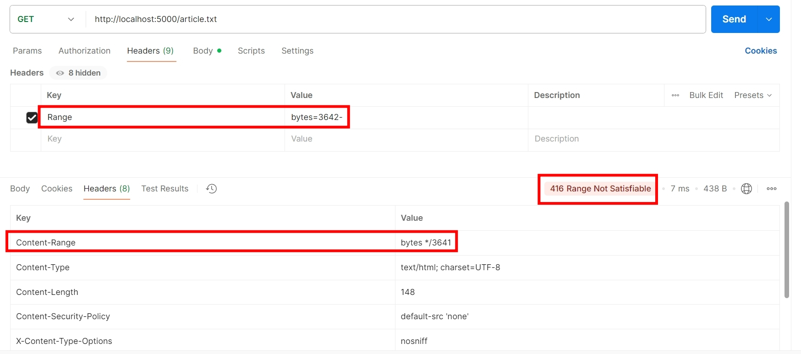

## NodeJS + HTTP 模組自行實作 Range

1. 下載 [Google 提供的 Public Test MP4](http://commondatastorage.googleapis.com/gtv-videos-bucket/sample/ElephantsDream.mp4)
2. 調整 NodeJS 程式碼

index.ts

```ts
httpServer.on("request", function requestListener(req, res) {
  if (req.url === "/favicon.ico") return faviconListener(req, res);
  if (req.url === "/article.txt") {
    res.setHeader("Content-Type", "text/plain;charset=utf-8");
    return send(req, String(req.url), { root: __dirname }).pipe(res);
  }
  if (req.url === "/ElephantsDream.mp4") return rangeListener(req, res);
  return notFoundListener(req, res);
});

const mp4file = readFileSync(join(__dirname, "ElephantsDream.mp4"));
const rangeListener: RequestListener<
  typeof IncomingMessage,
  typeof ServerResponse
> = (req, res) => {
  const range = req.headers.range;

  res.setHeader("Content-Type", "video/mp4");
  // invalid range
  if (!range || !range.startsWith("bytes=")) return res.end(mp4file);

  const [startStr, endStr] = range.split("bytes=")[1].split("-");
  const start = parseInt(startStr);
  const end = endStr === "" ? mp4file.byteLength - 1 : parseInt(endStr);

  // 416
  if (start > end || start > mp4file.byteLength) {
    res.statusCode = 416;
    res.setHeader("Content-Range", `bytes */${mp4file.byteLength}`);
    res.end(STATUS_CODES[416]);
    return;
  }

  const options = { start, end };
  const readStream = createReadStream(
    join(__dirname, "ElephantsDream.mp4"),
    options,
  );
  res.setHeader("Accept-Ranges", "bytes");
  res.setHeader("Content-Range", `bytes ${start}-${end}/${mp4file.byteLength}`);
  res.setHeader("Content-Length", end - start + 1);
  res.statusCode = 206;
  readStream.pipe(res);
};
```

3. 瀏覽器打開 http://localhost:5000/ElephantsDream.mp4 ，都可以正常切換影片進度～
   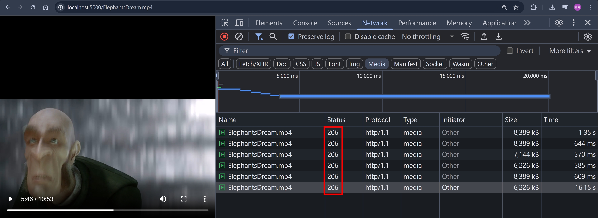

## 小結

本篇文章，帶大家了解 Range 請求，平常看影片/大型檔案下載時就會用到這個技術，深入了解才發現實作起來眉角很多，並且也翻了 send 套件跟 Apache Web Server，才把 Range 請求的行為都測試過一輪，算是收穫滿滿～

## 參考資料

- https://developer.mozilla.org/en-US/docs/Web/HTTP/Range_requests
- https://developer.mozilla.org/en-US/docs/Web/HTTP/Reference/Headers/Range
- https://developer.mozilla.org/en-US/docs/Web/HTTP/Reference/Headers/If-Range
- https://developer.mozilla.org/en-US/docs/Web/HTTP/Reference/Headers/Content-Range
- https://developer.mozilla.org/en-US/docs/Web/HTTP/Reference/Headers/Accept-Ranges
- https://developer.mozilla.org/en-US/docs/Web/HTTP/Reference/Status/206
- https://developer.mozilla.org/en-US/docs/Web/HTTP/Reference/Status/416
