## 前言

一直沒有很深入了解 3xx Status Code 有哪些，各代表什麼含意，就趁這篇文章把它搞懂吧！

## Permanent redirections

- 代表原本的網址已經不再使用了
- 例如，網站搬家，從 old.example.com 搬到 new.example.com
- 搜尋引擎爬蟲收到 Permanent redirections 之後，，會將轉導的 URL 記錄下來（原網站的 SEO 會指到新網站）
- 預設會被快取
- 根據 [RFC7231](https://datatracker.ietf.org/doc/html/rfc7231#section-6.4.2) 的建議

```
The server's response payload usually contains a short hypertext note with a hyperlink to the new URI(s).
```

### 301 Moved Permanently

- 轉導的 HTTP Request 統一用 GET METHOD 來做導轉，若有 Body 會被捨棄

我們使用 NodeJS HTTP Server 實作（但我們不按照 RFC7231 的建議）

```ts
import httpServer from "../httpServer";
import { faviconListener } from "../listeners/faviconListener";
import { notFoundListener } from "../listeners/notFoundlistener";

httpServer.on("request", function requestListener(req, res) {
  if (req.url === "/favicon.ico") return faviconListener(req, res);
  // 轉導後的目標網址，回傳 { method, body }
  if (req.url === "/") {
    const chunks: Buffer[] = [];
    req.on("data", (chunk) => {
      chunks.push(chunk);
    });
    req.on("end", () => {
      res.setHeader("Content-Type", "application/json");
      res.end(
        JSON.stringify({
          method: req.method,
          body: Buffer.concat(chunks).toString(),
        }),
      );
      return;
    });
    return;
  }
  if (req.url === "/301") {
    res.statusCode = 301;
    res.setHeader("location", "http://localhost:5000");
    res.end();
    return;
  }
  return notFoundListener(req, res);
});
```

先用瀏覽器打開 http://localhost:5000/301 做個簡單的 GET 請求
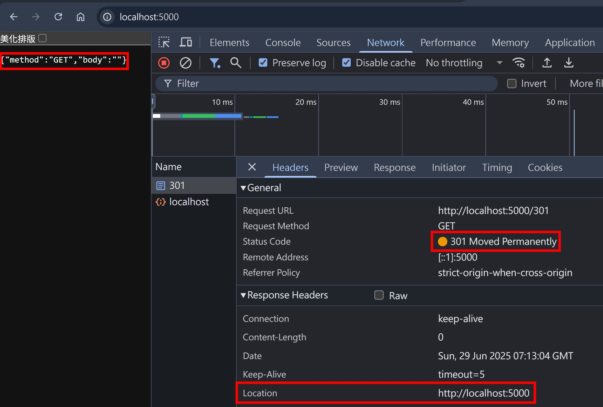

再來用 fetch 做個 Post + Body 的請求

```js
fetch("http://localhost:5000/301", {
  method: "POST",
  body: "hello-world",
  redirect: "follow",
  headers: { "Content-Type": "text/plain" },
})
  .then((res) => res.text())
  .then((body) => console.log(body));
```

轉導的 HTTP Request 確實變成 GET，且 Body 被捨棄
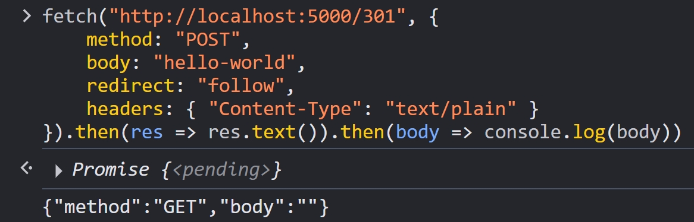

### 308 Permanent Redirect

- 轉導的 HTTP Request Method 跟 Body 不變
- 使用古老 `<form method="POST" action="http://localhost:5000/308">` 技術的網站，若網站網址更動，就會需要用到 308，而不是 301，也算是為了向後兼容（backward compatibility）

新增以下 NodeJS 程式碼

```ts
if (req.url === "/308") {
  res.statusCode = 308;
  res.setHeader("location", "http://localhost:5000");
  res.end();
  return;
}
```

再來用 fetch 做個 Post + Body 的請求

```js
fetch("http://localhost:5000/308", {
  method: "POST",
  body: "hello-world",
  redirect: "follow",
  headers: { "Content-Type": "text/plain" },
})
  .then((res) => res.text())
  .then((body) => console.log(body));
```

轉導的 HTTP Request Method 跟 Body 確實不變
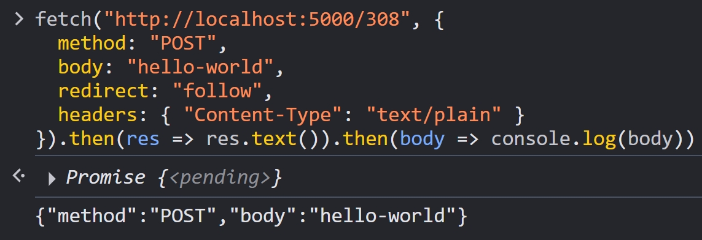

## Temporary redirections

- 搜尋引擎爬蟲收到 Temporary redirections 之後，不會將轉導的 URL 記錄下來（意思就是原本網站的搜尋引擎排名不會被影響）

### 302 Found

- 根據 [RFC9110](https://www.rfc-editor.org/rfc/rfc9110#section-15.4.3) 的描述

```
Note: For historical reasons, a user agent MAY change the request method from POST to GET for the subsequent request.
```

- 根據 [MDN 文件](https://developer.mozilla.org/en-US/docs/Web/HTTP/Guides/Redirections#temporary_redirections) 的描述

```
GET methods unchanged. Others may or may not be changed to GET.
```

- 根據 [Fetch Standard](https://fetch.spec.whatwg.org/#http-redirect-fetch)

```
12. If one of the following is true
- internalResponse’s status is 301 or 302 and request’s method is `POST`
- internalResponse’s status is 303 and request’s method is not `GET` or `HEAD`
  then:
    Set request’s method to `GET` and request’s body to null.
    For each headerName of [request-body-header] name, delete headerName from request’s header list.
```

request-body-header

```
A request-body-header name is a header name that is a byte-case-insensitive match for one of:

`Content-Encoding`
`Content-Language`
`Content-Location`
`Content-Type`
```

- 我的建議，根據不同情況使用 [303](#303-see-other) 跟 [307](#307-temporary-redirect)

新增以下 NodeJS 程式碼

```ts
if (req.url === "/302") {
  res.statusCode = 302;
  res.setHeader("location", "http://localhost:5000");
  res.end();
  return;
}
```

先用瀏覽器打開 http://localhost:5000/302 做個簡單的 GET 請求，確認 GET 請求維持不變
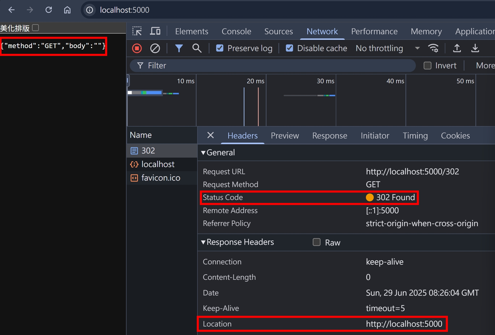

再來用 fetch 做個 Post + Body 的請求

```js
fetch("http://localhost:5000/302", {
  method: "POST",
  body: "hello-world",
  redirect: "follow",
  headers: { "Content-Type": "text/plain" },
})
  .then((res) => res.text())
  .then((body) => console.log(body));
```

確實轉為 GET + 清空 Body 了
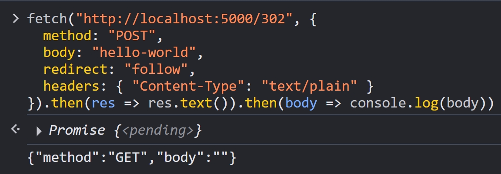

繼續試試看用 fetch 做個 PUT + Body 的請求

```js
fetch("http://localhost:5000/302", {
  method: "PUT",
  body: "hello-world",
  redirect: "follow",
  headers: { "Content-Type": "text/plain" },
})
  .then((res) => res.text())
  .then((body) => console.log(body));
```

保持原本的 Request Method + Body
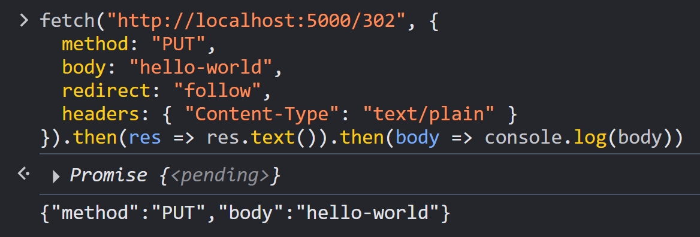

### 303 See Other

- 轉導的 HTTP Request 統一用 GET METHOD 來做導轉，若有 Body 會被捨棄，同 [301](#301-moved-permanently) 的行為
- 使用情境： 用戶訂閱電子報 `<form method="POST" action="http://localhost:5000/subscribeEDM">` 後，使用 303 將用戶導到其他頁面（好像蠻合理的，但實務上我沒看過有網站這樣做）

新增以下 NodeJS 程式碼

```ts
if (req.url === "/303") {
  res.statusCode = 303;
  res.setHeader("location", "http://localhost:5000");
  res.end();
  return;
}
```

再來用 fetch 做個 Post + Body 的請求

```js
fetch("http://localhost:5000/303", {
  method: "POST",
  body: "hello-world",
  redirect: "follow",
  headers: { "Content-Type": "text/plain" },
})
  .then((res) => res.text())
  .then((body) => console.log(body));
```

轉導的 HTTP Request 確實變成 GET，且 Body 被捨棄
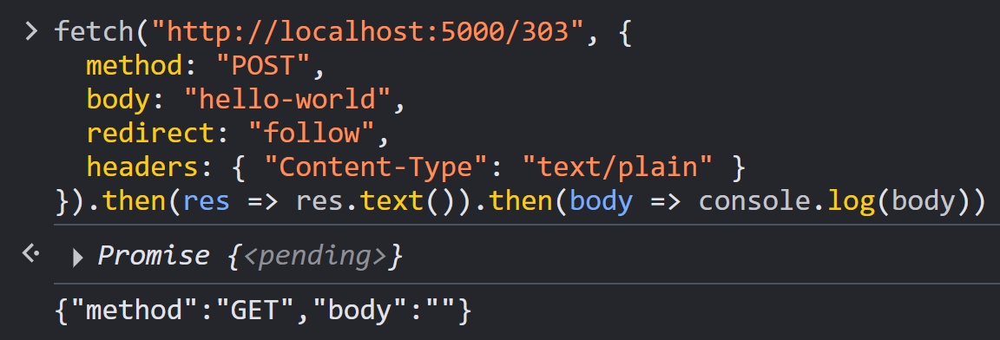

### 307 Temporary Redirect

- 轉導的 HTTP Request Method 跟 Body 不變，，同 [308](#308-permanent-redirect) 的行為

新增以下 NodeJS 程式碼

```ts
if (req.url === "/307") {
  res.statusCode = 307;
  res.setHeader("location", "http://localhost:5000");
  res.end();
  return;
}
```

再來用 fetch 做個 Post + Body 的請求

```js
fetch("http://localhost:5000/307", {
  method: "POST",
  body: "hello-world",
  redirect: "follow",
  headers: { "Content-Type": "text/plain" },
})
  .then((res) => res.text())
  .then((body) => console.log(body));
```

轉導的 HTTP Request 確實變成 GET，且 Body 被捨棄
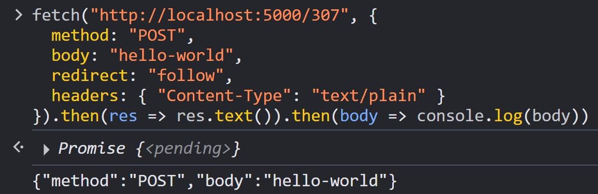

## 3xx with no Location

如果回傳 3xx，但沒有 Location Header，會發生什麼事情呢？

新增以下 NodeJS 程式碼

```ts
if (req.url === "/301-with-no-location") {
  res.statusCode = 301;
  res.end();
  return;
}
```

用瀏覽器打開 http://localhost:5000/301-with-no-location 做個簡單的 GET 請求，沒有噴錯誤訊息，一切平安
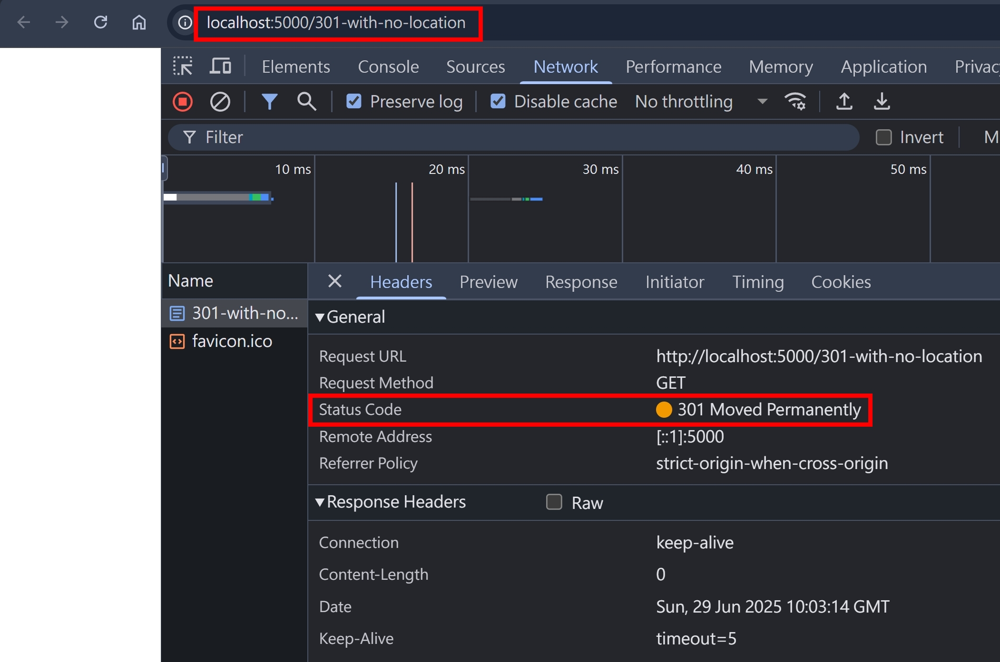

## non 3xx with location

如果回傳 200 + Location Header，會發生什麼事情呢？

新增以下 NodeJS 程式碼

```ts
if (req.url === "/200-with-location") {
  res.statusCode = 200;
  res.setHeader("location", "http://localhost:5000");
  res.end();
  return;
}
```

用瀏覽器打開 http://localhost:5000/200-with-location 做個簡單的 GET 請求，沒有轉導
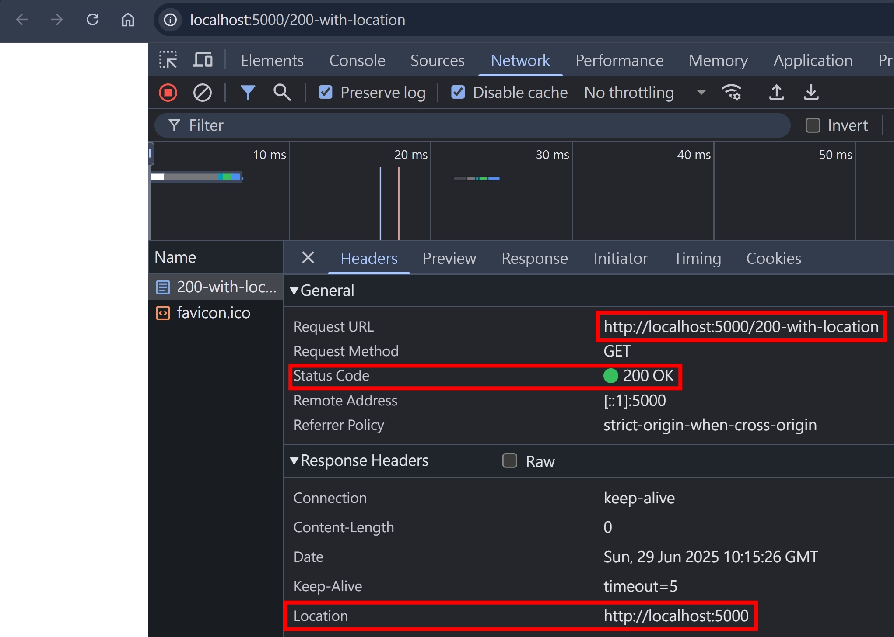

我推測瀏覽器會去判斷特定 status code 搭配 location response header 才會轉導，參考 [MDN 文件](https://developer.mozilla.org/en-US/docs/Web/HTTP/Reference/Headers/Location#see_also) 的描述

```
Status responses including a Location header: 201, 301, 302, 303, 307, 308.
```

使用 201 看看，新增以下 NodeJS 程式碼

```ts
if (req.url === "/201") {
  res.statusCode = 201;
  res.setHeader("location", "http://localhost:5000");
  res.end();
  return;
}
```

用瀏覽器打開 http://localhost:5000/201 做個簡單的 GET 請求，沒有成功轉導QQ
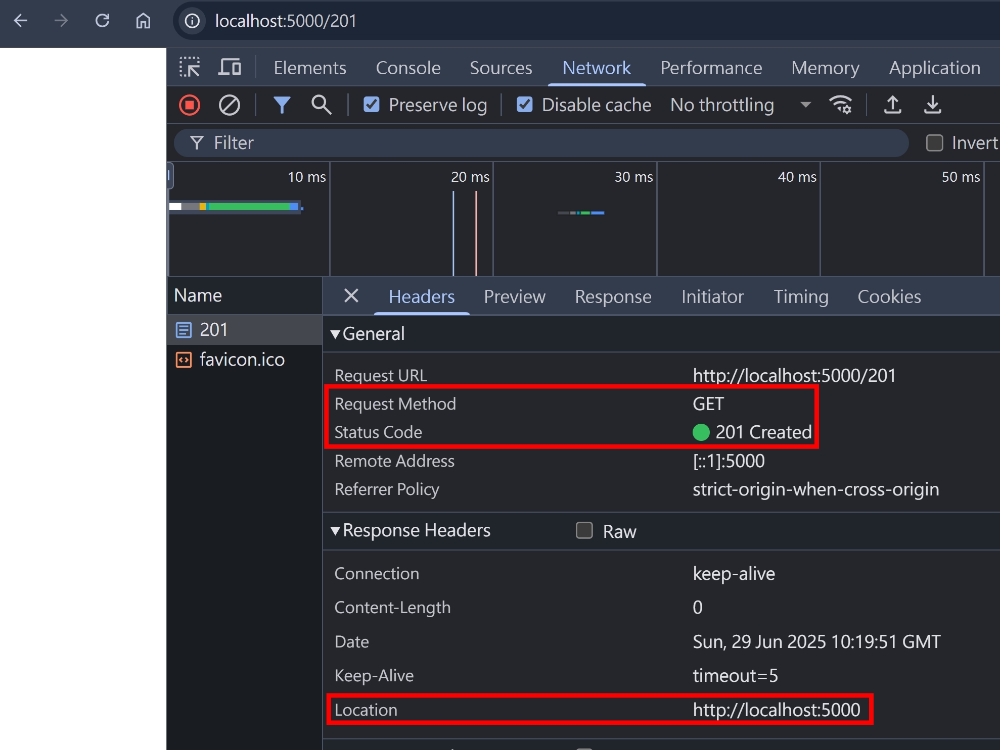

由於 201 Created 通常用在 POST 請求新增資源，所以我們換成 POST + Null Body 試試看：

```js
fetch("http://localhost:5000/201", {
  method: "POST",
  redirect: "follow",
})
  .then((res) => res.text())
  .then((body) => console.log(body));
```

還是沒有轉導
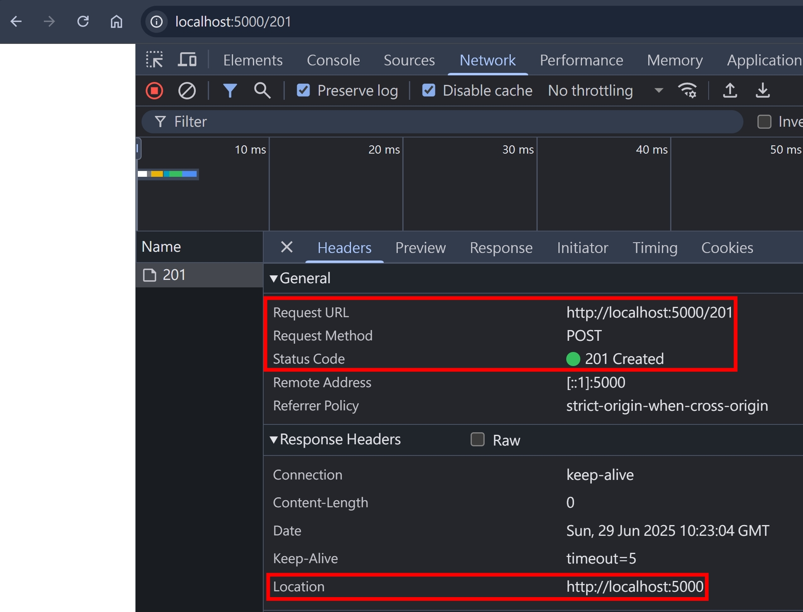

加個 Body 試試看：

```js
fetch("http://localhost:5000/201", {
  method: "POST",
  body: "hello-world",
  redirect: "follow",
  headers: { "Content-Type": "text/plain" },
})
  .then((res) => res.text())
  .then((body) => console.log(body));
```

還是沒有轉導
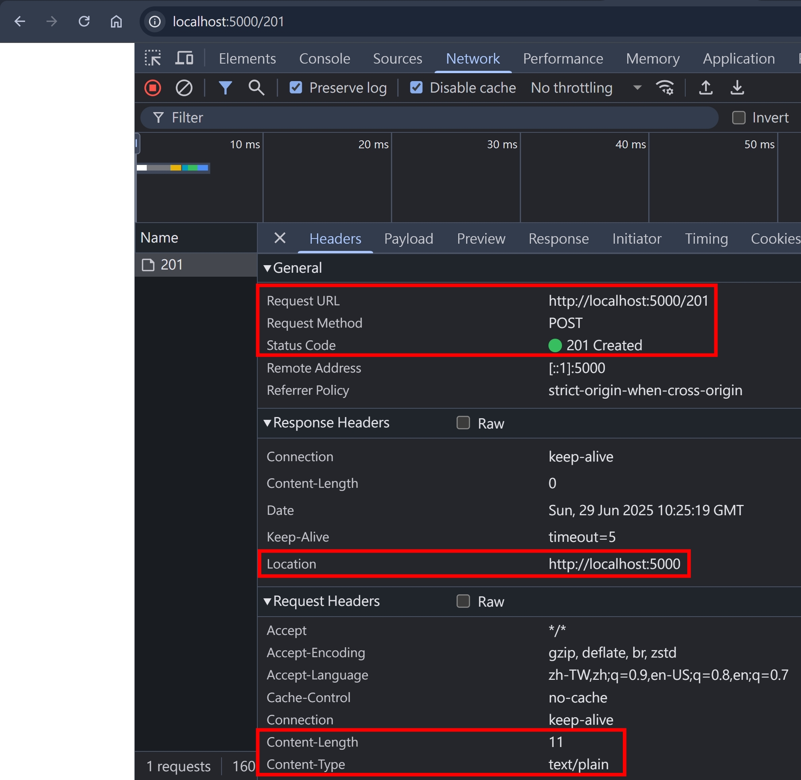

為何 201 搭配 Location 沒有轉導呢？根據 [MDN 文件](https://developer.mozilla.org/en-US/docs/Web/HTTP/Reference/Headers/Location) 跟 [RFC9110](https://www.rfc-editor.org/rfc/rfc9110#section-15.3.2) 的描述，都沒有特別提到 201 + Location "可以用來被轉導"，RFC 針對上述 3xx status code 的用詞常常會出現

```
The user agent MAY use the Location field value for automatic redirection.
```

其中蠻有趣的，大寫的 MAY，還有專門一篇 [RFC2119](https://datatracker.ietf.org/doc/html/rfc2119) 來描述每個 Keyword 的意義，節錄 MAY 的部分描述：

```
MAY
This word, or the adjective "OPTIONAL", mean that an item is
truly optional.
```

結論：RFC 沒有明確禁止 HTTP Client 在 201 的時候使用 Location Header 轉導，但也沒有說 `MAY use the Location field value for automatic redirection`，實務上我沒看過 201 會轉導的，在 Response Body 回傳新建立的資源是比較常見的做法

## 小結

這篇文章，帶大家理解 301, 302, 303, 307, 308 redirect 的差異，也介紹了 201 這個特殊的情境，我自己也學到了很多～

## 參考資料

- https://developer.mozilla.org/en-US/docs/Web/HTTP/Redirections
- https://datatracker.ietf.org/doc/html/rfc7231
- https://www.rfc-editor.org/rfc/rfc9110
- https://developer.mozilla.org/en-US/docs/Web/HTTP/Reference/Status/201
- https://developer.mozilla.org/en-US/docs/Web/HTTP/Reference/Status/301
- https://developer.mozilla.org/en-US/docs/Web/HTTP/Reference/Status/302
- https://developer.mozilla.org/en-US/docs/Web/HTTP/Reference/Status/302
- https://developer.mozilla.org/en-US/docs/Web/HTTP/Reference/Status/307
- https://developer.mozilla.org/en-US/docs/Web/HTTP/Reference/Status/308
- https://developer.mozilla.org/en-US/docs/Web/HTTP/Reference/Headers/Location
