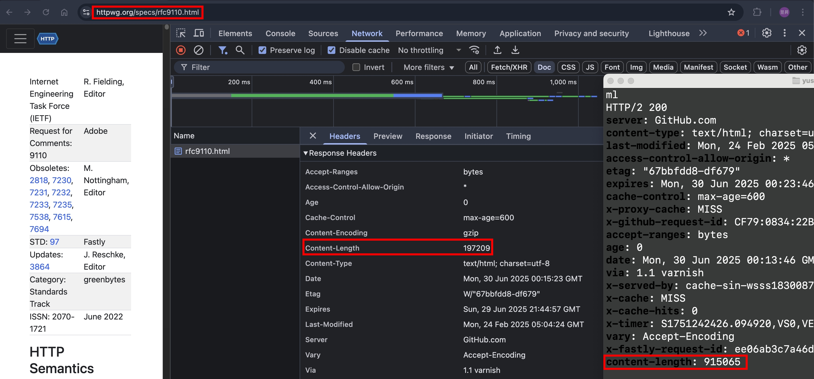
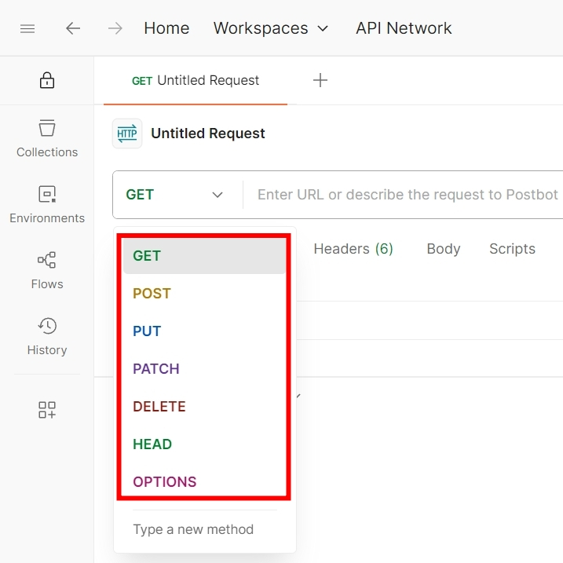
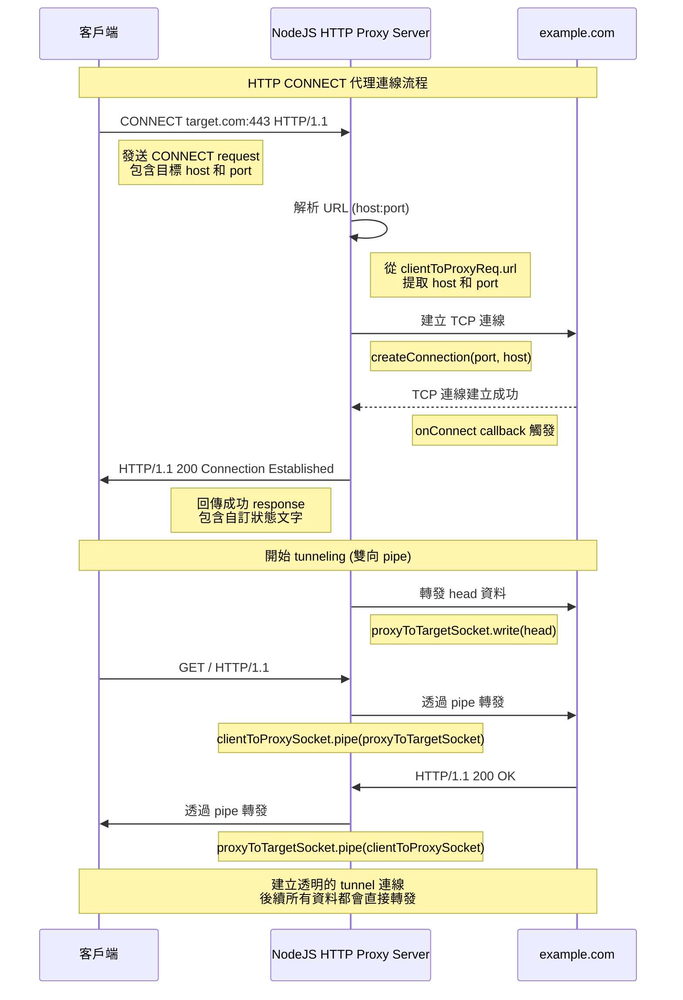

## 前言

我們平常 RESTFUL API 會用到的 HTTP Request Methods 就 GET, POST, PUT, PATCH, DELETE

- GET: 取資料
- POST: 新增資料
- PUT: 更新資料
- PATCH: 部分更新資料
- DELETE: 刪除資料

但，今天我想要深入理解，平常不會去使用那些 HTTP Request Methods，一起來看看吧！

## [2025/11/21 更] Request Method 到底要大寫還是小寫 ?

在寫前端的時候，總是會看到各種大小寫混雜的寫法

```ts
fetch("https://example.com", { method: "get" });
fetch("https://example.com", { method: "GET" });
```

我以前以為 Request Method 是 case-insensitive，直到我發現 nginx 會 reject 小寫的 Request Method

```
get / HTTP/2
Host: example.com


```

Response

```
HTTP/2 400 Bad Request
Date: Fri, 21 Nov 2025 01:02:23 GMT
Content-Type: text/html
Content-Length: 150

<html>
  <head>
    <title>400 Bad Request</title>
  </head>
  <body>
    <center>
      <h1>400 Bad Request</h1>
    </center>
    <hr>
    <center>nginx</center>
  </body>
</html>
```

於是回頭查看 [RFC 9110 section-9.1](https://datatracker.ietf.org/doc/html/rfc9110#section-9.1) 的描述

```
The method token is case-sensitive because it might be used as a gateway to object-based systems with case-sensitive method names. By convention, standardized methods are defined in all-uppercase US-ASCII letters.
```

但是 Header Field Names 就是 case-insensitive，所以 `content-type` 跟 `Content-Type` 是同樣的，我們來看看 [RFC 9110 section-5.1](https://datatracker.ietf.org/doc/html/rfc9110#section-5.1) 的描述

```
Field names are case-insensitive and ought to be registered within the "Hypertext Transfer Protocol (HTTP) Field Name Registry"
```

其中 [Hypertext Transfer Protocol (HTTP) Field Name Registry](https://www.iana.org/assignments/http-fields/http-fields.xhtml) 定義的是標準化的 Header Field Names，不包含 `X-Powered-By` 這種 Custom Header Field Names

## HEAD

- 簡單理解：同 GET 請求，只是把 Response Body 拿掉
- 承上，如果 Response Body 有值，HTTP Client "MUST" 忽略它
- 使用情境：下載大型檔案前，先發一個 HEAD 請求，讀取 Response.Headers.Content-Length，就可以預先知道檔案大小
- 如果發了 HEAD 請求，Server 回傳說 "快取過期了"。此情況下，快取會被更新，即便 GET 請求沒有發送
- 承上，詳細的測試情境，我們放到未來的篇章 [http-caching](../http/http-caching-1.md)

### curl --head with third party static website testing

測試看看 `curl --head example.com`，結果如下

```zsh
HTTP/1.1 200 OK
Content-Type: text/html
ETag: "84238dfc8092e5d9c0dac8ef93371a07:1736799080.121134"
Last-Modified: Mon, 13 Jan 2025 20:11:20 GMT
Cache-Control: max-age=3457
Date: Mon, 30 Jun 2025 00:06:32 GMT
Connection: keep-alive
```

為什麼沒有回傳 `Content-Length` 呢？根據 [RFC9110 9.3.2. HEAD](https://httpwg.org/specs/rfc9110.html#rfc.section.9.3.2) 的描述：

```
However, a server MAY omit header fields for which a value is determined only while generating the content.
```

所以說，透過 HEAD 請求預先讀取 Response.Headers.Content-Length，其實不一定有效的

我們再來嘗試 `curl --head https://httpwg.org/specs/rfc9110.html`

可以看到 HEAD 請求跟 GET 請求回傳的 `Content-Length` 也不一樣


### curl --head with local static file

我們使用先前的文章 [http-range-requests#send-套件的實作](../http/http-range-requests.md#send-套件的實作) 介紹過的 `send` 套件來實作

index.ts

```ts
import send from "send";
import httpServer from "../httpServer";
import { faviconListener } from "../listeners/faviconListener";
import { notFoundListener } from "../listeners/notFoundlistener";

httpServer.on("request", function requestListener(req, res) {
  if (req.url === "/favicon.ico") return faviconListener(req, res);
  if (req.url === "/example.txt") {
    return send(req, String(req.url), { root: __dirname }).pipe(res);
  }
  return notFoundListener(req, res);
});
```

example.txt

```
helloworld
```

嘗試 `curl --head http://localhost:5000/example.txt`

```zsh
HTTP/1.1 200 OK
Accept-Ranges: bytes
Cache-Control: public, max-age=0
Last-Modified: Mon, 30 Jun 2025 00:33:43 GMT
ETag: W/"a-197be410daa"
Content-Type: text/plain; charset=utf-8
Content-Length: 10
Date: Mon, 30 Jun 2025 00:38:02 GMT
Connection: keep-alive
Keep-Alive: timeout=5
```

嘗試 `curl -v http://localhost:5000/example.txt`，擷取 response header，可以看到跟 HEAD 請求是一樣的

```zsh
< HTTP/1.1 200 OK
< Accept-Ranges: bytes
< Cache-Control: public, max-age=0
< Last-Modified: Mon, 30 Jun 2025 00:33:43 GMT
< ETag: W/"a-197be410daa"
< Content-Type: text/plain; charset=utf-8
< Content-Length: 10
< Date: Mon, 30 Jun 2025 00:39:38 GMT
< Connection: keep-alive
< Keep-Alive: timeout=5
```

我們來看看 `send` 套件關於 HEAD 請求的實作（節錄部分）：

```js
SendStream.prototype.send = function send(path, stat) {
  // other code...

  // content-length
  res.setHeader("Content-Length", len);

  // HEAD support
  if (req.method === "HEAD") {
    res.end();
    return;
  }

  this.stream(path, opts);
};
```

function 的上面已經把各種 Response Headers 都設定好了，最後要送出 Body 之前，檢查是否為 HEAD 請求，若是則直接調用 `res.end()`

我認為這個寫法很優美，並且也符合 Best Practice（HEAD 請求的 Response Headers 跟 GET 請求的一樣，只差在有沒有 Response Body）

### HEAD 小結

使用 HEAD 請求來獲取 `Content-Length`，影響的因素太多了，實務上：

- HTTP 請求通常不會直接打到 Application Server，中間都會過 Web Server, CDN, WAF 以及 Proxy 等等，中間每一層都有不同的機制去修改 HTTP Headers
- 但在 Application Server 這一層的實作，以 `send` 套件為例，確實是有 follow Best Practice
- 通常後端工程師在寫 RESTFUL API 的時候，不會特別實現 HEAD 請求的商業邏輯，絕大部分都是各種 HTTP Framework, library 或是程式語言本身幫忙實現的

## CONNECT

### 語法

跟一般的 HTTP 請求不一樣，這邊只要定義 host 跟 port 就好

```
CONNECT <host>:<port> HTTP/1.1
CONNECT www.google.com:443 HTTP/1.1
```

### NodeJS HTTP Server 實作階段 1

NodeJS HTTP Server 提供原生的 Event 可以監聽 `connect` 事件，參考 [NodeJS 官方文件](https://nodejs.org/api/http.html#event-connect_1) 的描述

```
Emitted each time a client requests an HTTP CONNECT method.
```

我們實作 NodeJS HTTP Server，先簡單回傳 400 就好

```ts
httpServer.on("connect", function connectListener(req, socket, head) {
  console.log({
    url: req.url,
    method: req.method,
    headers: req.headers,
    head: head.toString("utf8"),
  });
  socket.end("HTTP/1.1 400 Bad Request\r\n\r\n");
  return;
});
```

### 尋找支援 CONNECT METHOD 的 HTTP Client

根據 [fetch.spec.whatwg.org](https://fetch.spec.whatwg.org/#methods) 描述

```
A forbidden method is a method that is a byte-case-insensitive match for `CONNECT`, `TRACE`, or `TRACK`.
```

實際在 F12 > Console 輸入 `fetch("www.google.com:443", { method: "CONNECT" })` 也會報錯

```
Uncaught (in promise) TypeError: Failed to execute 'fetch' on 'Window': 'CONNECT' HTTP method is unsupported.
    at <anonymous>:1:1
```

POSTMAN 預設的 HTTP Request Methods 也沒有 CONNECT


好消息是，curl 有支援，輸入 `curl --help all`，可以看到關於 proxy 的部分

```
-x, --proxy <[protocol://]host[:port]>            Use this proxy
-p, --proxytunnel                                 HTTP proxy tunnel (using CONNECT)
-v, --verbose                                     Make the operation more talkative
```

我們在終端機輸入 `curl -x http://localhost:5000 -p https://www.google.com -v`，可以看到 NodeJS 確實有回傳 `HTTP/1.1 400 Bad Request`，整體過程看起來都蠻正常的。

```zsh
* Host localhost:5000 was resolved.
* IPv6: ::1
* IPv4: 127.0.0.1
*   Trying [::1]:5000...
* CONNECT tunnel: HTTP/1.1 negotiated
* allocate connect buffer
* Establish HTTP proxy tunnel to www.google.com:443
> CONNECT www.google.com:443 HTTP/1.1
> Host: www.google.com:443
> User-Agent: curl/8.13.0
> Proxy-Connection: Keep-Alive
>
< HTTP/1.1 400 Bad Request
<
* CONNECT tunnel failed, response 400
* closing connection #0
curl: (56) CONNECT tunnel failed, response 400
```

同時也看看 NodeJS Log

```js
{
  url: 'www.google.com:443',
  method: 'CONNECT',
  headers: {
    host: 'www.google.com:443',
    'user-agent': 'curl/8.7.1',
    'proxy-connection': 'Keep-Alive'
  },
  head: ''
}
```

### NodeJS HTTP Server 實作階段 2

我們繼續把 NodeJS HTTP Server 功能補上

```ts
httpServer.on(
  "connect",
  function connectListener(clientToProxyReq, clientToProxySocket, head) {
    console.log({
      url: clientToProxyReq.url,
      method: clientToProxyReq.method,
      headers: clientToProxyReq.headers,
      head: head.toString("utf8"),
    });
    // todo 驗證格式
    const [host, portStr] = String(clientToProxyReq.url).split(":");
    const port = parseInt(portStr);

    const proxyToTargetSocket = createConnection(
      port,
      host,
      function onConnect() {
        clientToProxySocket.write(
          "HTTP/1.1 200 [Custom Status Text]Connection Established\r\n\r\n",
        );
        proxyToTargetSocket.write(head);
        proxyToTargetSocket.pipe(clientToProxySocket);
        clientToProxySocket.pipe(proxyToTargetSocket);
      },
    );

    // todo 處理錯誤情境, 關閉 TCP 連線
  },
);
```

終端機輸入 `curl -x http://localhost:5000 -p http://example.com -v`，節錄重點 HTTP round trip 的 Log

```
> CONNECT example.com:80 HTTP/1.1
> Host: example.com:80
> User-Agent: curl/8.7.1
> Proxy-Connection: Keep-Alive
>
< HTTP/1.1 200 [Custom Status Text]Connection Established
<
* CONNECT phase completed
* CONNECT tunnel established, response 200
> GET / HTTP/1.1
> Host: example.com
> User-Agent: curl/8.7.1
> Accept: */*
>
* Request completely sent off
< HTTP/1.1 200 OK
< Content-Type: text/html
< ETag: "84238dfc8092e5d9c0dac8ef93371a07:1736799080.121134"
< Last-Modified: Mon, 13 Jan 2025 20:11:20 GMT
< Cache-Control: max-age=2542
< Date: Tue, 01 Jul 2025 00:58:43 GMT
< Content-Length: 1256
< Connection: keep-alive
<
<!doctype html>
<html>
... 中間省略，都是 HTML 內容
</html>
```

P.S. 若對 Raw HTTP Request 跟 Response 不熟悉的朋友，可參考 [anatomy-of-an-http-message](../http/anatomy-of-an-http-message.md) 這篇文章～

我把整個 Round Trip 畫成循序圖，方便大家了解



### CONNECT 小結

HTTP Request Method CONNECT 我認為比較難理解，原因是它需要對 TCP 有一定程度的理解，最好也要熟悉 [NodeJS Net 模組](https://nodejs.org/api/net.html)。本篇章我盡量只講到 HTTP 的傳輸，對於 TCP 層連線的建立跟關閉都沒提到，這會在未來的篇章 [TCP-Finite-State-Machine](../protocols/tcp.md#tcp-finite-state-machine) 跟大家詳細解釋，希望大家對 CONNECT 有初步的認識。

## 小結

沒想到兩個 HTTP Request Method 就可以講到這麼長的篇幅，本來以為很簡單，沒想到很多坑QQ

下一篇會跟大家講到 `OPTIONS` 跟 `TRACE`～跟著我的腳步繼續探索吧！

## 參考資料

- https://developer.mozilla.org/en-US/docs/Web/HTTP/Reference/Methods/HEAD
- https://developer.mozilla.org/en-US/docs/Web/HTTP/Reference/Methods/CONNECT
- https://httpwg.org/specs/rfc9110.html#rfc.section.9.3.2
- https://fetch.spec.whatwg.org/#methods
