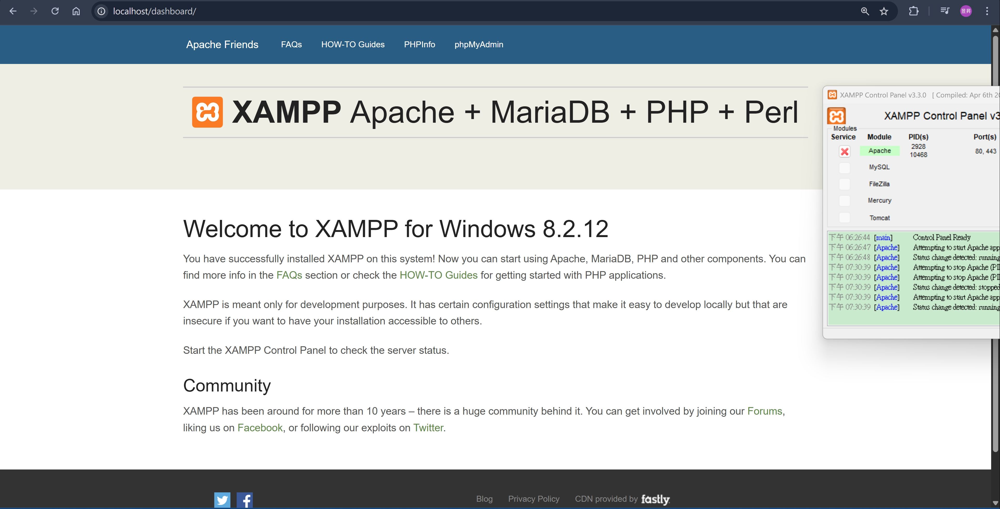
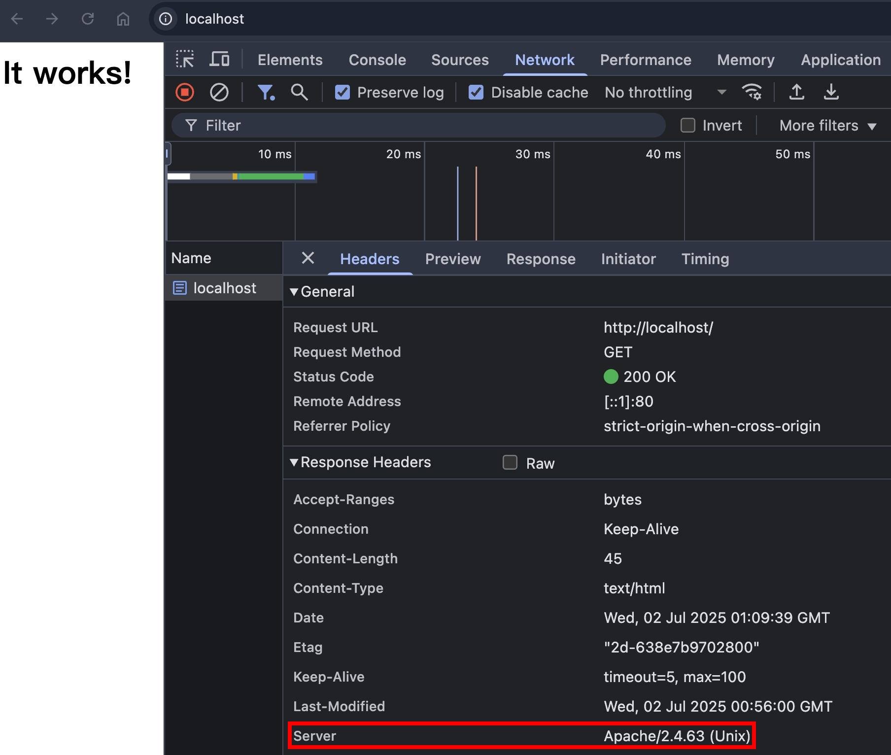
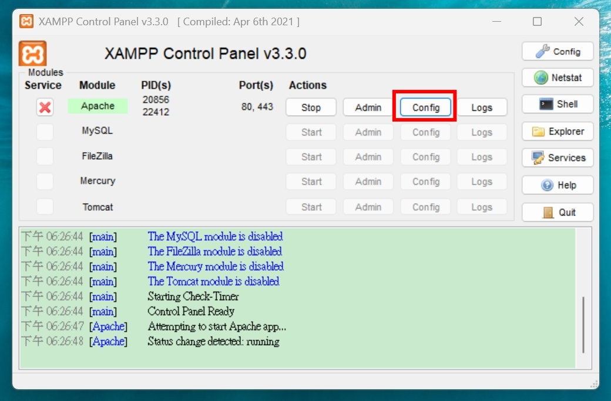

## OPTIONS

絕大部分的應用場景都在 CORS 的 Preflight Request，會在未來的篇章 [cross-origin-resource-sharing](../http/cross-origin-resource-sharing-1.md) 介紹到

### 小插曲

在學習 HTTP Header 的過程，我會把 [MDN 文件](https://developer.mozilla.org/en-US/docs/Web/HTTP/Reference/Methods/OPTIONS) 跟 [RFC 文件](https://www.rfc-editor.org/rfc/rfc9110.html#name-options) 一起對照著看。概念上是 MDN 會照著 RFC 的規範來撰寫 "面向開發者好閱讀" 的技術文章，並且提供程式範例，但偶爾也會遇到兩邊 Spec 不一致的問題。

我這次剛好遇到 [RFC 規範](https://www.rfc-editor.org/rfc/rfc9110.html#name-options) 說 `OPTIONS` 請求可以搭配 Request Body，原文是

```
A client that generates an OPTIONS request containing content MUST send a valid Content-Type header field describing the representation media type. Note that this specification does not define any use for such content.
```

但 [MDN 文件](https://developer.mozilla.org/en-US/docs/Web/HTTP/Reference/Methods/OPTIONS) 卻說不能帶 Request Body，所以就順手發了一個 [PR](https://github.com/mdn/content/pull/40146)，也順利在一天後 Merge 了。算是深入研究 HTTP，偶爾能獲得的一個開源貢獻小成就（？

## TRACE

### 簡介

- 實務上，由於 Client 到 Origin Server 中間會經過各種節點，例如 CDN, Web Server, Proxy，每一層理論上都有能力去修改 HTTP Request, Response，TRACE 請求的設計初衷就是為了測試，讓 Client 有能力知道 Request, Response 在傳輸過程究竟被異動了哪些
- 承上，引用 [RFC9110 #TRACE](https://httpwg.org/specs/rfc9110.html#TRACE) 的描述：

```
TRACE allows the client to see what is being received at the other end of the request chain and use that data for testing or diagnostic information.
```

- Request body is not allowed
- Request headers 要盡量把可能洩露機敏資訊的 Headers 移除，例如 cookies
- Origin Server 要把整個 RAW HTTP Reuqest 都寫入 Response Body，並且把可能洩露機敏資訊的 Headers 移除，例如 cookies
- 承上述兩點，為何要特別提到 `把可能洩露機敏資訊的 Headers 移除`，原因是有發生過資安漏洞，可參考 [xst-cross-site-tracing](#xst-cross-site-tracing)
- Response.Headers.Content-Type 必須是 `message/http`
- 現今，大部分 Server 都不支援 `TRACE` 了，此時可回傳 `405 Method Not Allowed`

### RAW HTTP Request and Response

RAW HTTP Request

```
TRACE / HTTP/1.1
Host: localhost
User-Agent: curl/8.7.1
Accept: */*
```

RAW HTTP Response

```
HTTP/1.1 200 OK
Content-Length: 74
Date: Wed, 04 Sep 2024 11:50:24 GMT
Server: Apache/2.4.59 (Unix)
Content-Type: message/http

TRACE / HTTP/1.1
Host: example.com
User-Agent: curl/8.7.1
Accept: */*
```

### Apache 環境設定

由於支援 TRACE Method 的 Web Server 跟程式語言框架比較少，原因可參考 [xst-cross-site-tracing](#xst-cross-site-tracing)，我後來找了一番，發現 Apache 這個比較老牌的 Web Server 預設有支援，所以我們就來下載～

#### XAMPP For Windows

XAMPP For Windows 下載網址：https://sourceforge.net/projects/xampp/files/XAMPP%20Windows/8.2.12/xampp-windows-x64-8.2.12-0-VS16-installer.exe/download

安裝時，PHP, Tomcat, MySQL 等等全都取消勾選，本節只有要用到 Apache 而已，XAMPP 安裝的組合包有

- Apache/2.4.58 (Win64)
- OpenSSL/3.1.3
- PHP/8.2.12

#### Mac install Apache

```zsh
brew install httpd
vim /opt/homebrew/etc/httpd/httpd.conf # Listen 8080 改為 Listen 80
sudo brew services start httpd
```

安裝且啟動後，瀏覽器輸入 http://localhost/ ，有看到畫面就代表成功了！

Windows XAMPP 會看到 Dashboard 頁面


Mac 會看到 It works!


### Apache TRACE 測試

由於無法透過瀏覽器的 JavaScript 發出 `TRACE` Request，所以我們使用 `curl -X TRACE http://localhost -v`

Raw HTTP Request

```
> TRACE / HTTP/1.1
> Host: localhost
> User-Agent: curl/8.7.1
> Accept: */*
```

Raw HTTP Response，可以看到 `Content-Type: message/http`，以及 body 包含整包 RAW HTTP Request

```
< HTTP/1.1 200 OK
< Date: Wed, 02 Jul 2025 01:25:41 GMT
< Server: Apache/2.4.63 (Unix)
< Transfer-Encoding: chunked
< Content-Type: message/http
<
TRACE / HTTP/1.1
Host: localhost
User-Agent: curl/8.7.1
Accept: */*
```

### Max-Forwards

格式：

```
Max-Forwards: <number>
Max-Forwards: 10
```

規則：

- 這個 Request Header 會跟 `TRACE` 或是 `OPTIONS` Method 搭配使用
- 每經過一個節點（例如：CDN, Proxy, Web Server），節點就要把 `Max-Forwards` 的值減 1
- 節點收到 `Max-Forwards: 0` 的時候，就要把當下的 RAW HTTP Request 寫進 HTTP Response Body 並且回傳
- 承上，如果 `Max-Forwards` 的值 >= 0，且 HTTP Request 已經傳送到 Origin Server，此時就會把當下的 RAW HTTP Request 寫進 HTTP Response Body 並且回傳

有了基本概念，我們來嘗試看看 `curl -X TRACE -H "Max-Forwards: 1" http://localhost -v`

RAW Response Body

```
TRACE / HTTP/1.1
Host: localhost
User-Agent: curl/8.7.1
Accept: */*
Max-Forwards: 1
```

因為 Apache 後面沒有節點了，所以直接回傳 `Max-Forwards: 1`，符合預期。但接下來會需要讓 Apache 當中間結點，所以需要設定 `httpd.conf`

### httpd.conf 設定

Windows XAMPP，在 Control Panel 可以打開


Mac 的話，輸入 `vim /opt/homebrew/etc/httpd/httpd.conf`

加入以下程式碼，將請求反向代理到 http://localhost:5000/ ，也就是我們的 NodeJS HTTP Server

httpd.conf

```
# For Windows XAMPP
LoadModule proxy_module modules/mod_proxy.so
LoadModule proxy_http_module modules/mod_proxy_http.so

# For Mac
LoadModule proxy_module lib/httpd/modules/mod_proxy.so
LoadModule proxy_http_module lib/httpd/modules/mod_proxy_http.so

<VirtualHost *:80>
    ServerName localhost
    ProxyPreserveHost On
    ProxyRequests Off
    <Location />
        ProxyPass http://localhost:5000/
        ProxyPassReverse http://localhost:5000/
    </Location>
</VirtualHost>
```

修改完以後重啟 `sudo brew services restart httpd`，接著實作 NodeJS HTTP Server 的部分

### NodeJS TRACE 實作

有了 TRACE 的基本概念，要實作也不難。接下來的範例，我們會以 NodeJS HTTP Server 當作 Origin Server，也就是不管 `Max-Forwards` 是多少，它都會直接把 RAW HTTP Request 寫入 HTTP Response Body

```ts
// Act as a Origin Server
if (req.method === "TRACE") {
  console.log(req.headers);
  const startLine = `TRACE ${req.url} HTTP/1.1\r\n`;
  const reqHeadersToRawHTTP = Object.entries(req.headers)
    .map(([key, value]) => `${key}: ${value}`)
    .join("\r\n");
  const body = startLine + reqHeadersToRawHTTP + "\r\n\r\n";
  res.setHeader("Content-Type", "message/http");
  res.end(body);
  return;
}
```

### Max-Forwards 測試

測試 `curl -X TRACE -H "Max-Forwards: 1" http://localhost -v`

RAW HTTP Request

```
> TRACE / HTTP/1.1
> Host: localhost
> User-Agent: curl/8.13.0
> Accept: */*
> Max-Forwards: 1
```

RAW HTTP Response

```
TRACE / HTTP/1.1
host: localhost
user-agent: curl/8.13.0
accept: */*
max-forwards: 0
x-forwarded-for: ::1
x-forwarded-host: localhost
x-forwarded-server: localhost
connection: Keep-Alive
```

可以看到 Apache 在 Request Headers 加了這些

```
x-forwarded-for: ::1
x-forwarded-host: localhost
x-forwarded-server: localhost
connection: Keep-Alive
```

繼續測試 `curl -X TRACE -H "Max-Forwards: 0" http://localhost -v`，理論上 NodeJS 這邊不會收到請求

RAW HTTP Request

```
> TRACE / HTTP/1.1
> Host: localhost
> User-Agent: curl/8.13.0
> Accept: */*
> Max-Forwards: 0
```

RAW HTTP Response（這次 Apache 就直接回傳了，沒有再繼續反向代理，所以也少了 x-forwarded-\* 那些 Headers）

```
TRACE / HTTP/1.1
Host: localhost
User-Agent: curl/8.13.0
Accept: */*
Max-Forwards: 0
```

繼續測試 `curl -X TRACE -H "Max-Forwards: -1" http://localhost -v`，看看 Apache 有沒有做錯誤邊界處理XD

RAW HTTP Response（Apache 果然也是成熟的 Web Server，這種錯誤邊界都有包含到）

```
<!DOCTYPE HTML PUBLIC "-//IETF//DTD HTML 2.0//EN">
<html><head>
<title>400 Proxy Error</title>
</head><body>
<h1>Proxy Error</h1>
<p>Your browser sent a request that this server could not understand.<br />
The proxy server could not handle the request<p>Reason: <strong>Max-Forwards request header could not be parsed</strong></p></p>
<hr>
<address>Apache/2.4.58 (Win64) OpenSSL/3.1.3 PHP/8.2.12 Server at localhost Port 80</address>
</body></html>
```

繼續測試 `curl -X TRACE -H "Max-Forwards: 0" -d "Hello World" -http://localhost -v`

RAW HTTP Response（再次讚嘆 Apache 的錯誤邊界處理）

```
<!DOCTYPE HTML PUBLIC "-//IETF//DTD HTML 2.0//EN">
<html><head>
<title>413 Request Entity Too Large</title>
</head><body>
<h1>Request Entity Too Large</h1>
The requested resource does not allow request data with TRACE requests, or the amount of data provided in
the request exceeds the capacity limit.
<hr>
<address>Apache/2.4.58 (Win64) OpenSSL/3.1.3 PHP/8.2.12 Server at localhost Port 80</address>
</body></html>
```

關於 `Max-Forwards` 的測試到這邊～接下來的主題跳比較快，會介紹一個由 `TRACE` 引起的資安漏洞

## XST (Cross Site Tracing)

### PoC

以下 PoC 無法在現代瀏覽器還原，程式碼是參考 [XMLHttpRequest2-20080225#response-metadata](https://www.w3.org/TR/2008/WD-XMLHttpRequest2-20080225/#response-metadata) 這份文件，僅供參考

1. 攻擊者會架一個惡意網站，內含以下程式碼

```js
var client = new XMLHttpRequest();
client.open("TRACE", "https://www.facebook.com/", true);
client.send();
client.onreadystatechange = function() {
 if(this.readyState == 3) {
  print(this.getAllResponseHeaders());
 }
}

// ...should output something similar to the following text:
Date: Sun, 24 Oct 2004 04:58:38 GMT
Server: Apache/1.3.31 (Unix)
Keep-Alive: timeout=15, max=99
Connection: Keep-Alive
Transfer-Encoding: chunked
Content-Type: text/plain; charset=utf-8
```

2. 受害者進到惡意網站，就會執行惡意程式碼
3. 攻擊者就可以竊取受害者在 `https://www.facebook.com/` 登入狀態的 cookies 等等資訊

### 時間軸

- 這是一個古早時期（約 2002 ~ 2003 年公布）的資安漏洞，詳細可參考 [這篇文章](https://www.kb.cert.org/vuls/id/867593)
- 參考 https://www.w3.org/TR/2006/WD-XMLHttpRequest-20060405/#xmlhttprequest 這邊文章，在 2006 年，當時還沒禁止 cross-origin 的 XMLHttpRequest 去讀取 ResponseHeaders

```
getAllResponseHeaders
If the readyState attribute has a value other than 3 (Receiving) or 4 (Loaded), it MUST return null. Otherwise, it MUST return all the HTTP headers, as a single string, with each header line separated by a CR (U+000D) LF (U+000A) pair. The status line MUST not be included.
```

- 參考 https://www.w3.org/TR/2008/WD-XMLHttpRequest2-20080225/#response-metadata 這篇文章，在 2008 年，開始禁止 cross-origin 的 XMLHttpRequest 去讀取 ResponseHeaders

```
The getAllResponseHeaders() method provides access to all response headers as a single string. When invoked, the user agent must act as if it had run the following steps:
1. ......
2. If the error flag is "true" or the same-origin flag is "false" return null and terminate these steps.
```

- 到了 2025 年，瀏覽器的 CORS 機制已經算相對完善，XST 這個攻擊手法基本上已經很難成立
- 但也因為這個資安漏洞，所以 `TRACE` 請求已經沒有什麼 Origin Server 會實作了

## 小結

沒想到一個 `TRACE` 請求就可以寫這麼多故事，雖然它在 2025 年已經沒啥使用場景了，但從 [xst](#xst-cross-site-tracing) 這個資安漏洞，也可以看到瀏覽器安全性的演進歷史，對於了解 CORS 的設計初衷，有非常大的幫助。從攻擊的手法，去了解要怎麼防範，我覺得是一個非常好，且記憶會非常深刻的學習方式。希望各位有學到新東西呦～

## 參考資料

- https://developer.mozilla.org/en-US/docs/Web/HTTP/Reference/Methods/OPTIONS
- https://developer.mozilla.org/en-US/docs/Web/HTTP/Reference/Methods/TRACE
- https://developer.mozilla.org/en-US/docs/Web/HTTP/Reference/Headers/Max-Forwards
- https://httpwg.org/specs/rfc9110.html
- https://fetch.spec.whatwg.org/#methods
