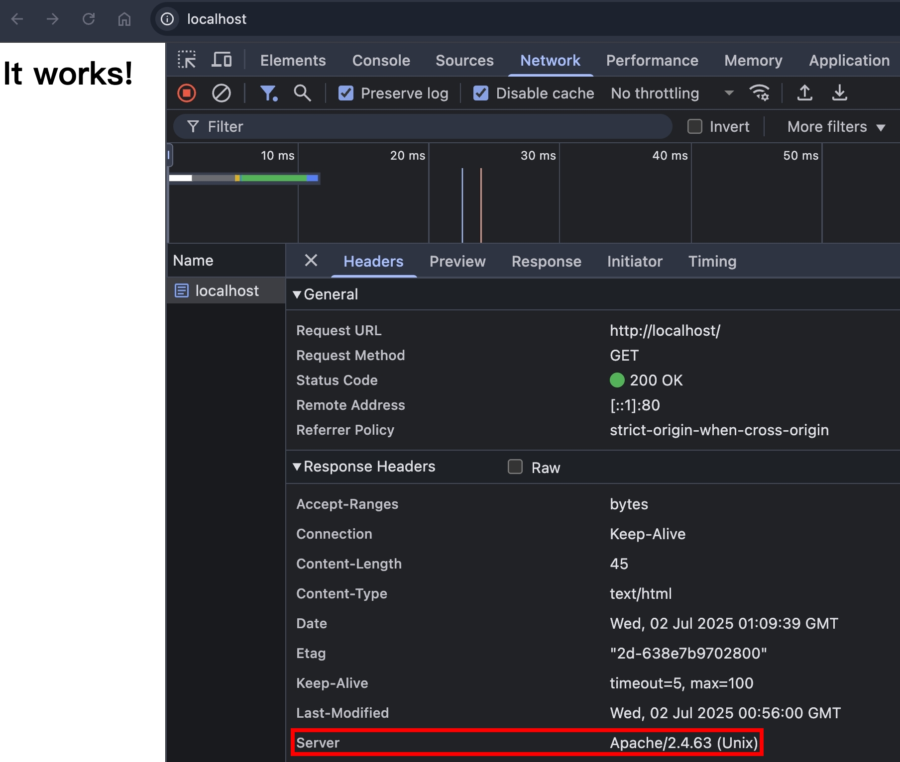

## OPTIONS

## TRACE

### RAW HTTP Request and Response

我個人認為這是最快可以讓我理解這個 HTTP Request Method 在幹嘛的方式XD

RAW HTTP Request

```
TRACE / HTTP/1.1
Host: localhost
User-Agent: curl/8.7.1
Accept: */*
```

RAW HTTP Response

```
HTTP/1.1 200 OK
Content-Length: 74
Date: Wed, 04 Sep 2024 11:50:24 GMT
Server: Apache/2.4.59 (Unix)
Content-Type: message/http

TRACE / HTTP/1.1
Host: example.com
User-Agent: curl/8.7.1
Accept: */*
```

### 簡介

- 實務上，由於 Client 到 Origin Server 中間會經過各種節點，例如 CDN, Web Server, Proxy，每一層理論上都有能力去修改 HTTP Request, Response，TRACE 請求的設計初衷就是為了測試，讓 Client 有能力知道 Request, Response 在傳輸過程究竟被異動了哪些．引用 [RFC9110 #TRACE](https://httpwg.org/specs/rfc9110.html#TRACE) 的描述

```
TRACE allows the client to see what is being received at the other end of the request chain and use that data for testing or diagnostic information.
```

- Request body is not allowed
- Request headers 要盡量把可能洩露機敏資訊的 Headers 移除，例如 cookies
- Origin Server 要把整個 RAW HTTP Reuqest 都寫入 Response Body，並且把可能洩露機敏資訊的 Headers 移除，例如 cookies
- 承上述兩點，為何要特別提到 `把可能洩露機敏資訊的 Headers 移除`，原因是有發生過資安漏洞，可參考 [xst-cross-site-tracing](#xst-cross-site-tracing)
- Response.Headers.Content-Type 必須是 `message/http`
- 現今，大部分 Server 都不支援 `TRACE` 了，此時可回傳 `405 Method Not Allowed`

### Apache 環境設定

由於支援 TRACE Method 的 Web Server 跟程式語言框架比較少，原因可參考 [xst-cross-site-tracing](#xst-cross-site-tracing)，我後來找了一番，發現 Apache 這個比較老牌的 Web Server 預設有支援，所以我們就來下載～

#### XAMPP For Windows

XAMPP For Windows 下載網址：https://sourceforge.net/projects/xampp/files/XAMPP%20Windows/8.2.12/xampp-windows-x64-8.2.12-0-VS16-installer.exe/download

安裝時，PHP, Tomcat, MySQL 等等全都取消勾選，本節只有要用到 Apache 而已，XAMPP 安裝的組合包有

- Apache/2.4.58 (Win64)
- OpenSSL/3.1.3
- PHP/8.2.12

#### Mac install Apache

```zsh
brew install httpd
vim /opt/homebrew/etc/httpd/httpd.conf # Listen 8080 改為 Listen 80
sudo brew services start httpd
```

安裝且啟動後，瀏覽器輸入 http://localhost/ ，有看到畫面就代表成功了！

Windows XAMPP 會看到 Dashboard 頁面

<!-- todo-yus 補圖 -->

Mac 會看到 It works!


### Apache TRACE 測試

由於無法透過瀏覽器的 JavaScript 發出 `TRACE` Request，所以我們使用 `curl -X TRACE http://localhost -v`

Raw HTTP Request

```
> TRACE / HTTP/1.1
> Host: localhost
> User-Agent: curl/8.7.1
> Accept: */*
>
```

Raw HTTP Response，可以看到 `Content-Type: message/http`，以及 body 包含整包 RAW HTTP Request

```
< HTTP/1.1 200 OK
< Date: Wed, 02 Jul 2025 01:25:41 GMT
< Server: Apache/2.4.63 (Unix)
< Transfer-Encoding: chunked
< Content-Type: message/http
<
TRACE / HTTP/1.1
Host: localhost
User-Agent: curl/8.7.1
Accept: */*
```

### Max-Forwards

格式

```
Max-Forwards: <number>
Max-Forwards: 10
```

- 這個 Request Header 會跟 `TRACE` Method 搭配使用
- 每經過一個節點（CDN, Proxy, Web Server），節點就要把 `Max-Forwards` 的值減 1
- 節點收到 `Max-Forwards: 0` 的時候，就要把當下的 RAW HTTP Request 寫進 HTTP Response Body 並且回傳
- 承上，如果 `Max-Forwards` 的值大於 0，且 HTTP Request 已經傳送到 Origin Server，此時會連同當下的 `Max-Forwards` 也一起寫進 HTTP Response Body 並且回傳

有了基本概念，我們來嘗試看看 `curl -X TRACE -H "Max-Forwards: 1" http://localhost -v`

因為 Apache 後面沒有節點了，所以直接回傳 `Max-Forwards: 1`，符合預期

```
TRACE / HTTP/1.1
Host: localhost
User-Agent: curl/8.7.1
Accept: */*
Max-Forwards: 1
```

### httpd.conf 設定

Windows XAMPP，在 Control Panel 可以打開

<!-- todo-yus 補圖 -->

Mac 的話，輸入 `vim /opt/homebrew/etc/httpd/httpd.conf`

加入以下程式碼

httpd.conf

```
# For Windows XAMPP
LoadModule proxy_module modules/mod_proxy.so
LoadModule proxy_http_module modules/mod_proxy_http.so

# For Mac
LoadModule proxy_module lib/httpd/modules/mod_proxy.so
LoadModule proxy_http_module lib/httpd/modules/mod_proxy_http.so

<VirtualHost *:80>
    ServerName localhost
    ProxyPreserveHost On
    ProxyRequests Off
    <Location />
        ProxyPass http://localhost:5000/
        ProxyPassReverse http://localhost:5000/
    </Location>
</VirtualHost>
```

修改完以後重啟 `sudo brew services restart httpd`

### NodeJS TRACE 實作

## XST (Cross Site Tracing)

### PoC

以下 PoC 無法在現代瀏覽器還原，程式碼是參考 [XMLHttpRequest2-20080225#response-metadata](https://www.w3.org/TR/2008/WD-XMLHttpRequest2-20080225/#response-metadata) 這份文件，僅供參考

1. 攻擊者會架一個惡意網站，內含以下程式碼

```js
var client = new XMLHttpRequest();
client.open("TRACE", "https://www.facebook.com/", true);
client.send();
client.onreadystatechange = function() {
 if(this.readyState == 3) {
  print(this.getAllResponseHeaders());
 }
}

// ...should output something similar to the following text:
Date: Sun, 24 Oct 2004 04:58:38 GMT
Server: Apache/1.3.31 (Unix)
Keep-Alive: timeout=15, max=99
Connection: Keep-Alive
Transfer-Encoding: chunked
Content-Type: text/plain; charset=utf-8
```

2. 受害者進到惡意網站，就會執行惡意程式碼
3. 攻擊者就可以竊取受害者在 `https://www.facebook.com/` 登入狀態的 cookies 等等資訊

### 時間軸

- 這是一個古早時期（約 2022 ~ 2003 年公布）的資安漏洞，詳細可參考 [這篇文章](https://www.kb.cert.org/vuls/id/867593)
- 參考 https://www.w3.org/TR/2006/WD-XMLHttpRequest-20060405/#xmlhttprequest 這邊文章，在 2006 年，當時還沒禁止 cross-origin 的 XMLHttpRequest 去讀取 ResponseHeaders

```
getAllResponseHeaders
If the readyState attribute has a value other than 3 (Receiving) or 4 (Loaded), it MUST return null. Otherwise, it MUST return all the HTTP headers, as a single string, with each header line separated by a CR (U+000D) LF (U+000A) pair. The status line MUST not be included.
```

- 參考 https://www.w3.org/TR/2008/WD-XMLHttpRequest2-20080225/#response-metadata 這篇文章，在 2008 年，開始禁止 cross-origin 的 XMLHttpRequest 去讀取 ResponseHeaders

```
The getAllResponseHeaders() method provides access to all response headers as a single string. When invoked, the user agent must act as if it had run the following steps:
1. ......
2. If the error flag is "true" or the same-origin flag is "false" return null and terminate these steps.
```

- 到了 2025 年，瀏覽器的 CORS 機制已經算相對完善，XST 這個攻擊手法基本上已經很難成立

## 參考資料

- https://developer.mozilla.org/en-US/docs/Web/HTTP/Reference/Methods/OPTIONS
- https://developer.mozilla.org/en-US/docs/Web/HTTP/Reference/Methods/TRACE
- https://developer.mozilla.org/en-US/docs/Web/HTTP/Reference/Headers/Max-Forwards
- https://httpwg.org/specs/rfc9110.html
- https://fetch.spec.whatwg.org/#methods
