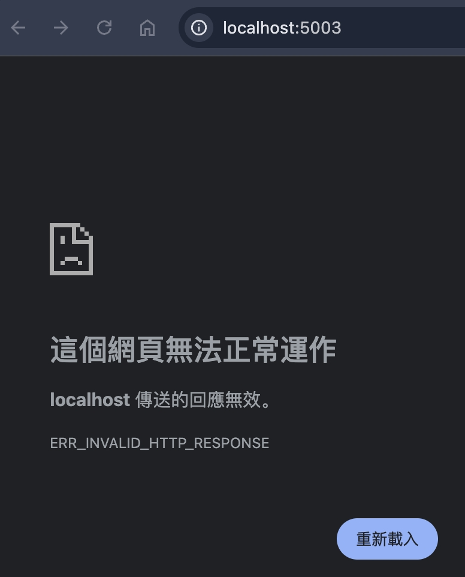
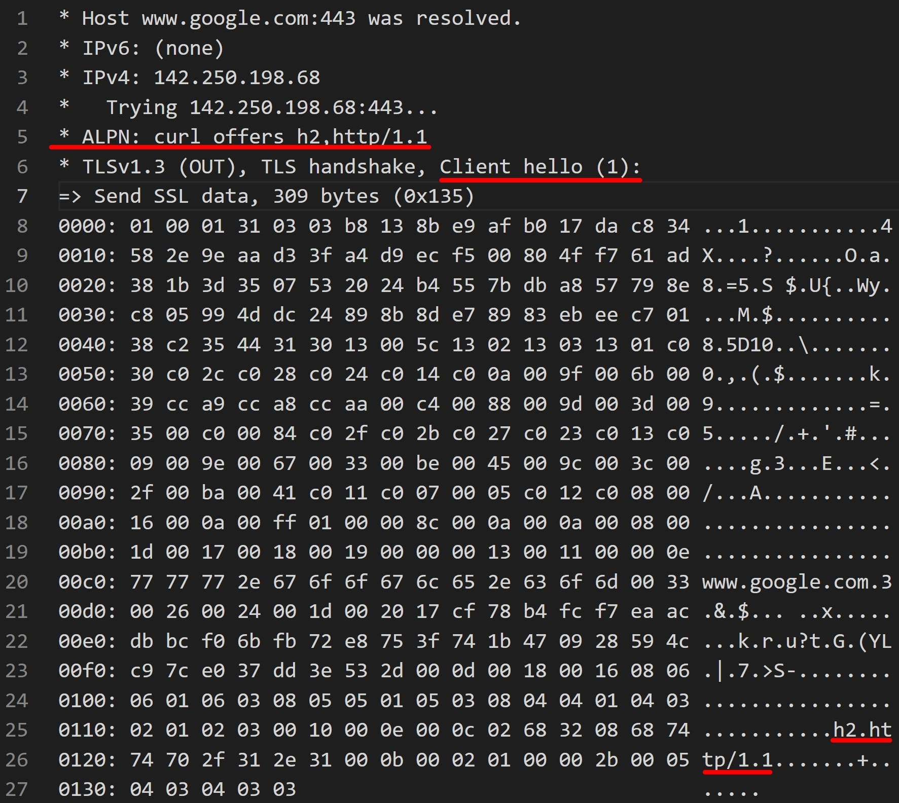
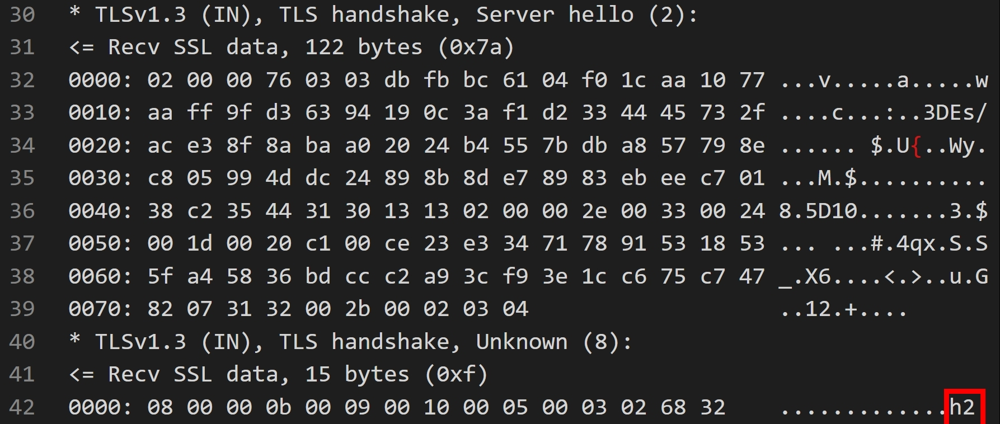
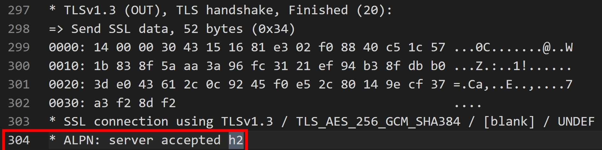
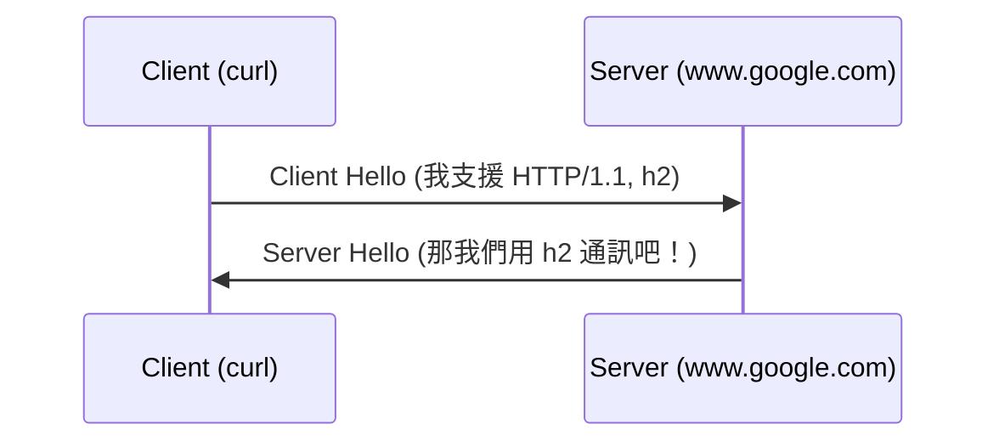
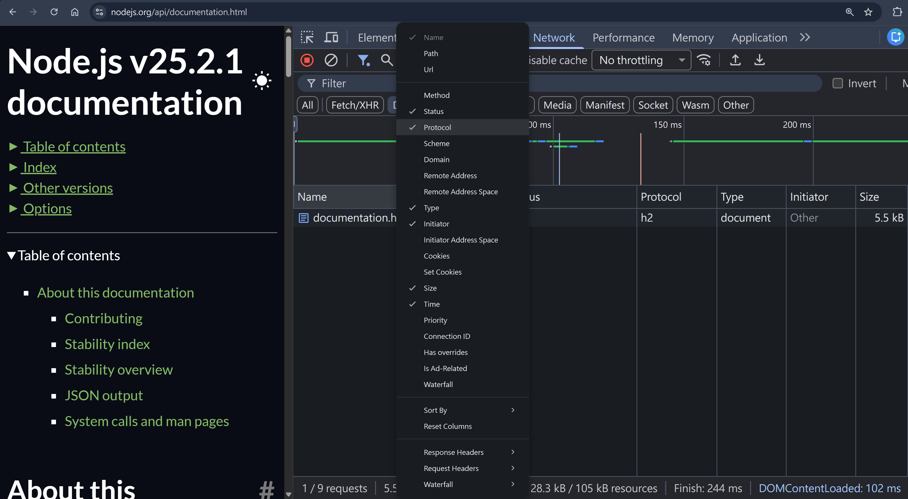
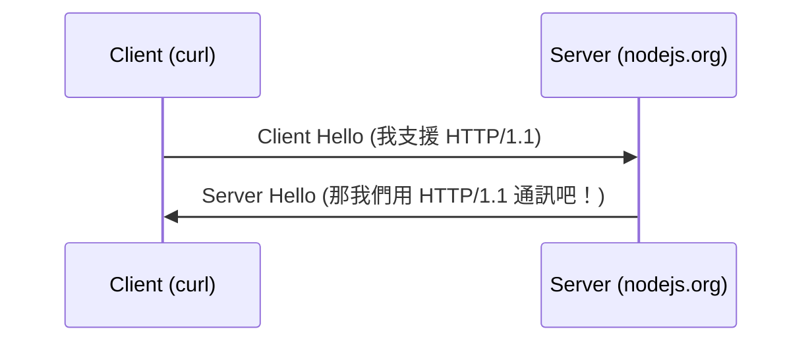

## 前言

當我們在本機啟動一個 NodeJS http server

```js
import { createServer } from "http";
const httpServer = createServer().listen(5000);
httpServer.on("request", function requestListener(req, res) {
  res.end("ok");
});
```

瀏覽器輸入 http://localhost:5000/ 即可看到結果，這一切都是那麼的理所當然

但當我們在本機啟動一個 NodeJS http2 server

```js
const http2Server = http2.createServer();
http2Server.on("request", (req, res) => {
  console.log(req.headers);
  res.end("Welcome to HTTP/2 Server");
});
http2Server.listen(5003);
```

瀏覽器輸入 http://localhost:5003/ ，會發現竟然打不開！？


不知道各位有沒有想過，當我們在網址列輸入 "http" 的時候，Client (瀏覽器) 跟 Server (NodeJS) 是怎麼決定 http 版本的呢？

這問題其實從 2022 年就一直埋藏在我心中，直到我 2025/11 寫了 [HTTP/2](./http-2.md) 的文章，才終於了解 "HTTP Version Negotiation" 的機制

## h2c is not widely implemented

簡單來說

1. 瀏覽器只支援 HTTP/2 + TLS (簡稱 h2)
2. HTTP/2 over cleartext (簡稱 h2c) 實作率很低

至於原因，可參考我寫過的 [HTTP/2](./http-2.md#http2-over-https)

## ALPN

這是我們今天的重點，ALPN (Application-Layer Protocol Negotiation)，它是一個 TLS 層級的 extension，讓 Layer 7 (Application Layer) 的 Protocol 可以在 (Layer 7 以下的) TLS 就協商好

所以，為啥要這麼複雜勒？因為 HTTP/1.1, HTTP/2 的 HTTPS 都跑在 443 port，在 TLS HandShake 階段就把 HTTP 版本協商好，真正開始發送 HTTP 請求的時候，就不用再重新協商一次

至於 ALPN 是怎麼運作的呢？我們不需要了解整個 TLS HandShake 的內容，只需要用 curl 觀察協商過程的關鍵字即可

```
curl --trace google.txt https://www.google.com
```

:::info
Windows 內建的 curl (C:\Windows\System32\curl.exe) 是閹割版的，不支援 HTTP/2

可下載 curl for Windows https://curl.se/windows/

之後將 C:\path-to-your-download-curl\bin\curl.exe 重新命名為 curl2.exe

並且將 C:\path-to-your-download-curl\bin\curl.exe 加到環境變數

即可用 curl2 來代替 curl
:::

這行指令會在當前目錄寫入一個 google.txt，包含詳細的 DEBUG 資訊

搜尋關鍵字 h2，就可以看到 ALPN 協商的過程




簡化一下 ALPN 協商過程，其實就是



## NodeJS http, https, http2 模組

NodeJS 關於 HTTP 的模組有三個

| Module | Server Compatibility       | ALPN | Document                          |
| ------ | -------------------------- | ---- | --------------------------------- |
| http   | HTTP/1.1 + plaintext       | ❌   | https://nodejs.org/api/http.html  |
| https  | HTTP/1.1 over TLS          | ✅   | https://nodejs.org/api/https.html |
| http2  | h2, h2c, HTTP/1.1 over TLS | ✅   | https://nodejs.org/api/http2.html |

從命名來看還蠻混亂的，但如果從時間軸來看的話，http 跟 https 是最早出現的模組；到了 2015 年 HTTP/2 問世，新的模組也只能命名叫 http2，所以若考量歷史的話，其實這是蠻合理的命名

## h2 Server support HTTP/1.1 over TLS

再來要提到，實務上 h2 Server 通常都會支援 HTTP/1.1 over TLS，其中一個原因就是向後兼容性

測試方法也很簡單，隨意點開一個 https 的網站，用瀏覽器 F12 > Network 觀察 Protocol，確認有支援 h2


之後用 curl 測試是否支援 HTTP/1.1 over TLS

```
curl -v --http1.1 https://nodejs.org/api/documentation.html -o documentation.html
```

從 log 可以看到 ALPN 的協商過程，以及 Raw HTTP/1.1 Request & Response

```
* ALPN: curl offers http/1.1
...
* ALPN: server accepted http/1.1

> GET /api/documentation.html HTTP/1.1
> Host: nodejs.org
> User-Agent: curl/8.17.0
> Accept: */*
>
* Request completely sent off
< HTTP/1.1 200 OK
< Date: Sun, 28 Dec 2025 01:45:23 GMT
< Content-Type: text/html; charset=utf-8
< Content-Length: 28305
< Connection: keep-alive
< Server: cloudflare
...
```

ALPN 協商過程：



:::info
為何上述情境，不用瀏覽器測試 HTTP/1.1 over TLS ?

因為現代瀏覽器在 ALPN 都會發送 Client Hello (我支援 HTTP/1.1, h2)

所以用底層的 HTTP Client 測試會比較方便
:::

## NodeJS 實作環節

NodeJS [http2.createSecureServer](https://nodejs.org/api/http2.html#http2createsecureserveroptions-onrequesthandler) 也有支援 HTTP/1.1 over TLS

使用 mkcert 建立本機測試憑證

```
mkcert -install
mkcert -key-file private-key.pem -cert-file cert.pem localhost
```

啟動 NodeJS http2 Server

```ts
const https2Server = http2.createSecureServer({
  key: readFileSync(join(__dirname, "private-key.pem")),
  cert: readFileSync(join(__dirname, "cert.pem")),
  allowHTTP1: true,
});

https2Server.on("request", (req, res) => {
  res.end("Welcome to HTTP/2 Server");
});
```

嘗試

```
curl -v --http1.1 https://localhost:5002/
```

若觀察到憑證不被信任的狀況，請將 mkcert 的 rootCA 加入 curl

```cmd
mkcert -CAROOT
type C:\path-to-your\mkcert\rootCA.pem >> C:\path-to-your-curl\bin\curl-ca-bundle.crt
```

重新嘗試

```
curl -v --http1.1 https://localhost:5002/
```

即可成功看到 ALPN 協商過程，以及 HTTP/2 Request & Response

```
* ALPN: curl offers http/1.1
...
* ALPN: server accepted http/1.1
...
> GET / HTTP/1.1
> Host: localhost:5002
> User-Agent: curl/8.17.0
> Accept: */*
>
< HTTP/1.1 200 OK
< Date: Sun, 28 Dec 2025 07:35:56 GMT
< Connection: keep-alive
< Content-Length: 24
<
Welcome to HTTP/2 Server
```

### TLS no_application_protocol

若設定 `allowHTTP1: false`，然後發送 `curl -v --http1.1 https://localhost:5002/`，會發生什麼事呢？

微調 NodeJS http2 Server 設定

```ts
const https2Server = http2.createSecureServer({
  key: readFileSync(join(__dirname, "private-key.pem")),
  cert: readFileSync(join(__dirname, "cert.pem")),
  allowHTTP1: false,
});
```

會看到以下 curl 錯誤訊息

```
* TLSv1.3 (IN), TLS alert, no application protocol (632):
* TLS connect error: error:14004460:SSL routines:CONNECT_CR_SRVR_HELLO:tlsv1 alert no application protocol
* closing connection #0
curl: (35) TLS connect error: error:14004460:SSL routines:CONNECT_CR_SRVR_HELLO:tlsv1 alert no application protocol
```

並且根據 [RFC7301 section-3.2](https://datatracker.ietf.org/doc/html/rfc7301#section-3.2) 的描述

```
In the event that the server supports no protocols that the client advertises, then the server SHALL respond with a fatal "no_application_protocol" alert.
```

進一步研究 TLS v1.2 跟 TLS v1.3，在 [RFC 5246 appendix-A.3](https://datatracker.ietf.org/doc/html/rfc5246#appendix-A.3) 跟 [RFC 8446 appendix-B.2](https://datatracker.ietf.org/doc/html/rfc8446#appendix-B.2) 都有描述到 Alert Messages

```
enum { warning(1), fatal(2), (255) } AlertLevel;
enum {
    ...
    no_application_protocol(120),
    (255)
} AlertDescription;
```

實際用 openssl 查看更詳細的 log

```
openssl s_client -connect localhost:5002 -alpn http/1.1 -msg
```

捕捉關鍵的 log

```
<<< TLS 1.3, Alert [length 0002], fatal ???
    02 78
34200000:error:0A000460:SSL routines:ssl3_read_bytes:tlsv1 alert no application protocol:ssl\record\rec_layer_s3.c:916:SSL alert number 120
```

- 按照上面定義的 AlertLevel， 02 就是對應到 fatal
- 78 則是 hex 格式，轉成 decimal (十進位) 的話就是 120，也就是 no_application_protocol

總結一下，若 Client 只支援 HTTP/1.1 且 Server 只支援 HTTP/2，則在 TLS 階段，Server 就可以回應 fatal no_application_protocol，並且直接斷開連線

參考 [RFC 5246 section-7.2](https://datatracker.ietf.org/doc/html/rfc5246#section-7.2)

```
Alert messages with a level of fatal result in the immediate termination of the connection.
```

## 小結

回頭反思[前言](#前言)，當前端工程師在本機開發前端網頁時，若使用瀏覽器打開 `http://localhost:port`，一定是走 HTTP/1.1，不管你用 Vite, NextJS, NuxtJS 或是其他工具。

有了 ALPN，可以在 TLS 協商過程就指定 HTTP 版本，這就是 "HTTP Version Negotiation" 的實現！

## 參考資料

- https://developer.mozilla.org/en-US/docs/Glossary/ALPN
- https://datatracker.ietf.org/doc/html/rfc7301
- https://datatracker.ietf.org/doc/html/rfc5246
- https://datatracker.ietf.org/doc/html/rfc8446
