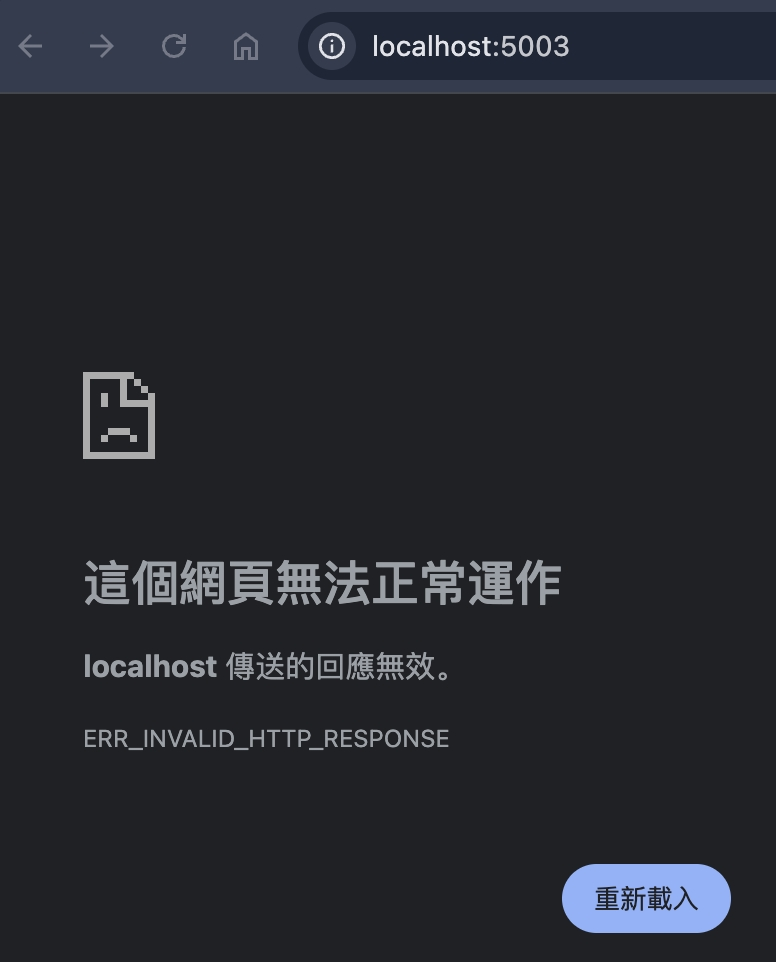
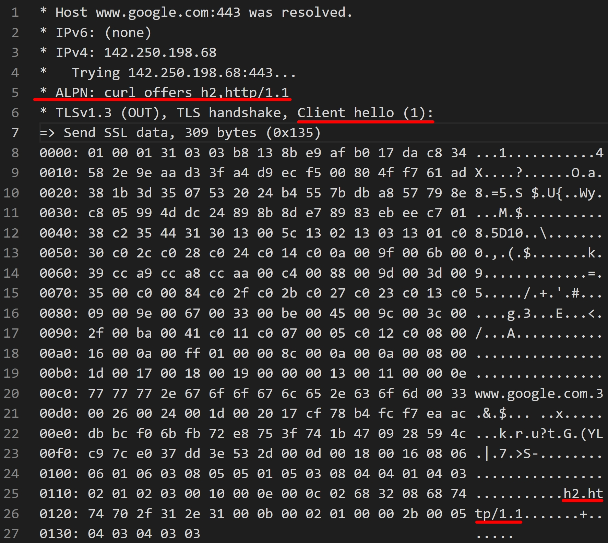
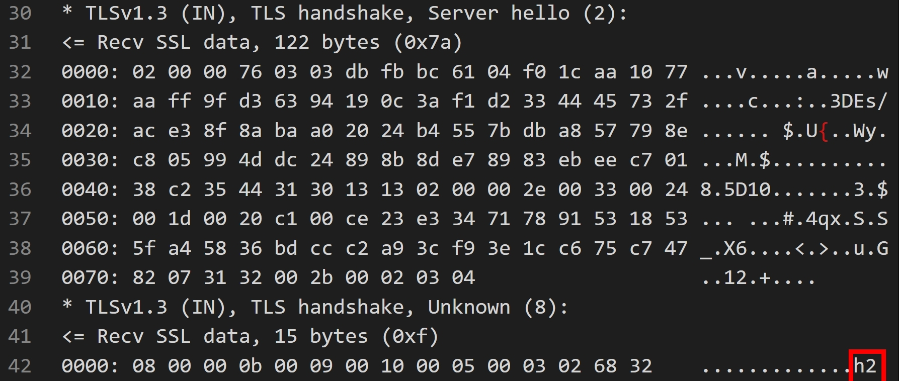
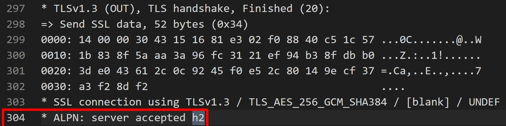
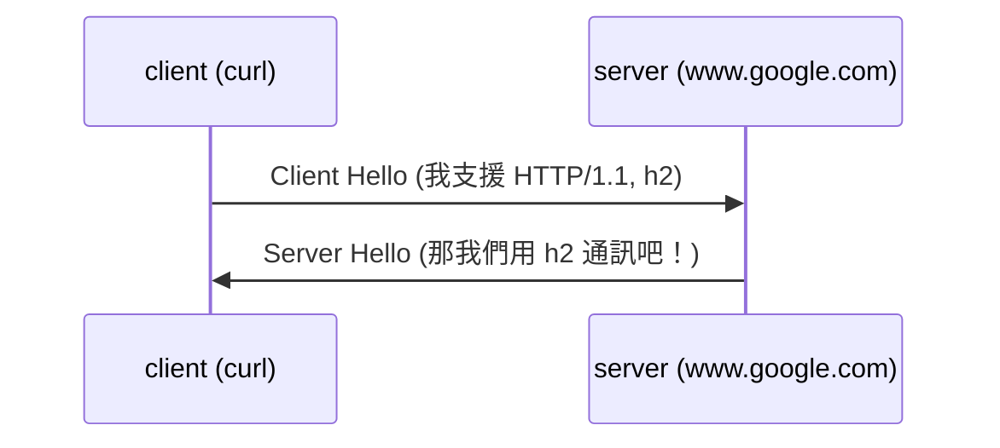
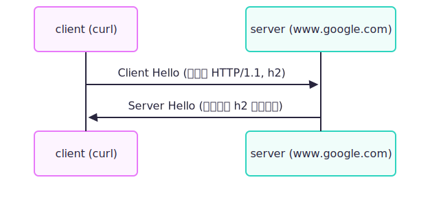
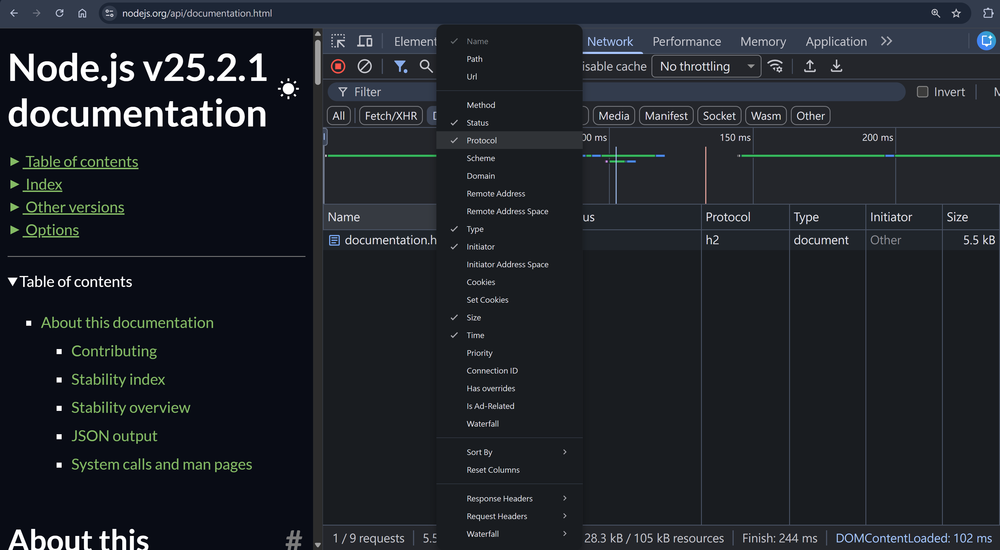
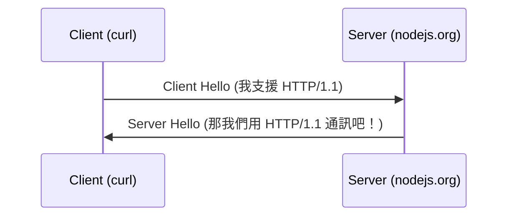

## 前言

當我們在本機啟動一個 Node.js `http.Server`

```js
import http from "http";

const httpServer = http.createServer((req, res) => res.end("ok"));
httpServer.listen(5000);
```

瀏覽器輸入 http://localhost:5000/ 即可看到結果，這一切都是那麼的理所當然

但當我們在本機啟動一個 Node.js `Http2Server`

```js
import http2 from "http2";

const http2Server = http2.createServer((req, res) => res.end("ok"));
http2Server.listen(5003);
```

瀏覽器輸入 http://localhost:5003/ ，會發現竟然打不開！？



不知道各位有沒有想過，當我們在網址列輸入 "http" 的時候，client (瀏覽器) 跟 server (Node.js) 是怎麼決定 http 版本的呢？

這問題其實從 2022 年就一直埋藏在我心中，直到我 2025/11 寫了 HTTP/2 的文章，才終於了解 "HTTP Version Negotiation" 的機制

## h2c is not widely implemented

在上面的範例，瀏覽器輸入 http://localhost:5003/ ，之所以會收到 "ERR_INVALID_HTTP_RESPONSE"

是因為主流瀏覽器只支援 HTTP/2 + TLS (簡稱 h2)，不支援 HTTP/2 over cleartext (簡稱 h2c)

<!-- 至於原因，可參考我寫過的 [HTTP/2](./http-2.md#http2-for-http-uris-has-been-deprecated) -->

## ALPN

這是我們今天的重點，ALPN (Application-Layer Protocol Negotiation) 是一個 TLS 層級的 extension，讓 Layer 7 (Application Layer) 的 Protocol 可以在 (Layer 5 ~ 6) TLS 就協商好

為啥要這麼複雜勒？因為 HTTP/1.1, HTTP/2 的 HTTPS 通常都跑在 443 port，在 TLS HandShake 階段就把 HTTP 版本協商好，真正開始發送 HTTP 請求的時候，就不用再重新協商一次

至於 ALPN 是怎麼運作的呢？我們不需要了解整個 TLS HandShake 的內容，只需要用 curl 觀察協商過程的關鍵字即可

```
curl --trace google.txt https://www.google.com
```

這行指令會在當前目錄寫入一個 google.txt，包含詳細的 DEBUG 資訊

:::info
Windows 內建的 curl (C:\Windows\System32\curl.exe) 是閹割版的，不支援 HTTP/2

可下載 curl for Windows https://curl.se/windows/

之後將 C:\path-to-your-downloaded-curl\bin\curl.exe 重新命名為 curl2.exe

並且將 C:\path-to-your-downloaded-curl\bin\curl2.exe 加到環境變數

即可在終端機用 curl2 來代替 curl
:::

搜尋關鍵字 h2，就可以看到 ALPN 協商的過程





簡化一下 ALPN 協商過程，其實就是


```mermaid
sequenceDiagram
  participant c as client (curl)
  participant s as server (www.google.com)

  c ->> s: Client Hello (我支援 HTTP/1.1, h2)
  s ->> c: Server Hello (那我們用 h2 通訊吧！)
```

<!--  -->

## Node.js `http`, `https`, `http2` 模組差異

Node.js 關於 HTTP 的模組有三個

| Module | Server Compatibility       | ALPN | Document                          |
| ------ | -------------------------- | ---- | --------------------------------- |
| http   | HTTP/1.1 + plaintext       | No   | https://nodejs.org/api/http.html  |
| https  | HTTP/1.1 over TLS          | Yes  | https://nodejs.org/api/https.html |
| http2  | h2, h2c, HTTP/1.1 over TLS | Yes  | https://nodejs.org/api/http2.html |

- 從命名來看還蠻混亂的，但如果從時間軸來看的話，`http` 跟 `https` 是最早出現的模組
- 到了 2015 年 HTTP/2 問世，新的模組也只能命名叫 `http2`
- 所以若考量歷史的話，其實這是蠻合理的命名

## h2 server support HTTP/1.1 over TLS

再來要提到，實務上 h2 server 通常都會支援 HTTP/1.1 over TLS，其中一個原因就是向後兼容性

測試方法也很簡單，隨意點開一個 https 的網站，用瀏覽器 F12 > Network 觀察 Protocol，確認有支援 h2



之後用 curl 測試是否支援 HTTP/1.1 over TLS

```
curl --http1.1 -v https://nodejs.org/api/documentation.html -o /dev/null
```

從 log 可以看到 ALPN 的協商過程，以及 raw HTTP/1.1 request & response

```
* ALPN: curl offers http/1.1
...
* ALPN: server accepted http/1.1

> GET /api/documentation.html HTTP/1.1
> Host: nodejs.org
> User-Agent: curl/8.17.0
> Accept: */*
>
* Request completely sent off
< HTTP/1.1 200 OK
< Content-Type: text/html; charset=utf-8
< Content-Length: 28305
< Connection: keep-alive
...
```

ALPN 協商過程：


```mermaid
sequenceDiagram
  participant c as Client (curl)
  participant s as Server (nodejs.org)

  c ->> s: Client Hello (我支援 HTTP/1.1)
  s ->> c: Server Hello (那我們用 HTTP/1.1 通訊吧！)
```

:::info
為何上述情境，不用瀏覽器測試 HTTP/1.1 over TLS ?

因為現代瀏覽器在 ALPN 都會發送 Client Hello (我支援 HTTP/1.1, h2)

所以用底層的 HTTP client 測試會比較方便
:::

## Node.js 實作環節

Node.js [http2.createSecureServer](https://nodejs.org/api/http2.html#http2createsecureserveroptions-onrequesthandler) 也有支援 HTTP/1.1 over TLS

1. 使用 mkcert 建立本機測試憑證

```
mkcert -install
mkcert -key-file private-key.pem -cert-file cert.pem localhost
```

2. 啟動 Node.js `Http2SecureServer`

```ts
import http2 from "http2";

const http2SecureServer = http2.createSecureServer({
  key: readFileSync(join(__dirname, "private-key.pem")),
  cert: readFileSync(join(__dirname, "cert.pem")),
  allowHTTP1: true,
});
http2SecureServer.on("request", (req, res) => {
  res.end("Welcome to HTTP/2 Server");
});
http2SecureServer.listen(5002);
```

3. 終端機輸入

```
curl -v --http1.1 https://localhost:5002/
```

4. 若觀察到憑證不被信任的狀況，請將 mkcert 的 rootCA 加入 curl

```cmd
mkcert -CAROOT
type /path-to-your/mkcert/rootCA.pem >> /path-to-your-curl/bin/curl-ca-bundle.crt
```

5. 終端機輸入

```
curl -v --http1.1 https://localhost:5002/
```

6. 即可成功看到 ALPN 協商過程，以及 HTTP/2 request & response

```
* ALPN: curl offers http/1.1
...
* ALPN: server accepted http/1.1
...
> GET / HTTP/1.1
> Host: localhost:5002
> User-Agent: curl/8.17.0
> Accept: */*
>
< HTTP/1.1 200 OK
< Connection: keep-alive
< Content-Length: 24
<
Welcome to HTTP/2 Server
```

## Edge Case 1: HTTP/1.1 client + HTTP/2 server

若設定 `allowHTTP1: false`，然後發送 `curl -v --http1.1 https://localhost:5002/`，會發生什麼事呢？

1. 微調 Node.js `Http2SecureServer` 設定（僅列出異動）

```ts
const http2SecureServer = http2.createSecureServer({
  key: readFileSync(join(__dirname, "private-key.pem")),
  cert: readFileSync(join(__dirname, "cert.pem")),
  allowHTTP1: false,
});
```

2. 終端機輸入 `curl -v --http1.1 https://localhost:5002/`，會看到以下 curl 錯誤訊息

```
* TLSv1.3 (IN), TLS alert, no application protocol (632):
* TLS connect error: error:14004460:SSL routines:CONNECT_CR_SRVR_HELLO:tlsv1 alert no application protocol
* closing connection #0
curl: (35) TLS connect error: error:14004460:SSL routines:CONNECT_CR_SRVR_HELLO:tlsv1 alert no application protocol
```

3. 根據 [RFC7301 section-3.2](https://datatracker.ietf.org/doc/html/rfc7301#section-3.2) 的描述

```
In the event that the server supports no protocols that the client advertises, then the server SHALL respond with a fatal "no_application_protocol" alert.
```

4. 進一步研究 TLS v1.2 跟 TLS v1.3，在 [RFC 8446 appendix-B.2](https://datatracker.ietf.org/doc/html/rfc8446#appendix-B.2) 有描述到 Alert Messages

```
enum { warning(1), fatal(2), (255) } AlertLevel;
enum {
    ...
    no_application_protocol(120),
    (255)
} AlertDescription;
```

5. 實際用 openssl 查看更詳細的 log

```
openssl s_client -connect localhost:5002 -alpn http/1.1 -msg
```

6. 捕捉關鍵的 log

```
<<< TLS 1.3, Alert [length 0002], fatal ???
    02 78
```

- 按照上面定義的 `enum AlertLevel`， 02 就是對應到 `fatal`
- 78 則是 hex 格式，轉成 decimal (十進位) 的話就是 120，也就是 `no_application_protocol`

若 client 只支援 HTTP/1.1 且 server 只支援 HTTP/2，則在 TLS 階段，server 可以回應 `fatal` + `no_application_protocol`，並且直接斷開連線，參考 [RFC8446 Section 6.2](https://datatracker.ietf.org/doc/html/rfc8446#section-6.2)

```
Whenever an implementation encounters a fatal error condition, it SHOULD send an appropriate fatal alert and MUST close the connection without sending or receiving any additional data.
```

## 小結

在這篇文章，我們學到了

- 主流瀏覽器不支援 h2c
- HTTP 版本是如何透過 ALPN 協商的
- **"只支援 HTTP/1.1 的 client"** 嘗試去連 **"只支援 HTTP/2 的 server"** 會發生什麼事

## 參考資料

- https://developer.mozilla.org/en-US/docs/Glossary/ALPN
- https://datatracker.ietf.org/doc/html/rfc7301
- https://datatracker.ietf.org/doc/html/rfc8446
