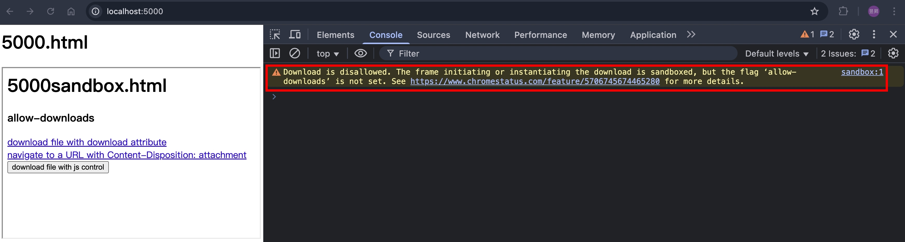
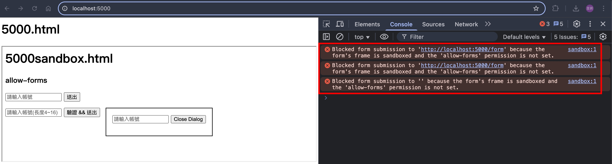
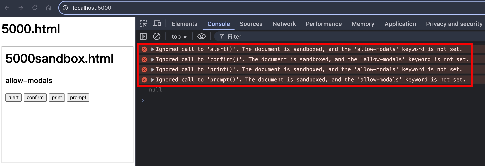
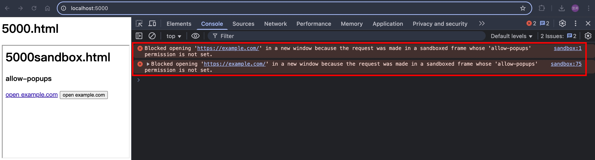
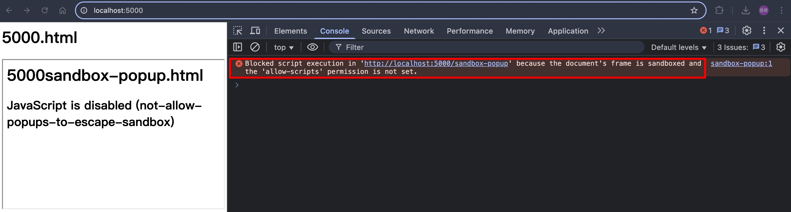
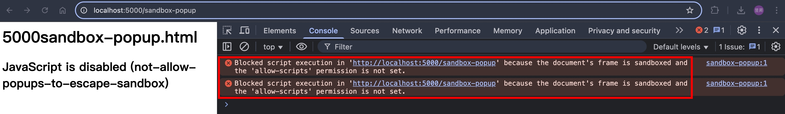
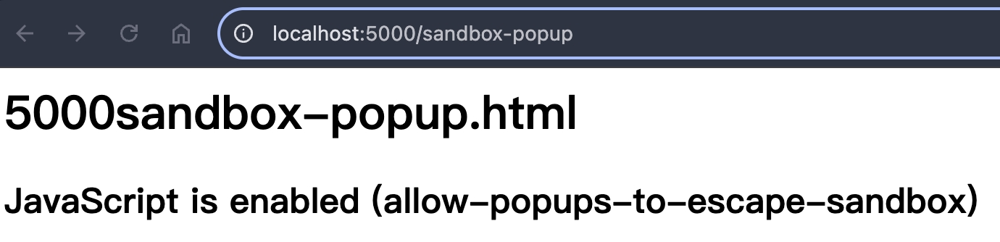
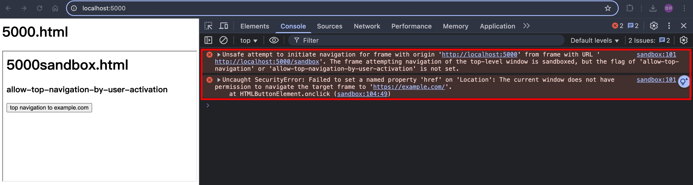
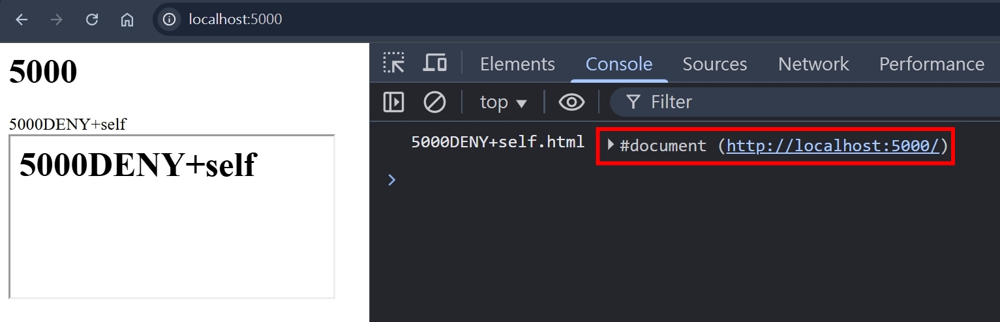

## 大綱

本篇要來介紹 iframe security，內容包含

1. `<iframe sandbox>`
2. X-Frame-Options
3. CSP: frame-ancestors

## `<iframe sandbox>`

根據 [html.spec.whatwg.org](https://html.spec.whatwg.org/multipage/iframe-embed-object.html#attr-iframe-sandbox) 的文件描述

```
When the attribute is set, the content is treated as being from a unique opaque origin, forms, scripts, and various potentially annoying APIs are disabled, and links are prevented from targeting other navigables.
```

也就是說，當我們設定 `<iframe sandbox src="URL"></iframe>` 的時候，就會限制 `<iframe>` 內的網站行為，但我們可以透過設定多組 `allow-` 的 token 來指定被嵌入的頁面可以執行哪些事情，包含以下：

<table>
  <thead>
    <tr>
      <th>token</th>
      <th>explain</th>
    </tr>
  </thead>
  <tbody>
    <tr>
      <td>allow-downloads</td>
      <td>
        <ol>
          <li>允許透過 `<a download>` 下載檔案</li>
          <li>允許透過 `<a href="file-url">` 下載檔案</li>
          <li>允許透過 `HTMLAnchorElement.click()` 下載檔案，需先設定 `allow-scripts`</li>
        </ol>
      </td>
    </tr>
    <tr>
      <td>allow-forms</td>
      <td>
        <ol>
          <li>允許 `<form action="URL"></form>` 可正常送出表單</li>
          <li>允許 `<dialog><form method="dialog"></form></dialog>` 可正常關閉 dialog</li>
          <li>允許 `<form><input pattern="\w{3,16}" /></form>` 可正常觸發表單的驗證</li>
        </ol>
      </td>
    </tr>
    <tr>
      <td>allow-modals</td>
      <td>
        <ol>
          <li>允許 `alert()` 的執行</li>
          <li>允許 `confirm()` 的執行</li>
          <li>允許 `print()` 的執行</li>
          <li>允許 `prompt()` 的執行</li>
          <li>允許 `beforeunload` event 的執行</li>
        </ol>
        💡 以上皆需先設定 `allow-scripts` 💡
      </td>
    </tr>
    <tr>
      <td>allow-popups</td>
      <td>
        <ol>
          <li>允許 `open("URL", "_blank")` 的執行，需先設定 `allow-scripts`</li>
          <li>允許 `<a target="_blank">` 的執行</li>
        </ol>
      </td>
    </tr>
    <tr>
      <td>allow-same-origin</td>
      <td>
        <ol>
          <li>允許瀏覽器將 "被嵌入的同源網頁" 視為同源</li>
          <li>如果嵌入的網頁為非同源，設定 `allow-same-origin` 還是會被瀏覽器視為非同源</li>
        </ol>
      </td>
    </tr>
    <tr>
      <td>allow-scripts</td>
      <td>允許執行 javascript</td>
    </tr>
    <tr>
      <td>allow-popups-to-escape-sandbox</td>
      <td>
        <ol>
          <li>允許被嵌入的頁面所開啟的新視窗（需先設定 `allow-popups`）可以跳脫 `<iframe>` 設定的 sandbox</li>
          <li>應用場景：新聞網站為了營收，透過 iframe 嵌入第三方廣告，第三方廣告頁的 "立即結帳" 會另開購物車頁面，這個購物車頁面，就可以跳脫 `<iframe>` 設定的 sandbox（可以正常執行 JavaScript => 可以正常結帳）</li>
        </ol>
      </td>
    </tr>
    <tr>
      <td>allow-top-navigation</td>
      <td>
        <ol>
          <li>允許被嵌入的頁面可以針對 `window.top` 去導轉，需先設定 `allow-scripts`</li>
          <li>允許被嵌入的頁面可以使用 `window.top.close()`，需先設定 `allow-scripts`，且 top 頁面是透過 js 打開的</li>
        </ol>
      </td>
    </tr>
    <tr>
      <td>allow-top-navigation-by-user-activation</td>
      <td>
        <ol>
          <li>`allow-top-navigation` 的子集合，差別是 => 必須由 user 觸發（例如：onClick）</li>
          <li>承上，若有設定 `allow-top-navigation`，則不需要設定此 token</li>
        </ol>
      </td>
    </tr>
    <tr>
      <td>allow-top-navigation-to-custom-protocols</td>
      <td>同 `allow-top-navigation`，差別是 => 可以導轉到 http 以外的 protocols</td>
    </tr>
    <tr>
      <td>allow-orientation-lock</td>
      <td>`lockOrientation()` 已被棄用，本篇不討論</td>
    </tr>
    <tr>
      <td>allow-presentation</td>
      <td>允許被嵌入的網頁使用 `PresentationRequest`（我沒用過）</td>
    </tr>
    <tr>
      <td>allow-pointer-lock</td>
      <td>允許被嵌入的網頁使用 Pointer Lock API（我沒用過）</td>
    </tr>
  </tbody>
</table>

## 實作環節

我們建立以下：
| 檔案名稱 | 用途 |
| ---- | ---- |
| 5000.html | 主網站，等等要透過瀏覽器打開 |
| 5000sandbox.html | 被嵌入 `<iframe>` 的網站 |
| 5000sandbox-popup.html | 被嵌入 `<iframe>` 的網站所開啟的新分頁 |
| index.ts | NodeJS HTTP Server |
| download.js | 被下載的測試檔案，內容隨意 |

## allow-downloads

5000.html

```html
<html>
  <head></head>
  <body>
    <h1>5000.html</h1>
    <style>
      iframe {
        width: 100%;
        height: 300px;
      }
    </style>

    <iframe
      src="http://localhost:5000/sandbox"
      sandbox="allow-scripts"
    ></iframe>
  </body>
</html>
```

5000sandbox.html

```html
<html>
  <head></head>
  <body>
    <h1>5000sandbox.html</h1>

    <h3>allow-downloads</h3>
    <div>
      <a download href="http://localhost:5000/download">
        download file with download attribute
      </a>
      <br />
      <a href="http://localhost:5000/download">
        navigate to a URL with Content-Disposition: attachment
      </a>
      <br />
      <script>
        function handleDownload() {
          const a = document.createElement("a");
          a.href = "http://localhost:5000/download";
          a.click();
        }
      </script>
      <button onclick="handleDownload()">download file with js control</button>
    </div>
  </body>
</html>
```

index.ts

```ts
import { readFileSync } from "fs";
import { http5000Server } from "./httpServers";
import { join } from "path";
import { faviconListener } from "../listeners/faviconListener";
import { notFoundListener } from "../listeners/notFoundlistener";

// 為了開發方便，每次 request 都去讀取 static html

http5000Server.removeAllListeners("request");
http5000Server.on("request", function requestListener(req, res) {
  if (req.url === "/favicon.ico") return faviconListener(req, res);
  if (req.url === "/") {
    res.setHeader("Content-Type", "text/html; charset=utf-8");
    return res.end(readFileSync(join(__dirname, "5000.html")));
  }
  if (req.url === "/sandbox") {
    res.setHeader("Content-Type", "text/html; charset=utf-8");
    return res.end(readFileSync(join(__dirname, "5000sandbox.html")));
  }
  if (req.url === "/download") {
    res.setHeader("Content-Type", "text/javascript");
    res.setHeader("Content-Disposition", "attachment; filename=download.js");
    return res.end(readFileSync(join(__dirname, "download.js")));
  }
  return notFoundListener(req, res);
});
```

download.js

```js
console.log("downloaded js file!!!");
```

瀏覽器打開 http://localhost:5000/ ，點擊下載連結跟按鈕，會看到以下錯誤訊息


把 `allow-downloads` 加上去

5000.html

```html
<iframe
  src="http://localhost:5000/sandbox"
  sandbox="allow-scripts allow-downloads"
></iframe>
```

重整畫面，點擊下載按鈕，此時就可以正常下載了 ✨✨✨

## allow-forms

5000.html

```html
<iframe src="http://localhost:5000/sandbox" sandbox=""></iframe>
```

5000sandbox.html

```html
<h3>allow-forms</h3>
<form
  method="post"
  action="http://localhost:5000/form"
  enctype="multipart/form-data"
>
  <input type="text" placeholder="請輸入帳號" name="username" />
  <button type="submit">送出</button>
</form>

<dialog open>
  <form method="dialog">
    <input type="text" placeholder="請輸入帳號" name="username" pattern="" />
    <button type="submit">Close Dialog</button>
  </form>
</dialog>

<form
  method="post"
  action="http://localhost:5000/form"
  enctype="multipart/form-data"
>
  <input
    required
    type="text"
    placeholder="請輸入帳號(長度4~16)"
    name="username"
    pattern="\w{4,16}"
  />
  <button type="submit">驗證 && 送出</button>
</form>
```

index.ts

```ts
if (req.url === "/form") {
  res.setHeader("Content-Type", "text/plain");
  return res.end("form submitted");
}
```

瀏覽器打開 http://localhost:5000/ ，點擊按鈕，會看到以下錯誤訊息


把 `allow-forms` 加上去

5000.html

```html
<iframe src="http://localhost:5000/sandbox" sandbox="allow-forms"></iframe>
```

重整畫面，點擊 submit 按鈕，此時就可以正常表單驗證 & 送出表單了 ✨✨✨

## allow-modals

5000.html

```html
<iframe src="http://localhost:5000/sandbox" sandbox="allow-scripts"></iframe>
```

5000sandbox.html

```html
<h3>allow-modals</h3>
<script>
  function promptUsername() {
    const username = prompt("username");
    console.log(username);
  }
  addEventListener("beforeunload", (e) => {
    e.preventDefault();
    e.returnValue = "beforeunload";
    return "beforeunload";
  });
</script>
<button onclick="alert('alert')">alert</button>
<button onclick="confirm('confirm')">confirm</button>
<button onclick="print()">print</button>
<button onclick="promptUsername()">prompt</button>
```

瀏覽器打開 http://localhost:5000/ ，點擊按鈕，會看到以下錯誤訊息


把 `allow-modals` 加上去

5000.html

```html
<iframe
  src="http://localhost:5000/sandbox"
  sandbox="allow-scripts allow-modals"
></iframe>
```

重整畫面，點擊按鈕，此時就可以正常跳出 modal 了 ✨✨✨

## allow-popups

5000.html

```html
<iframe src="http://localhost:5000/sandbox" sandbox="allow-scripts"></iframe>
```

5000sandbox.html

```html
<h3>allow-popups</h3>
<div>
  <script>
    function openExampleCom() {
      open("https://example.com/", "_blank");
    }
  </script>
  <a target="_blank" href="https://example.com/">open example.com</a>
  <button onclick="openExampleCom()">open example.com</button>
</div>
```

瀏覽器打開 http://localhost:5000/ ，點擊按鈕，會看到以下錯誤訊息


把 `allow-popups` 加上去

5000.html

```html
<iframe
  src="http://localhost:5000/sandbox"
  sandbox="allow-scripts allow-popups"
></iframe>
```

重整畫面，點擊按鈕，此時就可以正常開啟新視窗了 ✨✨✨

## allow-popups-to-escape-sandbox

5000.html

```html
<iframe src="http://localhost:5000/sandbox" sandbox="allow-popups"></iframe>
```

5000sandbox.html

```html
<h3>allow-popups-to-escape-sandbox</h3>
<a target="_blank" href="http://localhost:5000/sandbox-popup">另開新頁</a>
<a target="_self" href="http://localhost:5000/sandbox-popup">原頁導轉</a>
```

5000sandbox-popup.html

```html
<html>
  <head></head>
  <body>
    <h1>5000sandbox-popup.html</h1>
    <h2 id="h2" style="display: none">
      JavaScript is enabled (allow-popups-to-escape-sandbox)
    </h2>
    <script>
      document.getElementById("h2").style.display = "block";
    </script>
    <noscript>
      <h2>JavaScript is disabled (not-allow-popups-to-escape-sandbox)</h2>
    </noscript>
  </body>
</html>
```

index.ts

```ts
if (req.url === "/sandbox-popup") {
  res.setHeader("Content-Type", "text/html; charset=utf-8");
  return res.end(readFileSync(join(__dirname, "5000sandbox-popup.html")));
}
```

瀏覽器打開 http://localhost:5000/ ，分別點擊兩個按鈕

原頁導轉


另開新頁


把 `allow-popups-to-escape-sandbox` 加上去

5000.html

```html
<iframe
  src="http://localhost:5000/sandbox"
  sandbox="allow-popups allow-popups-to-escape-sandbox"
></iframe>
```

重整畫面，分別點擊兩個按鈕

原頁導轉


另開新頁


- ✅ 原頁導轉，由於還是同一個 browsing context（不是 popup），所以還是會被 sandbox 限制（不能執行 script）
- ✅ 另開新頁，吃到 `allow-popups-to-escape-sandbox`，所以可以跳出 sandbox 的限制（可以執行 script）

## allow-top-navigation & allow-top-navigation-by-user-activation

5000.html

```html
<iframe src="http://localhost:5000/sandbox" sandbox="allow-scripts"></iframe>
```

5000sandbox.html

```html
<h3>allow-top-navigation-by-user-activation</h3>
<script>
  function navigateTopToExampleCom() {
    top.location.href = "https://example.com/";
  }
</script>
<button onclick="navigateTopToExampleCom()">
  top navigation to example.com
</button>
```

瀏覽器打開 http://localhost:5000/ ，點擊按鈕，會看到以下錯誤訊息


把 `allow-top-navigation` 加上去

5000.html

```html
<iframe
  src="http://localhost:5000/sandbox"
  sandbox="allow-scripts allow-top-navigation"
></iframe>
```

重整畫面，點擊按鈕，此時就可以正常把 top window 導轉了 ✨✨✨

## X-Frame-Options

- 一句話總結，這個 Response Header 決定該網頁是否可以被 HTML 的 `<iframe>`, `<frame>`, `<embed>` 跟 `<object>` 嵌入
- 其中，`<frame>`, `<embed>` 跟 `<object>` 都是比較老舊的 HTMLElement，故本篇會著重在 `<iframe>`

## X-Frame-Options: DENY

不讓任何網頁嵌入

## X-Frame-Options: SAMEORIGIN

只讓同源的網頁嵌入

## CSP: frame-ancestors

比 [X-Frame-Options](#x-frame-options) 更新的 HTTP Response Header，可以提供更精細的控制，可設定多個白名單

## frame-ancestors 'none'

跟 [X-Frame-Options: DENY](#x-frame-options-deny) 類似，不讓任何網頁嵌入

## frame-ancestors 'self'

跟 [X-Frame-Options: SAMEORIGIN](#x-frame-options-sameorigin) 類似，只讓同源的網頁嵌入

## X-Frame-Options 跟 CSP 都沒設定的情況

- 該網頁可被任何網頁嵌入
- 遵守 [Same-origin_policy](https://developer.mozilla.org/en-US/docs/Web/Security/Same-origin_policy)
- 嵌入同源的網站，可互相存取對方的 `window`
  - parent 網站可透過 `window.frames[number]` 或 `HTMLIFrameElement.contentWindow` 存取嵌入的網站
  - 嵌入的網站則可以透過 `window.parent` 存取 parent 網站
- 嵌入跨域的網站，則瀏覽器會限制能存取的屬性
  - 若需要互相通訊，則需要透過 `window.postMessage` 以及 `addEventListener('message', callback)`
  - 確保雙方的程式接有實作對應的發送事件以及接收事件，如此就可減少未經授權的存取
  - 若嘗試在跨域的網站互相存取其對方 `window` 底下的屬性，則會被瀏覽器擋下來
  ```
  Uncaught SecurityError: Failed to read a named property 'document' from 'Window': Blocked a frame with origin "http://localhost:5001" from accessing a cross-origin frame.
  ```

## X-Frame-Options: DENY + frame-ancestors 'self'

如果同時設定這兩個，瀏覽器會以哪個為更高優先度呢？我們使用 NodeJS HTTP 模組來試試看：

NodeJS

```ts
http5000Server.on("request", function requestListener(req, res) {
  if (req.url === "/") {
    res.setHeader("Content-Type", "text/html; charset=utf-8");
    return res.end(readFileSync(join(__dirname, "5000.html")));
  }
});

http5001Server.on("request", function requestListener(req, res) {
  if (req.url === "/DENY+self") {
    res.setHeader("X-Frame-Options", "DENY");
    res.setHeader("Content-Security-Policy", "frame-ancestors 'self'");
  }
});
```

5000.html

```html
<html>
  <head></head>
  <body>
    <h1>5000</h1>
    <div>5000DENY+self</div>
    <iframe src="http://localhost:5000/DENY+self"></iframe>
  </body>
</html>
```

5000DENY+self.html

```html
<html>
  <head></head>
  <body>
    <h1>5000DENY+self</h1>
    <script>
      console.log("5000DENY+self.html", window.parent.document);
    </script>
  </body>
</html>
```

兩者都有設定的情況，CSP 的優先權會高於 `X-Frame-Options`


在 [CSP2](https://www.w3.org/TR/CSP2/#frame-ancestors-and-frame-options) 的官方文件中有描述到這點

```
The frame-ancestors directive obsoletes the X-Frame-Options header. If a resource has both policies, the frame-ancestors policy SHOULD be enforced and the X-Frame-Options policy SHOULD be ignored.
```

## X-Frame-Options 跟 CSP frame-ancestors 該怎麼設定

因為 `CSP frame-ancestors` 是比較新的功能，為了瀏覽器的向後兼容性，建議兩者都設置

如果不想讓所有網站嵌入，就設定

```ts
res.setHeader("X-Frame-Options", "DENY");
res.setHeader("Content-Security-Policy", "frame-ancestors 'none'");
```

如果只想讓同源的網站嵌入，就設定

```ts
res.setHeader("X-Frame-Options", "SAMEORIGIN");
res.setHeader("Content-Security-Policy", "frame-ancestors 'self'");
```

如果想要更精細的控制哪些網站可嵌入，就設定

```ts
res.setHeader(
  "Content-Security-Policy",
  "frame-ancestors <host-source> <host-source>",
);
```

## 參考資料

- https://developer.mozilla.org/en-US/docs/Web/HTML/Reference/Elements/iframe#sandbox
- https://developer.mozilla.org/en-US/docs/Web/HTTP/Headers/X-Frame-Options
- https://developer.mozilla.org/en-US/docs/Web/HTTP/Reference/Headers/Content-Security-Policy#self
- https://developer.mozilla.org/en-US/docs/Web/HTTP/Reference/Headers/Content-Security-Policy/frame-ancestors
- https://developer.mozilla.org/en-US/docs/Web/Security/Same-origin_policy
- https://developer.mozilla.org/en-US/docs/Glossary/Same-origin_policy
- https://www.w3.org/TR/CSP2/#frame-ancestors-and-frame-options
- https://html.spec.whatwg.org/multipage/iframe-embed-object.html#attr-iframe-sandbox
- https://aszx87410.github.io/beyond-xss/ch5/clickjacking/
