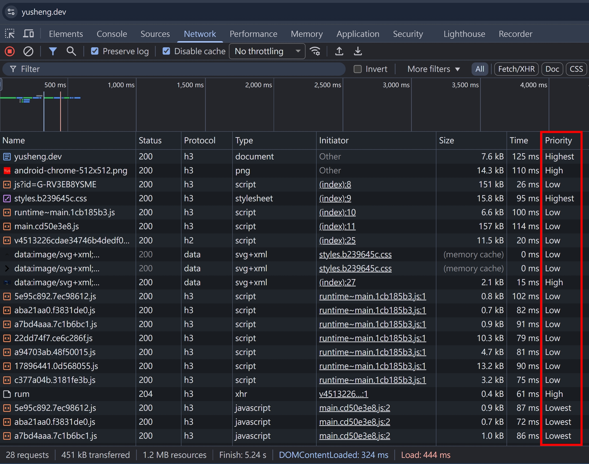
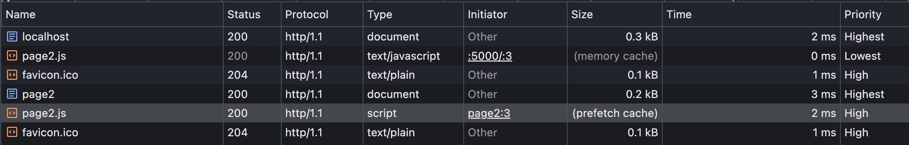
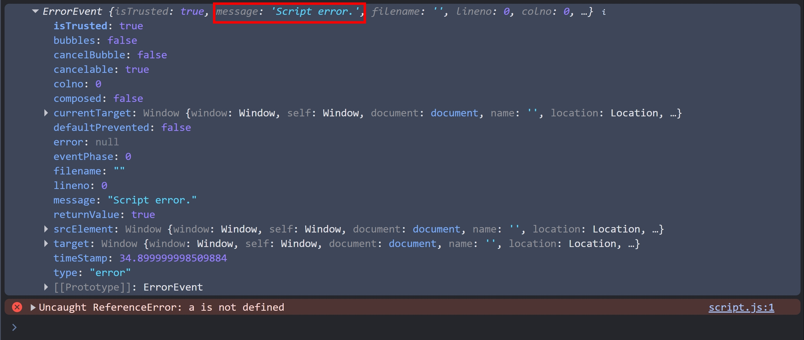
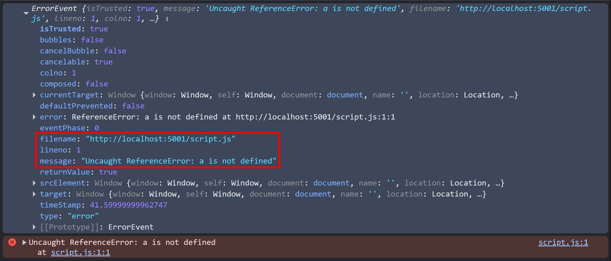

## 前言

在現代前端框架盛行的年代，很少會需要大量的手動設置 `<link>`，基本上 bundler 會處理好各種 JavaScript, CSS 的載入，只有少部分會需要在 `index.html` 設定；也因此顯少有機會深入研究 `<link>` 的各種 attribute。

為何會在 HTTP 的系列文章提到 `<link>` 呢？因為 HTTP response header 也可以設定 [Link](https://developer.mozilla.org/en-US/docs/Web/HTTP/Reference/Headers/Link)！所以就趁這篇文章，也順便把 HTML 的 `<link>` 也介紹一遍吧～

## 瀏覽器載入資源的 Priority

稍後在介紹 `<link>` 時，會提到這個概念

- 可透過 F12 > Network，右鍵點選 Table Header，將 "Priority" 勾選，即可看到
- 瀏覽器針對資源的載入順序，大致可分為 Highest > High > Medium > Low > Lowest



## `<link rel>`

rel = relationship，這是 `<link>` 身上很重要的 attribute，接下來會介紹幾個比較常用的值

### `<link rel="alternate">`

主要是為了 SEO，宣告不同語言的頁面

```html
<link rel="alternate" hreflang="x-default" href="https://example.com/" />
<link rel="alternate" hreflang="zh-TW" href="https://example.com/?lang=zh-TW" />
```

:::info
[x-default](https://developers.google.com/search/blog/2023/05/x-default) 是 Google 搜尋引擎定義的
:::

### `<link rel="canonical">`

canonical = 典範，在這邊代表的是 "preferred URL"

```html
<link rel="canonical" href="https://example.com/" />
```

### `<link rel="dns-prefetch">`

針對 cross-origin domains 先做 dns-prefetch

- same-origin 不需要，因為瀏覽器在訪問此頁面 HTML 的當下，就已經完整建立 TCP/TLS 連線了
- dns-prefetch 的用意是，先把 domain name resolve as IP Address

```html
<link rel="dns-prefetch" href="https://fonts.googleapis.com/" />
```

### `<link rel="prefetch">`

- 將資源的載入順序變成 "Lowest"
- 通常用在 same-origin，使用者下一頁會載入的資源，瀏覽器會在背景請求該資源，並且存到瀏覽器的 HTTP 快取
- 承上，response header 需要設定正確的 `Cache-Control`，prefetch 的資源才可以存到 HTTP 快取
- 透過 prefetch 載入的資源，request header 會有 `Sec-Purpose: prefetch`, `Sec-Fetch-Dest: empty`

使用 Node.js http 模組實作：

1. index.ts，定義 `/`、`/page2`、`/page2.js` 三個路由

```ts
import { readFileSync } from "fs";
import http from "http";
import httpServer from "../httpServer";
import { join } from "path";

const httpServer = http.createServer((req, res) => {
  const url = new URL(req.url || "", "http://localhost:5000");
  if (url.pathname === "/page2.js") {
    res.setHeader("Content-Type", "text/javascript");
    res.setHeader("Cache-Control", "public, max-age=60");
    res.end("console.log('hello world')");
    return;
  }
  if (url.pathname === "/") {
    res.setHeader("Content-Type", "text/html");
    res.end(readFileSync(join(__dirname, "index.html")));
    return;
  }
  if (url.pathname === "/page2") {
    res.setHeader("Content-Type", "text/html");
    res.end(readFileSync(join(__dirname, "page2.html")));
    return;
  }
});
httpServer.listen(5000);
```

2. index.html，定義 prefetch 載入 `/page2.js`

```html
<html>
  <head>
    <link rel="prefetch" href="/page2.js" as="script" />
  </head>
  <body>
    <a href="/page2">Go to page2</a>
  </body>
</html>
```

3. page2.html，實際載入 `/page2.js`

```html
<html>
  <head>
    <script src="/page2.js"></script>
  </head>
</html>
```

- 瀏覽器先訪問 http://localhost:5000/
- 之後透過超連結到 `/page2`
- 就可以看到 /page2 的 `<script src="/page2.js">` 吃到 prefetch 的快取
- F12 > Network => Disable Cache 要取消勾選



### `<link rel="preload">`

- 可以將資源的載入順序變成 "High"

```html
<link rel="preload" href="main.js" as="script" />
<link rel="preload" href="font.ttf" as="font" type="font/ttf" crossorigin />
```

:::info
`as="font"` 的情況，需要明確指定 `crossorigin` / `crossorigin=""` / `crossorigin="anonymous"`
:::

### `<link rel="modulepreload">`

[Vite](https://vite.dev/) 專案會看到，主流的瀏覽器到 2023 年才全數支援

```html
<link rel="modulepreload" href="/assets/chunks/theme.Dk-6AaEp.js" />
```

跟 [`<link rel="preload">`](#link-relpreload) 的差異是

```
The main difference is that preload just downloads the file and stores it in the cache, while modulepreload gets the module, parses and compiles it, and puts the results into the module map so that it is ready to execute.
```

### `<link rel="preconnect">`

- [dns-prefetch](#link-reldns-prefetch) + TCP / TLS 連線
- 同 [dns-prefetch](#link-reldns-prefetch)，也是用在 cross-origin

```html
<link rel="preconnect" href="https://example.com" />
```

### `<link rel="icon">`

最常用的情境就是 favicon

```html
<link rel="icon" href="favicon.ico" />
```

## HTML attribute: crossorigin

### Syntax

```html
<audio crossorigin></audio>

<link crossorigin="anonymous" />
<video crossorigin="use-credentials"></video>
<script crossorigin="use-credentials"></script>
```

其中，以下三個設定是一樣的意思，都代表 "anonymous"

- `crossorigin`
- `crossorigin=""`
- `crossorigin="anonymous"`

### anonymous vs use-credentials

| setting                       | description                                     |
| ----------------------------- | ----------------------------------------------- |
| crossorigin="anonymous"       | crossorigin 請求不帶 credentials（例如 Cookie） |
| crossorigin="use-credentials" | crossorigin 請求會帶 credentials（例如 Cookie） |

### Why do we need to set crossorigin ?

假設載入第三方套件，需要捕捉詳細錯誤，送到 Error Monitoring Tool，如果沒有 crossorigin 的話，就無法獲得詳細的錯誤資訊

寫個 PoC 來驗證：

1. localhost:5000

```ts
import { readFileSync } from "fs";
import http from "http";
import { join } from "path";

const httpServer5000 = http.createServer((req, res) => {
  const url = new URL(req.url || "", "http://localhost:5000");
  if (url.pathname === "/") {
    res.setHeader("Content-Type", "text/html");
    res.end(readFileSync(join(import.meta.dirname, "index.html")));
    return;
  }
});
httpServer5000.listen(5000);
```

2. index.html

```html
<html>
  <head>
    <script>
      addEventListener("error", console.log);
    </script>
    <script src="http://localhost:5001/script.js"></script>
  </head>
</html>
```

3. localhost:5001

```ts
const httpServer5001 = http.createServer((req, res) => {
  const url = new URL(req.url || "", "http://localhost:5001");
  if (url.pathname === "/script.js") {
    res.end("a"); // 刻意觸發 Uncaught ReferenceError: a is not defined
    return;
  }
});
httpServer5001.listen(5001);
```

透過 `addEventListener` 捕捉到的錯誤就不會顯示詳細的錯誤訊息



加上 crossorigin 的話：

1. localhost:5000 程式碼不變
2. index.html 加上 crossorigin

```html
<script src="http://localhost:5001/script.js" crossorigin></script>
```

3. localhost:5001 新增以下這行

```ts
res.setHeader("Access-Control-Allow-Origin", "*");
```

透過 `addEventListener` 捕捉到的錯誤就會顯示詳細的錯誤訊息



## 小結

這個章節，我們學到了

- `<link rel>` 的各種用法
- crossorigin attribute

下一篇會來介紹 HTTP Link

## 參考資料

- https://developer.mozilla.org/en-US/docs/Web/HTML/Reference/Attributes/rel
- https://developer.mozilla.org/en-US/docs/Web/HTML/Reference/Attributes/rel/preconnect
- https://developer.mozilla.org/en-US/docs/Web/HTML/Reference/Attributes/rel/preload
- https://developer.mozilla.org/en-US/docs/Web/HTML/Reference/Attributes/rel/prefetch
- https://developer.mozilla.org/en-US/docs/Web/HTML/Reference/Attributes/rel/modulepreload
- https://developer.mozilla.org/en-US/docs/Web/HTML/Reference/Attributes/rel/dns-prefetch
- https://developer.mozilla.org/en-US/docs/Web/HTML/Reference/Attributes/crossorigin
