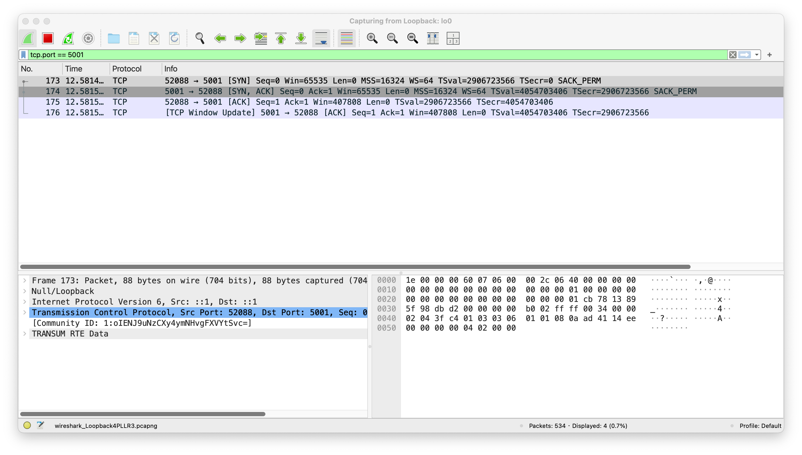
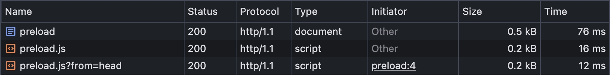
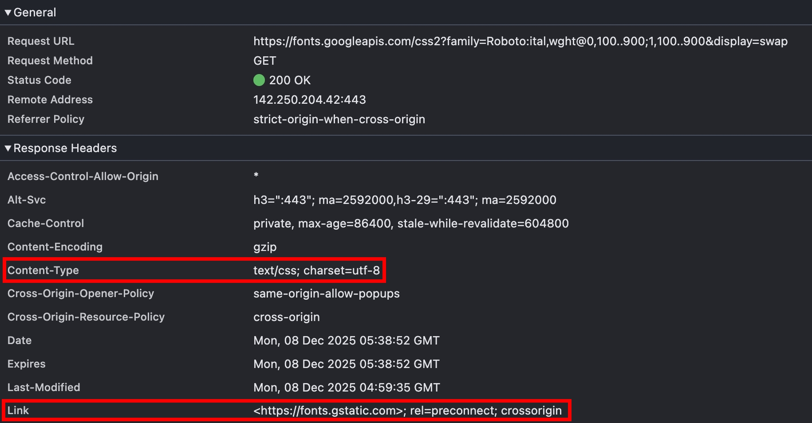
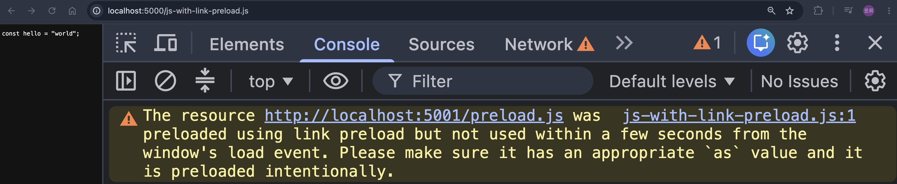

## Browser compatibility

翻開 [MDN 文件](https://developer.mozilla.org/en-US/docs/Web/HTTP/Reference/Headers/Link#browser_compatibility) 的話，會發現其實各瀏覽器大約都在 2022 ~ 2023 年才開始支援在 HTTP response header 設定 `<Link>`，其實算是蠻新的功能。我自己也只有在 [hackerone](https://www.hackerone.com/) 看到有設定


## Basic Syntax

以上圖 hackerone 的網站為例

```
</assets/static/main_css-ClkKLtaZ.css>; rel=preload; as=style; nopush
```

前面三個區塊，我想應該沒什麼問題，等同於

```html
<link href="/assets/static/main_css-ClkKLtaZ.css" rel="preload" as="style" />
```

至於 nopush，這是 HTTP/2 的語法，本篇暫時不討論

<!-- 會在未來的 [HTTP/2](./http-2.md) 介紹到 -->

## Why HTTP Link better than HTML `<link>`?

簡單講，就是因為 HTTP Link 可以比較快載入。假設某網站的首頁回傳的 response headers 為

```
HTTP/1.1 200 OK
Content-Type: text/html; charset=utf-8
Date: Tue, 18 Nov 2025 11:09:52 GMT
Transfer-Encoding: chunked
Link: </assets/static/main_css-ClkKLtaZ.css>; rel=preload; as=style


```

瀏覽器收到 response headers 的當下，就可以開始 preload 對應的資源，不用等 HTML 回傳！

## HTTP Link Use Cases

上一篇文章，談了很多 [`<link rel>`](./link-html.md) 的用法，但根據 [MDN 文件](https://developer.mozilla.org/en-US/docs/Web/HTTP/Reference/Headers/Link)，能用在 HTTP Link 的只有

- [`<link rel="preload">`](./link-html.md#link-relpreload)
- [`<link rel="preconnect">`](./link-html.md#link-relpreconnect)

簡單理解的話，因為 HTTP Link（response header）是在 HTML（response body）之前抵達

所以那些設定在 HTML 身上，例如 `<link rel="icon" href="favicon.ico">`，主流瀏覽器不一定有支援

## Syntax

```
Link: <https://example.com>; rel="preconnect"
Link: <https://example.com/%E5%B8%A5%E5%93%A5>; rel="preconnect" // 帥哥
Link: <https://one.example.com>; rel="preconnect", <https://two.example.com>; rel="preconnect"
Link: </style.css>; rel=preload; as=style; fetchpriority="high"
```

## preconnect via HTTP Link

使用 Node.js http 模組，測試是否真的有建立 TCP 連線

1. localhost:5000

```ts
import http from "http";

const httpServer5000 = http.createServer((req, res) => {
  const url = new URL(req.url || "", "http://localhost:5000");
  if (url.pathname === "/preconnect") {
    res.setHeader("link", `<http://localhost:5001>; rel="preconnect"`);
    res.end();
    return;
  }
});
httpServer5000.listen(5000);
```

2. localhost:5001

```ts
const httpServer5001 = http.createServer();
httpServer5001.listen(5001);
httpServer5001.on("connection", (socket) => console.log("connection"));
```

瀏覽器訪問 http://localhost:5000/preconnect 的當下，就可以在 Node.js 的 log 看到 `connection`

用 Wireshark 抓包，也可以看到 TCP 3-way handshake



## preload via HTTP Link

使用 Node.js http 模組測試

1. localhost:5000

```ts
import http from "http";

const httpServer5000 = http.createServer((req, res) => {
  const url = new URL(req.url || "", "http://localhost:5000");
  if (url.pathname === "/preload") {
    res.setHeader(
      "link",
      `<http://localhost:5001/preload.js>; rel="preload"; as="script"`,
    );
    res.setHeader("Content-Type", "text/html");
    res.end(readFileSync(join(__dirname, "preload.html")));
    return;
  }
});
httpServer5000.listen(5000);
```

2. preload.html

```html
<html>
  <head>
    <!-- 為了驗證 HTTP Link 的執行時機早於 HTML link，在 preload.html 也載入同樣資源，用 `?from=head` 來區分 -->
    <script src="http://localhost:5001/preload.js?from=head"></script>
  </head>
  <body></body>
</html>
```

3. localhost:5001

```ts
const httpServer5001 = http.createServer((req, res) => {
  const url = new URL(req.url || "", "http://localhost:5001");
  if (url.pathname === "/preload.js") {
    res.setHeader("Content-Type", "text/javascript");
    res.end(`const preload = true;`);
    return;
  }
});
httpServer5001.listen(5001);
```

瀏覽器輸入 http://localhost:5000/preload ，可以看到 HTTP Link 確實更快載入



## Edge Case 1: preload + `Content-Type !== text/html`

既然 HTTP Link 是 HTML `<link>` 的 alternative，那如果設定在 `Content-Type !== text/html` 還會生效嗎？

我在 Google Font 的 CSS 有看過這種設定



但還是寫個 PoC 來驗證

1. localhost:5000

```ts
import { readFileSync } from "fs";
import http from "http";
import { join } from "path";

const httpServer5000 = http.createServer((req, res) => {
  const url = new URL(req.url || "", "http://localhost:5000");
  if (url.pathname === "/js-with-link-preload.js") {
    res.setHeader(
      "link",
      `<http://localhost:5001/preload.js>; rel="preload"; as="script"`,
    );
    res.setHeader("Content-Type", "text/javascript");
    res.end(`const hello = "world";`);
    return;
  }
});
httpServer5000.listen(5000);
```

2. localhost:5001（無異動）

瀏覽器訪問 http://localhost/js-with-link-preload.js ，有成功 preload，不過瀏覽器會跳 warning



<!-- todo-yus -->

<!-- ### Edge Case 2: preconnect + HTTP/1.1 Connection: closed

### Edge Case 3: link block HTML render

### Edge Case 4: maximum links

### Edge Case 5: HOL Blocking

## 103 early hints -->

<!-- https://developers.cloudflare.com/cache/advanced-configuration/early-hints/ -->
<!-- application layer 感覺難實作吧，SSR 框架誰有支援 -->

## 小結

在這篇文章，我們學到了

- HTTP Link 比起 HTML `<link>` 的優勢
- 哪些 rel 可以適用在 HTTP Link
- HTTP Link 搭配 `rel="preload"` 也可以在 "非 HTML" 的 response 載入

## 參考資料

- https://developer.mozilla.org/en-US/docs/Web/HTTP/Reference/Headers/Link
  <!-- - https://developer.mozilla.org/en-US/docs/Web/HTTP/Reference/Status/103 -->
  <!-- - https://nodejs.org/api/http.html#responsewriteearlyhintshints-callback -->
  <!-- - https://developers.cloudflare.com/cache/advanced-configuration/early-hints/ -->
  <!-- - https://datatracker.ietf.org/doc/html/rfc8297 -->
