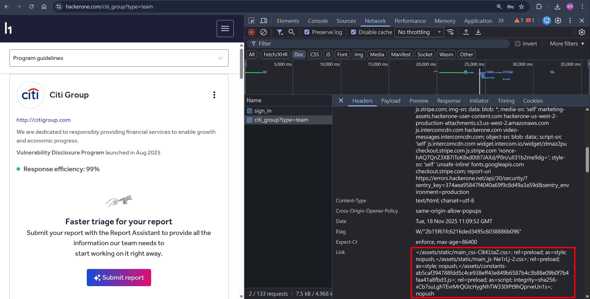
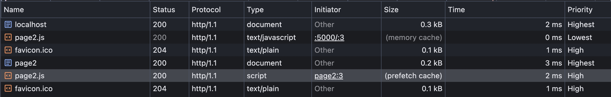
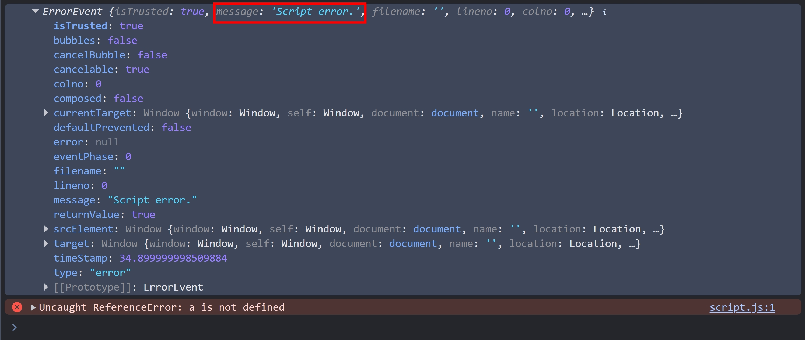
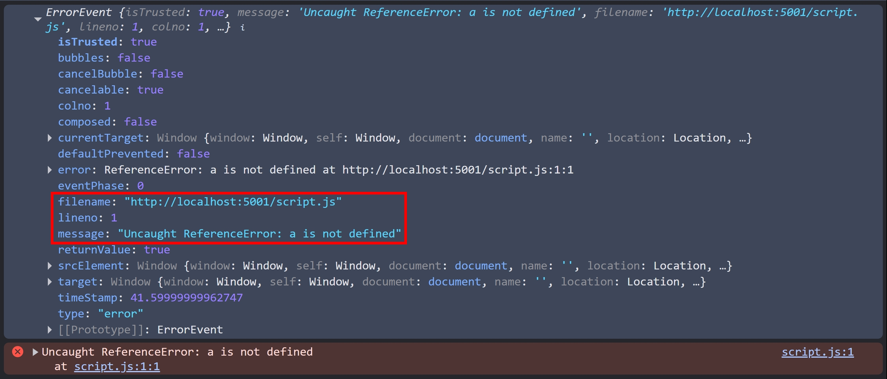
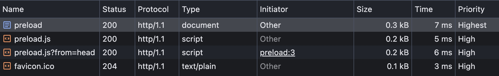
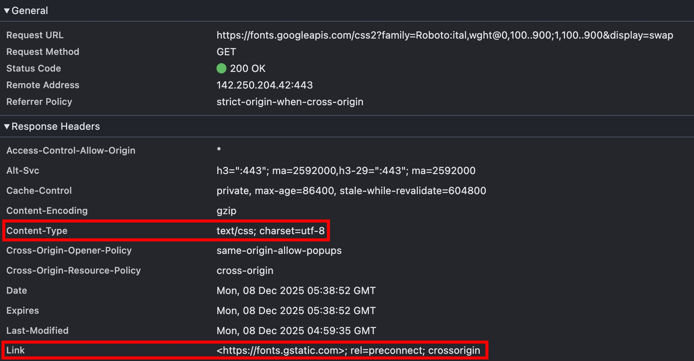
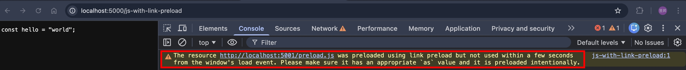

## 前言

在現代前端框架盛行的年代，很少會需要大量的手動設置 `<link>`，基本上 bundler 會處理好各種 JavaScript, CSS 的載入，只有少部分會需要在 `index.html` 設定；也因此顯少有機會深入研究 `<link>` 的各種 attribute。

為何會在 HTTP 的系列文章提到 `<link>` 呢？因為 HTTP Response Header 也可以設定 [Link](https://developer.mozilla.org/en-US/docs/Web/HTTP/Reference/Headers/Link)！所以就趁這篇文章，也順便把 HTML 的 `<link>` 也介紹一遍吧～

## Browser compatibility of HTTP Response Header `Link`

翻開 [MDN 文件](https://developer.mozilla.org/en-US/docs/Web/HTTP/Reference/Headers/Link#browser_compatibility) 的話，會發現其實各瀏覽器大約都在 2022 ~ 2023 年才開始支援在 HTTP Response Header 設定 `<Link>`，其實算是蠻新的功能。我自己也只有在 [hackerone](https://www.hackerone.com/) 看到有設定


## Basic Syntax of HTTP `Link`

以上圖 hackerone 的網站為例

```
</assets/static/main_css-ClkKLtaZ.css>; rel=preload; as=style; nopush
```

前面三個區塊，我想應該沒什麼問題，等同於

```html
<link href="/assets/static/main_css-ClkKLtaZ.css" rel="preload" as="style" />
```

<!-- todo-yus -->

至於 nopush 是什麼呢？恩...這會牽扯到 [HTTP/2](./http-2.md) 的 Server Push

## Why use HTTP Link instead of HTML `<link>`?

簡單講，就是因為 HTTP Link 可以比較快載入。承接我去年寫過的

- [深入解說 HTTP message](./anatomy-of-an-http-message.md#raw-http-介紹)
- [Transfer-Encoding](./transfer-encoding.md)

假設某網站的首頁回傳的 HTTP Response 為

```
HTTP/1.1 200 OK
Content-Type: text/html; charset=utf-8
Date: Tue, 18 Nov 2025 11:09:52 GMT
Transfer-Encoding: chunked
Link: </assets/static/main_css-ClkKLtaZ.css>; rel=preload; as=style

a

<html><head>
Backend 還在 Query DB，生成這一頁的資料...
```

瀏覽器收到 Response Headers 的當下，就可以開始 preload 對應的資源，不用等 HTML 回傳！

:::info
在 HTTP/1.1 的世界，如果想要先回傳 Headers，但又不確定 Content-Length 是多少的話，可以用 `Transfer-Encoding: chunked` 達到分塊傳輸
:::

## HTML `<link>` 前言

現在我們知道 HTTP Response Header 設定的 Link 跟 HTML `<link>` 在觸發時機上的差異了

接下來，我們來看看 HTML `<link>` 有哪些 attributes

## `<link rel>`

rel = relationship

接下來會介紹幾個比較常用的值

### 瀏覽器載入資源的 Priority

- 可透過 F12 > Network，右鍵點選 Table Header，將 "Priority" 勾選，即可看到
- 瀏覽器針對資源的載入順序，大致可分為 Highest > High > Medium > Low > Lowest

### `<link rel="alternate">`

主要是為了 SEO，宣告不同語言的頁面

```html
<link rel="alternate" hreflang="x-default" href="https://example.com/" />
<link rel="alternate" href="https://example.com/?lang=zh-TW" hreflang="zh-TW" />
```

:::info
[x-default](https://developers.google.com/search/blog/2023/05/x-default) 是 Google 搜尋引擎定義的
:::

### `<link rel="canonical">`

canonical = 典範，在這邊代表的是 "preferred URL"

```html
<link rel="canonical" href="https://example.com/" />
```

### `<link rel="dns-prefetch">`

針對 cross-origin domains 先做 dns-prefetch

- same-origin 不需要，因為瀏覽器在訪問此頁面之前，就已經完整建立連線了
- dns-prefetch 的用意是，先把 domain name resolve as IP Address

```html
<link rel="dns-prefetch" href="https://fonts.googleapis.com/" />
```

### `<link rel="prefetch">`

- 可以將資源的載入順序變成 "Lowest"
- 通常用在 same-origin，使用者下一頁會載入的資源
- Response Header 需要設定正確的 Cache-Control，prefetch 的資源才可以存到 HTTP Cache，例如 [no-store](./http-caching-1.md#cache-control) 或是 [no-cache](./http-caching-1.md#cache-control) 則無法
- Request Header 會有 `Sec-Purpose: prefetch`, `Sec-Fetch-Dest: empty`

使用 NodeJS http 模組實作：

index.ts，定義三個 route

```ts
import { readFileSync } from "fs";
import httpServer from "../httpServer";
import { join } from "path";

httpServer.on("request", (req, res) => {
  const url = new URL(req.url || "", "http://localhost:5000");
  if (url.pathname === "/page2.js") {
    console.log(req.headers);
    res.setHeader("content-type", "text/javascript");
    res.setHeader("Cache-Control", "public, max-age=60");
    res.end("console.log('hello world')");
    return;
  }
  if (url.pathname === "/") {
    res.setHeader("content-type", "text/html");
    res.end(readFileSync(join(__dirname, "index.html")));
    return;
  }
  if (url.pathname === "/page2") {
    res.setHeader("content-type", "text/html");
    res.end(readFileSync(join(__dirname, "page2.html")));
    return;
  }
});
```

index.html，定義 prefetch

```html
<html>
  <head>
    <link rel="prefetch" href="/page2.js" as="script" />
  </head>
  <body>
    <a href="/page2">Go to page2</a>
  </body>
</html>
```

page2.html，實際載入 js

```html
<html>
  <head>
    <script src="/page2.js"></script>
  </head>
</html>
```

瀏覽器先訪問 http://localhost:5000/ ，之後透過超連結到 `/page2`（F12 > Network => Disable Cache 要取消勾選）

可以看到 `/page2` 的 `<script src="/page2.js">` 有吃到 prefetch 的快取

### `<link rel="modulepreload">`

<!-- https://developer.mozilla.org/en-US/docs/Web/HTML/Reference/Attributes/rel/modulepreload -->

[Vite](https://vite.dev/) 專案會看到，主流的瀏覽器到 2023 年才全數支援

```html
<link rel="modulepreload" href="/assets/chunks/theme.Dk-6AaEp.js" />
```

跟 [`<link rel="preload">`](#link-relpreload) 的差異是

```
The main difference is that preload just downloads the file and stores it in the cache, while modulepreload gets the module, parses and compiles it, and puts the results into the module map so that it is ready to execute.
```

### `<link rel="preload">`

<!-- https://developer.mozilla.org/en-US/docs/Web/HTML/Reference/Attributes/rel/preload -->

- 可以將資源的載入順序變成 "High"

```html
<link rel="preload" href="main.js" as="script" />
<link rel="preload" href="font.ttf" as="font" type="font/ttf" crossorigin />
```

:::info
`as="font"` 的情況，需要明確指定 `crossorigin` / `crossorigin=""` / `crossorigin="anonymous"`
:::

### `<link rel="preconnect">`

- [dns-prefetch](#link-reldns-prefetch) + TCP 連線 + TLS/SSL 連線
- 同 [dns-prefetch](#link-reldns-prefetch)，也是用在 cross-origin

```html
<link rel="preconnect" href="https://example.com" />
```

### `<link rel="icon">`

最常用的情境就是 favicon

```html
<link rel="icon" href="favicon.ico" />
```

## HTML attribute: crossorigin

### Syntax

```html
<script src="script.js" crossorigin>
<script src="script.js" crossorigin="">
<script src="script.js" crossorigin="anonymous">

<script src="script.js" crossorigin="use-credentials">
```

### anonymous vs use-credentials

- anonymous => 可以理解為 `fetch(URL, { mode: 'cors', credentials: 'omit' })`
- 承上，前者在 same-origin 的情況會帶 Cookie，後者在 same-origin 的情況則不帶 Cookie
- use-credentials => 可以理解為 `fetch(URL, { mode: 'cors', credentials: 'include' })`
- 差異在 crossorigin 的請求會不會帶 Cookie, Basic Authorization, TLS certificates

### Also valid on these elements

```html
<audio></audio>

<link />
<video></video>
```

### Why do we need to set crossorigin ?

簡單來講，需要透過 JavaScript 完整讀取 Response 的時候，就需要 crossorigin

例如，載入第三方套件，需要 try catch 詳細錯誤，送到 Error Monitoring Tool，如果沒有 crossorigin 的話：

localhost:5000

```html
<html>
  <head>
    <script>
      addEventListener("error", console.log);
    </script>
    <script src="http://localhost:5001/script.js"></script>
  </head>
</html>
```

localhost:5001

```ts
http5001Server.on("request", (req, res) => {
  const url = new URL(req.url || "", "http://localhost:5001");
  if (url.pathname === "/script.js") {
    res.setHeader("content-type", "text/javascript");
    res.end("a");
    return;
  }
});
```

- Request Header 不會有 `Origin`，且 `Sec-Fetch-Mode: no-cors`
- 透過 `addEventListener` 捕捉到的錯誤就不會顯示詳細的錯誤訊息
  

加上 crossorigin 的話

localhost:5000

```html
<script src="http://localhost:5001/script.js" crossorigin></script>
```

localhost:5001

```ts
res.setHeader("Access-Control-Allow-Origin", "*");
```

- Request Header 會有 `Origin`，且 `Sec-Fetch-Mode: cors`
- 透過 `addEventListener` 捕捉到的錯誤就會顯示詳細的錯誤訊息
  

## HTTP Link

上面談了很多 [`<link rel>`](#link-rel)，但根據 [MDN 文件](https://developer.mozilla.org/en-US/docs/Web/HTTP/Reference/Headers/Link)，能用在 HTTP Link 的只有

- [`<link rel="preload">`](#link-relpreload)
- [`<link rel="preconnect">`](#link-relpreconnect)

簡單理解，因為 HTTP Link（Response Header）是在 HTML（Response Body）之前抵達 => 所以那些設定在 HTML 身上，例如 `<link rel="icon" href="favicon.ico">`，主流瀏覽器不一定有支援

### Syntax

```
Link: <https://example.com>; rel="preconnect"
Link: <https://example.com/%E5%B8%A5%E5%93%A5>; rel="preconnect" // 帥哥
Link: <https://one.example.com>; rel="preconnect", <https://two.example.com>; rel="preconnect"
Link: </style.css>; rel=preload; as=style; fetchpriority="high"
```

### preconnect via HTTP Link

使用 NodeJS http 模組，測試是否真的有建立 TCP 連線

index.ts

```ts
if (url.pathname === "/preconnect") {
  res.setHeader("link", `<http://localhost:5001>; rel="preconnect"`);
  res.setHeader("content-type", "text/html");
  res.end(readFileSync(join(__dirname, "preconnect.html")));
  return;
}

http5001Server.on("connection", () => console.log("connection"));
```

preconnect.html

```html
<html>
  <head></head>
  <body></body>
</html>
```

瀏覽器訪問 http://localhost:5000/preconnect 的當下，就可以在 NodeJS Log 看到

```
connection
```

如果立即重整頁面，會發現沒有觸發 connection，我們看看 NodeJS http 模組的 [server.timeout](https://nodejs.org/api/http.html#servertimeout)

```
Type: <number> Timeout in milliseconds. Default: 0 (no timeout)
The number of milliseconds of inactivity before a socket is presumed to have timed out.
```

嘗試將 NodeJS server.timeout 調成 5 秒

```ts
http5001Server.timeout = 5000;
http5001Server.on("connection", (socket) => {
  console.log("connection");
  console.time("connection");
  socket.on("error", console.log);
  socket.on("close", (hadError) => {
    console.timeEnd("connection");
    console.log({ event: "close", hadError });
  });
});
```

重整瀏覽器，5 秒後收到

```
connection
connection: 5.015s
{ event: 'close', hadError: false }
```

<!-- todo-yus -->
<!-- :::info
關於 NodeJS http 模組的各種 timeout，我打算在未來專門寫一篇文章來探討 [NodeJS HTTP/1.1 timeout](./nodejs-http-1.1-timeout.md)
::: -->

<!-- todo-yus timeout -->
<!-- Chrome v142.0.7444.177 實測後
```
connection
Error: Request timeout
  at onRequestTimeout (node:_http_server:871:30)
  at Server.checkConnections (node:_http_server:684:7)
  at listOnTimeout (node:internal/timers:608:17)
  at processTimers (node:internal/timers:543:7) {
  code: 'ERR_HTTP_REQUEST_TIMEOUT'
}
connection: 1:26.201 (m:ss.mmm)
{ event: 'close', hadError: true }
```

卡在一個神奇的 86 秒，且 `hasError: true`...

為了驗證 86 秒是瀏覽器主動斷開的，我們將 server 的 timeout 調低 -->

另外還有一個情境會關閉連線，那就是: 關閉所有瀏覽器視窗

### preload via HTTP Link

使用 NodeJS http 模組測試

localhost:5000

```ts
if (url.pathname === "/preload") {
  res.setHeader(
    "link",
    `<http://localhost:5001/preload.js>; rel="preload"; as="script"`,
  );
  res.setHeader("content-type", "text/html");
  res.end(readFileSync(join(__dirname, "preload.html")));
  return;
}
```

為了驗證 HTTP Link 的執行時機早於 HTML Link，在 preload.html 也載入同樣資源，用 `?from=head` 來區分

```html
<html>
  <head>
    <script src="http://localhost:5001/preload.js?from=head"></script>
  </head>
  <body></body>
</html>
```

localhost:5001

```ts
if (url.pathname === "/preload.js") {
  console.log(url.searchParams);
  res.setHeader("content-type", "text/javascript");
  res.end(`const preload = true;`);
  return;
}
```

瀏覽器輸入 http://localhost:5000/preload ，可以看到 HTTP Link 確實更快載入


```
URLSearchParams {}
URLSearchParams { 'from' => 'head' }
```

## HTTP Link Edge Cases

### Edge Case 1: preload + Content-Type !== text/html

既然 HTTP Link 是 HTML `<link>` 的 alternative，那如果設定在 "Content-Type !== text/html" 還會生效嗎？

我在 Google Font 有看過這種設定


但還是寫個 PoC 來驗證

localhost:5000

```ts
if (url.pathname === "/js-with-link-preload") {
  res.setHeader(
    "link",
    `<http://localhost:5001/preload.js>; rel="preload"; as="script"`,
  );
  res.setHeader("content-type", "text/javascript");
  res.end(readFileSync(join(__dirname, "preload.html")));
  return;
}
```

瀏覽器訪問 http://localhost/js-with-link-preload ，有成功 preload，不過因為沒有用到這個資源，所以瀏覽器會跳 warning


<!-- todo-yus -->

<!-- ### Edge Case 2: preconnect + HTTP/1.1 Connection: closed

### Edge Case 3: link block HTML render

### Edge Case 4: maximum links

### Edge Case 5: HOL Blocking

## 103 early hints -->

<!-- https://developers.cloudflare.com/cache/advanced-configuration/early-hints/ -->
<!-- application layer 感覺難實作吧，SSR 框架誰有支援 -->

## 參考資料

- https://developer.mozilla.org/en-US/docs/Web/HTTP/Reference/Headers/Link
- https://developer.mozilla.org/en-US/docs/Web/HTTP/Reference/Status/103
- https://nodejs.org/api/http.html#responsewriteearlyhintshints-callback
- https://developers.cloudflare.com/cache/advanced-configuration/early-hints/
- https://datatracker.ietf.org/doc/html/rfc8297
- https://developer.mozilla.org/en-US/docs/Web/HTML/Reference/Attributes/rel
- https://developer.mozilla.org/en-US/docs/Web/HTML/Reference/Attributes/rel/preconnect
- https://developer.mozilla.org/en-US/docs/Web/HTML/Reference/Attributes/rel/preload
- https://developer.mozilla.org/en-US/docs/Web/HTML/Reference/Attributes/rel/prefetch
- https://developer.mozilla.org/en-US/docs/Web/HTML/Reference/Attributes/rel/modulepreload
- https://developer.mozilla.org/en-US/docs/Web/HTML/Reference/Attributes/rel/dns-prefetch
