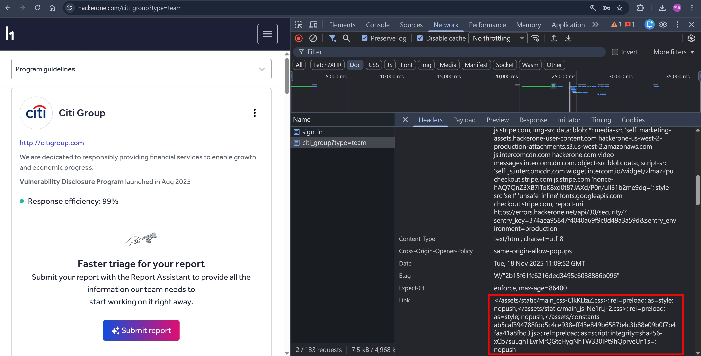

## 前言

在現代前端框架盛行的年代，很少會需要大量的手動設置 `<link>`，基本上 bundler 會處理好各種 JavaScript, CSS 的載入，只有少部分會需要在 `index.html` 設定；也因此顯少有機會深入研究 `<link>` 的各種 attribute。

為何會在 HTTP 的系列文章提到 `<link>` 呢？因為 HTTP Response Header 也可以設定 [Link](https://developer.mozilla.org/en-US/docs/Web/HTTP/Reference/Headers/Link)！所以就趁這篇文章，也順便把 HTML 的 `<link>` 也介紹一遍吧～

## Browser compatibility of HTTP Response Header `Link`

翻開 [MDN 文件](https://developer.mozilla.org/en-US/docs/Web/HTTP/Reference/Headers/Link#browser_compatibility) 的話，會發現其實各瀏覽器大約都在 2022 ~ 2023 年才開始支援在 HTTP Response Header 設定 `<Link>`，其實算是蠻新的功能。我自己也只有在 [hackerone](https://www.hackerone.com/) 看到有設定


## Basic Syntax of HTTP `Link`

以上圖 hackerone 的網站為例

```
</assets/static/main_css-ClkKLtaZ.css>; rel=preload; as=style; nopush
```

前面三個區塊，我想應該沒什麼問題，等同於

```html
<link href="/assets/static/main_css-ClkKLtaZ.css" rel="preload" as="style" />
```

<!-- todo-yus -->

至於 nopush 是什麼呢？恩...這會牽扯到 HTTP/2 的 Server Push

## Why use HTTP Link instead of HTML `<link>`?

簡單講，就是因為 HTTP Link 可以比較快載入。承接我去年寫過的

- [深入解說 HTTP message](./anatomy-of-an-http-message.md#raw-http-介紹)
- [Transfer-Encoding](./transfer-encoding.md)

假設某網站的首頁回傳的 HTTP Response 為

```
HTTP/1.1 200 OK
Content-Type: text/html; charset=utf-8
Date: Tue, 18 Nov 2025 11:09:52 GMT
Transfer-Encoding: chunked
Link: </assets/static/main_css-ClkKLtaZ.css>; rel=preload; as=style

a

<html><head>
Backend 還在 Query DB，生成這一頁的資料...
```

瀏覽器收到 Response Headers 的當下，就可以開始 preload 對應的資源，不用等 HTML 回傳！

P.S. 在 HTTP/1.1 的世界，如果想要先回傳 Headers，但又不確定 Content-Length 是多少的話，可以用 `Transfer-Encoding: chunked` 達到分塊傳輸

## `<link crossorigin>`

## `<link rel="preload">`

## `<link rel="preconnect">`

## `<link rel="prefetch">`

## `<link rel="modulepreload">`

## `<link rel="dns-prefetch">`

## `<link rel="manifest">`

## 103 early hints

<!-- https://developers.cloudflare.com/cache/advanced-configuration/early-hints/ -->
<!-- application layer 感覺難實作吧，SSR 框架誰有支援 -->

## edge case 1: link + Content-Type !== text/html

## edge case 2: link + HTTP/1.1 Connection: closed

## edge case 3: link block HTML render

## edge case 3: maximum links

## edge case 4: HOL Blocking

## 參考資料

- https://developer.mozilla.org/en-US/docs/Web/HTTP/Reference/Headers/Link
- https://developer.mozilla.org/en-US/docs/Web/HTTP/Reference/Status/103
- https://nodejs.org/api/http.html#responsewriteearlyhintshints-callback
- https://developers.cloudflare.com/cache/advanced-configuration/early-hints/
- https://datatracker.ietf.org/doc/html/rfc8297
- https://developer.mozilla.org/en-US/docs/Web/HTML/Reference/Attributes/rel/preconnect
- https://developer.mozilla.org/en-US/docs/Web/HTML/Reference/Attributes/rel/preload
- https://developer.mozilla.org/en-US/docs/Web/HTML/Reference/Attributes/rel/prefetch
- https://developer.mozilla.org/en-US/docs/Web/HTML/Reference/Attributes/rel/modulepreload
- https://developer.mozilla.org/en-US/docs/Web/HTML/Reference/Attributes/rel/dns-prefetch
- https://developer.mozilla.org/en-US/docs/Web/HTML/Reference/Attributes/rel/manifest
