## 前言

某天在 [聯合影音網](https://video.udn.com/) 看到了影片的 HTML 標籤

```html
<video
  class="ui-video"
  width="100%"
  height="100%"
  preload="metadata"
  playsinline=""
  webkit-playsinline=""
  muted=""
  src="https://cdn.udn.com/vods3/251221183729786/playlist.m3u8?Expires=1766662347&amp;Signature=ZWqGVYw0N2OmZwdV3H1K0PKHueIlAaqBTOnyVLLyx2jci--wJlhEFPWZACRz7tyWjAoS9HXfcnp4slgccKPHgyY0ALZoELt9wbh6v8OeRsescv-g92VQI4LCGLfDiZOFWLvzST517VeEEf-r41Thv3TDrQyHZ7964flGaTkjw~A_&amp;Key-Pair-Id=APKAJRQ6UOZB4E3SGXWQ"
>
  <track
    src="//video.udn.com/api-player/video-subtitle/news/1316728"
    default="true"
  />
</video>
```

其中 `preload="metadata"`、`.m3u8` 跟 `<track>` 都是我沒看過的，就趁這個機會來研究看看吧！

## HTMLMediaElement: preload

Syntax

```html
<video preload="none"></video>
<video preload="metadata"></video>
<video preload="auto"></video>
```

### preload="none"

這個應該沒有爭議，就是 media 開始播放，才會發起 HTTP Request 載入資源

### preload="auto"

告訴瀏覽器 "可以下載整個資源，即便使用者還沒按播放"

這邊要注意的是，不同瀏覽器的實作方式不同，我以 Chrome 瀏覽器為例

```html
<video
  muted
  controls
  playsinline
  preload="auto"
  width="100%"
  height="100%"
  src="https://commondatastorage.googleapis.com/gtv-videos-bucket/sample/ElephantsDream.mp4"
></video>
```

一開始只會先下載幾 MB 的資料

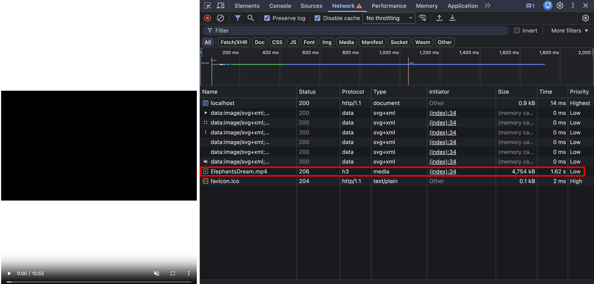

之後使用者開始播放影片後，會用同一個連線接收後續的資源

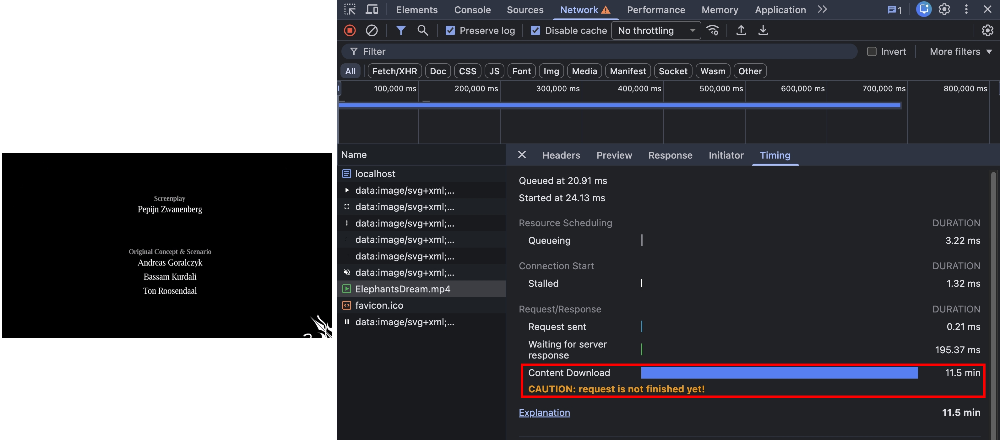

在資源完整接收完之前，都會顯示 `CAUTION: request is not finished yet!`

:::warning
上述情境，僅限於沒有跳轉影片的情況

若有跳轉，則會發起新的 [Range Request](./http-range-requests.md)
:::

總結來說，`preload="auto"` 並沒有強制瀏覽器要馬上 "下載整個資源"

### preload="metadata"

我很好奇所謂的 metadata 有哪些

我第一個想到的是 `firebase/storage` 有 `getMetadata` 這個方法，順手實測看看

```ts
const firebaseOptions: FirebaseOptions = {
  apiKey: process.env.apiKey,
  authDomain: process.env.authDomain,
  databaseURL: process.env.databaseURL,
  projectId: process.env.projectId,
  storageBucket: process.env.storageBucket,
  messagingSenderId: process.env.messagingSenderId,
  appId: process.env.appId,
  measurementId: process.env.measurementId,
};
const firebaseApp = initializeApp(firebaseOptions);
const firebaseStorage = getStorage(firebaseApp);
const storageRef = ref(firebaseStorage, "20230519/20230519_123754.jpg");
getMetadata(storageRef).then(console.log);
```

結果

```json
{
  "type": "file",
  "bucket": "xxxx-xxxxxx-xx.appspot.com",
  "generation": "1726576002013836",
  "metageneration": "4",
  "fullPath": "20230519/20230519_123754.jpg",
  "name": "20230519_123754.jpg",
  "size": 4312957,
  "timeCreated": "2024-09-17T12:26:42.015Z",
  "updated": "2024-11-13T12:35:07.690Z",
  "md5Hash": "wkMu9YKP/eCW/BCsvgfRkg==",
  "contentEncoding": "identity",
  "contentLanguage": "en",
  "contentType": "image/jpeg"
}
```

metadata 的中文很難解釋，如果以上述例子來看，就是 "描述這張圖片" 的資料

有了 metadata 的概念，我們接著來實測 `preload="metadata"` 到底包含哪些屬性

基本的 HTML

```html
<video
  preload="metadata"
  width="100%"
  height="100%"
  src="https://commondatastorage.googleapis.com/gtv-videos-bucket/sample/ElephantsDream.mp4"
></video>
```

寫個 JS 印出 onloadedmetadata 前後的 HTMLVideoElement 差異

```html
<script>
  const videoEl = document.getElementsByTagName("video")[0];
  const oldVideoEl = {};
  for (const attr in videoEl) {
    oldVideoEl[attr] = videoEl[attr];
  }
  console.log(oldVideoEl);
  videoEl.addEventListener("loadedmetadata", (e) => {
    const newVideoEl = {};
    for (const attr in videoEl) {
      newVideoEl[attr] = videoEl[attr];
    }
    console.log(newVideoEl);
  });
</script>
```

使用 git 比較 `oldVideoEl` 跟 `newVideoEl` 的差異
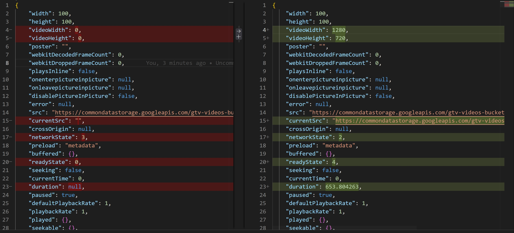

可以得知以下就是 video 的 metadata

```json
{
  "videoWidth": 1280,
  "videoHeight": 720,
  "duration": 653.804263
}
```

實際上觀察瀏覽器的 Network，瀏覽器只會先載入部分 mp4 的內容，且載入的資料量明顯比 `preload="auto"` 還要少

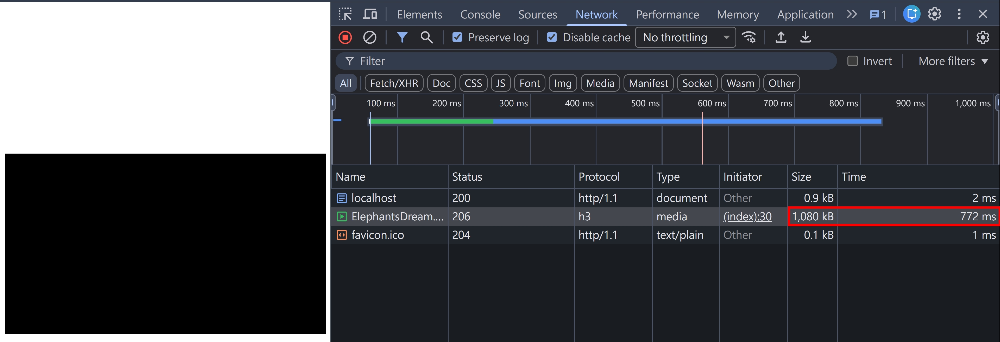

另外我也發現一個蠻有趣的，若 Server 不支援 [Range Request](./http-range-requests.md)，直接回傳 200 + 整個 MP4 檔案

```ts
import { readFileSync } from "fs";
import httpServer from "../httpServer";
import { join } from "path";

httpServer.on("request", function requestListener(req, res) {
  const url = new URL(req.url || "/", "http://localhost:5000");
  if (url.pathname === "/ElephantsDream.mp4") {
    const filePath = join(__dirname, "../range/ElephantsDream.mp4");
    const nonSharedBuffer = readFileSync(filePath);
    res.setHeader("Content-Type", "video/mp4");
    res.end(nonSharedBuffer);
    return;
  }
});
```

在 Chrome 瀏覽器會先顯示 `CAUTION: request is not finished yet!`

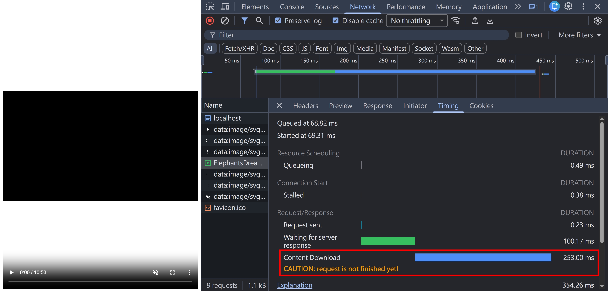

這時候已經觸發 loadedmetadata 事件了！

等到整部 mp4 影片的 Response Body 傳輸完畢後，警告訊息就會消失

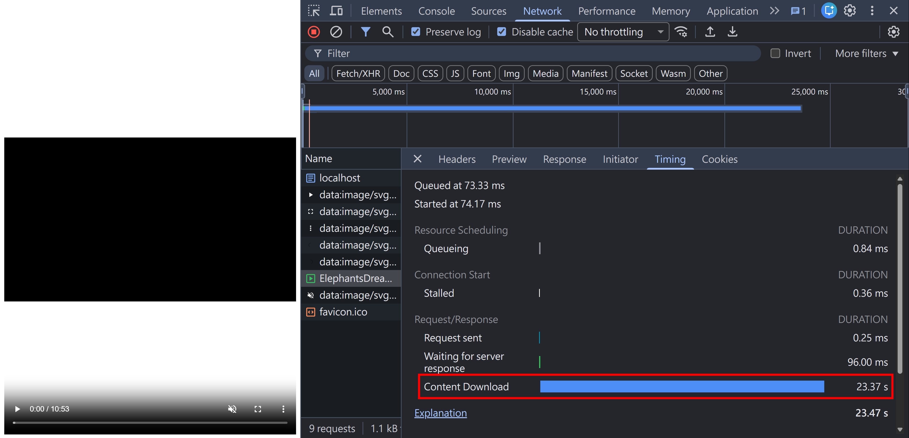

反之，若 Server 有支援 Range Request（其實也不用真的支援，只要回傳以下 Header 欺騙瀏覽器即可）

```ts
res.setHeader("Accept-Ranges", "bytes");
```

就不會有上述的警告訊息，從 Content Download 的時間來看，應該也是瀏覽器解析完 mp4 metadata 後，就直接關閉連線

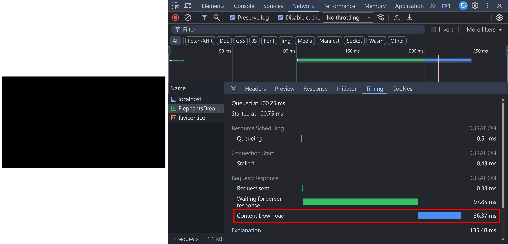

🧐 至於為何 `Accept-Ranges: bytes` 會影響瀏覽器 "是否要下載整個檔案" 呢？

若從瀏覽器 (Client) 的角度思考:

沒有 Accept-Ranges:

- 💭 Server 不支援 Range Request
- 💭 這次連線是唯一拿資料的機會
- 💭 如果我現在關掉，就永遠拿不到剩下的資料了

有 Accept-Ranges:

- 💭 太好了！Server 支援 Range Request
- 💭 我現在只要 metadata，拿完就可以先關閉連線
- 💭 之後隨時可以用 Range Request 再要資料

## `<track>`

再來談到 `<track>`，可以幫影片或音樂加上字幕，具體使用方法為

```html
<video src="video.mp4">
  <track default srclang="en" label="English" src="subtitle-en.vtt" />
  <track srclang="zh-TW" label="繁體中文" src="subtitle-zh-TW.vtt" />
</video>
```

根據 [HTMLMediaElement: loadedmetadata](https://developer.mozilla.org/en-US/docs/Web/API/HTMLMediaElement/loadedmetadata_event) 的描述，字幕也在 `preload="metadata"` 的範圍內

我們嘗試看看

NodeJS http server

```ts
if (url.pathname === "/") {
  res.setHeader("Content-Type", "text/html");
  res.end(readFileSync(join(__dirname, "index.html")));
  return;
}
if (url.pathname === "/copy-from-mdn.vtt") {
  const filePath = join(__dirname, "copy-from-mdn.vtt");
  const nonSharedBuffer = readFileSync(filePath);
  res.setHeader("Content-Type", "text/vtt");
  res.end(nonSharedBuffer);
  return;
}
if (url.pathname === "/ElephantsDream.mp4") {
  const filePath = join(__dirname, "../range/ElephantsDream.mp4");
  const nonSharedBuffer = readFileSync(filePath);
  res.setHeader("Content-Type", "video/mp4");
  res.end(nonSharedBuffer);
  return;
}
```

HTML 的部分

```html
<video
  muted
  controls
  playsinline
  preload="metadata"
  width="100%"
  height="100%"
  src="ElephantsDream.mp4"
>
  <track default srclang="en" label="English" src="copy-from-mdn.vtt" />
</video>
```

實測確實會預先載入字幕～
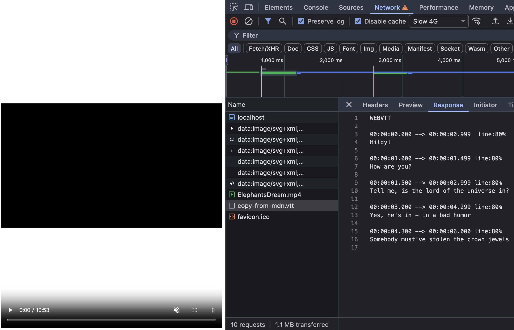

## vtt

vtt 全名是 Web Video Text Tracks Format (WEBVTT)，是一個純文本的格式

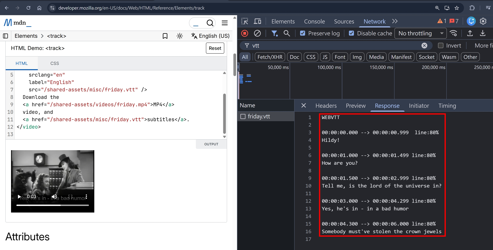

細節的部分，本篇不會討論，因為我覺得跟 http 協議沒什麼關聯 (?)

## srt

說到字幕，我第一個想到的是 srt，也是純文本的格式

```
1
00:00:01,000 --> 00:00:04,000
這是第一行字幕。

2
00:00:05,000 --> 00:00:7,000
這是第二行字幕。

3
00:00:8,000 --> 00:00:10,000
這是第三行字幕。
```

## m3u8 簡介

- 前身是 MP3 URL (m3u)
- 這是一個純文本的內容
- 可以列出音樂或影片的所在位置
- 主要作用是，媒體播放器知道要播放哪些檔案
- m3u 已經很少使用了，現在基本上都是用 m3u8
- m3u8 的 8 是指 UTF-8
- [RFC 8216: HTTP Live Streaming](https://datatracker.ietf.org/doc/html/rfc8216) 跟 m3u8 的關係密不可分
- 核心概念: 將不同畫質的影片切分成多段影片，方便快取、在網速波動的情況動態調整畫質
- RFC 8216 是蘋果提出的（推測是為了解決 iPhone 手機在網路不穩的情況聽音樂、看影片，又要保持最佳的使用者體驗）
- Content-Type: application/vnd.apple.mpegurl

## 觀察 `<video>` + m3u8 是如何載入影片

我們以 https://cdn.udn.com/vods3/251221183729786/playlist.m3u8 為範例

1. 首先，瀏覽器會載入 playlist.m3u8
   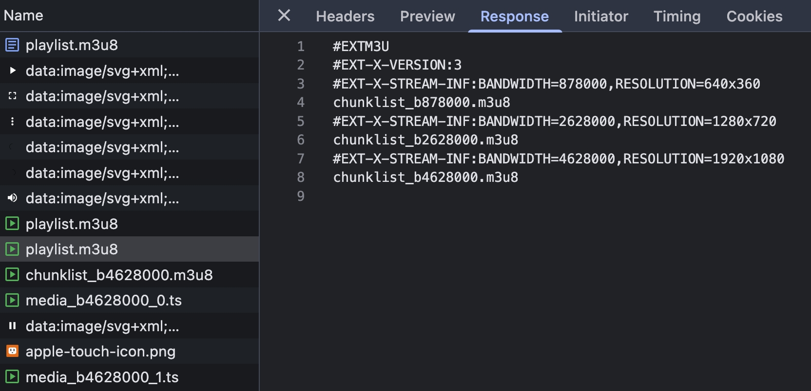

2. 接著，瀏覽器會有一套黑箱的機制，選擇出對應畫質的 chunklist.m3u8
   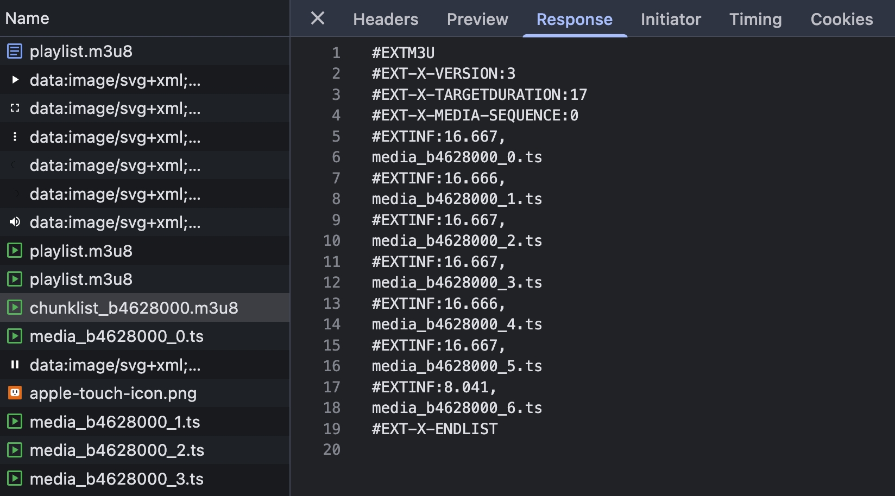

3. 最後，就會根據 chunklist.m3u8 的內容，載入對應的 ts 影片
   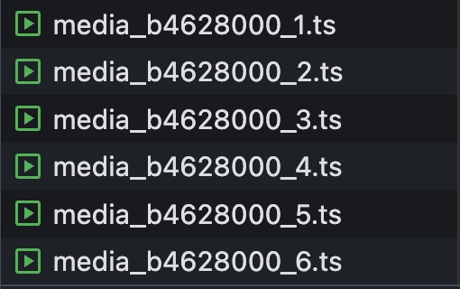

## m3u8 vs HTTP Range Request

假設今天你收到一個需求，要在網頁上呈現一個 10 分鐘的影片，並且要確保跨裝置的用戶都能獲得最好的使用者體驗

總共有三個影片素材

- video_480P.mp4
- video_720P.mp4
- video_1080P.mp4

你很開心的寫了一版 HTML，根據使用者的裝置寬度，來決定要載入哪個畫質的影片

```html
<video src="video_480P.mp4" v-if="width <= 600"></video>
<video src="video_720P.mp4" v-if="width > 600 && width <= 1024"></video>
<video src="video_1080P.mp4" v-if="width > 1024"></video>
```

結果發現用手機觀看畫質超爛...

接著你開始研究

- [navigator.connection.effectiveType](https://developer.mozilla.org/en-US/docs/Web/API/NetworkInformation/effectiveType)
- [navigator.mediaCapabilities](https://developer.mozilla.org/en-US/docs/Web/API/Media_Capabilities_API)
- [navigator.deviceMemory](https://developer.mozilla.org/en-US/docs/Web/API/Navigator/deviceMemory)

但你發現，最終也只能決定 "初始載入的影片畫質"，如果今天在移動的火車上，或是剛好搭電梯，都會遇到網路不穩定的狀況

為什麼我們平常看影片的平台（YouTube, Netfilx...）都可以做到動態切換畫質呢？其中一個原因就是 m3u8！

直接來張圖比較 m3u8 跟傳統 HTTP Range Request + 大型 mp4 檔案的差別
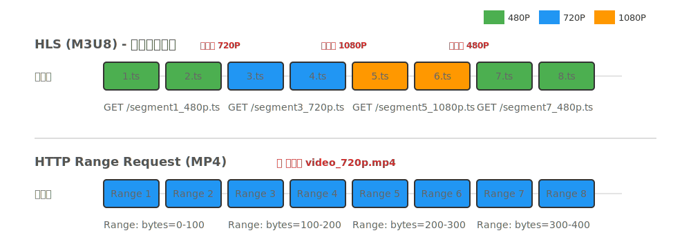

另外，由於 m3u8 是 Server 決定要把影片切成幾等份，所以檔名是固定的，非常適合快取！

雖然 HTTP Range Request 也可以快取，但不同瀏覽器發送 Range 的策略不同

- Range: bytes=0-1
- Range: bytes=0-100
- Range: bytes=0-1000

都會被視為不同的 Cache Key，所以快取命中的機率就很低，也很難預先把 Cache 準備好

## 如何支動態切換畫質

實測不同瀏覽器搭配 HTML 原生的 `<video src="playlist.m3u8">`，並且在中途使用瀏覽器內建功能切換網速

- Chrome 不支援動態切換畫質（即便切到 3G，還是繼續載入 1080P 的第二個 chunk）
  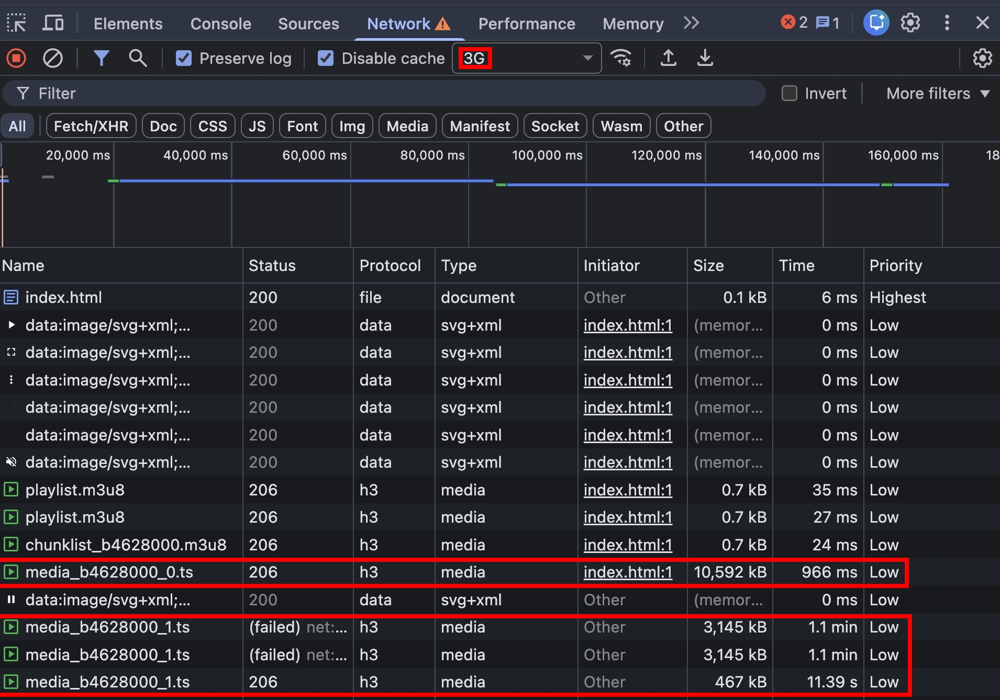
- Firefox 不支援 `<video src="playlist.m3u8">`
  
- Safari，我找不到 Network Throttling 的功能啊～

結論: 想依賴瀏覽器原生的機制 => 不可靠

## 要怎麼啟用 HTTP Live Streaming (HLS)

很幸運的是，JavaScript 生態系有個 [hls.js](https://www.npmjs.com/package/hls.js) 套件，幫我們處理好細節了

只需要以下 HTML

```html
<script src="https://cdn.jsdelivr.net/npm/hls.js@1"></script>
<video id="video" width="100%" height="100%"></video>
<script>
  if (Hls.isSupported()) {
    const video = document.getElementsByTagName("video")[0];
    const hls = new Hls();
    hls.loadSource("https://cdn.udn.com/vods3/260105182347770/playlist.m3u8");
    hls.attachMedia(video);
  }
</script>
```

就可以根據網速，動態載入不同畫質的影片


<!-- ### #EXT-X-ENDLIST

### #EXT-X-TARGETDURATION

### #EXT-X-BYTERANGE -->

## 小結

本篇文章，我們學到了

- HTMLMediaElement: preload
- `<track>`
- HTTP Live Streaming (HLS) + m3u8

其實還有很多可以深入，包含

- 付費的影音串流平台（Netfilx, HamiVideo...）是怎麼保護影片資源只能給訂戶觀看
- HLS 不一定要把影片切成多個 ts！？`#EXT-X-BYTERANGE` 的功用
- 深入理解 [RFC 8216: HTTP Live Streamimg](https://datatracker.ietf.org/doc/html/rfc8216)
- [hls.js](https://www.npmjs.com/package/hls.js) 是用哪些 API 實現的

礙於篇幅關係，若未來有機會再來研究上述這些題目～

<!-- ## 快問快答

✏️ Question 1: `<video preload="metadata">` 具體有包含哪些 metadata？

✏️ Question 2: m3u8 是影片格式 -->

## 參考資料

- https://datatracker.ietf.org/doc/html/rfc8216
- https://html.spec.whatwg.org/multipage/media.html#attr-media-preload
- https://developer.mozilla.org/en-US/docs/Web/API/HTMLMediaElement/readyState#htmlmediaelement.have_metadata
