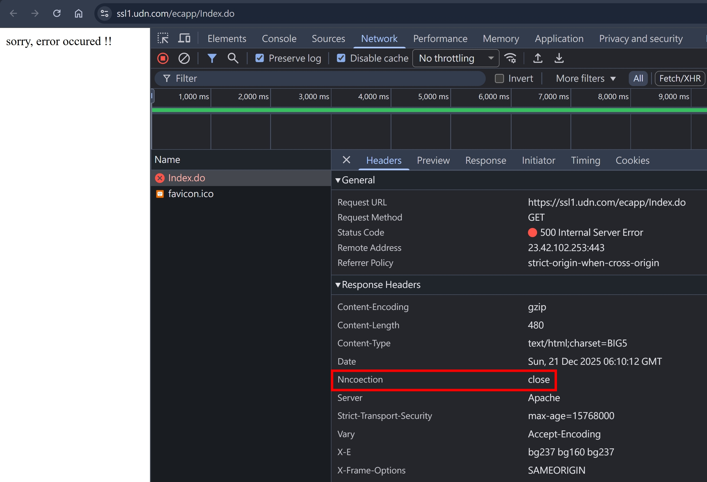
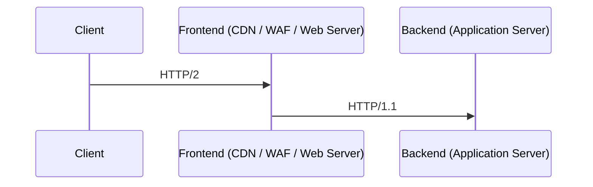
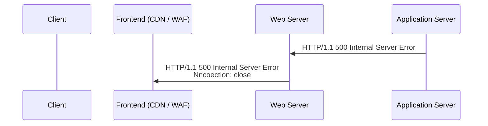
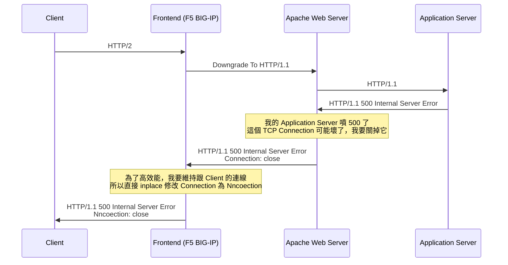

## 前言

某天在逛 udn 的網站時，看到 Response Header 有 `Nncoection: close`


由於瀏覽器的 F12 > Network 呈現的 Header Name 會經過 Case 轉換，變成人類適合閱讀的 `Hello-World` 格式，所以我馬上用 Burp Suite Repeater 抓包

當下立即想到是拼錯的 [Connection: close](./keep-alive-and-connection.md)，但又覺得沒有這麼簡單，於是就趁這個機會來研究看砍

## 推測1: 後端工程師手殘打錯字

以 NodeJS http server 為例，需要這樣設定

```js
res.setHeader("Nncoection", "close");
```

但實務上，我們在 Application Server 寫的都是 Layer 7 之上的商業邏輯，基本上不會碰到 TCP 連線池的管理，都是交給程式語言本身的 http, socket 模組來處理，所以這個 "後端工程師手殘打錯字" 的推測，機率感覺非常低。

## 推測2: 某個 proxy 加的

從瀏覽器的 F12 > Network 可以觀察到這是 HTTP/2 的請求

HTTP/2 本身就是用一個 TCP Connection 來傳輸多個 HTTP 請求，所以 `Connection: close` 在 HTTP/2 是沒有效果的

現代很多 Application 的架構，都是 Client > Frontend 走 HTTP/2，Frontend > Backend 走 HTTP/1



也就是說，`Nncoection: close` 可能是在 Response 階段的某個節點加的



## Google Search

如果在 Google 查詢 "Nncoection" 的話，會看到有蠻多篇討論的，大多數都集中在 2010 ~ 2011 年

- https://bugs.python.org/issue12576
- https://stackoverflow.com/questions/4798461/cneonction-and-nncoection-http-headers
- https://news.ycombinator.com/item?id=1912397
- https://github.com/jofpin/compaXSS/blob/master/wafw00f.py

大致上有提到幾個關鍵字

- TCP Checksum
- Citrix NetScaler, F5 BIG-IP

這個領域，對於一般接觸 Layer 7 為主的軟體工程師來講，會很不熟悉。我查了很多資料，簡單來說

- [F5](https://www.f5.com/): 一間美國的公司
- [BIG-IP](https://www.f5.com/products/big-ip): F5 公司的旗下的一個產品系列
- [Citrix NetScaler ADC](https://www.twcert.org.tw/newepaper/cp-67-10224-ffe71-3.html): 對標 F5 BIG-IP，Citrix 公司旗下 NetScaler 的一款產品 ADC，全名為 Application Delivery Controller

平常我們常接觸的 Nginx 是運作在 Layer 7 的 Load Balancer（這邊先不探討 Nginx 的其他用途），每秒能處理的請求數量有限，但對於中小型企業來說很夠用

但如果是金融產業等大型企業，每秒百萬級別的請求，則需要更強大的 Solution，這時候就會需要上述兩種產品，運作在 Layer 7 以下的 Load Balancer

## 最終結論

從上面的各種線索，我推敲出以下結論



至於為何不直接把 `Connection: close` 這行刪掉，或是改成 `Connection: keep-alive` 呢？原因也是因為高效能，`Connection` 改成 `Nncoection` 的 [TCP Checksum](https://datatracker.ietf.org/doc/html/rfc1071) 是一樣的，且 Bytes 長度也相同，不會發生位移，所以在 TCP 這層可以邊發邊改，不需要把整個 HTTP Response Header Block Buffer 住

另外，若同樣的請求，用 HTTP/1.1 重發一次的話，也可以間接驗證我上述的結論

```
curl --http1.1 https://ssl1.udn.com/ecapp/Index.do -v

< HTTP/1.1 500 Internal Server Error
< Server: Apache
< Content-Encoding: gzip
< Strict-Transport-Security: max-age=15768000
< X-Frame-Options: SAMEORIGIN
< X-e: bg237 bg160 bg237
< Content-Length: 480
< nnCoection: close
< Content-Type: text/html;charset=BIG5
< Date: Sun, 21 Dec 2025 12:46:46 GMT
< Connection: keep-alive
```

同時可以看到

- Frontend (F5 BIG-IP) 修改過的 `nnCoection: close`
- Frontend (F5 BIG-IP) 把 `Connection: keep-alive` 加到 Header 最後面

## 小結

從一個小小的觀察，讓我把 HTTP/1, HTTP/2, Connection 的觀念重新梳理了一遍，並且也認識了不同的網路架構，透過好奇心驅動學習，真的是最好的學習路徑！

<!-- 這種 pipe 的概念，以 NodeJS 為例的話，我覺得要去理解 [Stream](https://nodejs.org/api/stream.html) 這個物件的設計 -->

## 參考文章

<!-- - https://ssl1.udn.com/ecapp/Index.do -->
<!-- - https://claude.ai/chat/e3e0aa2a-b7c0-4043-abcb-fd6dec6a2b3c -->

- https://github.com/jofpin/compaXSS/blob/master/wafw00f.py
- https://stackoverflow.com/questions/4798461/cneonction-and-nncoection-http-headers
- https://datatracker.ietf.org/doc/html/rfc1071
