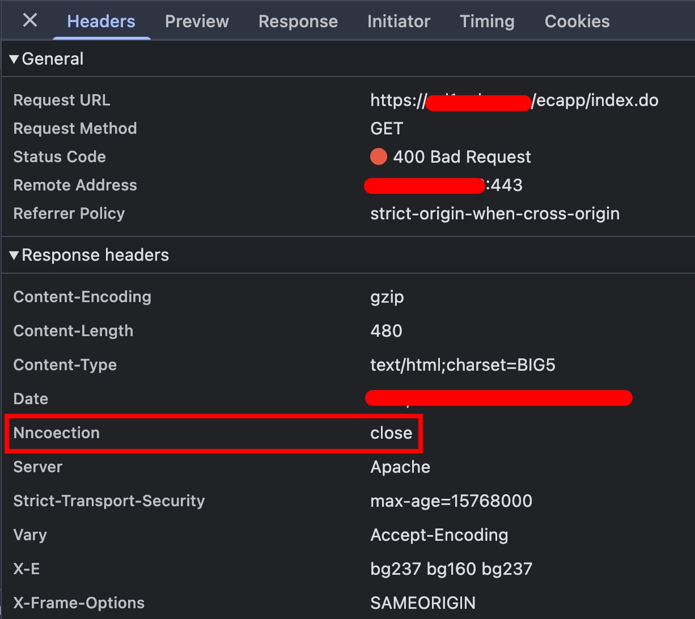
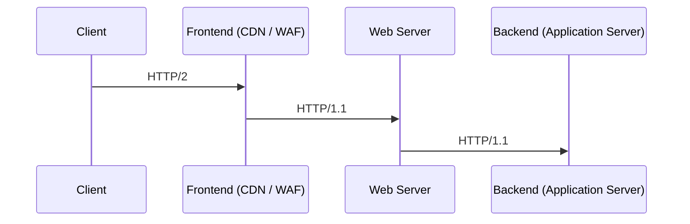
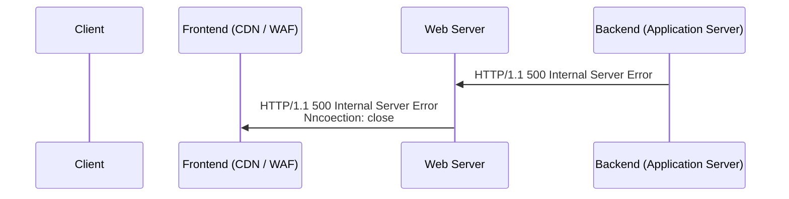
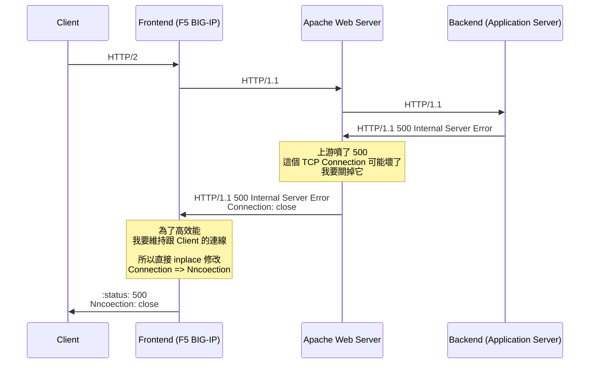

## 前言

<!-- https://ssl1.udn.com/ecapp/index.do -->

某天在逛一個網站時，看到 response header 有 `Nncoection: close`



當下立即想到是拼錯的 [Connection: close](./keep-alive-and-connection.md)，但又覺得沒有這麼簡單，於是就趁這個機會來研究看砍

## 推測1：後端工程師手殘打錯字

以 Node.js `http.Server` 為例，需要這樣設定

```js
res.setHeader("Nncoection", "close");
```

但實務上，我們在 Application Server 寫的都是 Layer 7 之上的商業邏輯，基本上不會碰到 TCP 連線池的管理，都是交給程式語言本身的 http, net 模組來處理，所以這個 "後端工程師手殘打錯字" 的推測，機率感覺非常低

## 推測2：某個 proxy 加的

從瀏覽器的 F12 > Network 可以觀察到這是 HTTP/2 的請求

HTTP/2 廢棄了 `Connection` header，參考 [RFC 9113 Section 8.2.2](https://datatracker.ietf.org/doc/html/rfc9113#section-8.2.2) 的描述

```
HTTP/2 does not use the Connection header field (Section 7.6.1 of [HTTP]) to indicate connection-specific header fields
```

現代很多 Application 的架構，都是 client > Frontend 走 HTTP/2，Frontend > Backend 走 HTTP/1


```mermaid
sequenceDiagram
  participant c as Client
  participant f as Frontend (CDN / WAF)
  participant w as Web Server
  participant b as Backend (Application Server)

  c ->> f: HTTP/2
  f ->> w: HTTP/1.1
  w ->> b: HTTP/1.1
```

也就是說，`Nncoection: close` 可能是在 response 階段的某個節點加的


```mermaid
sequenceDiagram
  participant c as Client
  participant f as Frontend (CDN / WAF)
  participant w as Web Server
  participant b as Backend (Application Server)

  b ->> w: HTTP/1.1 500 Internal Server Error
  w ->> f: HTTP/1.1 500 Internal Server Error<br/>Nncoection: close
```

## Google Search

如果在 Google 查詢 "Nncoection" 的話，會看到有蠻多篇討論的，大多數都集中在 2010 ~ 2011 年

- https://bugs.python.org/issue12576
- https://stackoverflow.com/questions/4798461/cneonction-and-nncoection-http-headers
- https://news.ycombinator.com/item?id=1912397
- https://github.com/jofpin/compaXSS/blob/master/wafw00f.py

大致上有提到幾個關鍵字

- TCP Checksum
- Citrix NetScaler, F5 BIG-IP

這個領域，對於一般接觸 Layer 7 為主的軟體工程師來講，會很不熟悉。我查了很多資料，總結以下：

- [F5](https://www.f5.com/)：一間美國的公司
- [BIG-IP](https://www.f5.com/products/big-ip)：F5 公司的旗下的一個產品系列
- [Citrix NetScaler ADC](https://www.twcert.org.tw/newepaper/cp-67-10224-ffe71-3.html)：對標 F5 BIG-IP，Citrix 公司旗下 NetScaler 的一款產品 ADC，全名為 Application Delivery Controller

平常我們常接觸的 Nginx 是運作在 Layer 7 的 load balancer，每秒能處理的請求數量有限，但對於中小型企業來說很夠用

但如果是金融產業等大型企業，每秒百萬級別的請求，則需要更強大的解決方案，這時候就會需要上述兩種產品（運作在 Layer 7 以下）

## 最終結論

從上面的各種線索，我推敲出以下結論


```mermaid
sequenceDiagram
  participant c as Client
  participant f as Frontend (F5 BIG-IP)
  participant w as Apache Web Server
  participant b as Backend (Application Server)

  c ->> f: HTTP/2
  f ->> w: HTTP/1.1
  w ->> b: HTTP/1.1

  b ->> w: HTTP/1.1 500 Internal Server Error
  Note Over w: 上游噴了 500<br/>這個 TCP Connection 可能壞了<br/>我要關掉它
  w ->> f: HTTP/1.1 500 Internal Server Error<br/>Connection: close
  Note Over f: 為了高效能<br/>我要維持跟 Client 的連線<br/><br/>所以直接 inplace 修改<br/>Connection => Nncoection
  f ->> c: :status: 500<br/>Nncoection: close
```

至於為何不直接把 `Connection: close` 這行刪掉，或是改成 `Connection: keep-alive` 呢？原因也是效能優化：

- `Connection` 改成 `Nncoection` 的 [TCP Checksum](https://datatracker.ietf.org/doc/html/rfc1071) 是一樣的，且 bytes 長度也相同，不會發生位移
- 所以在 TCP 這層可以邊發邊改，不需要把整個 HTTP response header buffer 在緩衝區

另外，若同樣的請求，用 HTTP/1.1 重發一次的話，也可以間接驗證我上述的結論

```
curl --http1.1 https://REDACTED/ecapp/Index.do -v

< HTTP/1.1 500 Internal Server Error
< Server: Apache
< Content-Encoding: gzip
< Strict-Transport-Security: max-age=15768000
< X-Frame-Options: SAMEORIGIN
< X-e: bg237 bg160 bg237
< Content-Length: 480
< nnCoection: close
< Content-Type: text/html;charset=BIG5
< Connection: keep-alive
```

同時可以看到

- Frontend (F5 BIG-IP) 修改過的 `nnCoection: close`
- Frontend (F5 BIG-IP) 把 `Connection: keep-alive` 加到 respone header 最後面

## 小結

這次的研究過程，其實是一個典型的技術偵探故事：從一個看似手殘打字的 header 開始，透過觀察 HTTP/2 廢棄 Connection header 的規範、Google 搜尋歷史文章、以及用 curl --http1.1 重現驗證，最終拼湊出 F5 BIG-IP 為了效能而 inplace 修改 header 的完整故事。這也提醒了我們，任何「看起來像 bug」的現象，背後都可能藏著值得深挖的架構知識。

## 參考文章

- https://github.com/jofpin/compaXSS/blob/master/wafw00f.py
- https://stackoverflow.com/questions/4798461/cneonction-and-nncoection-http-headers
- https://datatracker.ietf.org/doc/html/rfc1071
<!-- - https://claude.ai/chat/e3e0aa2a-b7c0-4043-abcb-fd6dec6a2b3c -->
